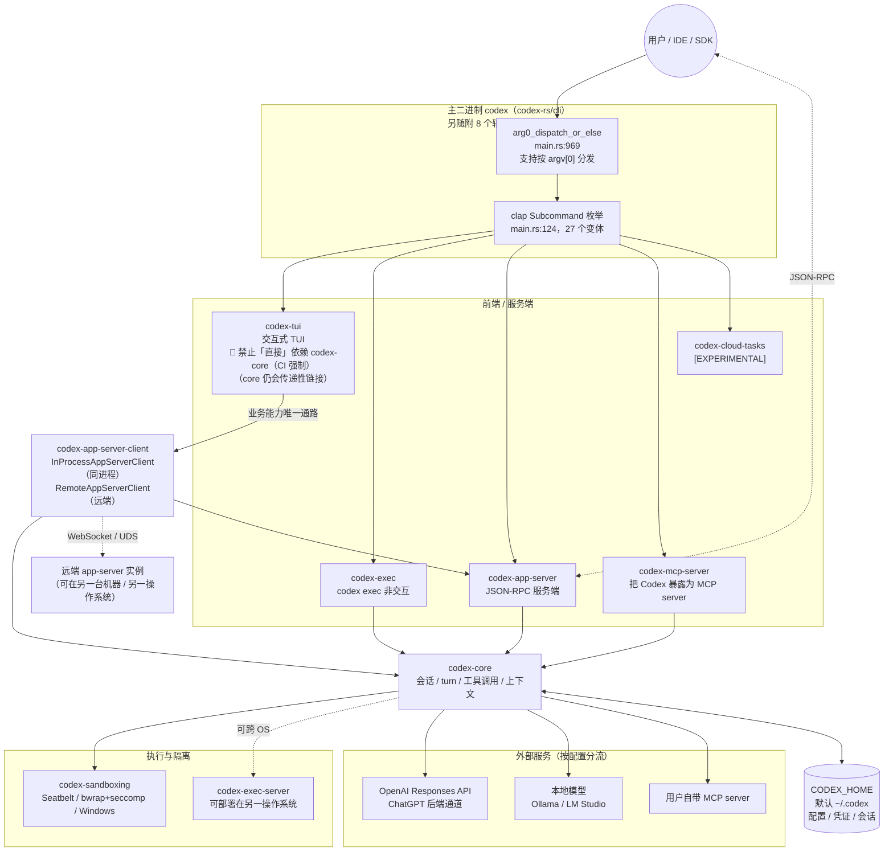

# Codex CLI 架构总览

> **基线 commit**: `bb5054fe47abe73ecbbd454751066a28c89f4bb9`
> **阅读顺序建议**: 本文 → [`crate_map.md`](./crate_map.md) → 各专题文档

---

## 1. 一句话概括

**Codex 是一个以单个主二进制对外、多前端、收敛到同一份 codex-core 会话循环的本地编码智能体**：所有用户入口（TUI、非交互 exec、IDE 接入的 app-server、MCP server、云任务）都是同一个 `codex` 可执行文件的不同子命令；除 TUI 外的前端直接依赖 codex-core，**TUI 则必须经由 `codex-app-server-client` 间接抵达 core**。

理解这一点是理解整个仓库的第一把钥匙 —— 它解释了为什么 `codex-core` 有 296,963 行、66 个内部依赖，也解释了为什么协议 crate `codex-protocol` 被 70 个 crate 依赖。

> [!CAUTION]
> **`codex-tui` 不得「直接」依赖、也不得「直接」import codex-core —— 这是 CI 强制的架构边界，不是风格建议。**
>
> - 校验脚本：`.github/scripts/verify_tui_core_boundary.py`，文件头注释即 `"""Verify codex-tui does not depend on or import codex-core directly."""`——**注意 `directly`**；脚本同时禁止 `Cargo.toml` 出现 `codex-core` 依赖，以及源码出现 `codex_core::` / `use codex_core` / `extern crate codex_core`。
> - 由 `.github/workflows/repo-checks.yml` 执行（`run: python3 .github/scripts/verify_tui_core_boundary.py`）。
> - **例外一（再导出）**：`codex-app-server-client` 显式再导出 core 的配置类型（`pub mod legacy_core { pub mod config { pub use codex_core::config::*; } }`），TUI 在 93 处、40 个文件中使用。校验脚本的报错文案也点名这是被认可的过渡通道，所以该边界约束的是**依赖边与 import**，而非「core 能力必须经协议方法抵达」。详见 [`tui_guide.md`](./tui_guide.md) §0.2。
> - **例外二（传递链接）**：门禁**不管**传递依赖。`codex-cloud-config`（`Cargo.toml:16`）与 `codex-utils-oss`（`Cargo.toml:11`）都直接依赖 `codex-core`，而 `tui/src/lib.rs:41`、`:66-67` 正在用这两个 crate；`codex-app-server-client` 本身也直接依赖 `codex-core`。所以**编译产物里 `codex-core` 是链进 TUI 的**。E4 复核见 §2 的 CAUTION。
> - **正确路径**：`codex-tui` → `codex-app-server-client` → `codex-app-server` + `codex-core`。同进程用 `InProcessAppServerClient`，连远端 app-server 用 `RemoteAppServerClient`（均导出自 `codex-rs/app-server-client/src/lib.rs`）。
> - 在 TUI 中"顺手加一行 `use codex_core::...`"会直接挂 CI，无论功能是否正确。
>
> **勘误**：本文第一版曾写"所有入口最终都汇聚到 `codex-core`"，并在拓扑图中画出 `TUI --> CORE` 的直接边。该表述对 TUI 是错误的，已按上述边界修正；`codex-core` 依赖数亦由 67 修正为 66（旧值把 `[dependencies]` 与 `[dev-dependencies]` 中的同名 crate 重复计入，见 [`crate_map.md`](./crate_map.md) §4 计数口径）。

---

## 2. 运行时拓扑



> [!NOTE]
> 图中 `TUI --> ASCLIENT` 是 TUI 抵达 core **业务能力**的唯一约定通路（E3）：`codex-rs/tui/Cargo.toml` 的依赖表里没有 `codex-core`，`tui/src/` 里也没有 `codex_core::`，这两点由 `.github/scripts/verify_tui_core_boundary.py` 在 CI 上强制。`codex-app-server-client` 自身同时依赖 `codex-app-server` 与 `codex-core`（`codex-rs/app-server-client/Cargo.toml`），由它承担"跨越边界"的职责。
>
> > [!CAUTION]
> > **本文上一稿这里有两处不准确，一并更正：**
> >
> > 1. **"`tui/Cargo.toml` 只声明 `codex-app-server-client`"是错的。** 该文件的 `[dependencies]` 段里就有 **42 条 `codex-*` 依赖**（全文件含 `[dev-dependencies]` 共 45 条，`grep -cE '^codex-' codex-rs/tui/Cargo.toml`；均写作 `{ workspace = true }`）。`cargo metadata` 解析后 `codex-tui` 的直接普通依赖有 92 个包。真正成立的说法只是「其中不含 `codex-core`」。
> > 2. **"TUI 不链接 `codex-core`"也是过度解读。** CI 脚本的文档注释原文是 `does not depend on or import codex-core **directly**`。传递地看，`codex-core` 照样会被链进 TUI：`codex-rs/cloud-config/Cargo.toml:16` 和 `codex-rs/utils/oss/Cargo.toml:11` 都直接依赖 `codex-core`，而 `tui/src/lib.rs:41` 用了 `codex_cloud_config::`、`:66-67` 用了 `codex_utils_oss::`；`codex-app-server-client` 本身也直接依赖 `codex-core`。E4 复核：在 `cargo metadata` 的普通依赖图上做 BFS，`codex-tui → codex-app-server-client → codex-core` 可达。
> >
> > **准确表述：无直接依赖边、无直接导入（CI 强制）；`codex-core` 仍经多条中间 crate 传递性链接，且其配置类型通过 `codex_app_server_client::legacy_core` 再导出。** 详见 [`tui_guide.md`](./tui_guide.md) §0.1-§0.2。

---

## 3. 入口层：一个二进制，27 个子命令

### 3.1 分发机制

`codex-rs/cli/src/main.rs` 是唯一主二进制的入口，两级分发：

1. **argv[0] 分发**（`main.rs:9-10, 969`）：`codex_arg0::arg0_dispatch_or_else` 允许通过可执行文件名改变行为。发布产物带平台后缀（如 `codex-x86_64-unknown-linux-musl`），但 `bin_name = "codex"` 保证帮助输出始终显示通用命令名（`main.rs:100-105`）。
2. **clap 子命令分发**（`main.rs:124` 起的 `Subcommand` 枚举 → `main.rs:1016` 起的 match 分支）。

### 3.2 子命令口径

| 口径 | 数量 |
| ---- | ---: |
| `Subcommand` 枚举变体总数 | **27** |
| 其中 `#[clap(hide = true)]` 隐藏 | 3（`Execpolicy`、`ResponsesApiProxy`、`StdioToUds`） |
| 其中平台条件编译 | 1（`App`，仅 macOS/Windows） |
| **Linux 上可见** | **23** |
| **macOS / Windows 上可见** | **24** |

> 无子命令时进入默认交互式 TUI（`MultitoolCli` 的 `subcommand: Option<Subcommand>` 为 `None`，`main.rs:120`）。

### 3.4 "单二进制"需要限定：还有 8 个随行的辅助可执行文件

"单二进制"指的是**用户交互只有一个入口 `codex`**，不是"交付物只有一个文件"。workspace 里除 `codex` 之外还定义了多个 `[[bin]]` 目标（E4，`cargo metadata` 的 `targets` 中 `kind` 含 `bin`），其中会随发布 / CI 产物一起分发或被 `codex` 在运行时拉起的有 8 个：

| 辅助可执行文件 | 所属 crate | 作用 | 随发布分发 |
| ---- | ---- | ---- | ---- |
| `codex-code-mode-host` | `codex-code-mode-host` | JS code-mode 的独立宿主进程 | **是，且出现在每一个平台的每一个 bundle 里** |
| `codex-responses-api-proxy` | `codex-responses-api-proxy` | 对应 hidden 子命令 `responses-api-proxy` | 是（primary bundle + Windows） |
| `codex-app-server` | `codex-app-server` | app-server 独立进程；发布矩阵为它单独准备了 `bundle: app-server` | **是**（app-server bundle + Windows） |
| `bwrap` | `codex-bwrap` | vendored bubblewrap；`codex-rs/cli/BUILD.bazel` 以 `extra_binaries = ["//codex-rs/bwrap:bwrap"]` 与 `codex` 一同产出 | 是（两个 Linux musl primary bundle） |
| `codex-windows-sandbox-setup` | `codex-windows-sandbox` | Windows 沙箱环境准备 | 是（Windows） |
| `codex-command-runner` | `codex-windows-sandbox` | Windows 受限命令执行器 | 是（Windows） |
| `codex-linux-sandbox` | `codex-linux-sandbox` | Linux 沙箱 helper，由 `codex` 以子进程方式拉起 | 否（不在 release `binaries` 列表中；由 CI 拷入 helper 目录供测试） |
| `codex-execve-wrapper` | `codex-shell-escalation` | 权限提升时的 execve 包装 | 否（同上，运行时 helper） |

> [!CAUTION]
> **本节上一稿有两处错误，此处更正：**
>
> 1. **漏了 `codex-code-mode-host` 与 `codex-app-server`，表格只有 6 行**，因而得出"其余 `bin` 目标不随发布交付"的结论——这句话是**假的**。
> 2. **引用 `WINDOWS_BINARIES` 时截断了两项。** 上一稿只写了 `codex-responses-api-proxy codex-windows-sandbox-setup codex-command-runner`。完整原文是 `.github/workflows/rust-release-windows.yml:7`：
>
>    ```yaml
>    WINDOWS_BINARIES: "codex codex-code-mode-host codex-responses-api-proxy codex-windows-sandbox-setup codex-command-runner codex-app-server"
>    ```
>
>    **引用 CI 配置的字符串列表时要整行贴，截断等于制造事实错误。**

发布矩阵佐证（E2，`.github/workflows/rust-release.yml:84-132`）：每个平台拆成 `bundle: primary` 与 `bundle: app-server` 两条，`binaries` 字段分别是——

```yaml
# primary（macOS 两 arch）
binaries: "codex codex-code-mode-host codex-responses-api-proxy"        # :88 :100
# primary（Linux musl 两 arch，多一个 bwrap）
binaries: "codex codex-code-mode-host codex-responses-api-proxy bwrap"  # :113 :125
# app-server（全部四个 target）
binaries: "codex-app-server codex-code-mode-host"                       # :94 :106 :119 :131
```

同样的四组 `binaries` 值还出现在签名（`:496-508`）、产物汇总（`:685-700`）与发布（`:991-1006`）阶段。

`.github/workflows/rust-ci-full-nextest-platform.yml` 则会把 `codex-linux-sandbox` / `codex-windows-sandbox-setup` / `codex-command-runner` 拷入 helper 目录供测试使用。

> **不要反过来推断"其余 bin 目标都不重要"。** workspace 共 31 个 bin 目标，出现在发布清单里的只有 7 个（codex + 6 个辅助）。**剩下 24 个里既有开发/测试类**（`codex-write-config-schema`、`rmcp_test_server`、`md-events`），**也有本身就是产品能力、只是不单独打包的**（`codex-exec`、`codex-tui`、`codex-mcp-server`、`codex-execpolicy`、`codex-file-search`、`codex-stdio-to-uds`、`exec-server`、`apply_patch`——它们都编进主 codex 二进制或经上表的其他方式交付）。
>
> 唯一可靠的判据是"是否出现在某个发布工作流的 `binaries` / `WINDOWS_BINARIES` 列表里"：`grep -hoE 'binaries: "[^"]*"' .github/workflows/rust-release*.yml`。

### 3.3 按用途分组

| 用途 | 子命令 |
| ---- | ---- |
| **核心交互** | （无子命令，默认 TUI）、`exec`（别名 `e`）、`review` |
| **会话管理** | `resume`、`fork`、`archive`、`unarchive`、`delete` |
| **认证** | `login`、`logout` |
| **扩展生态** | `mcp`、`plugin`、`mcp-server` |
| **服务化** | `app-server` ⚠️、`remote-control` ⚠️、`exec-server` ⚠️ |
| **诊断运维** | `doctor`、`debug`、`features`、`completion`、`update` |
| **执行隔离** | `sandbox`、`execpolicy` 🔒 |
| **变更应用** | `apply`（别名 `a`） |
| **实验性** | `cloud`（别名 `cloud-tasks`）⚠️、`app`（桌面端，仅 macOS/Windows） |
| **内部用途** | `responses-api-proxy` 🔒、`stdio-to-uds` 🔒 |

⚠️ = 标注 `[experimental]` / `[EXPERIMENTAL]`　🔒 = `#[clap(hide = true)]`

---

## 4. 协议先行：类型的单一事实源

这是本仓库最重要的工程约定之一。

```
Rust 类型定义（唯一事实源）
        │
        │  ts-rs 导出
        ▼
codex-app-server-protocol/schema/typescript/v2/*.ts（550 个文件，构建产物）
        │
        ▼
IDE 扩展 / 桌面端 / TypeScript SDK
```

**硬性规则**（来自 `AGENTS.md`）：

| 规则 | 出处（按标题定位，勿用行号） |
| ---- | ---- |
| v2 类型必须标注 `#[ts(export_to = "v2/")]` | `## App-server API Development Best Practices` → `### Core Rules`，搜 `export_to` |
| API 形状变更后须跑 `just write-app-server-schema` | 同章 `### Development Workflow`，搜 `write-app-server-schema` |
| 变更须用 `just test -p codex-app-server-protocol` 验证 | 同上，搜 `codex-app-server-protocol` |

> [!NOTE]
> 本文引用 `AGENTS.md` 一律给**章节标题 + 可 grep 的关键词**，不给行号 —— `AGENTS.md` 是高频改动文件，行号会静默失效。

> [!WARNING]
> 生成的 `.ts` 文件是**构建产物**，不是手写代码。文档与代码审查中都不得把它们描述为可直接编辑的源文件。

同类的"生成物"还有：

| 生成物 | 生成命令 |
| ---- | ---- |
| `config.toml` 的 JSON Schema | `just write-config-schema` |
| hooks schema fixtures | `just write-hooks-schema` |
| app-server 协议 schema | `just write-app-server-schema` |

---

## 5. 进程边界与跨操作系统部署

### 5.1 五种进程形态

> [!NOTE]
> **本节标题上一稿写作"四种进程形态"，但表格是 5 行。** 这正是本文档体系反复批评的「标题计数与表格行数不符」，此处按实际行数改为 5。下表逐行可数：exec 单进程、TUI 同进程、TUI 连远端、客户端-服务端、守护进程。

| 形态 | 说明 | 相关 crate |
| ---- | ---- | ---- |
| **单进程（exec）** | `codex exec` 在本进程内直接跑 core | `codex-exec`、`codex-core` |
| **单进程（TUI，同进程 app-server）** | TUI 在**同一进程**内启动 `InProcessAppServerClient`，由该客户端持有 app-server 与 core；TUI 自身**不直接依赖、不直接导入 `codex-core`**（但 core 仍随中间 crate 传递性链接进同一个二进制，见 §2 的 CAUTION） | `codex-tui`、`codex-app-server-client`、`codex-app-server`、`codex-core` |
| **TUI ↔ 远端 app-server** | TUI 用 `RemoteAppServerClient` 连接一个**独立进程 / 独立机器**上的 app-server；core 完全跑在远端 | `codex-tui`、`codex-app-server-client`（`remote.rs`）、`codex-websocket-client`、`codex-uds` |
| **客户端-服务端** | app-server 以 JSON-RPC 对外服务，IDE / 桌面端 / SDK 作为客户端 | `codex-app-server`、`codex-app-server-transport`、`codex-app-server-client` |
| **守护进程** | `codex app-server daemon` 管理长驻生命周期，可启用 remote control | `codex-app-server-daemon`（`main.rs:1169-1210`） |

> **勘误**：第一版此表只有三行，且把"单进程"写成"TUI / exec 直接在本进程内跑 core"。TUI 那一半是错的（见 §1 CAUTION），且遗漏了"TUI 连远端 app-server"这一形态。

### 5.2 跨 OS 分离

`AGENTS.md` 的 `## Platform Support` 一节明确声明（搜 `different operating systems`）：

> "Codex supports running connected app-server and exec-server on different operating systems."

这意味着 `codex-exec-server`（39,311 行）可以运行在与 app-server 不同的操作系统上。相关传输设施包括 `codex-uds`（Unix domain socket）、`codex-stdio-to-uds`（stdio↔UDS 中继，hidden 子命令）、`codex-websocket-client`。

> [!NOTE]
> **传输实现细节仍未做代码级验证**（当前仅 `AGENTS.md` `## Platform Support` 的 E2 声明 + crate 存在性）。第 2 批 [`app_server_protocol.md`](./app_server_protocol.md) §7 复核后确认：**该缺口未能闭合**，`codex-exec-server-protocol`（1,723 行）是最佳切入点，跨 OS 集成测试见 `$remote-tests` skill。本节不推断实现方式。

---

## 6. 沙箱：三平台原生实现

沙箱是本项目的核心差异化能力，也是安全边界所在。

| 平台 | 机制 | 实现位置 |
| ---- | ---- | ---- |
| macOS | Seatbelt | `codex-rs/sandboxing/src/seatbelt.rs` + 3 个 `.sbpl` 策略文件 |
| **Linux（默认，唯一在跑的路径）** | **bubblewrap（文件系统）+ seccomp（系统调用）+ `no_new_privs`** | 调用侧 `codex-rs/sandboxing/src/bwrap.rs`；执行侧 `codex-linux-sandbox`（8,224 行）的 `linux_run_main.rs` / `landlock.rs`；bwrap 二进制来自 `codex-bwrap` crate（`codex-rs/bwrap`，151 行 Rust 壳）与**仓库内 vendored 的 bubblewrap C 源码 `codex-rs/vendor/bubblewrap/`（`git ls-files` 口径 50 个跟踪条目，`find -type f` 口径 49——差的一个是符号链接 `LICENSE` → `COPYING`；含 `vendor/BUILD.bazel` 则为 51 / 50）** |
| Linux（已废弃回退） | Landlock | 仅在显式打开 `[features].use_legacy_landlock` 时启用。CLI 开关 `--use-legacy-landlock` 为 `hide = true, default_value_t = false`（`linux_run_main.rs:110`）；`codex-features` 将其标为 `Stage::Deprecated`，`codex-rs/core/tests/suite/deprecation_notice.rs` 断言提示语"`[features].use_legacy_landlock` is deprecated and will be removed soon." |
| Windows | 原生沙箱 | `codex-rs/sandboxing/src/windows.rs`、`codex-windows-sandbox`（19,173 行） |

> [!CAUTION]
> **本节第一版严重写反了，此处保留勘误。** 第一版称 Linux 的机制是"**Landlock + seccomp**，bubblewrap 为备选"，并把实现指向 `codex-rs/sandboxing/src/landlock.rs`。三处都错：
>
> 1. **主次颠倒**。`codex-rs/linux-sandbox/src/landlock.rs` 的模块文档开宗明义：
>    > `//! In-process Linux sandbox primitives: no_new_privs and seccomp.`
>    > `//! Filesystem restrictions are enforced by bubblewrap in linux_run_main.`
>    > `//! Landlock helpers remain available here as legacy/backup utilities.`
>
>    同文件里的 `install_filesystem_landlock_rules_on_current_thread` 明确注明 "**currently unused** because filesystem sandboxing is performed via bubblewrap"。
> 2. **不存在"失败回退到 Landlock"**。`linux_run_main.rs:217` 的 `if !use_legacy_landlock { ... }` 分支注释写着 "This path **never falls back** to legacy Landlock on failure."；默认路径调用 `apply_permission_profile_to_current_thread(..., /*apply_landlock_fs*/ false, ...)`。
> 3. **文件指错**。`codex-rs/sandboxing/src/landlock.rs` 里**没有任何 landlock 调用**，它只是拼装 `codex-linux-sandbox` 子进程命令行（含在 legacy 模式下追加 `--use-legacy-landlock`）。真正的 `landlock` crate 依赖只出现在 `codex-rs/linux-sandbox/Cargo.toml`（以及 `codex-rs/protocol/Cargo.toml` 的类型定义处）。
>
> **正确心智模型：Linux = bwrap 管文件系统 + seccomp 管系统调用 + `no_new_privs`；Landlock 是待删除的 legacy 开关。**

配套能力：`codex-execpolicy`（执行策略）、`codex-shell-command`（命令解析）、`codex-shell-escalation`（权限提升审批）、`codex-process-hardening`（进程加固）。

> [!CAUTION]
> **绝对红线**：禁止新增或修改任何与 `CODEX_SANDBOX_NETWORK_DISABLED_ENV_VAR`、`CODEX_SANDBOX_ENV_VAR` 相关的代码。这条规则没有例外。出处：`AGENTS.md` 顶部规则列表（无标题的一级列表），grep 关键词 `Never add or modify any code related to`。

---

## 7. 配置与凭证：CODEX_HOME

### 7.1 解析规则（E3，已读取实现）

配置目录由 `CODEX_HOME` 环境变量决定，未设置时默认 `~/.codex`。权威实现在 `codex-rs/utils/home-dir/src/lib.rs:13`：

- CODEX_HOME **已设置**：该路径必须存在且为目录，会被 canonicalize；否则返回错误（`lib.rs:20-40`）
- `CODEX_HOME` **未设置**：回退到 `~/.codex`，**不校验目录是否存在**

> [!TIP]
> **一个容易误判的点已澄清**：`codex-rs/core/src/config/mod.rs:4578` 也有一个 `pub fn find_codex_home`，但它是**薄委托**——函数体只有一行 `codex_utils_home_dir::find_codex_home()`。两处**不是重复实现**，`codex-utils-home-dir` 是唯一事实源。

### 7.2 落盘内容

| 内容 | 说明 |
| ---- | ---- |
| 配置 | `config.toml`（JSON Schema 由 `just write-config-schema` 生成） |
| 凭证 | 认证态文件与系统钥匙串条目（`codex-login`、`codex-keyring-store`、`codex-secrets`） |
| 会话 | 线程与 rollout 记录（`codex-thread-store`、`codex-rollout`） |
| 状态与日志 | SQLite，可用 `just log` 实时查看（`codex-state`） |

> [!IMPORTANT]
> 本文档体系**不复述任何凭证的实际值**，只记录变量名、配置键名与文件路径。

---

## 8. 外部服务边界

README 描述 Codex "runs locally on your computer"，指的是**智能体进程在本地运行**，不等于"完全离线"或"不出网"。实际存在**六类**外部通路（第一版此处误写"三类"，与下表 6 行自相矛盾，已修正）：

| 类别 | 触发条件 | 端点 / 位置 | 证据 |
| ---- | ---- | ---- | ---- |
| **① 默认在线模型通路** | 默认路径 | `https://api.openai.com/v1`、`https://chatgpt.com/backend-api/codex` | E3，`codex-rs/model-provider-info/src/` |
| **② 认证通路** | 登录时 | `https://auth.openai.com`（含 `/oauth/token`、`/oauth/revoke`） | E3，`codex-rs/login/src/` |
| **③ 本地模型通路** | 用户显式配置 | Ollama（`codex-ollama`）、LM Studio（`codex-lmstudio`） | E3，crate 存在且有实现 |
| **④ 用户自带 MCP server** | 用户显式配置 | 任意，由用户决定 | E3，`codex-rmcp-client`、`codex-mcp` |
| **⑤ 云任务** | `codex cloud`（实验性） | Codex Cloud 后端 | E3，`main.rs:195-197` |
| **⑥ 遥测** | **随二进制而异**：TUI 默认开指标，app-server / remote-control 默认关 | Statsig / OTLP | E3，`codex-rs/core/src/otel_init.rs`、`codex-rs/tui/src/lib.rs`、`codex-rs/app-server/src/main.rs` |

> [!IMPORTANT]
> **⑥ 遥测默认行为已完成代码级核查（E3），结论已定，不再是"待核实"**。三类导出器默认值**并不一致**：
>
> | 项 | 默认值 |
> | ---- | ---- |
> | `metrics_exporter` | **`Statsig`（开）** —— 但见下方两条前置条件 |
> | `trace_exporter` | `None`（关） |
> | `exporter`（通用） | `None`（关） |
> | `log_user_prompt` | **`false`（用户提示词不记录）** |
>
> **两条容易被漏掉的前置条件（对上一版结论的重要修正）**：
>
> 1. **analytics 关掉时，指标导出器被强制置为 `None`**。`codex-rs/core/src/otel_init.rs:70-77`：
>    ```rust
>    let metrics_exporter = if config.analytics_enabled.unwrap_or(default_analytics_enabled) {
>        to_otel_exporter(&config.otel.metrics_exporter)
>    } else {
>        OtelExporter::None
>    };
>    ```
>    也就是说 `metrics_exporter = Statsig` 只在 analytics 开启时才生效。
> 2. **`default_analytics_enabled` 的取值按二进制不同**，而且**不止 TUI 传 `true`**：
>
>    | 调用方 | 传入值 | 位置 |
>    | ---- | ---- | ---- |
>    | TUI | `true` | `codex-rs/tui/src/lib.rs:1157` |
>    | `codex exec` | `true` | `codex-rs/exec/src/lib.rs:163` |
>    | `codex mcp-server` | `true` | `codex-rs/mcp-server/src/lib.rs:57` |
>    | app-server | `false` | `codex-rs/app-server/src/main.rs:108` |
>    | remote-control | `false` | `codex-rs/cli/src/remote_control_cmd.rs:137` |
>    | exec-server 遥测 | `false` | `codex-rs/cli/src/exec_server_telemetry.rs:6` |
>
> **所以正确的说法是：交互式/一次性执行类前台二进制（TUI、exec、mcp-server）默认开，被集成的服务端形态（app-server、remote-control、exec-server 遥测）默认关。**
>
> > [!NOTE]
> > **勘误**：本文上一稿写的"'指标默认外发'是 TUI 特有的行为"是错的——它把一个三对三的分野收窄成了一个特例。`exec/src/lib.rs:163` 与 `mcp-server/src/lib.rs:57` 都有 `const DEFAULT_ANALYTICS_ENABLED: bool = true;`，且均位于各自 `#[cfg(test)]` 块之外。可用 `grep -rn "DEFAULT_ANALYTICS_ENABLED" codex-rs/ --include=*.rs` 一次看全。以 [`observability.md`](./observability.md) §1.2 的六行表为准。
>
> 另外 `Statsig` 在 **debug 构建下会降级为 `None`**，不发任何数据。完整证据与配置键见 [`observability.md`](./observability.md) §1-§3。

上述公开服务端点属于技术事实，按框架脱敏规范予以保留。

---

## 9. 双构建系统

仓库同时维护 Cargo 与 Bazel 两套构建：

| | Cargo | Bazel |
| ---- | ---- | ---- |
| 锁文件 | `codex-rs/Cargo.lock` | `MODULE.bazel.lock`（1,547,127 字节） |
| 日常开发 | ✅ 主用 | 发布与 CI 校验 |
| 发布构建 | — | `just build-for-release` → `//codex-rs/cli:release_binaries` |

> [!IMPORTANT]
> **依赖变更后必须同步双锁**：跑 `just bazel-lock-update` 并在同一个 PR 提交更新后的 `MODULE.bazel.lock`，CI 会校验漂移（AGENTS.md 顶部规则列表，grep `bazel-lock-update`）。
>
> 使用 `include_str!`、`sqlx::migrate!` 等**编译期读取文件**的宏时，还需在 `BUILD.bazel` 补 `compile_data`（`AGENTS.md` 顶部规则列表，grep `compile_data`）。

详见 [`development_workflow.md`](./development_workflow.md)。

---

## 10. 扩展面：一个主扩展点 + 一个并行机制

| 路径 | 入口 crate |
| ---- | ---- |
| ① 内建扩展 | `codex-rs/ext/`（12 个 crate，公共 API 在 `ext/extension-api`） |
| ② 插件 | `codex-core-plugins`（37,038 行）、`codex-plugin` |
| ③ Skills | `codex-core-skills`、`codex-skills` |
| ④ MCP | 客户端 `codex-rmcp-client` / `codex-mcp`；服务端 `codex-mcp-server`；扩展 `ext/mcp` |

> [!IMPORTANT]
> **关系已完成代码级核查（E3）。第一版给出的"12 个 `ext/*` crate 全部构建在 `extension-api` 之上"是错的，实测为 8 / 12**（逐个 grep `codex-rs/ext/*/Cargo.toml`）：
>
> | 依赖 `codex-extension-api` 的 8 个 | 不依赖的 3 个 | 第 12 个 |
> | ---- | ---- | ---- |
> | `ext/skills`、`ext/goal`、`ext/memories`、`ext/mcp`、`ext/image-generation`、`ext/web-search`、`ext/git-attribution`、`ext/guardian` | `ext/agent`（只依赖 `codex-core` + `codex-protocol`）、`ext/connectors`（依赖 `codex-connectors` + `codex-core-plugins` + `codex-plugin` + `codex-utils-path-uri`）、`ext/items`（只依赖 `codex-utils-absolute-path`） | `ext/extension-api` 自身 —— 第一版把它当成了自己的"依赖方"，多算了 1 |
>
> 修正后的结论：
>
> - `ext/extension-api` 仍是**主扩展点**（13 个扩展 trait，见 [`crate_map.md`](./crate_map.md) §3.8），但**不是 `ext/` 目录的准入条件**。`ext/` 是一个**目录约定**，不是"必须实现 extension-api"的契约。
> - 不依赖它的三个各有原因：**`ext/items` 是纯数据 / schema crate**（无行为，自然无 contributor）；**`ext/agent` 是子智能体辅助层**；二者都不是"贡献者型扩展"。
> - **`ext/connectors` 建立在插件机制之上**（依赖 `core-plugins` + `plugin`）。这一点削弱了"插件是完全平行的第二条赛道"的说法 —— 插件机制已经反向被 `ext/` 内的成员复用，两者是**交叉**而非平行。
> - **Skills 与 MCP 被包装成扩展**接入该体系：`ext/skills` 依赖 `core-skills`+`skills`，`ext/mcp` 依赖 `codex-mcp`。
> - `core-plugins` 自身确实**不**依赖 `extension-api`（已复核 `codex-rs/core-plugins/Cargo.toml`，无该条目），由 `codex-core` 直接对接。
>
> 完整证据与选择依据见 [`mcp_and_extensions.md`](./mcp_and_extensions.md)。

---

## 11. 根 `docs/` 很薄，但"仓库没有开发者文档"是错的

> **勘误**：第一版本节标题为"仓库内文档极薄"，只列了 4 个 3–15 行的文件就得出"仓库缺少面向开发者的文档"的结论。这是**挑样本得结论**，并不成立 —— 分层看才准确。同时第一版把行数统计标为 E4，也是错的：文件行数属于 **E1（文件级事实）**，E4 应保留给实际跑构建 / 测试 / lint 工具的结论。

**第一层：根 `docs/` 与几处顶层 `*.md` 确实是薄的**（E1，`wc -l` 实测）：

| 文件 | 行数 |
| ---- | ---: |
| `docs/config.md` | 15 |
| `codex-rs/config.md` | 6 |
| `docs/sandbox.md` | 3（正文为指向 developers.openai.com 的外链） |
| `codex-rs/README.md` | 3 |

**第二层：per-crate 与规范文档一点都不薄**（E1，同批 `wc -l`）：

| 文件 | 行数 | 内容 |
| ---- | ---: | ---- |
| `codex-rs/app-server/README.md` | **2,469** | app-server JSON-RPC API 的权威文档，`AGENTS.md` 的 `### Development Workflow` 明确要求 API 行为变更时同步更新它 |
| `codex-rs/exec-server/README.md` | **444** | exec-server 协议与部署 |
| AGENTS.md | **322** | AI 代理强制规范，本仓最高优先级文档 |
| `codex-rs/docs/protocol_v1.md` | 195 | v1 协议 |
| `codex-rs/docs/bazel.md` | 180 | Bazel 构建 |
| `codex-rs/docs/codex_mcp_interface.md` | 144 | MCP 接口 |

**修正后的判断**：面向**终端用户的产品文档**托管在 developers.openai.com、根 `docs/` 只留外链；但**面向开发者的接口文档是就近放在 crate 目录里的**（`codex-rs/*/README.md`、`codex-rs/docs/`）。找开发者文档时**先在目标 crate 目录里找 README**，不要只看根 `docs/`。

本文档体系的价值空间因此要重新定位：不是"填补文档空白"，而是**提供跨 crate 的横向视角与归属决策** —— 这是 per-crate README 天然覆盖不到的部分。

> [!IMPORTANT]
> `AGENTS.md` 顶部规则列表（grep `Do not add general product or user-facing documentation`）禁止向 `docs/` 添加通用产品或用户文档（例外是 app-server API 文档）。**本文档体系全部产物固定在仓库根 `dev_docs/`，任何情况下都不得迁入 `docs/`。**

---

## 12. 本文未覆盖的内容

| 未覆盖项 | 当前证据等级 | 何时补齐 |
| ---- | ---- | ---- |
| `codex-core` 内部的 turn 循环与工具调度实现 | E1 | 第 2 批 `core_agent_loop.md` |
| app-server JSON-RPC 的方法清单与握手 | E2 | 第 2 批 `app_server_protocol.md` |
| 沙箱策略文件的具体规则 | E2 | 第 2 批 `tools_and_sandbox.md` |
| 配置项全集与优先级 | E2 | 第 2 批 `config_system.md` |
| ~~四条扩展路径的关系~~ | **E3，已完成**（并已修正为 8/12） | 见 `mcp_and_extensions.md` §1、本文 §10 |
| 认证流程的完整时序 | E3（端点已确认，流程未读） | 第 3 批 `auth_and_providers.md` |
| ~~遥测默认行为~~ | **E3，已完成**（含"按二进制而异"的修正） | 见 `observability.md`、本文 §8 |
| ~~实验性表面的展开~~ | **已完成** | 见 `experimental_surfaces.md` |
| exec-server ↔ app-server 的传输实现 | E2（仅 `AGENTS.md` `## Platform Support` 声明） | 未闭合，见 §5.2 |

---

## 13. 相关文档

- [Crate 地图](./crate_map.md) — 134 个 crate 的分层与归属决策
- [开发流程](./development_workflow.md) — 规范落地、构建与测试
- [AI 编码上下文主文档](./AI_Coding_Context.md) — 场景导航入口
- 仓库自带：[AGENTS.md](../AGENTS.md)（**优先级高于本体系**）、[`docs/contributing.md`](../docs/contributing.md)
