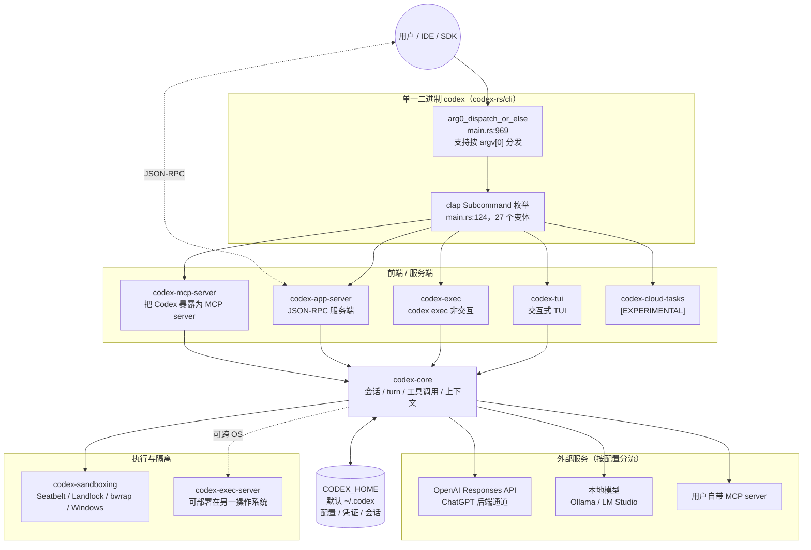

# Codex CLI 架构总览

> **基线 commit**: `bb5054fe47abe73ecbbd454751066a28c89f4bb9`
> **阅读顺序建议**: 本文 → [`crate_map.md`](./crate_map.md) → 各专题文档

---

## 1. 一句话概括

**Codex 是一个单二进制、多前端、收敛到同一份 `codex-core` 的本地编码智能体**：所有用户入口（TUI、非交互 exec、IDE 接入的 app-server、MCP server、云任务）都是同一个 `codex` 可执行文件的不同子命令，最终都汇聚到 `codex-core` 的会话与工具调用循环。

理解这一点是理解整个仓库的第一把钥匙 —— 它解释了为什么 `codex-core` 有 296,963 行、67 个内部依赖，也解释了为什么协议 crate `codex-protocol` 被 70 个 crate 依赖。

---

## 2. 运行时拓扑



---

## 3. 入口层：一个二进制，27 个子命令

### 3.1 分发机制

`codex-rs/cli/src/main.rs` 是唯一主二进制的入口，两级分发：

1. **argv[0] 分发**（`main.rs:9-10, 969`）：`codex_arg0::arg0_dispatch_or_else` 允许通过可执行文件名改变行为。发布产物带平台后缀（如 `codex-x86_64-unknown-linux-musl`），但 `bin_name = "codex"` 保证帮助输出始终显示通用命令名（`main.rs:100-105`）。
2. **clap 子命令分发**（`main.rs:124` 起的 `Subcommand` 枚举 → `main.rs:1016` 起的 match 分支）。

### 3.2 子命令口径

| 口径 | 数量 |
| ---- | ---: |
| `Subcommand` 枚举变体总数 | **27** |
| 其中 `#[clap(hide = true)]` 隐藏 | 3（`Execpolicy`、`ResponsesApiProxy`、`StdioToUds`） |
| 其中平台条件编译 | 1（`App`，仅 macOS/Windows） |
| **Linux 上可见** | **23** |
| **macOS / Windows 上可见** | **24** |

> 无子命令时进入默认交互式 TUI（`MultitoolCli` 的 `subcommand: Option<Subcommand>` 为 `None`，`main.rs:120`）。

### 3.3 按用途分组

| 用途 | 子命令 |
| ---- | ---- |
| **核心交互** | （无子命令，默认 TUI）、`exec`（别名 `e`）、`review` |
| **会话管理** | `resume`、`fork`、`archive`、`unarchive`、`delete` |
| **认证** | `login`、`logout` |
| **扩展生态** | `mcp`、`plugin`、`mcp-server` |
| **服务化** | `app-server` ⚠️、`remote-control` ⚠️、`exec-server` ⚠️ |
| **诊断运维** | `doctor`、`debug`、`features`、`completion`、`update` |
| **执行隔离** | `sandbox`、`execpolicy` 🔒 |
| **变更应用** | `apply`（别名 `a`） |
| **实验性** | `cloud`（别名 `cloud-tasks`）⚠️、`app`（桌面端，仅 macOS/Windows） |
| **内部用途** | `responses-api-proxy` 🔒、`stdio-to-uds` 🔒 |

⚠️ = 标注 `[experimental]` / `[EXPERIMENTAL]`　🔒 = `#[clap(hide = true)]`

---

## 4. 协议先行：类型的单一事实源

这是本仓库最重要的工程约定之一。

```
Rust 类型定义（唯一事实源）
        │
        │  ts-rs 导出
        ▼
codex-app-server-protocol/schema/typescript/v2/*.ts（550 个文件，构建产物）
        │
        ▼
IDE 扩展 / 桌面端 / TypeScript SDK
```

**硬性规则**（来自 `AGENTS.md`）：

| 规则 | 出处 |
| ---- | ---- |
| v2 类型必须标注 `#[ts(export_to = "v2/")]` | `AGENTS.md:277` |
| API 形状变更后须跑 `just write-app-server-schema` | `AGENTS.md:300-304` |
| 变更须用 `just test -p codex-app-server-protocol` 验证 | 同上 |

> [!WARNING]
> 生成的 `.ts` 文件是**构建产物**，不是手写代码。文档与代码审查中都不得把它们描述为可直接编辑的源文件。

同类的"生成物"还有：

| 生成物 | 生成命令 |
| ---- | ---- |
| `config.toml` 的 JSON Schema | `just write-config-schema` |
| hooks schema fixtures | `just write-hooks-schema` |
| app-server 协议 schema | `just write-app-server-schema` |

---

## 5. 进程边界与跨操作系统部署

### 5.1 三种进程形态

| 形态 | 说明 | 相关 crate |
| ---- | ---- | ---- |
| **单进程** | TUI / exec 直接在本进程内跑 core | `codex-tui`、`codex-exec`、`codex-core` |
| **客户端-服务端** | app-server 以 JSON-RPC 对外服务，IDE / 桌面端 / SDK 作为客户端 | `codex-app-server`、`codex-app-server-transport`、`codex-app-server-client` |
| **守护进程** | `codex app-server daemon` 管理长驻生命周期，可启用 remote control | `codex-app-server-daemon`（`main.rs:1169-1210`） |

### 5.2 跨 OS 分离

`AGENTS.md:321-322` 明确声明：

> "Codex supports running connected app-server and exec-server on different operating systems."

这意味着 `codex-exec-server`（39,311 行）可以运行在与 app-server 不同的操作系统上。相关传输设施包括 `codex-uds`（Unix domain socket）、`codex-stdio-to-uds`（stdio↔UDS 中继，hidden 子命令）、`codex-websocket-client`。

> [!NOTE]
> **传输实现细节尚未做代码级验证**（当前仅 `AGENTS.md` 的 E2 声明 + crate 存在性）。具体协议与握手流程待第 2 批 `app_server_protocol.md` 核实。本节不推断实现方式。

---

## 6. 沙箱：三平台原生实现

沙箱是本项目的核心差异化能力，也是安全边界所在。

| 平台 | 机制 | 实现位置 |
| ---- | ---- | ---- |
| macOS | Seatbelt | `codex-rs/sandboxing/src/seatbelt.rs` + 3 个 `.sbpl` 策略文件 |
| Linux | Landlock | `codex-rs/sandboxing/src/landlock.rs`、独立 crate `codex-linux-sandbox`（8,224 行） |
| Linux（备选） | bubblewrap | `codex-rs/sandboxing/src/bwrap.rs`、`codex-bwrap` |
| Windows | 原生沙箱 | `codex-rs/sandboxing/src/windows.rs`、`codex-windows-sandbox`（19,173 行） |

配套能力：`codex-execpolicy`（执行策略）、`codex-shell-command`（命令解析）、`codex-shell-escalation`（权限提升审批）、`codex-process-hardening`（进程加固）。

> [!CAUTION]
> **绝对红线（`AGENTS.md:8-10`）**：禁止新增或修改任何与 `CODEX_SANDBOX_NETWORK_DISABLED_ENV_VAR`、`CODEX_SANDBOX_ENV_VAR` 相关的代码。这条规则没有例外。

---

## 7. 配置与凭证：CODEX_HOME

### 7.1 解析规则（E3，已读取实现）

配置目录由 `CODEX_HOME` 环境变量决定，未设置时默认 `~/.codex`。权威实现在 `codex-rs/utils/home-dir/src/lib.rs:13`：

- CODEX_HOME **已设置**：该路径必须存在且为目录，会被 canonicalize；否则返回错误（`lib.rs:20-40`）
- `CODEX_HOME` **未设置**：回退到 `~/.codex`，**不校验目录是否存在**

> [!TIP]
> **一个容易误判的点已澄清**：`codex-rs/core/src/config/mod.rs:4578` 也有一个 `pub fn find_codex_home`，但它是**薄委托**——函数体只有一行 `codex_utils_home_dir::find_codex_home()`。两处**不是重复实现**，`codex-utils-home-dir` 是唯一事实源。

### 7.2 落盘内容

| 内容 | 说明 |
| ---- | ---- |
| 配置 | `config.toml`（JSON Schema 由 `just write-config-schema` 生成） |
| 凭证 | 认证态文件与系统钥匙串条目（`codex-login`、`codex-keyring-store`、`codex-secrets`） |
| 会话 | 线程与 rollout 记录（`codex-thread-store`、`codex-rollout`） |
| 状态与日志 | SQLite，可用 `just log` 实时查看（`codex-state`） |

> [!IMPORTANT]
> 本文档体系**不复述任何凭证的实际值**，只记录变量名、配置键名与文件路径。

---

## 8. 外部服务边界

README 描述 Codex "runs locally on your computer"，指的是**智能体进程在本地运行**，不等于"完全离线"或"不出网"。实际存在三类外部通路：

| 类别 | 触发条件 | 端点 / 位置 | 证据 |
| ---- | ---- | ---- | ---- |
| **① 默认在线模型通路** | 默认路径 | `https://api.openai.com/v1`、`https://chatgpt.com/backend-api/codex` | E3，`codex-rs/model-provider-info/src/` |
| **② 认证通路** | 登录时 | `https://auth.openai.com`（含 `/oauth/token`、`/oauth/revoke`） | E3，`codex-rs/login/src/` |
| **③ 本地模型通路** | 用户显式配置 | Ollama（`codex-ollama`）、LM Studio（`codex-lmstudio`） | E3，crate 存在且有实现 |
| **④ 用户自带 MCP server** | 用户显式配置 | 任意，由用户决定 | E3，`codex-rmcp-client`、`codex-mcp` |
| **⑤ 云任务** | `codex cloud`（实验性） | Codex Cloud 后端 | E3，`main.rs:195-197` |
| **⑥ 遥测** | **默认行为待核实** | Statsig / OTLP | E3 部分证据 |

> [!WARNING]
> **⑥ 遥测的默认开关尚未完整核实。** 已知：`codex-rs/otel/src/config.rs:90` 存在 Statsig 默认指标导出器；`:16` 与测试 `:113` 显示 debug 构建下该默认导出器关闭；`codex-rs/analytics/src/client.rs:221` 显示 analytics 为 opt-out 语义，`:108` 的日志文案为 `analytics event capture enabled; network delivery is disabled`。
>
> **但这些来自定向 grep，未读取完整初始化链路**，因此本文不给出"release 构建默认是否上报"的结论。完整核查见第 4 批 [`observability.md`](./observability.md)。

上述公开服务端点属于技术事实，按框架脱敏规范予以保留。

---

## 9. 双构建系统

仓库同时维护 Cargo 与 Bazel 两套构建：

| | Cargo | Bazel |
| ---- | ---- | ---- |
| 锁文件 | `codex-rs/Cargo.lock` | `MODULE.bazel.lock`（1,547,127 字节） |
| 日常开发 | ✅ 主用 | 发布与 CI 校验 |
| 发布构建 | — | `just build-for-release` → `//codex-rs/cli:release_binaries` |

> [!IMPORTANT]
> **依赖变更后必须同步双锁**：跑 `just bazel-lock-update` 并在同一个 PR 提交更新后的 `MODULE.bazel.lock`，CI 会校验漂移（`AGENTS.md:37-39`）。
>
> 使用 `include_str!`、`sqlx::migrate!` 等**编译期读取文件**的宏时，还需在 `BUILD.bazel` 补 `compile_data`（`AGENTS.md:40-43`）。

详见 [`development_workflow.md`](./development_workflow.md)。

---

## 10. 四条并行的扩展路径

| 路径 | 入口 crate |
| ---- | ---- |
| ① 内建扩展 | `codex-rs/ext/`（12 个 crate，公共 API 在 `ext/extension-api`） |
| ② 插件 | `codex-core-plugins`（37,038 行）、`codex-plugin` |
| ③ Skills | `codex-core-skills`、`codex-skills` |
| ④ MCP | 客户端 `codex-rmcp-client` / `codex-mcp`；服务端 `codex-mcp-server`；扩展 `ext/mcp` |

> [!CAUTION]
> **四条路径的相互关系尚未验证**（当前仅 E1 目录存在性证据）。这是本文档体系当前证据等级最薄弱的架构点。
>
> **禁止凭目录名推断它们的层次或调用关系。** 关系核查已排入第 3 批 [`mcp_and_extensions.md`](./mcp_and_extensions.md)。

---

## 11. 仓库内文档极薄，这是本体系的价值空间

实测（E4）：

| 文件 | 行数 |
| ---- | ---: |
| `docs/config.md` | 15 |
| `codex-rs/config.md` | 6 |
| `docs/sandbox.md` | 3（正文为指向 developers.openai.com 的外链） |
| `codex-rs/README.md` | 3 |

产品文档托管在 developers.openai.com，仓库内缺少**面向开发者的架构与规范落地层**。

> [!IMPORTANT]
> 这同时解释了 `AGENTS.md:32` 的用意 —— 禁止向 `docs/` 添加通用产品或用户文档。**本文档体系全部产物固定在仓库根 `dev_docs/`，任何情况下都不得迁入 `docs/`。**

---

## 12. 本文未覆盖的内容

| 未覆盖项 | 当前证据等级 | 何时补齐 |
| ---- | ---- | ---- |
| `codex-core` 内部的 turn 循环与工具调度实现 | E1 | 第 2 批 `core_agent_loop.md` |
| app-server JSON-RPC 的方法清单与握手 | E2 | 第 2 批 `app_server_protocol.md` |
| 沙箱策略文件的具体规则 | E2 | 第 2 批 `tools_and_sandbox.md` |
| 配置项全集与优先级 | E2 | 第 2 批 `config_system.md` |
| 四条扩展路径的关系 | E1 | 第 3 批 `mcp_and_extensions.md` |
| 认证流程的完整时序 | E3（端点已确认，流程未读） | 第 3 批 `auth_and_providers.md` |
| 遥测默认行为 | E3（部分） | 第 4 批 `observability.md` |
| 实验性表面的展开 | E3（标记已确认） | 第 4 批 `experimental_surfaces.md` |

---

## 13. 相关文档

- [Crate 地图](./crate_map.md) — 134 个 crate 的分层与归属决策
- [开发流程](./development_workflow.md) — 规范落地、构建与测试
- [AI 编码上下文主文档](./AI_Coding_Context.md) — 场景导航入口
- 仓库自带：[AGENTS.md](../AGENTS.md)（**优先级高于本体系**）、[`docs/contributing.md`](../docs/contributing.md)
