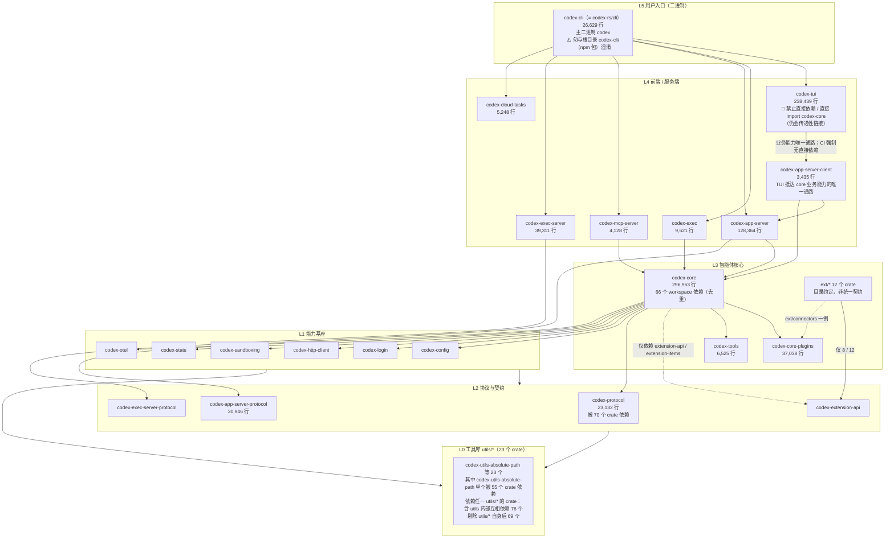

# Codex CLI Crate 地图

> **基线 commit**: `bb5054fe47abe73ecbbd454751066a28c89f4bb9`
> **数据来源**: `cargo metadata --no-deps`（crate 清单与 path 依赖）+ `git ls-files` 行数统计
> **适用读者**: 需要回答"这个 crate 干什么"「我的新代码该放哪」「改动会波及谁」的开发者与 AI 代理

---

## 0. 先读这一节：如何使用本文

| 你的问题 | 去看 |
| ---- | ---- |
| 这个 crate 是干什么的？ | [§3 按职责分组速查表](#3-按职责分组速查表) |
| 我要新增功能，代码放哪个 crate？ | [§5 新代码归属决策树](#5-新代码归属决策树) |
| 我改这个 crate 会影响谁？ | [§4 依赖热点与影响面](#4-依赖热点与影响面) |
| 整体是怎么分层的？ | [§2 分层总览](#2-分层总览) |
| 为什么不能往 `codex-core` 里加东西？ | [§6 codex-core 减负指引](#6-codex-core-减负指引) |

---

## 1. 计数口径（重要）

同一个"crate 数量"有多种口径，混用会导致文档漂移。本文统一采用 **`cargo metadata` 口径 = 134**。

| 口径 | 数值 | 命令 | 证据等级 |
| ---- | ---: | ---- | ---- |
| **workspace 包总数（本文采用）** | **134** | `cargo metadata --no-deps --format-version 1 --manifest-path codex-rs/Cargo.toml` 的 `packages` 计数 | E4 |
| `[workspace] members` 显式条目 | 128 | 读取 `codex-rs/Cargo.toml` 的 `members` 数组 | E2 |
| `[workspace.dependencies]` 中 path 映射 | 128 | 统计该段含 `path =` 的条目 | E2 |
| `codex-rs/` 下子 crate 清单文件 | 134 | `git ls-files "codex-rs/**/Cargo.toml" \| wc -l` | **E1** |

> **证据等级修正**：上表最后一行第一版标为 E4。按本体系约定，**文件计数 / 目录列举属于 E1**（文件级事实），E4 专指实际跑构建、测试、lint 等工具得到的结论。`cargo metadata` 那一行确实是 E4（跑了 Cargo），`git ls-files | wc -l` 不是。本文其余处的行数与文件数统计同理，均为 E1。

**128 与 134 的差额为 6 个**，全部是"不在 `members` 数组、但被 Cargo 作为 path 依赖纳入 workspace"的 crate：

| crate | 目录 | 纳入方式 |
| ---- | ---- | ---- |
| `codex-chatgpt` | `codex-rs/chatgpt` | `[workspace.dependencies]` path 声明 |
| `codex-message-history` | `codex-rs/message-history` | 同上 |
| `codex-windows-sandbox` | `codex-rs/windows-sandbox-rs` | 同上 |
| `core_test_support` | `codex-rs/core/tests/common` | 测试辅助 crate |
| `app_test_support` | `codex-rs/app-server/tests/common` | 测试辅助 crate |
| `mcp_test_support` | `codex-rs/mcp-server/tests/common` | 测试辅助 crate |

> **另有 1 个 workspace 之外的独立 crate**：`tools/argument-comment-lint`（Dylint 自定义 lint，由 `just argument-comment-lint` 驱动，不属于 `codex-rs` workspace）。

> [!WARNING]
> **`codex-cli` 是一个同名冲突，搜索时极易落错地方。**
>
> | 名字 | 实际位置 | 是什么 |
> | ---- | ---- | ---- |
> | 顶层目录 `codex-cli/` | 仓库根 `codex-cli/`（含 `package.json`、`bin/`、`scripts/`） | **npm 包，包名是 `@openai/codex`**，负责分发预编译二进制，里面没有 Rust 代码 |
> | Cargo 包 `codex-cli` | `codex-rs/cli/` | **Rust crate**，产出主二进制 `codex`（`[[bin]] name = "codex"`，另有 `logs_client`；lib 名为 `codex_cli`） |
>
> 也就是说：**目录名 `codex-cli/` ≠ Cargo 包 `codex-cli`**。想看子命令分发实现请去 `codex-rs/cli/src/main.rs`；`cd codex-cli` 会进到 npm 打包脚本。反过来，`npm i @openai/codex` 的包在 `codex-cli/package.json` 里，不在 `codex-rs/`。

> [!TIP]
> 需要重新核对时直接跑命令，不要抄本文数字：
> ```bash
> export PATH="$HOME/.cargo/bin:$PATH"
> cargo metadata --no-deps --format-version 1 --manifest-path codex-rs/Cargo.toml \
>   | python3 -c "import json,sys; print(len(json.load(sys.stdin)['packages']))"
> ```

---

## 2. 分层总览



> **证据等级说明**：分层是**依据 path 依赖方向归纳的表述**（E3），不是 `Cargo.toml` 里声明的显式层级。Cargo 不强制分层，实际依赖图存在跨层边。行数与文件计数为 **E1**；依赖计数为 E4（`cargo metadata` 实测）。

> [!CAUTION]
> **`codex-tui` 不得「直接」依赖、也不得「直接」`use` `codex-core` —— CI 强制。**
> 校验脚本 `.github/scripts/verify_tui_core_boundary.py`（文件头：`"""Verify codex-tui does not depend on or import codex-core directly."""`），由 `.github/workflows/repo-checks.yml` 执行。脚本同时检查 `codex-rs/tui/Cargo.toml` 不含 `codex-core`，以及 TUI 源码不出现 `codex_core::` / `use codex_core` / `extern crate codex_core`。
> - **例外一（再导出）**：`codex-app-server-client` 显式再导出 core 的配置类型（`pub mod legacy_core { pub mod config { pub use codex_core::config::*; } }`），TUI 在 93 处、40 个文件中使用。校验脚本的报错文案也点名这是被认可的过渡通道，所以该边界约束的是**依赖边与 import**，而非「core 能力必须经协议方法抵达」。详见 [`tui_guide.md`](./tui_guide.md) §0.2。
> - **例外二（传递链接）**：门禁只看**直接**关系。`codex-cloud-config`（`Cargo.toml:16`）与 `codex-utils-oss`（`Cargo.toml:11`）都在普通 `[dependencies]` 里直接依赖 `codex-core`，`tui/src/lib.rs:41`、`:66-67` 正在使用这两个 crate；`codex-app-server-client` 自身也直接依赖 `codex-core`。**因此 `codex-core` 会传递性地链接进 `codex-tui`。** E4：在 `cargo metadata` 的普通依赖图上 BFS，`codex-tui → codex-app-server-client → codex-core` 可达；而 `codex-tui` 的 92 个直接普通依赖里没有 `codex-core`。
>
> 正确通路：`codex-tui` → `codex-app-server-client` → `codex-app-server` + `codex-core`（同进程 `InProcessAppServerClient`，远端 `RemoteAppServerClient`）。
>
> **勘误（两轮）**：第一版分层图画了 `TUI --> CORE` 直接边、§ 三条主干路径也写成 `codex-tui → codex-core`，均已修正；上一稿又把"无直接依赖边"表述成"不链接 `codex-core`"，属于把 CI 脚本里的 `directly` 一词丢掉后的过度推论，已按上面的"例外二"更正。

> [!NOTE]
> **勘误**：第一版分层图中的 `PLUGINS --> EXTAPI` 边**不存在**，已删除。`codex-rs/core-plugins/Cargo.toml` 中没有 `codex-extension-api` 条目（已复核），这条边同时与本文 §3.8 自己的正文"插件不依赖 `extension-api`"相矛盾。

### 三条主干路径

1. **交互路径**：`codex` → `codex-tui` → **`codex-app-server-client`** → `codex-app-server` / `codex-core` → 模型 provider（TUI 不直连 core，见上方 CAUTION）
2. **非交互路径**：`codex exec` → `codex-exec` → `codex-core` → 模型 provider
3. **服务化路径**：`codex app-server` → `codex-app-server` ⇄ `codex-app-server-protocol` ⇄ IDE / 桌面端 / SDK

---

## 3. 按职责分组速查表

> 行数 = 该目录下 `*.rs` 的 Git 跟踪总行数（含测试代码）。`path 依赖数` = 该 crate 在 `Cargo.toml` 中声明的 workspace 内部依赖个数。

### 3.1 入口与前端（6）

| crate | 目录 | 行数 | path 依赖 | 职责 |
| ---- | ---- | ---: | ---: | ---- |
| `codex-cli` | `codex-rs/cli` | 26,629 | 46 | **主二进制** `codex`；clap 子命令分发；argv[0] 分发。⚠️ 与仓库根 npm 目录 `codex-cli/` 同名不同物，见 §1 |
| `codex-tui` | `codex-rs/tui` | 238,439 | 47 | ratatui 交互式终端界面，代码量第 2。🚫 **禁止「直接」依赖 / 「直接」import `codex-core`（CI 强制）**，经 `codex-app-server-client` 抵达 core；`codex-core` 仍会随中间 crate 传递性链接进来，见 §2 CAUTION |
| `codex-exec` | `codex-rs/exec` | 9,621 | 19 | `codex exec` 非交互执行 |
| `codex-app-server` | `codex-rs/app-server` | 128,364 | 58 | JSON-RPC 应用服务端，供 IDE / 桌面端 / SDK 接入 |
| `codex-mcp-server` | `codex-rs/mcp-server` | 4,128 | — | 把 Codex 自身暴露为 MCP server（stdio） |
| `codex-cloud-tasks` | `codex-rs/cloud-tasks` | 5,248 | — | `codex cloud`，标注 `[EXPERIMENTAL]` |

### 3.2 智能体核心（5）

| crate | 目录 | 行数 | path 依赖 | 职责 |
| ---- | ---- | ---: | ---: | ---- |
| `codex-core` | `codex-rs/core` | **296,963** | **66** | 会话、turn、工具调用、上下文管理。**代码量与依赖数双第一**（66 为去重值，第一版 67 含重复条目，见 §4） |
| `codex-core-plugins` | `codex-rs/core-plugins` | 37,038 | 23 | 插件运行时 |
| `codex-core-skills` | `codex-rs/core-skills` | 9,083 | 13 | skills 运行时 |
| `codex-tools` | `codex-rs/tools` | 6,525 | — | 工具定义与调度 |
| `codex-core-api` | `codex-rs/core-api` | 114 | — | core 对外的窄接口 |

### 3.3 协议与契约（7）

| crate | 目录 | 行数 | 被依赖数 | 职责 |
| ---- | ---- | ---: | ---: | ---- |
| `codex-protocol` | `codex-rs/protocol` | 23,132 | **70** | **全仓依赖热点第 1**，核心协议类型 |
| `codex-app-server-protocol` | `codex-rs/app-server-protocol` | 30,946 | 15 | app-server JSON-RPC 协议；ts-rs 导出 TS 类型 |
| `codex-exec-server-protocol` | `codex-rs/exec-server-protocol` | 1,723 | — | exec-server 协议 |
| `codex-code-mode-protocol` | `codex-rs/code-mode-protocol` | 3,587 | — | code-mode 协议 |
| `codex-extension-api` | `codex-rs/ext/extension-api` | 2,377 | 15 | 扩展点公共 API |
| `codex-api` | `codex-rs/codex-api` | 14,219 | 14 | 面向模型服务的 API 层 |
| `codex-client` | `codex-rs/codex-client` | 148 | — | 客户端薄封装 |

> [!IMPORTANT]
> `codex-app-server-protocol/schema/typescript/v2/` 下有 **550 个自动生成的 TS 类型文件**。**Rust 类型是唯一事实源，TS 文件是构建产物**，禁止手改。API 形状变更后须跑 `just write-app-server-schema`，并用 `just test -p codex-app-server-protocol` 验证（`AGENTS.md` → `## App-server API Development Best Practices` → `### Development Workflow`，grep `write-app-server-schema`）。

### 3.4 沙箱与执行安全（8）

| crate | 目录 | 行数 | 职责 |
| ---- | ---- | ---: | ---- |
| `codex-sandboxing` | `codex-rs/sandboxing` | 6,882 | 三平台沙箱统一入口：`seatbelt.rs` / `landlock.rs` / `bwrap.rs` / `windows.rs` + 3 个 `.sbpl` 策略 |
| `codex-windows-sandbox` | `codex-rs/windows-sandbox-rs` | 19,173 | Windows 沙箱实现 |
| `codex-linux-sandbox` | `codex-rs/linux-sandbox` | 8,224 | Linux 沙箱：**bwrap（文件系统）+ seccomp（系统调用）+ `no_new_privs`**。Landlock 为已废弃的 legacy 回退，默认不启用 |
| `codex-bwrap` | `codex-rs/bwrap` | 151 | bubblewrap 封装；产出 `bwrap` 二进制，C 源码 vendored 在 `codex-rs/vendor/bubblewrap/`（**50 个 Git 跟踪条目 / `find -type f` 得 49**，口径见表后说明） |
| `codex-execpolicy` | `codex-rs/execpolicy` | 2,937 | 执行策略；`codex execpolicy` 为 hidden 子命令 |
| `codex-shell-command` | `codex-rs/shell-command` | 6,760 | shell 命令解析 |
| `codex-shell-escalation` | `codex-rs/shell-escalation` | 2,279 | 权限提升审批 |
| `codex-process-hardening` | `codex-rs/process-hardening` | 193 | 进程加固 |

> **`vendor/bubblewrap/` 文件数的两个口径**（E1）：`git ls-files codex-rs/vendor/bubblewrap | wc -l` 得 **50**，`find codex-rs/vendor/bubblewrap -type f | wc -l` 得 **49**。差的一个是**符号链接** `LICENSE` → `COPYING`：Git 把它当作一个跟踪条目，而 `find -type f` 不匹配符号链接（`find ... -type l | wc -l` 得 1）。两个数字都对，引用时写明用的是哪一个即可。

> [!NOTE]
> **勘误**：第一版把 Linux 沙箱写成"Landlock（文件系统）+ seccomp + bwrap 回退"，主次正好写反。实际是 **bwrap 管文件系统、seccomp 管系统调用**，Landlock 已废弃（`--use-legacy-landlock` 为 `hide = true` 且默认 `false`，`codex-features` 标 `Stage::Deprecated`），且默认路径"never falls back to legacy Landlock on failure"。完整证据见 [`architecture_overview.md`](./architecture_overview.md) §6。
>
> 另注：`codex-rs/sandboxing/src/landlock.rs` **不含任何 landlock 调用**，它只负责拼装 `codex-linux-sandbox` 子进程命令行；`landlock` crate 依赖只在 `codex-rs/linux-sandbox/Cargo.toml`（与 `codex-rs/protocol/Cargo.toml`）中出现。

> [!WARNING]
> **绝对红线**：禁止新增或修改任何与 `CODEX_SANDBOX_NETWORK_DISABLED_ENV_VAR`、`CODEX_SANDBOX_ENV_VAR` 相关的代码。出处：`AGENTS.md` 顶部规则列表（无标题的一级列表），grep `Never add or modify any code related to`。

### 3.5 执行服务与进程间通信（9）

| crate | 目录 | 行数 | 职责 |
| ---- | ---- | ---: | ---- |
| `codex-exec-server` | `codex-rs/exec-server` | 39,311 | 独立执行服务，可与 app-server 跨操作系统分离部署 |
| `codex-app-server-transport` | `codex-rs/app-server-transport` | 16,180 | app-server 传输层 |
| `codex-app-server-daemon` | `codex-rs/app-server-daemon` | 3,552 | 守护进程生命周期 |
| `codex-app-server-client` | `codex-rs/app-server-client` | 3,435 | app-server 客户端。**`codex-tui` 抵达 core 业务能力的唯一合法通路**：`InProcessAppServerClient`（同进程）/ `RemoteAppServerClient`（远端，`remote.rs`）。自身直接依赖 `codex-app-server` + `codex-core`，并通过 `legacy_core` 再导出 core 的配置类型 |
| `codex-app-server-test-client` | `codex-rs/app-server-test-client` | 4,077 | 测试客户端，由 `just app-server-test-client` 驱动 |
| `codex-exec-server-test-support` | `codex-rs/exec-server/tests/support` | 10 | exec-server 集成测试辅助 crate。是 `[workspace] members` 的显式条目（`"exec-server/tests/support"`），但因**藏在 `tests/` 子目录**里而极易被目录遍历漏掉 —— 本文第一版是唯一未提及的 crate，此处补上 |
| `codex-uds` | `codex-rs/uds` | 452 | Unix domain socket |
| `codex-stdio-to-uds` | `codex-rs/stdio-to-uds` | 223 | stdio ↔ UDS 中继（hidden 子命令） |
| `codex-websocket-client` | `codex-rs/websocket-client` | 1,158 | WebSocket 客户端 |

### 3.6 配置、认证与模型接入（14）

| crate | 目录 | 行数 | 职责 |
| ---- | ---- | ---: | ---- |
| `codex-config` | `codex-rs/config` | 21,034 | 配置体系；`just write-config-schema` 生成 JSON Schema |
| `codex-login` | `codex-rs/login` | 13,798 | 登录流程（被 28 个 crate 依赖） |
| `codex-keyring-store` | `codex-rs/keyring-store` | 226 | 系统钥匙串存储 |
| `codex-secrets` | `codex-rs/secrets` | 786 | 密钥抽象 |
| `codex-agent-identity` | `codex-rs/agent-identity` | 1,000 | 代理身份 |
| `codex-http-client` | `codex-rs/http-client` | 7,455 | HTTP 客户端（被 26 个 crate 依赖） |
| `codex-model-provider` | `codex-rs/model-provider` | 3,247 | provider 抽象 |
| `codex-model-provider-info` | `codex-rs/model-provider-info` | 1,118 | provider 元信息 |
| `codex-models-manager` | `codex-rs/models-manager` | 2,722 | 模型管理 |
| `codex-ollama` | `codex-rs/ollama` | 1,107 | 本地 Ollama 接入 |
| `codex-lmstudio` | `codex-rs/lmstudio` | 470 | 本地 LM Studio 接入 |
| `codex-chatgpt` | `codex-rs/chatgpt` | 1,110 | ChatGPT 通道；`codex apply` 实现 |
| `codex-backend-client` | `codex-rs/backend-client` | 2,258 | 后端客户端 |
| `codex-aws-auth` | `codex-rs/aws-auth` | 375 | AWS 认证 |

### 3.7 会话、状态与持久化（9 个 crate / 8 行）

> 表中 `codex-memories-write` 与 `codex-memories-read` 是**两个独立 crate**，因同属 `codex-rs/memories/` 而合并在一行展示。因此本节是 **8 行、9 个 crate**（第一版标题只写"8"，易被误读为 8 个 crate）。

| crate | 目录 | 行数 | 职责 |
| ---- | ---- | ---: | ---- |
| `codex-state` | `codex-rs/state` | 19,744 | 运行时状态；SQLite 日志由 `just log` 读取 |
| `codex-thread-store` | `codex-rs/thread-store` | 20,404 | 会话线程存储 |
| `codex-rollout` | `codex-rs/rollout` | 13,940 | rollout 记录 |
| `codex-rollout-trace` | `codex-rs/rollout-trace` | 13,257 | rollout 追踪与回放（`codex debug trace-reduce`） |
| `codex-message-history` | `codex-rs/message-history` | 1,437 | 消息历史 |
| `codex-memories-write` / `-read` | `codex-rs/memories/*` | 4,541 / 236 | 记忆写入与读取 |
| `codex-context-fragments` | `codex-rs/context-fragments` | 236 | 上下文片段 |
| `codex-agent-graph-store` | `codex-rs/agent-graph-store` | 479 | 代理图存储 |

### 3.8 扩展面：四条路径、21 行、20 个去重 crate

> 下表 21 行中 `codex-mcp-extension` 出现两次（①与④各一），**去重后为 20 个 crate**。第一版标题写"19"，与表内容不符，已修正。

> [!IMPORTANT]
> **关系已完成代码级核查（E3）。第一版称"12 个 `ext/*` 全部依赖 `extension-api`"是错的，实测为 8 / 12。**
>
> 逐个 grep `codex-rs/ext/*/Cargo.toml` 的结果：
>
> | 依赖 `codex-extension-api`（8） | 不依赖（3） | 自身（1） |
> | ---- | ---- | ---- |
> | `skills`、`goal`、`memories`、`mcp`、`image-generation`、`web-search`、`git-attribution`、`guardian` | `agent`、`connectors`、`items` | `extension-api` |
>
> 第一版的错误来源是**把 `ext/extension-api` 自己也算成了依赖方**（其 `Cargo.toml` 里 `name = "codex-extension-api"` 会被朴素 grep 命中），于是 8 变成了 12。
>
> 修正后的判断：
>
> - `ext/extension-api` 仍是**主扩展点**（13 个扩展 trait），但 **`ext/` 只是目录约定，不是"必须实现 extension-api"的契约**。
> - **`ext/items`（271 行）是纯数据 / schema crate**，只依赖 `codex-utils-absolute-path`，没有行为，因此没有 contributor —— 它不是"贡献者型扩展"。
> - **`ext/agent`（161 行）是子智能体辅助层**，只依赖 `codex-core` + `codex-protocol`，同理不是贡献者型扩展。
> - **`ext/connectors` 建立在插件机制之上**（依赖 `codex-connectors` + `codex-core-plugins` + `codex-plugin` + `codex-utils-path-uri`）。这削弱了"插件是完全平行的第二条赛道"的框架 —— **`ext/` 内已有成员反过来消费插件机制，两者是交叉关系，不是平行关系**。
> - Skills 与 MCP 确实通过 `ext/skills`、`ext/mcp` 包装接入扩展体系。
> - `core-plugins` 自身**不**依赖 `extension-api`（已复核 `codex-rs/core-plugins/Cargo.toml`）。
>
> 详见 [`mcp_and_extensions.md`](./mcp_and_extensions.md) §1 与 [`architecture_overview.md`](./architecture_overview.md) §10。

| 路径 | crate | 行数 | 依赖 `extension-api`？ |
| ---- | ---- | ---: | ---- |
| **① 内建扩展 `ext/`（12）** | `codex-skills-extension`（`ext/skills`） | 11,114 | ✅ |
| | `codex-goal-extension`（`ext/goal`） | 4,384 | ✅ |
| | `codex-memories-extension`（`ext/memories`） | 2,399 | ✅ |
| | `codex-extension-api`（`ext/extension-api`） | 2,377 | — （即扩展点本身） |
| | `codex-mcp-extension`（`ext/mcp`） | 1,504 | ✅ |
| | `codex-image-generation-extension`（`ext/image-generation`） | 1,166 | ✅ |
| | `codex-web-search-extension`（`ext/web-search`） | 874 | ✅ |
| | `codex-git-attribution`（`ext/git-attribution`） | 439 | ✅ |
| | `codex-extension-items`（`ext/items`） | 271 | ❌ 纯数据 / schema crate |
| | `codex-agent-extension`（`ext/agent`） | 161 | ❌ 子智能体辅助层 |
| | `codex-guardian`（`ext/guardian`） | 77 | ✅ |
| | `codex-connectors-extension`（`ext/connectors`） | 71 | ❌ 建在**插件机制**之上 |
| **② 插件（3）** | `codex-core-plugins` | 37,038 | ❌ |
| | `codex-plugin` | 926 | ❌ |
| | `codex-utils-plugins`（`utils/plugins`） | 353 | ❌ |
| **③ Skills（2）** | `codex-core-skills` | 9,083 | — |
| | `codex-skills` | 372 | — |
| **④ MCP（4）** | `codex-rmcp-client` | 19,361 | — |
| | `codex-mcp`（`codex-rs/codex-mcp`） | 14,560 | — |
| | `codex-mcp-server` | 4,128 | — |
| | `codex-mcp-extension`（`ext/mcp`，与①重叠） | 1,504 | ✅ |

#### 13 个扩展 trait 的确切构成（E3）

"13" 这个数字成立，但不是"13 个 `*Contributor`"，而是 **12 + 1**：

- **12 个以 `Contributor` 结尾的 trait，全部在 `codex-rs/ext/extension-api/src/contributors.rs`**：`McpServerContributor`、`ContextContributor`、`ThreadLifecycleContributor`、`TurnLifecycleContributor`、`TurnInputContributor`、`ConfigContributor`、`TokenUsageContributor`、`SkillInvocationContributor`、`ToolContributor`、`ToolLifecycleContributor`、`ApprovalReviewContributor`、`TurnItemContributor`。
- **第 13 个是 `UserInstructionsProvider`**，在 `codex-rs/ext/extension-api/src/user_instructions.rs`，**名字里没有 "Contributor"**。按 `Contributor` 关键词 grep 只会得到 12，这是常见的对不上账原因。

> `extension-api` 中另有 4 个**能力（capability）** trait 不计入扩展点：`ExtensionMetrics`、`ExtensionEventSink`、`AgentSpawner`、`ResponseItemInjector`（均在 `src/capabilities/` 下）。它们是**扩展向宿主索取**的能力，方向与 contributor 相反。

### 3.9 可观测性与诊断（6）

| crate | 目录 | 行数 | 职责 |
| ---- | ---- | ---: | ---- |
| `codex-otel` | `codex-rs/otel` | 6,979 | OpenTelemetry；含 Statsig 默认指标导出器（被 25 个 crate 依赖） |
| `codex-analytics` | `codex-rs/analytics` | 12,116 | 本地埋点采集 |
| `codex-feedback` | `codex-rs/feedback` | 1,147 | 用户反馈 |
| `codex-response-debug-context` | `codex-rs/response-debug-context` | 166 | 响应调试上下文 |
| `codex-hooks` | `codex-rs/hooks` | 11,795 | 钩子机制；`just write-hooks-schema` 生成 schema |
| `codex-install-context` | `codex-rs/install-context` | 825 | 安装环境上下文 |

> [!NOTE]
> 遥测默认行为已完成核查（E3）：`metrics_exporter` 默认 `Statsig`、`trace_exporter` 与通用 `exporter` 默认 `None`、用户提示词默认不记录，debug 构建下 Statsig 降级为不发送。
>
> **但"指标默认外发"要按二进制区分**：`codex-rs/core/src/otel_init.rs:70-77` 在 analytics 关闭时把 `metrics_exporter` 强制置为 `None`，而 `default_analytics_enabled` 由各二进制自行传入：
>
> | 传 `true`（默认开） | 传 `false`（默认关） |
> | ---- | ---- |
> | TUI（`tui/src/lib.rs:1157`）、`codex exec`（`exec/src/lib.rs:163`）、`codex mcp-server`（`mcp-server/src/lib.rs:57`） | app-server（`app-server/src/main.rs:108`）、remote-control（`cli/src/remote_control_cmd.rs:137`）、exec-server 遥测（`cli/src/exec_server_telemetry.rs:6`） |
>
> **勘误**：本文上一稿写成"只对 TUI 成立"，这是**过度收窄**。`exec/src/lib.rs:163` 与 `mcp-server/src/lib.rs:57` 同样是 `const DEFAULT_ANALYTICS_ENABLED: bool = true;`，且都在各自的 `#[cfg(test)]` 块（分别在 `:2016`、`:209`）之前，属于生产代码。权威表格见 [`observability.md`](./observability.md) §1.2；另见 [`architecture_overview.md`](./architecture_overview.md) §8。

### 3.10 实验性与低频表面（8）

> 全部标注 `[experimental]` / `[EXPERIMENTAL]` / `#[clap(hide = true)]` 或目录名即 PoC。**上游可能随时变更或移除**。详细展开见第 4 批 `experimental_surfaces.md`。

| crate | 目录 | 行数 | 标记来源 |
| ---- | ---- | ---: | ---- |
| `codex-cloud-tasks` | `codex-rs/cloud-tasks` | 5,248 | `main.rs:195` `[EXPERIMENTAL]` |
| `codex-cloud-tasks-client` | `codex-rs/cloud-tasks-client` | 1,117 | 同上 |
| `codex-cloud-tasks-mock-client` | `codex-rs/cloud-tasks-mock-client` | 270 | 同上 |
| `codex-cloud-config` | `codex-rs/cloud-config` | 2,433 | 同上 |
| `codex-code-mode` | `codex-rs/code-mode` | 5,128 | `just code-mode-host` |
| `codex-code-mode-runtime` | `codex-rs/code-mode-runtime` | 6,749 | 同上 |
| `codex-code-mode-host` | `codex-rs/code-mode-host` | 3,517 | 同上 |
| `codex-v8-poc` | `codex-rs/v8-poc` | 92 | 目录名即 PoC |

### 3.11 utils/ 工具库（23）

> **勘误**：第一版标题写"20"，但下表本身就有 23 行 —— 自相矛盾。`ls -d codex-rs/utils/*/` 实测为 **23**（E1）。分层图中的 L0 节点也已同步更正。

| crate | 行数 | crate | 行数 |
| ---- | ---: | ---- | ---: |
| `codex-utils-pty` | 4,114 | `codex-utils-cache` | 193 |
| `codex-utils-path-uri` | 2,914 | `codex-utils-sandbox-summary` | 186 |
| `codex-utils-stream-parser` | 1,485 | `codex-utils-fuzzy-match` | 168 |
| `codex-utils-image` | 1,041 | `codex-utils-home-dir` | 134 |
| `codex-utils-absolute-path` | 872 | `codex-utils-json-to-toml` | 83 |
| `codex-utils-cli` | 645 | `codex-utils-rustls-provider` | 81 |
| `codex-utils-sleep-inhibitor` | 608 | `codex-utils-approval-presets` | 77 |
| `codex-utils-string` | 560 | `codex-utils-elapsed` | 71 |
| `codex-utils-output-truncation` | 560 | `codex-utils-oss` | 62 |
| `codex-utils-template` | 442 | `codex-utils-path`（`utils/path-utils`） | 354 |
| `codex-utils-plugins` | 353 | `codex-utils-cargo-bin` | 231 |
| `codex-utils-readiness` | 336 | | |

### 3.12 其余基础设施（约 20）

`codex-arg0`(751) · `codex-apply-patch`(5,056) · `codex-git-utils`(3,572) · `codex-file-search`(1,346) · `codex-file-watcher`(1,492) · `codex-file-system`(816) · `codex-network-proxy`(17,064) · `codex-responses-api-proxy`(1,007) · `codex-external-agent-migration`(15,262) · `codex-connectors`(4,851) · `codex-features`(2,617) · `codex-prompts`(1,708) · `codex-terminal-detection`(1,495) · `codex-ansi-escape`(58) · `codex-async-utils`(86) · `codex-home`(227) · `codex-backend-openapi-models`(1,017) · `codex-experimental-api-macros`(310) · `codex-app-server-protocol-noop-macros`(20) · `codex-collaboration-mode-templates`(4) · `codex-thread-manager-sample`(420) · `codex-test-binary-support`(77)

---

## 4. 依赖热点与影响面

改动下列 crate 的**公共 API** 会波及大量下游，代价最高。

> [!IMPORTANT]
> **计数口径（第一版未声明，导致 4 个数字偏大）**：本表数字 = **workspace 内直接依赖它的 crate 个数，按 crate 名去重，且含 `[dev-dependencies]`**（E4，`cargo metadata --no-deps` 统计）。
>
> ⚠️ **含 dev-deps 这一点很重要**：本体系自己的第 27 条铁律要求依赖类断言必须区分 `[dependencies]` 与 `[dev-dependencies]`，因为把 dev 依赖当架构依赖正是首版 H4 那个错误的来源。本表是「谁碰过它」的影响面口径，**不是架构依赖口径**。仅算 normal 依赖时数字明显更低：codex-core 出度 58（而非 66）、`codex-utils-absolute-path` 入度 49（而非 55）、`codex-protocol` 入度 67（而非 70）、依赖任一 `utils/*` 者 70（而非 76）。评估「改这个 crate 会波及谁」用本表；论证架构分层请用 normal 口径。
>
> 第一版的数字是 **`Cargo.toml` 的依赖条目数**——同一个 crate 若同时出现在 `[dependencies]` 与 `[dev-dependencies]`，会被计两次。已按去重口径修正 4 个：
>
> | 项 | 第一版（条目数） | 现值（去重 crate 数） |
> | ---- | ---: | ---: |
> | `codex-utils-absolute-path` 被依赖 | 58 | **55** |
> | `codex-http-client` 被依赖 | 27 | **26** |
> | `codex-otel` 被依赖 | 26 | **25** |
> | `codex-core` 出度 | 67 | **66** |
>
> 其余数字（`codex-protocol` 70、`codex-login` 28、`codex-core` 入度 26、`codex-config` 25、`codex-utils-path-uri` 24、`codex-exec-server` 20、`codex-git-utils` 17，以及出度 `app-server` 58 / `tui` 47 / `cli` 46 / `core-plugins` 23）两种口径一致，无需改动。

| 排名 | crate | 被依赖数（去重） | 改动影响 |
| ---: | ---- | ---: | ---- |
| 1 | `codex-protocol` | **70** | 协议类型；改动几乎波及全仓 |
| 2 | `codex-utils-absolute-path` | **55** | 路径类型基座 |
| 3 | `codex-login` | 28 | 认证链路 |
| 4 | `codex-http-client` | 26 | 全部出网请求 |
| 5 | `codex-core` | 26 | 智能体核心 |
| 6 | `codex-otel` | 25 | 全链路遥测 |
| 7 | `codex-config` | 25 | 配置读取 |
| 8 | `codex-utils-path-uri` | 24 | 路径 URI |
| 9 | `codex-exec-server` | 20 | 执行服务 |
| 10 | `codex-git-utils` | 17 | Git 操作 |

**反向的依赖出度 Top 5**（自身依赖了多少 workspace crate，同样去重）：`codex-core` 66 · `codex-app-server` 58 · `codex-tui` 47 · `codex-cli` 46 · `codex-core-plugins` 23。

> **`utils/` 层的整体影响面另计**：`codex-utils-absolute-path` 的 55 是**单个 crate**的入度，不代表整层。第一版分层图把"58"标在 L0 节点上，读起来像"整个 utils 层被 58 个 crate 依赖"，属于口径混淆，已更正。
>
> **"依赖 `utils/*` 中任意一个"的实测数字要看口径（E4）**：
>
> | 口径 | 数量 |
> | ---- | ---: |
> | 全部 workspace crate（**含 `utils/*` 自己依赖别的 `utils/*`**） | **76** |
> | **剔除 `utils/*` 自身**，只数 utils 层以外的消费者 | **69** |
> | workspace crate 总数 / 其中 `utils/*` | 134 / 23 |
>
> 上一稿只给了 76 而没说明口径。**76 这个数把 utils 层内部的互相依赖也算进去了**（23 个 utils crate 里有 7 个依赖了其它 utils crate），因此"有 76 个 crate 要看 utils 的脸色"是略微夸大的；**衡量"改 utils 会波及多少外部消费者"时应当用 69。**

> 出度高说明这个 crate 是"汇聚点"，改动它本身相对安全；入度高说明它是"基座"，改动它风险最高。`codex-core` 两头都高，是全仓最敏感的位置。

---

## 5. 新代码归属决策树

```
新增代码
├── 是纯函数式小工具（字符串/路径/时间/缓存）？
│   └── 是 → codex-rs/utils/ 下新建或并入现有 utils crate
│
├── 是协议/线上契约类型？
│   ├── app-server JSON-RPC → codex-app-server-protocol
│   │   └── ⚠️ v2 类型必须标注 #[ts(export_to = "v2/")]
│   │       （AGENTS.md → ## App-server API ... → ### Core Rules，grep "export_to"）
│   │       改完跑 just write-app-server-schema
│   ├── exec-server → codex-exec-server-protocol
│   └── 其他核心协议 → codex-protocol（⚠️ 被 70 个 crate 依赖，改动前先确认无替代方案）
│
├── 是新的用户可见能力面（新子命令）？
│   └── codex-rs/cli/src/main.rs 的 Subcommand 枚举 + 对应实现 crate
│       └── 实验性能力请加 [experimental] 或 #[clap(hide = true)]
│
├── 是 TUI 相关？
│   └── codex-rs/tui
│       └── 🚫 绝不可 use codex_core:: —— CI 强制边界，走 codex-app-server-client
│
├── 是扩展/插件/技能/MCP 相关？
│   └── ✅ 关系已完成代码级核查（E3），见 §3.8 与 mcp_and_extensions.md §1：
│       ├── 要挂 contributor 钩子（工具/上下文/生命周期）→ ext/ 下新建，实现 extension-api
│       ├── 纯数据/schema，无行为            → 参照 ext/items，不必依赖 extension-api
│       ├── 要用插件运行时/连接器机制        → 参照 ext/connectors，走 core-plugins + plugin
│       └── 注意：ext/ 只是目录约定，12 个 ext/* 中只有 8 个依赖 extension-api
│
├── 是沙箱或执行策略？
│   └── codex-sandboxing / codex-execpolicy
│       └── 🚫 禁止触碰 CODEX_SANDBOX_* 相关代码
│           （AGENTS.md 顶部规则列表，grep "Never add or modify any code related to"）
│
└── 是智能体核心逻辑（会话/turn/工具调用/上下文）？
    └── 先读 §6 —— codex-core 已 296,963 行，默认答案是"不要放进 core"
```

> **勘误**：第一版这棵决策树写着"四条路径关系未验证，先读 `mcp_and_extensions.md`（第 3 批）"，而同一文件的 §3.8 与 §7 却都写着"已完成代码级核查（E3）"—— 三处自相矛盾。现已统一为**已验证**，并把结论直接写进树里（含 8/12 的修正）。

---

## 6. codex-core 减负指引

`AGENTS.md` 的 `## The codex-core crate` 一节明确要求为 `codex-core` 减负（grep `resist adding code to codex-core`）。实测数据支持这一要求：

| 指标 | `codex-core` | 全仓位次 |
| ---- | ---: | ---- |
| 代码行数 | 296,963 | 第 1（是第 2 名 `codex-tui` 的 1.24 倍） |
| workspace 依赖数（去重） | 66 | 第 1 |
| 被依赖数（去重） | 26 | 并列第 4 |

**实践准则**：

1. **默认不往 core 加代码。** 先问"这段逻辑能否独立成 crate，让 core 依赖它"。
2. 新能力优先落在 `codex-tools`、`codex-core-plugins`、`ext/*` 或新建 crate。
3. 确需改 core 时，遵守 `AGENTS.md` 顶部规则列表的 `Avoid large modules` 一条（以及 `### Change size guidance (800 lines)`）：单模块目标 500 行以内（不含测试）；文件超过约 800 行时，**新功能放新模块，不要继续扩写原文件**。
4. core 内部已有 `config/`、`session/` 等子模块划分，新增逻辑应归入既有子模块或新建子模块，而非堆进顶层。

> [!NOTE]
> `codex-rs/core/src/config/config_tests.rs`（12,127 行）与 `codex-rs/core/src/session/tests.rs`（11,434 行）是仓库内**第 2、3 大的 `.rs` 文件**（第 1 是 `codex-rs/tui/src/bottom_pane/chat_composer.rs`，12,616 行），均为测试代码。规范中的 500 行目标明确 "excluding tests"，因此它们不违反规范，但**阅读时必须分段读取**。
>
> **口径提醒**（第一版缺失，"第 2、3 大文件"曾被写成全仓口径）：以上排名**只在 `.rs` 文件内成立**。若按 `git ls-files` 全仓口径，最大的跟踪文件依次是 `codex-rs/app-server-protocol/schema/json/codex_app_server_protocol.schemas.json`（22,635 行）、同目录 `...v2.schemas.json`（20,393 行）、`codex-rs/Cargo.lock`（16,230 行），三者都排在任何 `.rs` 文件之前 —— 但它们都是**生成物 / 锁文件**，不适用代码规范。

---

## 7. 本文未覆盖的内容

诚实声明，避免被当作完整事实源：

| 未覆盖项 | 原因 | 何时补齐 |
| ---- | ---- | ---- |
| 各 crate 的**内部模块结构** | 本文是 crate 级地图，不下钻到模块 | 各专题文档（第 2-4 批） |
| ~~四条扩展路径的相互关系~~ | **已完成（E3）**，并已修正为 8/12 | 见 §3.8、`mcp_and_extensions.md` §1 |
| `codex-core` 66 个依赖的**具体用途** | 需逐个读取才能给出 E3 结论 | 第 2 批 `core_agent_loop.md` |
| app-server ↔ exec-server 的**传输实现** | 仅有 `AGENTS.md` `## Platform Support` 的 E2 声明 | 第 2 批 `app_server_protocol.md` |
| 各 crate 的**外部（crates.io）依赖** | 本文只统计 workspace 内部 path 依赖 | 暂无计划，需要时直接读 `Cargo.toml` |
| `tools/argument-comment-lint` 的实现 | 不属于 codex-rs workspace | 第 3 批 `build_and_release.md` 简述 |

---

## 8. 相关文档

- [架构总览](./architecture_overview.md) — 运行时拓扑与进程边界
- [开发流程](./development_workflow.md) — 规范落地、构建与测试
- [AI 编码上下文主文档](./AI_Coding_Context.md) — 场景导航入口
- 仓库自带：[AGENTS.md](../AGENTS.md) — **AI 代理强制规范，优先级高于本文档体系**
