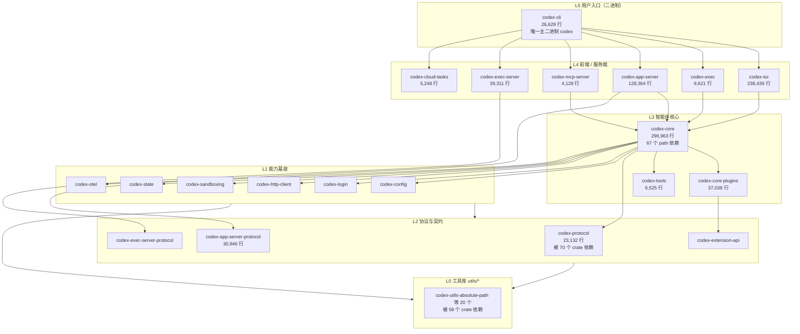

# Codex CLI Crate 地图

> **基线 commit**: `bb5054fe47abe73ecbbd454751066a28c89f4bb9`
> **数据来源**: `cargo metadata --no-deps`（crate 清单与 path 依赖）+ `git ls-files` 行数统计
> **适用读者**: 需要回答"这个 crate 干什么"「我的新代码该放哪」「改动会波及谁」的开发者与 AI 代理

---

## 0. 先读这一节：如何使用本文

| 你的问题 | 去看 |
| ---- | ---- |
| 这个 crate 是干什么的？ | [§3 按职责分组速查表](#3-按职责分组速查表) |
| 我要新增功能，代码放哪个 crate？ | [§5 新代码归属决策树](#5-新代码归属决策树) |
| 我改这个 crate 会影响谁？ | [§4 依赖热点与影响面](#4-依赖热点与影响面) |
| 整体是怎么分层的？ | [§2 分层总览](#2-分层总览) |
| 为什么不能往 `codex-core` 里加东西？ | [§6 codex-core 减负指引](#6-codex-core-减负指引) |

---

## 1. 计数口径（重要）

同一个"crate 数量"有多种口径，混用会导致文档漂移。本文统一采用 **`cargo metadata` 口径 = 134**。

| 口径 | 数值 | 命令 | 证据等级 |
| ---- | ---: | ---- | ---- |
| **workspace 包总数（本文采用）** | **134** | `cargo metadata --no-deps --format-version 1 --manifest-path codex-rs/Cargo.toml` 的 `packages` 计数 | E4 |
| `[workspace] members` 显式条目 | 128 | 读取 `codex-rs/Cargo.toml` 的 `members` 数组 | E2 |
| `[workspace.dependencies]` 中 path 映射 | 128 | 统计该段含 `path =` 的条目 | E2 |
| `codex-rs/` 下子 crate 清单文件 | 134 | `git ls-files "codex-rs/**/Cargo.toml" \| wc -l` | E4 |

**128 与 134 的差额为 6 个**，全部是"不在 `members` 数组、但被 Cargo 作为 path 依赖纳入 workspace"的 crate：

| crate | 目录 | 纳入方式 |
| ---- | ---- | ---- |
| `codex-chatgpt` | `codex-rs/chatgpt` | `[workspace.dependencies]` path 声明 |
| `codex-message-history` | `codex-rs/message-history` | 同上 |
| `codex-windows-sandbox` | `codex-rs/windows-sandbox-rs` | 同上 |
| `core_test_support` | `codex-rs/core/tests/common` | 测试辅助 crate |
| `app_test_support` | `codex-rs/app-server/tests/common` | 测试辅助 crate |
| `mcp_test_support` | `codex-rs/mcp-server/tests/common` | 测试辅助 crate |

> **另有 1 个 workspace 之外的独立 crate**：`tools/argument-comment-lint`（Dylint 自定义 lint，由 `just argument-comment-lint` 驱动，不属于 `codex-rs` workspace）。

> [!TIP]
> 需要重新核对时直接跑命令，不要抄本文数字：
> ```bash
> export PATH="$HOME/.cargo/bin:$PATH"
> cargo metadata --no-deps --format-version 1 --manifest-path codex-rs/Cargo.toml \
>   | python3 -c "import json,sys; print(len(json.load(sys.stdin)['packages']))"
> ```

---

## 2. 分层总览



> **证据等级说明**：分层是**依据 path 依赖方向归纳的表述**（E3），不是 `Cargo.toml` 里声明的显式层级。Cargo 不强制分层，实际依赖图存在跨层边。行数与依赖计数为 E4 实测。

### 三条主干路径

1. **交互路径**：`codex` → `codex-tui` → `codex-core` → 模型 provider
2. **非交互路径**：`codex exec` → `codex-exec` → `codex-core` → 模型 provider
3. **服务化路径**：`codex app-server` → `codex-app-server` ⇄ `codex-app-server-protocol` ⇄ IDE / 桌面端 / SDK

---

## 3. 按职责分组速查表

> 行数 = 该目录下 `*.rs` 的 Git 跟踪总行数（含测试代码）。`path 依赖数` = 该 crate 在 `Cargo.toml` 中声明的 workspace 内部依赖个数。

### 3.1 入口与前端（6）

| crate | 目录 | 行数 | path 依赖 | 职责 |
| ---- | ---- | ---: | ---: | ---- |
| `codex-cli` | `codex-rs/cli` | 26,629 | 46 | **唯一主二进制** `codex`；clap 子命令分发；argv[0] 分发 |
| `codex-tui` | `codex-rs/tui` | 238,439 | 47 | ratatui 交互式终端界面，代码量第 2 |
| `codex-exec` | `codex-rs/exec` | 9,621 | 19 | `codex exec` 非交互执行 |
| `codex-app-server` | `codex-rs/app-server` | 128,364 | 58 | JSON-RPC 应用服务端，供 IDE / 桌面端 / SDK 接入 |
| `codex-mcp-server` | `codex-rs/mcp-server` | 4,128 | — | 把 Codex 自身暴露为 MCP server（stdio） |
| `codex-cloud-tasks` | `codex-rs/cloud-tasks` | 5,248 | — | `codex cloud`，标注 `[EXPERIMENTAL]` |

### 3.2 智能体核心（5）

| crate | 目录 | 行数 | path 依赖 | 职责 |
| ---- | ---- | ---: | ---: | ---- |
| `codex-core` | `codex-rs/core` | **296,963** | **67** | 会话、turn、工具调用、上下文管理。**代码量与依赖数双第一** |
| `codex-core-plugins` | `codex-rs/core-plugins` | 37,038 | 23 | 插件运行时 |
| `codex-core-skills` | `codex-rs/core-skills` | 9,083 | 13 | skills 运行时 |
| `codex-tools` | `codex-rs/tools` | 6,525 | — | 工具定义与调度 |
| `codex-core-api` | `codex-rs/core-api` | 114 | — | core 对外的窄接口 |

### 3.3 协议与契约（7）

| crate | 目录 | 行数 | 被依赖数 | 职责 |
| ---- | ---- | ---: | ---: | ---- |
| `codex-protocol` | `codex-rs/protocol` | 23,132 | **70** | **全仓依赖热点第 1**，核心协议类型 |
| `codex-app-server-protocol` | `codex-rs/app-server-protocol` | 30,946 | 15 | app-server JSON-RPC 协议；ts-rs 导出 TS 类型 |
| `codex-exec-server-protocol` | `codex-rs/exec-server-protocol` | 1,723 | — | exec-server 协议 |
| `codex-code-mode-protocol` | `codex-rs/code-mode-protocol` | 3,587 | — | code-mode 协议 |
| `codex-extension-api` | `codex-rs/ext/extension-api` | 2,377 | 15 | 扩展点公共 API |
| `codex-api` | `codex-rs/codex-api` | 14,219 | 14 | 面向模型服务的 API 层 |
| `codex-client` | `codex-rs/codex-client` | 148 | — | 客户端薄封装 |

> [!IMPORTANT]
> `codex-app-server-protocol/schema/typescript/v2/` 下有 **550 个自动生成的 TS 类型文件**。**Rust 类型是唯一事实源，TS 文件是构建产物**，禁止手改。API 形状变更后须跑 `just write-app-server-schema`，并用 `just test -p codex-app-server-protocol` 验证（`AGENTS.md:300-304`）。

### 3.4 沙箱与执行安全（8）

| crate | 目录 | 行数 | 职责 |
| ---- | ---- | ---: | ---- |
| `codex-sandboxing` | `codex-rs/sandboxing` | 6,882 | 三平台沙箱统一入口：`seatbelt.rs` / `landlock.rs` / `bwrap.rs` / `windows.rs` + 3 个 `.sbpl` 策略 |
| `codex-windows-sandbox` | `codex-rs/windows-sandbox-rs` | 19,173 | Windows 沙箱实现 |
| `codex-linux-sandbox` | `codex-rs/linux-sandbox` | 8,224 | Linux Landlock 沙箱 |
| `codex-bwrap` | `codex-rs/bwrap` | 151 | bubblewrap 封装 |
| `codex-execpolicy` | `codex-rs/execpolicy` | 2,937 | 执行策略；`codex execpolicy` 为 hidden 子命令 |
| `codex-shell-command` | `codex-rs/shell-command` | 6,760 | shell 命令解析 |
| `codex-shell-escalation` | `codex-rs/shell-escalation` | 2,279 | 权限提升审批 |
| `codex-process-hardening` | `codex-rs/process-hardening` | 193 | 进程加固 |

> [!WARNING]
> **绝对红线**：`AGENTS.md:8-10` 规定，禁止新增或修改任何与 `CODEX_SANDBOX_NETWORK_DISABLED_ENV_VAR`、`CODEX_SANDBOX_ENV_VAR` 相关的代码。

### 3.5 执行服务与进程间通信（8）

| crate | 目录 | 行数 | 职责 |
| ---- | ---- | ---: | ---- |
| `codex-exec-server` | `codex-rs/exec-server` | 39,311 | 独立执行服务，可与 app-server 跨操作系统分离部署 |
| `codex-app-server-transport` | `codex-rs/app-server-transport` | 16,180 | app-server 传输层 |
| `codex-app-server-daemon` | `codex-rs/app-server-daemon` | 3,552 | 守护进程生命周期 |
| `codex-app-server-client` | `codex-rs/app-server-client` | 3,435 | app-server 客户端 |
| `codex-app-server-test-client` | `codex-rs/app-server-test-client` | 4,077 | 测试客户端，由 `just app-server-test-client` 驱动 |
| `codex-uds` | `codex-rs/uds` | 452 | Unix domain socket |
| `codex-stdio-to-uds` | `codex-rs/stdio-to-uds` | 223 | stdio ↔ UDS 中继（hidden 子命令） |
| `codex-websocket-client` | `codex-rs/websocket-client` | 1,158 | WebSocket 客户端 |

### 3.6 配置、认证与模型接入（14）

| crate | 目录 | 行数 | 职责 |
| ---- | ---- | ---: | ---- |
| `codex-config` | `codex-rs/config` | 21,034 | 配置体系；`just write-config-schema` 生成 JSON Schema |
| `codex-login` | `codex-rs/login` | 13,798 | 登录流程（被 28 个 crate 依赖） |
| `codex-keyring-store` | `codex-rs/keyring-store` | 226 | 系统钥匙串存储 |
| `codex-secrets` | `codex-rs/secrets` | 786 | 密钥抽象 |
| `codex-agent-identity` | `codex-rs/agent-identity` | 1,000 | 代理身份 |
| `codex-http-client` | `codex-rs/http-client` | 7,455 | HTTP 客户端（被 27 个 crate 依赖） |
| `codex-model-provider` | `codex-rs/model-provider` | 3,247 | provider 抽象 |
| `codex-model-provider-info` | `codex-rs/model-provider-info` | 1,118 | provider 元信息 |
| `codex-models-manager` | `codex-rs/models-manager` | 2,722 | 模型管理 |
| `codex-ollama` | `codex-rs/ollama` | 1,107 | 本地 Ollama 接入 |
| `codex-lmstudio` | `codex-rs/lmstudio` | 470 | 本地 LM Studio 接入 |
| `codex-chatgpt` | `codex-rs/chatgpt` | 1,110 | ChatGPT 通道；`codex apply` 实现 |
| `codex-backend-client` | `codex-rs/backend-client` | 2,258 | 后端客户端 |
| `codex-aws-auth` | `codex-rs/aws-auth` | 375 | AWS 认证 |

### 3.7 会话、状态与持久化（8）

| crate | 目录 | 行数 | 职责 |
| ---- | ---- | ---: | ---- |
| `codex-state` | `codex-rs/state` | 19,744 | 运行时状态；SQLite 日志由 `just log` 读取 |
| `codex-thread-store` | `codex-rs/thread-store` | 20,404 | 会话线程存储 |
| `codex-rollout` | `codex-rs/rollout` | 13,940 | rollout 记录 |
| `codex-rollout-trace` | `codex-rs/rollout-trace` | 13,257 | rollout 追踪与回放（`codex debug trace-reduce`） |
| `codex-message-history` | `codex-rs/message-history` | 1,437 | 消息历史 |
| `codex-memories-write` / `-read` | `codex-rs/memories/*` | 4,541 / 236 | 记忆写入与读取 |
| `codex-context-fragments` | `codex-rs/context-fragments` | 236 | 上下文片段 |
| `codex-agent-graph-store` | `codex-rs/agent-graph-store` | 479 | 代理图存储 |

### 3.8 四条扩展路径（19）

> [!CAUTION]
> **四条路径的相互关系尚未做代码级验证**（当前仅 E1 目录存在性证据）。本节只列清单与目录，**不描述它们之间的调用关系**。关系核查已排入第 3 批 `mcp_and_extensions.md`。

| 路径 | crate | 行数 |
| ---- | ---- | ---: |
| **① 内建扩展 `ext/`（12）** | `codex-skills-extension`（`ext/skills`） | 11,114 |
| | `codex-goal-extension`（`ext/goal`） | 4,384 |
| | `codex-memories-extension`（`ext/memories`） | 2,399 |
| | `codex-extension-api`（`ext/extension-api`） | 2,377 |
| | `codex-mcp-extension`（`ext/mcp`） | 1,504 |
| | `codex-image-generation-extension`（`ext/image-generation`） | 1,166 |
| | `codex-web-search-extension`（`ext/web-search`） | 874 |
| | `codex-git-attribution`（`ext/git-attribution`） | 439 |
| | `codex-extension-items`（`ext/items`） | 271 |
| | `codex-agent-extension`（`ext/agent`） | 161 |
| | `codex-guardian`（`ext/guardian`） | 77 |
| | `codex-connectors-extension`（`ext/connectors`） | 71 |
| **② 插件（3）** | `codex-core-plugins` | 37,038 |
| | `codex-plugin` | 926 |
| | `codex-utils-plugins`（`utils/plugins`） | 353 |
| **③ Skills（2）** | `codex-core-skills` | 9,083 |
| | `codex-skills` | 372 |
| **④ MCP（4）** | `codex-rmcp-client` | 19,361 |
| | `codex-mcp`（`codex-rs/codex-mcp`） | 14,560 |
| | `codex-mcp-server` | 4,128 |
| | `codex-mcp-extension`（`ext/mcp`，与①重叠） | 1,504 |

### 3.9 可观测性与诊断（6）

| crate | 目录 | 行数 | 职责 |
| ---- | ---- | ---: | ---- |
| `codex-otel` | `codex-rs/otel` | 6,979 | OpenTelemetry；含 Statsig 默认指标导出器（被 26 个 crate 依赖） |
| `codex-analytics` | `codex-rs/analytics` | 12,116 | 本地埋点采集 |
| `codex-feedback` | `codex-rs/feedback` | 1,147 | 用户反馈 |
| `codex-response-debug-context` | `codex-rs/response-debug-context` | 166 | 响应调试上下文 |
| `codex-hooks` | `codex-rs/hooks` | 11,795 | 钩子机制；`just write-hooks-schema` 生成 schema |
| `codex-install-context` | `codex-rs/install-context` | 825 | 安装环境上下文 |

> [!NOTE]
> 遥测的**默认开关行为尚未完整核实**（当前 E3 部分证据），完整结论待第 4 批 `observability.md`。在此之前，不要依据本表推断"release 构建是否默认上报"。

### 3.10 实验性与低频表面（8）

> 全部标注 `[experimental]` / `[EXPERIMENTAL]` / `#[clap(hide = true)]` 或目录名即 PoC。**上游可能随时变更或移除**。详细展开见第 4 批 `experimental_surfaces.md`。

| crate | 目录 | 行数 | 标记来源 |
| ---- | ---- | ---: | ---- |
| `codex-cloud-tasks` | `codex-rs/cloud-tasks` | 5,248 | `main.rs:195` `[EXPERIMENTAL]` |
| `codex-cloud-tasks-client` | `codex-rs/cloud-tasks-client` | 1,117 | 同上 |
| `codex-cloud-tasks-mock-client` | `codex-rs/cloud-tasks-mock-client` | 270 | 同上 |
| `codex-cloud-config` | `codex-rs/cloud-config` | 2,433 | 同上 |
| `codex-code-mode` | `codex-rs/code-mode` | 5,128 | `just code-mode-host` |
| `codex-code-mode-runtime` | `codex-rs/code-mode-runtime` | 6,749 | 同上 |
| `codex-code-mode-host` | `codex-rs/code-mode-host` | 3,517 | 同上 |
| `codex-v8-poc` | `codex-rs/v8-poc` | 92 | 目录名即 PoC |

### 3.11 utils/ 工具库（20）

| crate | 行数 | crate | 行数 |
| ---- | ---: | ---- | ---: |
| `codex-utils-pty` | 4,114 | `codex-utils-cache` | 193 |
| `codex-utils-path-uri` | 2,914 | `codex-utils-sandbox-summary` | 186 |
| `codex-utils-stream-parser` | 1,485 | `codex-utils-fuzzy-match` | 168 |
| `codex-utils-image` | 1,041 | `codex-utils-home-dir` | 134 |
| `codex-utils-absolute-path` | 872 | `codex-utils-json-to-toml` | 83 |
| `codex-utils-cli` | 645 | `codex-utils-rustls-provider` | 81 |
| `codex-utils-sleep-inhibitor` | 608 | `codex-utils-approval-presets` | 77 |
| `codex-utils-string` | 560 | `codex-utils-elapsed` | 71 |
| `codex-utils-output-truncation` | 560 | `codex-utils-oss` | 62 |
| `codex-utils-template` | 442 | `codex-utils-path`（`utils/path-utils`） | 354 |
| `codex-utils-plugins` | 353 | `codex-utils-cargo-bin` | 231 |
| `codex-utils-readiness` | 336 | | |

### 3.12 其余基础设施（约 20）

`codex-arg0`(751) · `codex-apply-patch`(5,056) · `codex-git-utils`(3,572) · `codex-file-search`(1,346) · `codex-file-watcher`(1,492) · `codex-file-system`(816) · `codex-network-proxy`(17,064) · `codex-responses-api-proxy`(1,007) · `codex-external-agent-migration`(15,262) · `codex-connectors`(4,851) · `codex-features`(2,617) · `codex-prompts`(1,708) · `codex-terminal-detection`(1,495) · `codex-ansi-escape`(58) · `codex-async-utils`(86) · `codex-home`(227) · `codex-backend-openapi-models`(1,017) · `codex-experimental-api-macros`(310) · `codex-app-server-protocol-noop-macros`(20) · `codex-collaboration-mode-templates`(4) · `codex-thread-manager-sample`(420) · `codex-test-binary-support`(77)

---

## 4. 依赖热点与影响面

改动下列 crate 的**公共 API** 会波及大量下游，代价最高。数字为 workspace 内直接依赖它的 crate 个数（E4，`cargo metadata` 统计）。

| 排名 | crate | 被依赖数 | 改动影响 |
| ---: | ---- | ---: | ---- |
| 1 | `codex-protocol` | **70** | 协议类型；改动几乎波及全仓 |
| 2 | `codex-utils-absolute-path` | **58** | 路径类型基座 |
| 3 | `codex-login` | 28 | 认证链路 |
| 4 | `codex-http-client` | 27 | 全部出网请求 |
| 5 | `codex-otel` | 26 | 全链路遥测 |
| 6 | `codex-core` | 26 | 智能体核心 |
| 7 | `codex-config` | 25 | 配置读取 |
| 8 | `codex-utils-path-uri` | 24 | 路径 URI |
| 9 | `codex-exec-server` | 20 | 执行服务 |
| 10 | `codex-git-utils` | 17 | Git 操作 |

**反向的依赖出度 Top 5**（自身依赖了多少 workspace crate）：`codex-core` 67 · `codex-app-server` 58 · `codex-tui` 47 · `codex-cli` 46 · `codex-core-plugins` 23。

> 出度高说明这个 crate 是"汇聚点"，改动它本身相对安全；入度高说明它是"基座"，改动它风险最高。`codex-core` 两头都高，是全仓最敏感的位置。

---

## 5. 新代码归属决策树

```
新增代码
├── 是纯函数式小工具（字符串/路径/时间/缓存）？
│   └── 是 → codex-rs/utils/ 下新建或并入现有 utils crate
│
├── 是协议/线上契约类型？
│   ├── app-server JSON-RPC → codex-app-server-protocol
│   │   └── ⚠️ v2 类型必须标注 #[ts(export_to = "v2/")]（AGENTS.md:277）
│   │       改完跑 just write-app-server-schema
│   ├── exec-server → codex-exec-server-protocol
│   └── 其他核心协议 → codex-protocol（⚠️ 被 70 个 crate 依赖，改动前先确认无替代方案）
│
├── 是新的用户可见能力面（新子命令）？
│   └── codex-rs/cli/src/main.rs 的 Subcommand 枚举 + 对应实现 crate
│       └── 实验性能力请加 [experimental] 或 #[clap(hide = true)]
│
├── 是扩展/插件/技能/MCP 相关？
│   └── ⚠️ 四条路径关系未验证，先读 mcp_and_extensions.md（第 3 批）再决定
│
├── 是沙箱或执行策略？
│   └── codex-sandboxing / codex-execpolicy
│       └── 🚫 禁止触碰 CODEX_SANDBOX_* 相关代码（AGENTS.md:8-10）
│
└── 是智能体核心逻辑（会话/turn/工具调用/上下文）？
    └── 先读 §6 —— codex-core 已 296,963 行，默认答案是"不要放进 core"
```

---

## 6. codex-core 减负指引

`AGENTS.md:74-83` 明确要求为 `codex-core` 减负。实测数据支持这一要求：

| 指标 | `codex-core` | 全仓位次 |
| ---- | ---: | ---- |
| 代码行数 | 296,963 | 第 1（是第 2 名 `codex-tui` 的 1.24 倍） |
| workspace path 依赖数 | 67 | 第 1 |
| 被依赖数 | 26 | 第 6 |

**实践准则**：

1. **默认不往 core 加代码。** 先问"这段逻辑能否独立成 crate，让 core 依赖它"。
2. 新能力优先落在 `codex-tools`、`codex-core-plugins`、`ext/*` 或新建 crate。
3. 确需改 core 时，遵守 `AGENTS.md:49-61`：单模块目标 500 行以内（不含测试）；文件超过约 800 行时，**新功能放新模块，不要继续扩写原文件**。
4. core 内部已有 `config/`、`session/` 等子模块划分，新增逻辑应归入既有子模块或新建子模块，而非堆进顶层。

> [!NOTE]
> `codex-rs/core/src/config/config_tests.rs`（12,127 行）与 `codex-rs/core/src/session/tests.rs`（11,434 行）是仓库内第 2、3 大文件，均为测试代码。规范中的 500 行目标明确"excluding tests"，因此它们不违反规范，但**阅读时必须分段读取**。

---

## 7. 本文未覆盖的内容

诚实声明，避免被当作完整事实源：

| 未覆盖项 | 原因 | 何时补齐 |
| ---- | ---- | ---- |
| 各 crate 的**内部模块结构** | 本文是 crate 级地图，不下钻到模块 | 各专题文档（第 2-4 批） |
| 四条扩展路径的**相互关系** | 仅有 E1 目录证据，未做代码级验证 | 第 3 批 `mcp_and_extensions.md` |
| `codex-core` 67 个依赖的**具体用途** | 需逐个读取才能给出 E3 结论 | 第 2 批 `core_agent_loop.md` |
| app-server ↔ exec-server 的**传输实现** | 仅有 `AGENTS.md:321-322` 的 E2 声明 | 第 2 批 `app_server_protocol.md` |
| 各 crate 的**外部（crates.io）依赖** | 本文只统计 workspace 内部 path 依赖 | 暂无计划，需要时直接读 `Cargo.toml` |
| `tools/argument-comment-lint` 的实现 | 不属于 codex-rs workspace | 第 3 批 `build_and_release.md` 简述 |

---

## 8. 相关文档

- [架构总览](./architecture_overview.md) — 运行时拓扑与进程边界
- [开发流程](./development_workflow.md) — 规范落地、构建与测试
- [AI 编码上下文主文档](./AI_Coding_Context.md) — 场景导航入口
- 仓库自带：[AGENTS.md](../AGENTS.md) — **AI 代理强制规范，优先级高于本文档体系**
