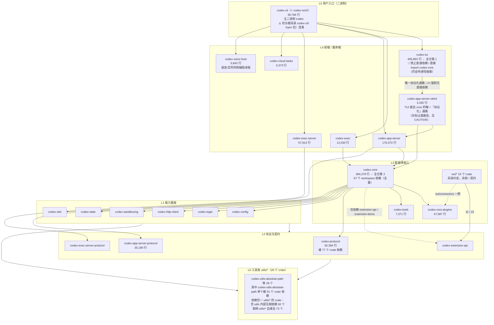

# Codex CLI Crate 地图

> **基线 commit**: `5c5308fc9a9ee789049d646ef11e5400384b9c6f`
> **数据来源**: `cargo metadata --no-deps`（crate 清单与 path 依赖）+ `git ls-files` 行数统计
> **适用读者**: 需要回答"这个 crate 干什么"「我的新代码该放哪」「改动会波及谁」的开发者与 AI 代理

---

## 0. 先读这一节：如何使用本文

| 你的问题 | 去看 |
| ---- | ---- |
| 这个 crate 是干什么的？ | [§3 按职责分组速查表](#3-按职责分组速查表) |
| 我要新增功能，代码放哪个 crate？ | [§5 新代码归属决策树](#5-新代码归属决策树) |
| 我改这个 crate 会影响谁？ | [§4 依赖热点与影响面](#4-依赖热点与影响面) |
| 整体是怎么分层的？ | [§2 分层总览](#2-分层总览) |
| 为什么不能往 `codex-core` 里加东西？ | [§6 codex-core 减负指引](#6-codex-core-减负指引) |

---

## 1. 计数口径（重要）

同一个"crate 数量"有多种口径，混用会导致文档漂移。本文统一采用 **`cargo metadata` 口径 = 154**。

| 口径 | 数值 | 命令 | 证据等级 |
| ---- | ---: | ---- | ---- |
| **workspace 包总数（本文采用）** | **154** | `cargo metadata --no-deps --format-version 1 --manifest-path codex-rs/Cargo.toml` 的 `packages` 计数 | E4 |
| `[workspace] members` 显式条目 | 149 | 读取 `codex-rs/Cargo.toml` 的 `members` 数组 | E2 |
| `[workspace.dependencies]` 中 path 映射 | 144 | 在该段内统计 `path = "..."` 的**不同路径值** | E2 |
| `codex-rs/` 下子 crate 清单文件 | 154 | `git ls-files "codex-rs/**/Cargo.toml" \| wc -l` | **E1** |

> **计数陷阱（第 6 轮新登记）**：用 `grep -c 'path\s*='` 统计上表第三行会得到 **146**，多出的 2 条是 `..._path =` 这类**长标识符的子串命中**（如 `manifest_path =`）。正则必须要求 `path` 前是词边界、后跟引号值，否则数字会悄悄偏大。

> **证据等级修正**：上表最后一行第一版标为 E4。按本体系约定，**文件计数 / 目录列举属于 E1**（文件级事实），E4 专指实际跑构建、测试、lint 等工具得到的结论。`cargo metadata` 那一行确实是 E4（跑了 Cargo），`git ls-files | wc -l` 不是。本文其余处的行数与文件数统计同理，均为 E1。

> [!IMPORTANT]
> **`members`（149）与 `[workspace.dependencies]` 的 path 映射（144）不是同一个集合的两种数法 —— 这是本节最容易被误读的地方。**
>
> 两个集合互有出入，只算交集是 139：
>
> | 只在 `[workspace.dependencies]`（5） | 只在 `[workspace] members`（10） |
> | ---- | ---- |
> | `app-server/tests/common`、`chatgpt`、`core/tests/common`、`message-history`、`windows-sandbox-rs` | `bwrap`、`cli`、`cloud-tasks`、`code-mode-host`、`codex-backend-openapi-models`、`config-schema`、`thread-manager-sample`、`utils/readiness`、`voice-host`、`windows-sandbox-service` |
>
> 换言之：左列 5 个不在 `members` 里（正是下面「149 与 154 的差额」那 5 个），右列 10 个则是 `members` 成员但没有被任何 workspace 依赖别名引用——**基本都是只产出二进制的 crate**（`cli`、`bwrap`、`code-mode-host`、`config-schema`、`voice-host`、`windows-sandbox-service` 都是），别人不需要以库的形式依赖它们。
>
> **第 6 轮变化**：右列从 6 个增至 10 个，新进的 4 个（`cli`、`config-schema`、`voice-host`、`windows-sandbox-service`）全部是二进制型 crate，其中后三个是本轮新增。`mcp-server/tests/common` 随 `mcp-server` crate 一并删除，左列从 6 个减至 5 个。

**149（`members`）与 154 的差额为 5 个**，全部是"不在 `members` 数组、但被 Cargo 作为 path 依赖纳入 workspace"的 crate。**五者的纳入方式完全相同**——都是 workspace member 通过 `path` 依赖引用它们，Cargo 遂自动把这些 path 依赖纳入 workspace（仅在 `[workspace.dependencies]` 里写一条声明**并不足以**纳入，必须真的被某个 member 依赖）：

| crate | 目录 | 纳入方式 | 说明 |
| ---- | ---- | ---- | ---- |
| `codex-chatgpt` | `codex-rs/chatgpt` | workspace member 的 path 依赖被自动纳入 | 业务 crate |
| `codex-message-history` | `codex-rs/message-history` | 同上 | 业务 crate |
| `codex-windows-sandbox` | `codex-rs/windows-sandbox-rs` | 同上 | 业务 crate（目录名与包名不一致，见 §5 门禁例外） |
| `core_test_support` | `codex-rs/core/tests/common` | 同上 | 测试辅助（见 §3.5「测试辅助」） |
| `app_test_support` | `codex-rs/app-server/tests/common` | 同上 | 测试辅助（同上） |

> **第 6 轮变化**：上表原有第六行 `mcp_test_support`（`codex-rs/mcp-server/tests/common`），随 `mcp-server` crate 被上游删除而消失（提交 `531f3836a1`「Remove the deprecated `codex mcp-server` command」）。

> **另有 1 个 workspace 之外的独立 crate**：`tools/argument-comment-lint`（Dylint 自定义 lint，由 `just argument-comment-lint` 驱动，不属于 `codex-rs` workspace）。

> [!WARNING]
> **`codex-cli` 是一个同名冲突，搜索时极易落错地方。**
>
> | 名字 | 实际位置 | 是什么 |
> | ---- | ---- | ---- |
> | 顶层目录 `codex-cli/` | 仓库根 `codex-cli/`（含 `package.json`、`bin/`、`scripts/`） | **npm 包，包名是 `@openai/codex`**，负责分发预编译二进制，里面没有 Rust 代码 |
> | Cargo 包 `codex-cli` | `codex-rs/cli/` | **Rust crate**，产出主二进制 `codex`（`[[bin]] name = "codex"`，另有 `logs_client`；lib 名为 `codex_cli`） |
> | **两者的衔接点** | `codex-cli/scripts/build_npm_package.py` | 把 `codex-rs/` 编出的 Rust 二进制**装配进 npm 包**的脚本（文件头 docstring：`"""Stage and optionally package the @openai/codex npm module."""`）。搞混上面两行之后，这里就是下一跳——想知道 Rust 产物如何变成 `@openai/codex`，读它 |
>
> 也就是说：**目录名 `codex-cli/` ≠ Cargo 包 `codex-cli`**。想看子命令分发实现请去 `codex-rs/cli/src/main.rs`；`cd codex-cli` 会进到 npm 打包脚本。反过来，`npm i @openai/codex` 的包在 `codex-cli/package.json` 里，不在 `codex-rs/`。

> [!TIP]
> 需要重新核对时直接跑命令，不要抄本文数字：
> ```bash
> export PATH="$HOME/.cargo/bin:$PATH"
> cargo metadata --no-deps --format-version 1 --manifest-path codex-rs/Cargo.toml \
>   | python3 -c "import json,sys; print(len(json.load(sys.stdin)['packages']))"
> ```

---

## 2. 分层总览



> **证据等级说明**：分层是**依据 path 依赖方向归纳的表述**（E3），不是 `Cargo.toml` 里声明的显式层级。<!-- ref-exempt: 泛指任意 crate 的清单文件 -->Cargo 不强制分层，实际依赖图存在跨层边。行数与文件计数为 **E1**；依赖计数为 E4（`cargo metadata` 实测）。

> [!CAUTION]
> **`codex-tui` 不得「直接」依赖、也不得「直接」`use` `codex-core` —— CI 强制。**
> 校验脚本 `.github/scripts/verify_tui_core_boundary.py`（文件头：`"""Verify codex-tui does not depend on or import codex-core directly."""`），由 `.github/workflows/repo-checks.yml` 执行。脚本同时检查 `codex-rs/tui/Cargo.toml` 不含 `codex-core`，以及 TUI 源码不出现 `codex_core::` / `use codex_core` / `extern crate codex_core`。
> - **例外一（再导出）**：`codex-app-server-client` 显式再导出 core 的配置类型（`pub mod legacy_core { pub mod config { pub use codex_core::config::*; } }`），TUI 在 165 处、82 个文件中使用。校验脚本的报错文案也点名这是被认可的过渡通道，所以该边界约束的是**依赖边与 import**，而非「core 能力必须经协议方法抵达」。详见 [`tui_guide.md`](./tui_guide.md) §0.2。
> - **例外二（传递链接）**：门禁只看**直接**关系。`codex-cloud-config`（`codex-rs/cloud-config/Cargo.toml:30`）与 `codex-utils-oss`（`codex-rs/utils/oss/Cargo.toml:11`）都在普通 `[dependencies]` 里直接依赖 `codex-core`；`codex-app-server-client` 自身也直接依赖 `codex-core`。**因此 `codex-core` 会传递性地链接进 `codex-tui`。** E4：在 `cargo metadata` 的普通依赖图上 BFS，`codex-tui → codex-app-server-client → codex-core` 可达；而 `codex-tui` 的 107 个直接普通依赖（含 crates.io，其中 51 个是 workspace 内 path 依赖）里没有 `codex-core`。
>
> **「唯一通路」的准确说法**：`codex-app-server-client` 是 `codex-tui` 抵达 core 的**唯一「协议化」通路**（走 JSON-RPC 方法而非直接调用 core API）。它**不是**唯一的到达路径 —— 至少还有两条经中间 crate 的过渡路径，且 CI 都不禁止：
> 1. `codex-app-server-client` 的 `legacy_core` 再导出（TUI 在 165 处 / 82 个文件使用）；
> 2. 自身直接依赖 `codex-core` 的 helper crate，如 `codex-utils-oss`（`codex-rs/utils/oss/Cargo.toml:11`）、`codex-cloud-config`（`codex-rs/cloud-config/Cargo.toml:16`）。
>
> 校验脚本强制的只有「不得直接依赖 `codex-core`」与「不得直接 `use codex_core`」两条，**并未强制「core 能力必须经 app-server-client 抵达」**。
>
> 正确（推荐）通路：`codex-tui` → `codex-app-server-client` → `codex-app-server` + `codex-core`（同进程 `InProcessAppServerClient`，远端 `RemoteAppServerClient`）。
>
> **勘误（两轮，历史版本记录）**：第一版分层图画了 `TUI --> CORE` 直接边、§ 三条主干路径也写成 `codex-tui → codex-core`，均已修正；上一稿又把"无直接依赖边"表述成"不链接 `codex-core`"，属于把 CI 脚本里的 `directly` 一词丢掉后的过度推论，已按上面的"例外二"更正。

> [!NOTE]
> **勘误（历史版本记录）**：第一版分层图中的 `PLUGINS --> EXTAPI` 边**不存在**，已删除。`codex-rs/core-plugins/Cargo.toml` 中没有 `codex-extension-api` 条目（已复核），这条边同时与本文 §3.8 自己的正文"插件不依赖 `extension-api`"相矛盾。

### 三条主干路径

1. **交互路径**：`codex` → `codex-tui` → **`codex-app-server-client`** → `codex-app-server` / `codex-core` → 模型 provider（TUI 不直连 core，见上方 CAUTION）
2. **非交互路径**：`codex exec` → `codex-exec` → `codex-core` → 模型 provider
3. **服务化路径**：`codex app-server` → `codex-app-server` ⇄ `codex-app-server-protocol` ⇄ IDE / 桌面端 / SDK

---

## 3. 按职责分组速查表

> 行数 = 该目录下 `*.rs` 的 Git 跟踪总行数（含测试代码）。`path 依赖数` = 该 crate 在 `Cargo.toml` 中声明的 workspace 内部依赖个数。<!-- ref-exempt: 泛指任意 crate 的清单文件 -->
>
> ⚠️ **行数口径是「按目录」而非「按 crate」，因此嵌套的子 crate 会被父 crate 重复计入。** 三处重复（第 6 轮实测）：`codex-core` 的 402,720 行**包含** `codex-rs/core/tests/common`（`core_test_support`，8,441 行）；`codex-app-server` 的 180,438 行**包含** `codex-rs/app-server/tests/common`（`app_test_support`，4,068 行）；`codex-exec-server` 的 58,038 行**包含** `codex-rs/exec-server/tests/support`（125 行）。**把本文各行相加不会等于全仓行数**，存在这三处重复。原第四处 `codex-rs/mcp-server/tests/common` 随 `mcp-server` crate 删除而消失。

### 3.1 入口与前端（5 + 语音辅助 1）

| crate | 目录 | 行数 | path 依赖 | 职责 |
| ---- | ---- | ---: | ---: | ---- |
| `codex-cli` | `codex-rs/cli` | 38,766 | 49 | **主二进制** `codex`；clap 子命令分发；argv[0] 分发。⚠️ 与仓库根 npm 目录 `codex-cli/` 同名不同物，见 §1 |
| `codex-tui` | `codex-rs/tui` | **405,863** | 51 | ratatui 交互式终端界面，**代码量全仓第 1**（第 6 轮首次超过 `codex-core`）。🚫 **禁止「直接」依赖 / 「直接」import `codex-core`（CI 强制）**，经 `codex-app-server-client` 抵达 core；`codex-core` 仍会随中间 crate 传递性链接进来，见 §2 CAUTION |
| `codex-exec` | `codex-rs/exec` | 12,030 | 21 | `codex exec` 非交互执行 |
| `codex-app-server` | `codex-rs/app-server` | 180,438 | 62 | JSON-RPC 应用服务端，供 IDE / 桌面端 / SDK 接入 |
| `codex-cloud-tasks` | `codex-rs/cloud-tasks` | 5,373 | 9 | `codex cloud`，在 `codex-rs/cli/src/main.rs` 的 `Cloud` 变体上标注 `[EXPERIMENTAL]` |
| `codex-voice-host` | `codex-rs/voice-host` | 5,843 | 2 | **第 6 轮新增**：语音/实时会话的同构辅助进程。模块注释：`"Same-build helper lifecycle with privately owned runtime, transport and opt-in local devices."`（E3）。**完整子系统见 §3.13** |

> [!CAUTION]
> **`codex-mcp-server`（`codex-rs/mcp-server`）已被上游删除**（提交 `531f3836a1`「Remove the deprecated `codex mcp-server` command (#42993)」）。<!-- ref-exempt: 反例——正文说明该路径已不存在 -->CLI 的 `McpServer` 子命令一并移除，`Mcp` 子命令保留。把 Codex 暴露为 MCP server 的能力现由 `codex-rs/codex-mcp` 承载，**不是简单改个路径就能对上**——两者的模块结构完全不同，详见 [`mcp_and_extensions.md`](./mcp_and_extensions.md)。

### 3.2 智能体核心（4）

| crate | 目录 | 行数 | path 依赖 | 职责 |
| ---- | ---- | ---: | ---: | ---- |
| `codex-core` | `codex-rs/core` | **402,720** | **67** | 会话、turn、工具调用、上下文管理。**依赖数仍第一，代码量第 6 轮退居第 2**（被 `codex-tui` 的 405,863 超过，差距仅 0.8%） |
| `codex-core-plugins` | `codex-rs/core-plugins` | 47,587 | 21 | 插件运行时 |
| `codex-tools` | `codex-rs/tools` | 7,371 | 9 | 工具定义与调度 |
| `codex-core-api` | `codex-rs/core-api` | 137 | 17 | core 对外的窄接口（行数极小但出度 17，是典型的「薄门面、厚转发」） |

> [!CAUTION]
> **`codex-core-skills`（`codex-rs/core-skills`）已被上游删除**（提交 `33e365b19e`「Remove the legacy core skill loader (#37457)」）。<!-- ref-exempt: 反例——正文说明该路径已不存在 -->技能加载迁至 `codex-rs/ext/skills`（22,219 行，见 §3.8），样例技能资产在 `codex-rs/skills`（2,594 行）。原 `core-skills/src/loader.rs` 是本体系上一版被引用最多的死路径（12 处）。

### 3.3 协议与契约（7）

| crate | 目录 | 行数 | 被依赖数 | 职责 |
| ---- | ---- | ---: | ---: | ---- |
| `codex-protocol` | `codex-rs/protocol` | 30,394 | **77** | **全仓依赖热点第 1**，核心协议类型 |
| `codex-app-server-protocol` | `codex-rs/app-server-protocol` | 35,190 | 14 | app-server JSON-RPC 协议；ts-rs 导出 TS 类型 |
| `codex-exec-server-protocol` | `codex-rs/exec-server-protocol` | 2,574 | 3 | exec-server 协议 |
| `codex-code-mode-protocol` | `codex-rs/code-mode-protocol` | 4,584 | 3 | code-mode 协议 |
| `codex-extension-api` | `codex-rs/ext/extension-api` | 2,912 | 17 | 扩展点公共 API |
| `codex-api` | `codex-rs/codex-api` | 15,949 | 16 | 面向模型服务的 API 层 |
| `codex-client` | `codex-rs/codex-client` | 186 | 3 | 客户端薄封装 |

> [!IMPORTANT]
> `codex-app-server-protocol/schema/typescript/v2/` 下有 **631 个自动生成的 TS 类型文件**。**Rust 类型是唯一事实源，TS 文件是构建产物**，禁止手改。API 形状变更后须跑 `just write-app-server-schema`，并用 `just test -p codex-app-server-protocol` 验证（`AGENTS.md` → `## App-server API Development Best Practices` → `### Development Workflow`，grep `write-app-server-schema`）。

### 3.4 沙箱与执行安全（10）

| crate | 目录 | 行数 | 职责 |
| ---- | ---- | ---: | ---- |
| `codex-sandboxing` | `codex-rs/sandboxing` | 10,097 | 三平台沙箱统一入口：`codex-rs/sandboxing/src/seatbelt.rs` / `codex-rs/sandboxing/src/landlock.rs` / `codex-rs/sandboxing/src/bwrap.rs` / `codex-rs/sandboxing/src/windows.rs` + **4 个** `.sbpl` 策略。⚠️ 这些文件名在 `codex-rs/linux-sandbox/src/` 下**各有同名副本**，引用时务必带全路径 |
| `codex-windows-sandbox` | `codex-rs/windows-sandbox-rs` | 28,227 | Windows 沙箱实现 |
| `codex-linux-sandbox` | `codex-rs/linux-sandbox` | 11,817 | Linux 沙箱：**bwrap（文件系统）+ seccomp（系统调用）+ `no_new_privs`**。Landlock 为已废弃的 legacy 回退，默认不启用 |
| `codex-bwrap` | `codex-rs/bwrap` | 151 | bubblewrap 封装；产出 `bwrap` 二进制，C 源码 vendored 在 `codex-rs/vendor/bubblewrap/`（**50 个 Git 跟踪条目 / `find -type f` 得 49**，口径见表后说明） |
| `codex-execpolicy` | `codex-rs/execpolicy` | 2,975 | 执行策略；`codex execpolicy` 为 hidden 子命令 |
| `codex-shell-command` | `codex-rs/shell-command` | 10,155 | shell 命令解析与**危险命令判定** |
| `codex-shell-escalation` | `codex-rs/shell-escalation` | 2,282 | 权限提升审批 |
| `codex-process-hardening` | `codex-rs/process-hardening` | 193 | 进程加固 |
| `codex-mxc-sandbox` | `codex-rs/mxc-sandbox` | 1,851 | **第 6 轮新增**：原生 Windows MXC 辅助。模块注释：`"Native Windows MXC helper. Policy conversion is portable; execution requires a usable process security environment and never enters MXC's ACL fallbacks."`（E3）。与 `codex-rs/sandboxing/src/windows_mxc.rs` 配套 |
| `codex-windows-sandbox-service` | `codex-rs/windows-sandbox-service` | 5,261 | **第 6 轮新增**：Windows 沙箱的常驻服务端（`RunMode` 枚举 + `run()` 入口，E3）。随发布交付为独立可执行文件 `codex-windows-sandbox-service`，见 §3.12 |

> [!CAUTION]
> **第 6 轮框架级变更：known-safe 命令白名单已整体退役。**
>
> 上游提交 `942af8447b`「Retire the untrusted approval policy (#39630)」删除了 `codex-rs/shell-command/src/command_safety/is_safe_command.rs` 整个模块<!-- ref-exempt: 反例——正文说明该路径已不存在 -->，函数 `is_safe_command()` 与 `is_known_safe_command()` 全仓归零。`command_safety/` 下现只剩 `codex-rs/shell-command/src/command_safety/is_dangerous_command.rs` 这条**黑名单**通路——判定极性从「列举什么是安全的」翻转成「列举什么是危险的」。
>
> `AskForApproval::UnlessTrusted` 变体本身仍在 `codex-rs/protocol/src/protocol.rs`，但其文档注释已改写为「Commands require approval unless an explicit exec policy rule allows them」——由白名单改判为 execpolicy 规则制。完整展开见 [`tools_and_sandbox.md`](./tools_and_sandbox.md)。

> **`vendor/bubblewrap/` 文件数的两个口径**（E1）：`git ls-files codex-rs/vendor/bubblewrap | wc -l` 得 **50**，`find codex-rs/vendor/bubblewrap -type f | wc -l` 得 **49**。差的一个是**符号链接** `LICENSE` → `COPYING`：Git 把它当作一个跟踪条目，而 `find -type f` 不匹配符号链接（`find ... -type l | wc -l` 得 1）。两个数字都对，引用时写明用的是哪一个即可。

> [!NOTE]
> **勘误（历史版本记录）**：第一版把 Linux 沙箱写成"Landlock（文件系统）+ seccomp + bwrap 回退"，主次正好写反。实际是 **bwrap 管文件系统、seccomp 管系统调用**，Landlock 已废弃（`--use-legacy-landlock` 为 `hide = true` 且默认 `false`，`codex-features` 标 `Stage::Deprecated`），且默认路径"never falls back to legacy Landlock on failure"。完整证据见 [`architecture_overview.md`](./architecture_overview.md) §6。
>
> 另注（E3）：**`codex-rs/sandboxing/src/landlock.rs` 不含任何 landlock 调用** —— 全文对 `landlock` 的提及都是布尔参数名 `use_legacy_landlock`、命令行字符串 `"--use-legacy-landlock"` 与测试模块的 `#[path]` 属性，它只负责拼装 `codex-linux-sandbox` 子进程命令行。**该结论只对 sandboxing 版成立**：同名的 `codex-rs/linux-sandbox/src/landlock.rs` 恰恰是真正调用 landlock crate 的地方（`use landlock::ABI;` / `AccessFs` / `CompatLevel` 等）。
>
> `landlock` crate 依赖在 workspace 各清单文件中共出现 **3 处**（E2，第 6 轮复核行号）：`codex-rs/Cargo.toml:388`（`[workspace.dependencies]` 的版本声明源 `landlock = "0.4.4"`）、`codex-rs/linux-sandbox/Cargo.toml:29`、`codex-rs/protocol/Cargo.toml:55` —— 最后一条位于 `[target.'cfg(target_os = "linux")'.dependencies]`（段头在 `:54`），是 **target 门控**的，非 Linux 平台不会引入。

> [!WARNING]
> **绝对红线**：禁止新增或修改任何与 `CODEX_SANDBOX_NETWORK_DISABLED_ENV_VAR`、`CODEX_SANDBOX_ENV_VAR` 相关的代码。出处：`AGENTS.md` 顶部规则列表（无标题的一级列表），grep `Never add or modify any code related to`。

### 3.5 执行服务与进程间通信（9）

| crate | 目录 | 行数 | 职责 |
| ---- | ---- | ---: | ---- |
| `codex-exec-server` | `codex-rs/exec-server` | 58,038 | 独立执行服务，可与 app-server 跨操作系统分离部署 |
| `codex-app-server-transport` | `codex-rs/app-server-transport` | 18,433 | app-server 传输层 |
| `codex-app-server-daemon` | `codex-rs/app-server-daemon` | 9,408 | 守护进程生命周期 |
| `codex-app-server-client` | `codex-rs/app-server-client` | 3,282 | app-server 客户端。**`codex-tui` 抵达 core 的唯一「协议化」通路**（不是唯一到达路径，另有 `legacy_core` 再导出与 helper crate 两条过渡路径，见 §2 CAUTION）：`InProcessAppServerClient`（同进程）/ `RemoteAppServerClient`（远端，`codex-rs/app-server-client/src/remote.rs`）。自身直接依赖 `codex-app-server` + `codex-core`，并通过 `codex-rs/app-server-client/src/lib.rs:75` 的 `pub mod legacy_core` 再导出 core 的配置类型 |
| `codex-app-server-test-client` | `codex-rs/app-server-test-client` | 4,082 | 测试客户端，由 `just app-server-test-client` 驱动 |
| `codex-uds` | `codex-rs/uds` | 1,083 | Unix domain socket |
| `codex-stdio-to-uds` | `codex-rs/stdio-to-uds` | 223 | stdio ↔ UDS 中继（hidden 子命令） |
| `codex-websocket-client` | `codex-rs/websocket-client` | 1,555 | WebSocket 客户端 |
| `codex-tcp-tunnel` | `codex-rs/tcp-tunnel` | 939 | **第 6 轮新增**：经 HTTP/3 CONNECT 代理转发本地 TCP。模块注释明确「Bearer 凭据与代理元数据**只经 stdin 进入**」「监听器在传输中断后存活，单条 TCP 流永不重放」（E3）。对应新增的 hidden 子命令 `codex tcp-tunnel` |

#### 测试辅助（3）

> 这 3 个都是**正式的 workspace crate**，但因藏在各自宿主 crate 的 `tests/` 子目录下而极易被目录遍历漏掉。前两个在 §1 的「149 与 154 差额」表里出现过；它们的行数已被计入各自父 crate（见 §3 表头的口径提醒）。

| crate | 目录 | 行数 | 职责 |
| ---- | ---- | ---: | ---- |
| `core_test_support` | `codex-rs/core/tests/common` | 8,441 | `codex-core` 集成测试脚手架。**出度 19**，比多数业务 crate 还高 |
| `app_test_support` | `codex-rs/app-server/tests/common` | 4,068 | app-server 集成测试脚手架 |
| `codex-exec-server-test-support` | `codex-rs/exec-server/tests/support` | 125 | exec-server 集成测试辅助。是 `[workspace] members` 的显式条目（`"exec-server/tests/support"`），与上面两个的纳入方式不同 |

> **第 6 轮变化**：原第四个 `mcp_test_support`（`codex-rs/mcp-server/tests/common`，507 行）随 `mcp-server` crate 一并删除。<!-- ref-exempt: 反例——正文说明该路径已不存在 -->

### 3.6 配置、认证与模型接入（20）

| crate | 目录 | 行数 | 职责 |
| ---- | ---- | ---: | ---- |
| `codex-config` | `codex-rs/config` | 29,374 | 配置体系（被 28 个 crate 依赖） |
| `codex-config-schema` | `codex-rs/config-schema` | 22 | **第 6 轮新增**：config JSON Schema 的生成器，`just write-config-schema` 即 `cargo run -p codex-config-schema --bin codex-write-config-schema`（`justfile:173-174`）。**只有 22 行，但它是 `codex-rs/core/config.schema.json` 这个 100 顶层键产物的唯一来源**；此前该生成器是 `codex-rs/core/src/bin/config_schema.rs`<!-- ref-exempt: 反例——正文说明该旧路径已不存在 --> |
| `codex-cloud-config` | `codex-rs/cloud-config` | 3,132 | cloud config bundle 加载。直接依赖 `codex-core`（`codex-rs/cloud-config/Cargo.toml:30`），因此构成 §2 CAUTION「例外二」那条生产传递链路 `codex-tui → codex-cloud-config → codex-core` |
| `codex-login` | `codex-rs/login` | 19,583 | 登录流程（被 27 个 crate 依赖） |
| `codex-keyring-store` | `codex-rs/keyring-store` | 226 | 系统钥匙串存储 |
| `codex-secrets` | `codex-rs/secrets` | 1,007 | 密钥抽象 |
| `codex-agent-identity` | `codex-rs/agent-identity` | 1,000 | 代理身份 |
| `codex-agent-roles` | `codex-rs/agent-roles` | 592 | **第 6 轮新增**：代理角色配置的解析与加载（`AgentRoleConfig` / `load_agent_roles`，E3）。此前在 `codex-rs/core/src/config/agent_roles.rs`<!-- ref-exempt: 反例——正文说明该旧路径已不存在 -->，本轮独立成 crate，属 §6 core 减负的实例 |
| `codex-user-verification` | `codex-rs/user-verification` | 1,248 | **第 6 轮新增**：设备凭据与签名。模块注释强调其**独立于 RPC 路由、UI 与后端注册**（E3） |
| `codex-workload-identity` | `codex-rs/workload-identity` | 870 | **第 6 轮新增**：工作负载身份的断言与令牌交换（`WorkloadIdentityExchange` / `WorkloadIdentityToken`，E3） |
| `codex-http-client` | `codex-rs/http-client` | 10,396 | HTTP 客户端（被 29 个 crate 依赖） |
| `codex-model-provider` | `codex-rs/model-provider` | 7,802 | provider 抽象 |
| `codex-model-provider-info` | `codex-rs/model-provider-info` | 1,852 | provider 元信息 |
| `codex-models-manager` | `codex-rs/models-manager` | 3,480 | 模型管理 |
| `codex-ollama` | `codex-rs/ollama` | 1,107 | 本地 Ollama 接入 |
| `codex-lmstudio` | `codex-rs/lmstudio` | 470 | 本地 LM Studio 接入 |
| `codex-chatgpt` | `codex-rs/chatgpt` | 995 | ChatGPT 通道；`codex apply` 实现 |
| `codex-backend-client` | `codex-rs/backend-client` | 4,705 | 后端客户端 |
| `codex-aws-auth` | `codex-rs/aws-auth` | 654 | AWS 认证 |
| `codex-build-info` | `codex-rs/build-info` | 360 | **第 6 轮新增**：解析当前运行时的发布版本、编译 commit 与 target（E3）。被 4 个 crate 依赖 |

### 3.7 会话、状态与持久化（13 个 crate / 12 行）

> 表中 `codex-memories-write` 与 `codex-memories-read` 是**两个独立 crate**，因同属 `codex-rs/memories/` 而合并在一行展示。因此本节是 **12 行、13 个 crate**。

| crate | 目录 | 行数 | 职责 |
| ---- | ---- | ---: | ---- |
| `codex-state` | `codex-rs/state` | 24,095 | 运行时状态；SQLite 日志由 `just log` 读取。**6 个迁移目录共 69 个 `.sql`**（第 6 轮新增 `queue_migrations`） |
| `codex-thread-store` | `codex-rs/thread-store` | 33,659 | 会话线程存储 |
| `codex-rollout` | `codex-rs/rollout` | 16,439 | rollout 记录；**第 6 轮接管了原属 thread-store 的 `writer_lock`**（`codex-rs/rollout/src/writer_lock.rs`） |
| `codex-rollout-trace` | `codex-rs/rollout-trace` | 13,282 | rollout 追踪与回放（`codex debug trace-reduce`） |
| `codex-history` | `codex-rs/history` | 2,944 | **第 6 轮新增**：模型历史与持久化 rollout 的领域类型（E3）。入度 11，已是中等热点 |
| `codex-message-history` | `codex-rs/message-history` | 1,437 | 消息历史 |
| `codex-memories-write` / `-read` | `codex-rs/memories/*` | 5,880 / 293 | 记忆写入与读取 |
| `codex-context-fragments` | `codex-rs/context-fragments` | 521 | 上下文片段 |
| `codex-attachment-store` | `codex-rs/attachment-store` | 301 | **第 6 轮新增**：存储中立的附件持久化接口（E3） |
| `codex-agent-graph-store` | `codex-rs/agent-graph-store` | 479 | 代理图存储 |
| `codex-worktree` | `codex-rs/worktree` | 2,121 | **第 6 轮新增**：Git worktree 的托管与元数据（`ManagedWorktree` / `CreateWorktree` / `WorktreeSettings` / `DEFAULT_WORKTREE_KEEP_COUNT`，E3） |
| `codex-guardian-context` | `codex-rs/guardian-context` | 6,101 | **第 6 轮新增**：Guardian 同步复审与异步打分共用的上下文分段。模块注释明确「贡献者失败会中止整次采集，不返回部分上下文」（E3）。见 Guardian 专题 |

### 3.8 扩展面：四条路径、22 行、21 个去重 crate

> 下表 22 行中 `codex-mcp-extension` 出现两次（①与④各一），**去重后为 21 个 crate**。

> [!IMPORTANT]
> **关系已完成 `[dependencies]` 分段核查（E2）。第 6 轮实测为 11 / 15**（上一版为 8 / 12）。
>
> 逐个核查 `codex-rs/ext/*/Cargo.toml` 的 `[dependencies]` 段：
>
> | 依赖 `codex-extension-api`（11） | 不依赖（3） | 自身（1） |
> | ---- | ---- | ---- |
> | `skills`、`goal`、`memories`、`mcp`、`image-generation`、`web-search`、`git-attribution`、**`guardian-v2`**、**`guardian-reviewer`**、**`history-notes`**、**`queue`** | `agent`、`connectors`、`items` | `extension-api` |
>
> **不依赖的仍是原来那 3 个**——本轮新增的 4 个 ext crate（`guardian-v2`、`guardian-reviewer`、`history-notes`、`queue`）全部依赖 `extension-api`，而原单体 `ext/guardian`（77 行，依赖 ✅）被拆成前两者。
>
> **口径陷阱（保留，仍然成立）**：必须限定在 `[dependencies]` 段内统计。朴素 `grep -l` 会把 `codex-rs/ext/extension-api/Cargo.toml` 自身计入（其中有 `name = "codex-extension-api"`）。首版曾把「`ext/` 下共有 N 个 crate」直接当成「N 个都依赖 extension-api」，那是一次未取证的归纳，不是 grep 口径问题。
>
> 修正后的判断：
>
> - `ext/extension-api` 仍是**主扩展点**（第 6 轮实测 16 个扩展 trait，见下），但 **`ext/` 只是目录约定，不是"必须实现 extension-api"的契约**。
> - **`ext/items`（380 行）是纯数据 / schema crate**，**workspace 内只依赖 `codex-utils-absolute-path`**，没有行为，因此没有 contributor —— 它不是"贡献者型扩展"。
> - **`ext/agent`（170 行）是子智能体辅助层**，**workspace 内只依赖 `codex-core` + `codex-protocol`**，同理不是贡献者型扩展。
> - **`ext/connectors` 建立在插件机制之上**（依赖 `codex-connectors` + `codex-core-plugins` + `codex-plugin` + `codex-utils-path-uri`）。这削弱了"插件是完全平行的第二条赛道"的框架 —— **`ext/` 内已有成员反过来消费插件机制，两者是交叉关系，不是平行关系**。
> - Skills 与 MCP 确实通过 `ext/skills`、`ext/mcp` 包装接入扩展体系。
> - `core-plugins` 自身**不**依赖 `extension-api`（已复核 `codex-rs/core-plugins/Cargo.toml`）。
>
> 详见 [`mcp_and_extensions.md`](./mcp_and_extensions.md) §1 与 [`architecture_overview.md`](./architecture_overview.md) §10。

> **「依赖 `extension-api`？」列为三值（E2，读各 crate 的 `[dependencies]` 分段）**：✅ = 直接依赖；❌ = 不依赖；「自身」= 扩展点本身。**不再出现「—」**——上一稿用「—」同时表示「不依赖」和「未核」，语义含混。
>
> 全仓直接依赖 `codex-extension-api` 的共 **17 个 crate，全部是 normal 依赖**（无一只出现在 `[dev-dependencies]`）：`codex-app-server`、`codex-cli`、`codex-core`、`codex-core-api`、`codex-git-attribution`、`codex-goal-extension`、`codex-guardian-reviewer`、`codex-guardian-v2`、`codex-history-notes-extension`、`codex-home`、`codex-image-generation-extension`、`codex-mcp-extension`、`codex-memories-extension`、`codex-queue-extension`、`codex-skills-extension`、`codex-web-search-extension`、`core_test_support`。**上一版在列的 `codex-mcp-server` 已随该 crate 删除而移除。**

| 路径 | crate | 行数 | 依赖 `extension-api`？ |
| ---- | ---- | ---: | ---- |
| **① 内建扩展 `ext/`（15）** | `codex-skills-extension`（`ext/skills`） | 22,219 | ✅ |
| | `codex-guardian-v2`（`ext/guardian-v2`） | 11,545 | ✅ **第 6 轮新增** |
| | `codex-goal-extension`（`ext/goal`） | 5,725 | ✅ |
| | `codex-mcp-extension`（`ext/mcp`） | 3,843 | ✅ |
| | `codex-guardian-reviewer`（`ext/guardian-reviewer`） | 3,102 | ✅ **第 6 轮新增** |
| | `codex-extension-api`（`ext/extension-api`） | 2,912 | 自身（即扩展点本身） |
| | `codex-memories-extension`（`ext/memories`） | 2,585 | ✅ |
| | `codex-queue-extension`（`ext/queue`） | 1,689 | ✅ **第 6 轮新增**：持久化的用户消息队列与空闲分发 |
| | `codex-history-notes-extension`（`ext/history-notes`） | 1,529 | ✅ **第 6 轮新增** |
| | `codex-image-generation-extension`（`ext/image-generation`） | 1,446 | ✅ |
| | `codex-web-search-extension`（`ext/web-search`） | 885 | ✅ |
| | `codex-git-attribution`（`ext/git-attribution`） | 441 | ✅ |
| | `codex-extension-items`（`ext/items`） | 380 | ❌ 纯数据 / schema crate |
| | `codex-agent-extension`（`ext/agent`） | 170 | ❌ 子智能体辅助层 |
| | `codex-connectors-extension`（`ext/connectors`） | 74 | ❌ 建在**插件机制**之上 |
| **② 插件（3）** | `codex-core-plugins` | 47,587 | ❌ |
| | `codex-plugin` | 1,087 | ❌ |
| | `codex-utils-plugins`（`utils/plugins`） | 446 | ❌ |
| **③ Skills（1）** | `codex-skills` | 2,594 | ❌ 样例技能资产（`src/assets/samples/`） |
| **④ MCP（3）** | `codex-rmcp-client` | 34,399 | ❌ |
| | `codex-mcp`（`codex-rs/codex-mcp`） | 24,462 | ❌ |
| | `codex-mcp-extension`（`ext/mcp`，与①重叠） | 3,843 | ✅ |

> **第 6 轮的两处删除**：③ 中的 `codex-core-skills`（9,083 行）与 ④ 中的 `codex-mcp-server`（4,128 行）均已被上游删除，见 §3.1 / §3.2 的 CAUTION。`ext/guardian`（77 行）拆成 `ext/guardian-v2` + `ext/guardian-reviewer`，**从 77 行涨到 14,647 行，是本轮扩张最剧烈的扩展点**。

#### 16 个扩展 trait 的确切构成（E3，第 6 轮重推导）

上一版记「13 个」，本轮实测为 **16 个**，构成是 **12 + 4**：

- **12 个以 `Contributor` 结尾的 trait，全部在 `codex-rs/ext/extension-api/src/contributors.rs`**（名单未变）：`McpServerContributor`、`ContextContributor`、`ThreadLifecycleContributor`、`TurnLifecycleContributor`、`TurnInputContributor`、`ConfigContributor`、`TokenUsageContributor`、`SkillInvocationContributor`、`ToolContributor`、`ToolLifecycleContributor`、`ApprovalReviewContributor`、`TurnItemContributor`。
- **另外 4 个不以 `Contributor` 结尾**，按 `Contributor` 关键词 grep 一律漏掉——这正是本体系上一版只数到 13 的原因：
  - `UserInstructionsProvider`（`codex-rs/ext/extension-api/src/user_instructions.rs`）
  - `ThreadInstructionsProvider`（同文件，**第 6 轮新增**）
  - `SynchronousApprovalReviewer`（`codex-rs/ext/extension-api/src/contributors/approval_review.rs`，**第 6 轮新增**；注意该模块本轮已从单文件变为「文件 + 同名目录」的混合形态）
  - `TurnStartAdmission`（`codex-rs/ext/extension-api/src/turn_admission.rs`，**第 6 轮新增**）

> `extension-api` 中另有 4 个**能力（capability）** trait 不计入扩展点：`ExtensionMetrics`、`ExtensionEventSink`、`ResponseItemInjector`、`ConversationHistorySnapshot`（均在 `src/capabilities/` 下）。它们是**扩展向宿主索取**的能力，方向与 contributor 相反。
>
> **第 6 轮变化**：上一版列出的 `AgentSpawner` 已随 `capabilities/agent.rs` 被整体删除<!-- ref-exempt: 反例——正文说明该路径已不存在 -->，新增 `ConversationHistorySnapshot`（`capabilities/conversation_history.rs`）。能力 trait 总数仍为 4，但成员换了一个——**这是「数字没变但集合变了」的典型，只核对计数的检查抓不到。**

### 3.9 可观测性与诊断（8）

| crate | 目录 | 行数 | 职责 |
| ---- | ---- | ---: | ---- |
| `codex-otel` | `codex-rs/otel` | 8,368 | OpenTelemetry；含 Statsig 默认指标导出器（被 27 个 crate 依赖） |
| `codex-analytics` | `codex-rs/analytics` | 16,373 | 本地埋点采集 |
| `codex-feedback` | `codex-rs/feedback` | 2,807 | 用户反馈 |
| `codex-response-debug-context` | `codex-rs/response-debug-context` | 175 | 响应调试上下文 |
| `codex-hooks` | `codex-rs/hooks` | 15,671 | 钩子机制；`just write-hooks-schema` 生成 schema |
| `codex-install-context` | `codex-rs/install-context` | 991 | 安装环境上下文 |
| `codex-diagnostics` | `codex-rs/diagnostics` | 268 | **第 6 轮新增**：进程级计量快照（`Gauge` / `GaugeGuard` / `GaugeSnapshot` / `ProcessSnapshot` / `DiagnosticsSnapshot`，E3） |
| `codex-otel-trace-websocket` | `codex-rs/otel-trace-websocket` | 179 | **第 6 轮新增**：把 loopback OTLP trace 批次转发到独立 WebSocket 监听端。模块注释明确这是**尽力而为**的转发——断连或滞后的客户端会丢批次，且丢弃 bridge 会直接 abort 监听器而不排空队列（E3） |

> [!NOTE]
> 遥测默认行为已完成核查（E3）：`metrics_exporter` 默认 `Statsig`、`trace_exporter` 与通用 `exporter` 默认 `None`、用户提示词默认不记录，debug 构建下 Statsig 降级为不发送。
>
> **但"指标默认外发"要按二进制区分**：`codex-rs/core/src/otel_init.rs:72` 在 analytics 关闭时把 `metrics_exporter` 强制置为 `None`，而 `default_analytics_enabled` 由各二进制自行传入。**第 6 轮重新枚举全部生产调用点（E3）**：
>
> | 传 `true`（默认开） | 传 `false`（默认关） |
> | ---- | ---- |
> | TUI 启动编排（`codex-rs/tui/src/startup_orchestration.rs:558`）、TUI 守护进程遥测（`codex-rs/tui/src/daemon_telemetry.rs:47`）、`codex exec`（`codex-rs/exec/src/lib.rs:173`）、`codex migrate-rollouts`（`codex-rs/cli/src/migrate_rollouts.rs:63`） | app-server（`codex-rs/app-server/src/main.rs:124`）、remote-control（`codex-rs/cli/src/remote_control_cmd.rs:137`）、exec-server 遥测（`codex-rs/cli/src/exec_server_telemetry.rs:6`） |
>
> **第 6 轮变化**：TUI 的传入点从 `codex-rs/tui/src/lib.rs` 拆到了 `codex-rs/tui/src/startup_orchestration.rs` 与 `codex-rs/tui/src/daemon_telemetry.rs` 两处；`codex mcp-server` 一行随 crate 删除而消失；新增 `codex migrate-rollouts` 一处默认开。**"默认开/关"的二进制划分本身没变，但每一条的位置都变了**——照抄旧行号会全部落空。权威表格见 [`observability.md`](./observability.md) §1.2；另见 [`architecture_overview.md`](./architecture_overview.md) §8。

### 3.10 实验性与低频表面（7）

> ⚠️ **标记来源逐行不同，不要笼统认为「全部标了 `[EXPERIMENTAL]`」。** 上一稿的引导句写「全部标注 `[experimental]` / `[EXPERIMENTAL]` / `#[clap(hide = true)]` 或目录名即 PoC」，对下表其中 4 行并不成立：三个 `code-mode*` crate 的「标记来源」曾写作 `just code-mode-host`，**那是一条 justfile recipe，不是任何 experimental / hidden 标注**；`codex-cloud-config` 则根本不是实验性表面（已移至 §3.6）。现按实际来源逐行标注。**上游可能随时变更或移除**。详细展开见第 4 批 `experimental_surfaces.md`。

| crate | 目录 | 行数 | 标记来源（逐行核实） |
| ---- | ---- | ---: | ---- |
| `codex-cloud-tasks` | `codex-rs/cloud-tasks` | 5,373 | **`codex-rs/cli/src/main.rs:230`**：`/// [EXPERIMENTAL] Browse tasks from Codex Cloud and apply changes locally.`。⚠️ 该标注**不在 `codex-rs/cloud-tasks/` 里**——那个 crate 是纯 lib，没有二进制入口文件，`grep -rn 'EXPERIMENTAL' codex-rs/cloud-tasks/src/` 零命中 |
| `codex-cloud-tasks-client` | `codex-rs/cloud-tasks-client` | 1,117 | 同上（`codex-rs/cli/src/main.rs:230`），随 `codex cloud` 子命令一并实验 |
| `codex-cloud-tasks-mock-client` | `codex-rs/cloud-tasks-mock-client` | 270 | 同上（`codex-rs/cli/src/main.rs:230`） |
| `codex-code-mode` | `codex-rs/code-mode` | 8,859 | `codex-rs/features/src/lib.rs:1046`：`Feature::CodeMode`（key `code_mode`），`Stage::UnderDevelopment` + `default_enabled: false` |
| `codex-code-mode-runtime` | `codex-rs/code-mode-runtime` | 7,827 | 同一族的 6 个开关（`codex-rs/features/src/lib.rs:1046-1076`）：`CodeMode` / `CodeModePrewarm` / `CodeModeInterrupt` / `CodeModeOnly` 为 `UnderDevelopment`+`false`；`CodeModeBufferedExec` **第 6 轮已转为 `Stage::Removed`**；`CodeModeHost` 见下行 |
| `codex-code-mode-host` | `codex-rs/code-mode-host` | 8,642 | ⚠️ **不宜与其余 PoC 并列**：`codex-rs/features/src/lib.rs:1058` 的 `Feature::CodeModeHost`（key `code_mode_host`）是 **`Stage::Stable` + `default_enabled: true`**，即**稳定且默认开启**。列在此处仅因它与 code-mode 家族同源，**不代表它是实验性表面** |
| `codex-v8-poc` | `codex-rs/v8-poc` | 92 | 目录名即 PoC（另见 §5：它与 `code-mode` 是 `[features]` 禁令仅有的两个白名单例外） |

> **第 6 轮新增的一条实验面（不在上表，因它是子命令而非 crate）**：`codex-rs/cli/src/main.rs:242` 的 `/// [EXPERIMENTAL] Run the standalone exec-server service.`（`ExecServer` 变体）。`codex-exec-server` 本身是 57,913 行的成熟 crate（见 §3.5），**但把它作为独立服务跑的这条入口是实验性的**——crate 成熟度与入口成熟度是两件事。
>
> **`Stage::Removed` 的读法（承重）**：`CodeModeBufferedExec` 标为 `Removed` **不等于该开关不可用**——它仍在 `FeatureSpec` 表里、仍能被配置解析。`Stage` 表达的是生命周期定位，不是可达性。详见 [`experimental_surfaces.md`](./experimental_surfaces.md)。

> **`just code-mode-host` 是什么**：它只是一条 justfile recipe（本地起 code-mode host 的便捷命令），**不构成任何 experimental / hidden 标记**。上一稿把它当作 3 行的「标记来源」，属于把「有专用 recipe」误读为「是实验特性」。真正的权威开关在 `codex-rs/features/src/lib.rs` 的 `FeatureSpec` 表。

### 3.11 utils/ 工具库（26）

> `ls -d codex-rs/utils/*/` 实测为 **26**（E1），第 6 轮新增 3 个：`audio`、`git-discovery`、`redacted-string`。分层图中的 L0 节点已同步。

| crate | 行数 | crate | 行数 |
| ---- | ---: | ---- | ---: |
| `codex-utils-pty` | 6,544 | `codex-utils-audio` ★ | 428 |
| `codex-utils-path-uri` | 4,024 | `codex-utils-readiness` | 336 |
| `codex-utils-stream-parser` | 1,485 | `codex-utils-sandbox-summary` | 323 |
| `codex-utils-image` | 1,083 | `codex-utils-git-discovery` ★ | 305 |
| `codex-utils-absolute-path` | 951 | `codex-utils-cargo-bin` | 231 |
| `codex-utils-cli` | 682 | `codex-utils-cache` | 193 |
| `codex-utils-output-truncation` | 658 | `codex-utils-fuzzy-match` | 163 |
| `codex-utils-sleep-inhibitor` | 608 | `codex-utils-home-dir` | 134 |
| `codex-utils-path`（`utils/path-utils`） | 594 | `codex-utils-json-to-toml` | 83 |
| `codex-utils-string` | 560 | `codex-utils-rustls-provider` | 81 |
| `codex-utils-plugins` | 446 | `codex-utils-approval-presets` | 77 |
| `codex-utils-template` | 442 | `codex-utils-elapsed` | 71 |
| `codex-utils-oss` | 62 | `codex-utils-redacted-string` ★ | 49 |

> ★ = 第 6 轮新增。三者的定位（E3，取自模块注释或公开 API）：
>
> - `codex-utils-audio` —— 音频预处理与**基于时长的 token 估算**，服务于模型输入；原在 `codex-rs/core/src/audio_preparation.rs`<!-- ref-exempt: 反例——正文说明该旧路径已不存在 -->，本轮独立成 crate。
> - `codex-utils-git-discovery` —— 有界、共享的 Git 根目录探测。注释里写明几条反直觉约束：**同一 cwd 只保留一个在途探测**、**完成的结果不缓存**、**键比较不做文件系统 canonicalize**。
> - `codex-utils-redacted-string` —— 只有 49 行、一个 `RedactedString(String)` newtype。入度已达 4，是典型的"极小但承重"。

### 3.12 其余基础设施（23）

`codex-network-proxy`(29,510) · `codex-external-agent-migration`(16,363) · `codex-apply-patch`(5,929) · `codex-connectors`(5,362) · `codex-git-utils`(4,727) · `codex-features`(3,395) · `codex-prompts`(2,417) · `codex-mermaid`(1,868)★ · `codex-file-watcher`(1,492) · `codex-file-search`(1,346) · `codex-terminal-detection`(1,299) · `codex-backend-openapi-models`(1,252) · `codex-file-system`(1,140) · `codex-responses-api-proxy`(1,007) · `codex-arg0`(813) · `codex-thread-manager-sample`(430) · `codex-home`(325，目录是 `codex-rs/codex-home`) · `codex-experimental-api-macros`(310) · `codex-async-utils`(110) · `codex-test-binary-support`(77) · `codex-ansi-escape`(58) · `codex-app-server-protocol-noop-macros`(20) · `codex-collaboration-mode-templates`(2)

> ★ `codex-mermaid`（第 6 轮新增）值得单独一提：**终端原生的 Mermaid 图渲染原型**，支持 flowchart / sequence / state / class / ER 五类。模块注释给了两条硬约束——**不做任何 I/O**、**不依赖任何 Mermaid 实现**；不支持的语法或超出调用方宽度的输出**返回错误而非降级**，回退到源码文本由调用方自己决定（E3）。

### 3.13 语音与实时（3，第 6 轮新增子系统）

| crate | 目录 | 行数 | 职责 |
| ---- | ---- | ---: | ---- |
| `codex-voice-host` | `codex-rs/voice-host` | 5,843 | 同构辅助进程：私有运行时 + 传输 + **opt-in 的本地设备**。注释强调「排队中的隐私控制优先于启动下一批采集」（E3）。同时列于 §3.1 |
| `codex-realtime-webrtc` | `codex-rs/realtime-webrtc` | 1,954 | WebRTC 客户端（`VoiceHost` / `ConnectionError` / `AudioControls` / `AudioState` / `HelperExitStage`，E3），含 `linux_alsa` 平台实现 |
| `codex-utils-audio` | `codex-rs/utils/audio` | 428 | 音频预处理与 token 估算。同时列于 §3.11 |

> 协议侧对应 `Op` 枚举的 **6 个 `RealtimeConversation*` 变体**（Start / Audio / Text / Speech / Close / ListVoices）与 `EventMsg` 的 5 个同前缀变体；运行时资产在仓库根 `third_party/voice/`。**注意 `Op` 与 `EventMsg` 的同名前缀变体是两套东西，计数时必须限定枚举体**，否则会混计为 11。完整展开见语音/实时专题。

---

### 3.14 Guardian（3，第 6 轮由单体拆分而来）

基线上只有一个 77 行的 `codex-rs/ext/guardian`<!-- ref-exempt: 反例——正文说明该路径已不存在 -->，本轮拆成三个 crate、共 **20,748 行**，另有宿主侧的 `codex-rs/core/src/guardian/` 模块目录与 `codex-rs/prompts/templates/guardian/` 提示词模板。

| crate | 目录 | 行数 | 职责 |
| ---- | ---- | ---: | ---- |
| `codex-guardian-v2` | `codex-rs/ext/guardian-v2` | 11,545 | 扩展安装入口（`install` / `install_reviewer`），内部分 `sync_reviewer` 与 `async_scorer` 两条通路（E3）。出度 15，是 `ext/` 下最重的一个 |
| `codex-guardian-context` | `codex-rs/guardian-context` | 6,101 | 同步复审与异步打分**共用**的上下文分段。注释写明两条硬语义：贡献者失败**中止整次采集**（不返回部分上下文）、各 section 保留来源特有证据但共享提示词框架（E3）。同时列于 §3.7 |
| `codex-guardian-reviewer` | `codex-rs/ext/guardian-reviewer` | 3,102 | 独立于宿主会话运行时的 Guardian 会话簿记与同步复审策略。注释明确**宿主提供复审尝试并负责执行裁定**（E3）。同时列于 §3.8 |

> 协议侧对应 `Op::ApproveGuardianDeniedAction`；`extension-api` 侧新增 `SynchronousApprovalReviewer` trait（见 §3.8）。**原 `codex-rs/core/src/guardian/policy.md` 与 `policy_template.md` 已迁往 `codex-rs/prompts/templates/guardian/`**<!-- ref-exempt: 反例——正文说明旧路径已不存在 -->。完整展开见 Guardian 专题。

---

## 4. 依赖热点与影响面

改动下列 crate 的**公共 API** 会波及大量下游，代价最高。

> [!IMPORTANT]
> **计数口径（第一版未声明，导致 4 个数字偏大）**：本表数字 = **workspace 内直接依赖它的 crate 个数，按 crate 名去重，且含 `[dev-dependencies]`**（E4，`cargo metadata --no-deps` 统计）。
>
> ⚠️ **含 dev-deps 这一点很重要**：本体系的复盘清单 [`dev_docs/_analysis/health_check_report.md`](./_analysis/health_check_report.md) 中「拿 E2 证据下 E3 结论」一条要求依赖类断言必须区分 `[dependencies]` 与 `[dev-dependencies]`，因为把 dev 依赖当架构依赖正是首版 H4 那个错误的来源。本表是「谁碰过它」的影响面口径，**不是架构依赖口径**。评估「改这个 crate 会波及谁」用本表；论证架构分层请用 normal 口径（下表已并列给出）。

| 排名 | crate | 被依赖数（含 dev / 仅 normal） | 改动影响 |
| ---: | ---- | ---: | ---- |
| 1 | `codex-protocol` | **77 / 77** | 协议类型；改动几乎波及全仓。两口径相同，说明无人只在测试里用它 |
| 2 | `codex-utils-absolute-path` | **57 / 51** | 路径类型基座 |
| 3 | `codex-utils-path-uri` | 32 / 32 | 路径 URI |
| 4 | `codex-http-client` | 30 / 29 | 全部出网请求 |
| 5 | `codex-config` | 30 / 28 | 配置读取 |
| 6 | `codex-login` | 28 / 27 | 认证链路 |
| 7 | `codex-core` | 28 / 26 | 智能体核心 |
| 8 | `codex-otel` | 27 / 27 | 全链路遥测 |
| 9 | `codex-git-utils` | 19 / 18 | Git 操作 |
| 10 | `codex-exec-server` | 18 / 18 | 执行服务 |

> **一个只在含-dev 口径下才浮现的条目**：`codex-utils-cargo-bin` 含 dev 入度 **18**、仅 normal 入度 **2**——16 个依赖方只在 `[dev-dependencies]` 里用它。它是**测试脚手架型基座**，不属于架构依赖图。若只看含-dev 排名会把它误排进热点第 9 位。这是本表必须并列两个口径的直接理由。

**反向的依赖出度 Top 5**（自身依赖了多少 workspace crate，去重，含 dev / 仅 normal）：`codex-core` 75 / 67 · `codex-app-server` 66 / 62 · `codex-tui` 55 / 51 · `codex-cli` 52 / 49 · `codex-exec` 24 / 21。

> **第 6 轮排名变动**：`codex-utils-path-uri` 由第 8 升至第 3（24→32）；`codex-core-plugins` 跌出出度 Top 5，被 `codex-exec` 取代。`codex-protocol` 的入度从 70 升到 77，稳居第一且差距拉大。

> **`utils/` 层的整体影响面另计**：`codex-utils-absolute-path` 的 51 是**单个 crate**的入度，不代表整层。
>
> **"依赖 `utils/*` 中任意一个"的实测数字要看口径（E4）**：
>
> | 口径 | 数量 |
> | ---- | ---: |
> | 全部 workspace crate（**含 `utils/*` 自己依赖别的 `utils/*`**） | **82** |
> | **剔除 `utils/*` 自身**，只数 utils 层以外的消费者 | **73** |
> | workspace crate 总数 / 其中 `utils/*` | 154 / 26 |
>
> **82 这个数把 utils 层内部的互相依赖也算进去了**（26 个 utils crate 里有 9 个依赖了其它 utils crate），因此"有 82 个 crate 要看 utils 的脸色"是略微夸大的；**衡量"改 utils 会波及多少外部消费者"时应当用 73。**

> 出度高说明这个 crate 是"汇聚点"，改动它本身相对安全；入度高说明它是"基座"，改动它风险最高。`codex-core` 两头都高，是全仓最敏感的位置。

---

## 5. 新代码归属决策树

```
新增代码
├── 是纯函数式小工具（字符串/路径/时间/缓存）？
│   └── 是 → codex-rs/utils/ 下新建或并入现有 utils crate
│
├── 是协议/线上契约类型？
│   ├── app-server JSON-RPC → codex-app-server-protocol
│   │   └── ⚠️ v2 类型必须标注 #[ts(export_to = "v2/")]
│   │       （AGENTS.md → ## App-server API ... → ### Core Rules，grep "export_to"）
│   │       改完跑 just write-app-server-schema
│   ├── exec-server → codex-exec-server-protocol
│   └── 其他核心协议 → codex-protocol（⚠️ 被 77 个 crate 依赖，改动前先确认无替代方案）
│
├── 是新的用户可见能力面（新子命令）？
│   └── codex-rs/cli/src/main.rs 的 Subcommand 枚举 + 对应实现 crate
│       └── 实验性能力请加 [experimental] 或 #[clap(hide = true)]
│
├── 是 TUI 相关？
│   └── codex-rs/tui
│       └── 🚫 绝不可 use codex_core:: —— CI 强制边界，走 codex-app-server-client
│
├── 是扩展/插件/技能/MCP 相关？
│   └── ✅ 关系已完成 [dependencies] 分段核查（E2），见 §3.8 与 mcp_and_extensions.md §1：
│       ├── 要挂 contributor 钩子（工具/上下文/生命周期）→ ext/ 下新建，实现 extension-api
│       ├── 纯数据/schema，无行为            → 参照 ext/items，不必依赖 extension-api
│       ├── 要用插件运行时/连接器机制        → 参照 ext/connectors，走 core-plugins + plugin
│       └── 注意：ext/ 只是目录约定，15 个 ext/* 中有 11 个依赖 extension-api
│
├── 是沙箱或执行策略？
│   └── codex-sandboxing / codex-execpolicy
│       └── 🚫 禁止触碰 CODEX_SANDBOX_* 相关代码
│           （AGENTS.md 顶部规则列表，grep "Never add or modify any code related to"）
│
└── 是智能体核心逻辑（会话/turn/工具调用/上下文）？
    └── 先读 §6 —— codex-core 已 402,720 行，默认答案是"不要放进 core"
```

> [!IMPORTANT]
> **无论走哪个分支，只要你「新建了一个 crate」或改了 `codex-rs/**/Cargo.toml`，都会撞上一道 CI 门禁。**
>
> `.github/workflows/repo-checks.yml:22` 的「Verify codex-rs Cargo manifests inherit workspace settings」步骤执行 `.github/scripts/verify_cargo_workspace_manifests.py`，直接约束**新 crate 的 `Cargo.toml` 该怎么写**（E2/E4）。<!-- ref-exempt: 泛指任意新建 crate 的清单文件 -->上面决策树里「`codex-rs/utils/` 下新建」与「`ext/` 下新建」两个分支尤其常触发它。六条硬性要求：
>
> | # | 要求 | 细节 |
> | --- | ---- | ---- |
> | a | `version` / `edition` / `license` 必须 `.workspace = true` | 脚本常量 `WORKSPACE_PACKAGE_FIELDS = ("version", "edition", "license")` |
> | b | 必须有 `[lints]` 且 `workspace = true` | 否则 Cargo 不会应用 `codex-rs/Cargo.toml` 的 `[workspace.lints.clippy]` |
> | c | **包名必须与目录名匹配** | 仅两条硬编码例外：`windows-sandbox-rs` → `codex-windows-sandbox`（`TOP_LEVEL_NAME_EXCEPTIONS`）、`utils/path-utils` → `codex-utils-path`（`UTILITY_NAME_EXCEPTIONS`）。`utils/` 下的 crate 按 `codex-utils-<目录名>` 推导 |
> | d | **禁止任何 `[features]`** | 白名单只有 `codex-rs/code-mode/Cargo.toml` 与 `codex-rs/v8-poc/Cargo.toml` 的 `sandbox = ["v8/v8_enable_sandbox"]`（`MANIFEST_FEATURE_EXCEPTIONS`）。理由：Bazel 构建不支持 workspace crate features |
> | e | 禁止 `optional = true` | `OPTIONAL_DEPENDENCY_EXCEPTIONS` 是**空集**——可选依赖会隐式产生 feature |
> | f | 对**内部**依赖禁止 `features = [...]` 与 `default-features = false` | `INTERNAL_DEPENDENCY_FEATURE_EXCEPTIONS` 也是空的；对 crates.io 外部依赖不受此限 |
>
> 换言之：**在本仓新建 crate 时，能力开关请走 `codex-features` 的 `FeatureSpec`（见 §3.10），不要走 Cargo feature。**

> **勘误（历史版本记录）**：第一版这棵决策树写着"四条路径关系未验证，先读 `mcp_and_extensions.md`（第 3 批）"，而同一文件的 §3.8 与 §7 却都写着"已完成代码级核查"—— 三处自相矛盾。现已统一为**已验证**，并把结论直接写进树里（含 8/12 的修正）；证据等级同时由 E3 校正为 **E2**（依据是各 crate 清单文件的 `[dependencies]` 分段，属配置文件级事实，不是源码逻辑）。

---

## 6. codex-core 减负指引

`AGENTS.md:72` 的 ``## The `codex-core` crate`` 一节明确要求为 `codex-core` 减负（标题里含反引号，直接按纯文本 `## The codex-core crate` grep 会 0 命中；用 grep `resist adding code to codex-core` 更稳，命中 `AGENTS.md:76`）。实测数据支持这一要求：

| 指标 | `codex-core` | 全仓位次 |
| ---- | ---: | ---- |
| 代码行数 | 402,720 | **第 2**（第 1 是 `codex-tui` 的 405,863，差距 0.8%） |
| workspace 依赖数（去重，normal） | 67 | 第 1 |
| 被依赖数（去重，normal） | 26 | 第 7 |

> [!IMPORTANT]
> **第 6 轮的口径提醒：「`codex-core` 代码量全仓第一」这句话已经不成立了。**
>
> 基线时 core 是 tui 的 1.24 倍，本轮 tui 反超（405,863 vs 402,720）。但**这不意味着 core 的减负压力减轻了**——core 自身仍从 296,963 涨到 402,720（+36%），只是 tui 涨得更快（238,439 → 405,863，+70%）。
>
> 换句话说：**排名变化来自分母，不是来自分子。** 拿「core 已不是第一」当作可以往 core 加代码的理由，是对这组数字的误读；`AGENTS.md` 的减负要求依据的是 core 的**绝对体量与依赖集中度**，两者本轮都在恶化。

**实践准则**：

1. **默认不往 core 加代码。** 先问"这段逻辑能否独立成 crate，让 core 依赖它"。
2. 新能力优先落在 `codex-tools`、`codex-core-plugins`、`ext/*` 或新建 crate。
3. 确需改 core 时，遵守 `AGENTS.md:49-53` 顶部规则列表的 `Avoid large modules` 一条 —— 它管的是**文件体积**：单模块目标 500 行以内（"Target Rust modules under 500 LoC, excluding tests"）；**文件超过约 800 行时，新功能放新模块，不要继续扩写原文件**。
4. **另有一条独立规则管「单次改动的体积」，与上一条的 800 不是同一个阈值**：`AGENTS.md:125-129` 的 `### Change size guidance (800 lines)` 约束的是 **diff 行数** —— "the total number of changed lines should not exceed 800 lines"，复杂逻辑改动应控制在 500 行以内。**一个是文件多大，一个是这次改了多少行；两个 800 互不蕴含**，不要把后者当成前者的补强出处。
5. core 内部已有 `config/`、`session/` 等子模块划分，新增逻辑应归入既有子模块或新建子模块，而非堆进顶层。

> [!NOTE]
> 最大的三个 `.rs` 文件（第 6 轮实测）：`codex-rs/core/src/config/config_tests.rs`（13,226 行）、`codex-rs/tui/src/bottom_pane/chat_composer.rs`（13,036 行）、`codex-rs/core/src/session/tests.rs`（12,429 行）。**三者中有两个是测试代码**，规范中的 500 行目标明确 "excluding tests"，因此它们不违反规范，但**阅读时必须分段读取**。
>
> **第 6 轮排名变动**：`codex-rs/core/src/config/config_tests.rs` 反超 `codex-rs/tui/src/bottom_pane/chat_composer.rs` 成为最大 `.rs` 文件。后者仍是最大的**非测试** `.rs` 文件，13,036 行 —— 相对 500 行目标超出 26 倍，是全仓最突出的单文件体量问题。
>
> **口径提醒**：以上排名**只在 `.rs` 文件内成立**。若按 `git ls-files` 全仓口径，最大的跟踪文件依次是 `codex-rs/app-server-protocol/schema/json/codex_app_server_protocol.schemas.json`（26,114 行）、`codex-rs/app-server-protocol/schema/json/codex_app_server_protocol.v2.schemas.json`（23,827 行）、`codex-rs/Cargo.lock`（18,262 行），三者都排在任何 `.rs` 文件之前 —— 但它们都是**生成物 / 锁文件**，不适用代码规范。

---

## 7. 本文未覆盖的内容

诚实声明，避免被当作完整事实源：

| 未覆盖项 | 原因 | 何时补齐 |
| ---- | ---- | ---- |
| 各 crate 的**内部模块结构** | 本文是 crate 级地图，不下钻到模块 | 各专题文档 |
| ~~四条扩展路径的相互关系~~ | **已完成（E2，`[dependencies]` 分段核查）**，第 6 轮更新为 11/15 | 见 §3.8、`mcp_and_extensions.md` §1 |
| `codex-core` 67 个依赖的**具体用途** | 需逐个读取才能给出 E3 结论 | `core_agent_loop.md` |
| 18 个新增 crate 中未展开者的**内部机制** | 本轮只从模块注释与公开 API 定位其职责（E3），未追调用方 | 语音 / Guardian 专题已展开；`history`、`worktree`、`queue`、`workload-identity`、`mxc-sandbox` 等仅登记定位 |
| app-server ↔ exec-server 的**传输实现** | 仅有 `AGENTS.md` `## Platform Support` 的 E2 声明 | 第 2 批 `app_server_protocol.md` |
| 各 crate 的**外部（crates.io）依赖** | 本文只统计 workspace 内部 path 依赖 | 暂无计划，需要时直接读 `Cargo.toml` <!-- ref-exempt: 泛指任意 crate 的清单文件 --> |
| `tools/argument-comment-lint` 的实现 | 不属于 codex-rs workspace | 第 3 批 `build_and_release.md` 简述 |

---

## 8. 关于全文的「勘误 / 第一版 / 上一稿」类陈述

> [!NOTE]
> 本文多处出现「**勘误**」「第一版……」「上一稿……」之类的说明（见 §1、§2、§3.4、§3.7、§3.8、§3.9、§3.11、§4、§5、§6）。
>
> **这些是本文档自身先前版本的修订记录，不构成对当前代码的事实断言，也不属于 E1–E4 证据体系的任何一级。** 它们不可核验（旧版本文本已不在仓库中），保留的唯一目的是：让读过旧版的人知道哪些结论已被推翻，避免沿用错误记忆。
>
> **判读方法**：读当前代码事实时请忽略这些段落，只看带 E1–E4 标注的正文与表格。若某条勘误与正文冲突，**以正文为准**。

---

## 9. 相关文档

- [架构总览](./architecture_overview.md) — 运行时拓扑与进程边界
- [开发流程](./development_workflow.md) — 规范落地、构建与测试
- [AI 编码上下文主文档](./AI_Coding_Context.md) — 场景导航入口
- 仓库自带：[AGENTS.md](../AGENTS.md) — **AI 代理强制规范，优先级高于本文档体系**
