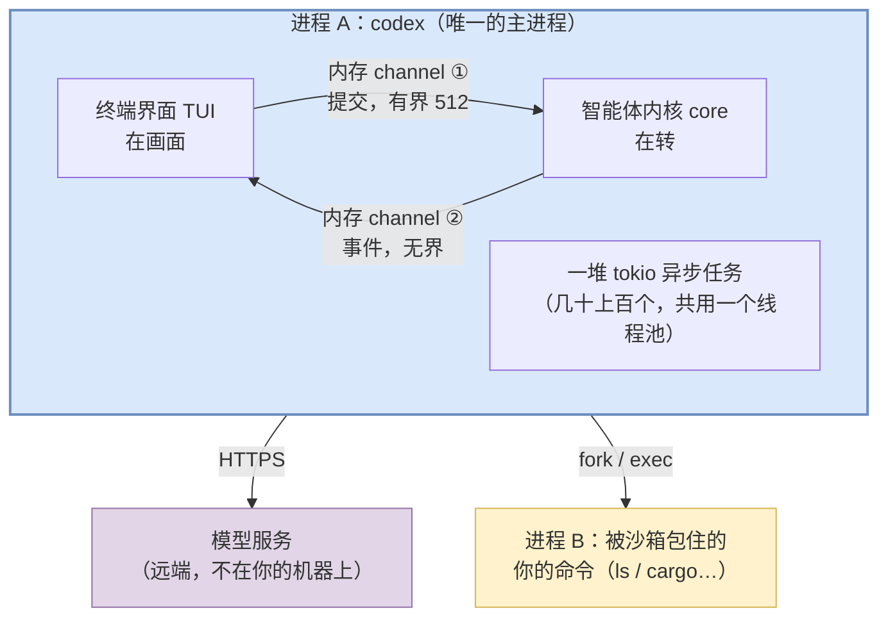
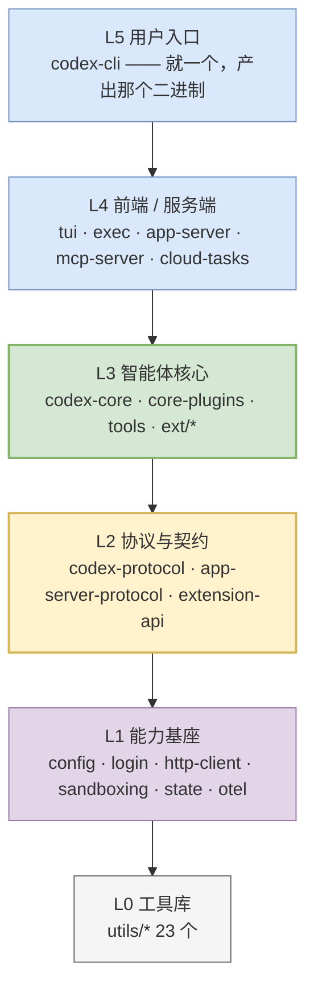

# 01 坐标系：codex 是什么形状的程序

> **配套图**：`dev_docs/diagrams/codex-01-topology.drawio.png`、`dev_docs/diagrams/codex-02-layers.drawio.png`

---

## 1. 先扔掉一个错觉

刚开始看这类项目，最容易犯的错是**上来就找"主逻辑在哪个文件"**。找不到，然后陷进 134 个 crate 的迷宫。

> **`crate` 是本教程第一个 Rust 专有词，先花十秒说清。**
>
> **一个 crate ≈ 一个"代码包"**，是 Rust 里编译和依赖的最小单位。对应到你熟悉的东西：Python 的一个 package、Java 的一个 jar、npm 的一个 module。
>
> 每个 crate 有自己的一份**清单文件**——文件名固定叫 `Cargo.toml`，写明这个包叫什么、依赖谁。**本教程后面说"清单文件"时，指的都是它。**  <!-- ref-exempt: 泛指任意 crate 的清单文件，不指某一个 -->
>
> 所以"134 个 crate"读作"**这个项目被拆成了 134 个代码包**"。至于为什么拆这么多、拆了有什么后果，是 §4 的内容。

正确的第一个问题不是"代码在哪"，而是：

> **运行 `codex` 的时候，我的电脑上有几个进程？它们各自在干嘛？**

因为 codex 的复杂度**主要来自进程和边界的设计**，不是来自算法。搞清楚进程视角，代码结构会自动对上。

---

## 2. 一次典型运行的进程图

你在项目目录敲 `codex`，回车。此刻你的机器上：



> 图里有两个词可能对你是新的：**channel** 和 **tokio**。它们不是 codex 发明的东西，是 Rust 并发编程的基础设施。**先看下面三个要点（不认识这两个词也读得懂），再看 §2 末尾的补课。**

**三个要点，每个都反直觉：**

### ① 界面和内核在同一个进程里

不是"客户端连服务端"那种分离架构。你看到的 TUI 和真正干活的 core，是同一个可执行文件里的两拨异步任务，**靠内存里的 channel 通信**。

> 但它们在**逻辑上**是完全分离的——这个区分很重要，[03](./03-protocol.md) 会展开。正是因为逻辑上分离，同一套内核才能换上 IDE 前端而不改一行。

> ⚠️ **图上这条边是简化的。** 默认 TUI 实际上是 `TUI → 进程内 app-server → core` **两跳**，中间那跳走 JSON-RPC 消息形态。但**两跳都在同一进程、都走内存 channel**，所以在"有几个进程"这个层级上，画成一条边是准确的。细节见 [10](./10-frontends-and-extensions.md) §1–§2。
>
> **`JSON-RPC` 是一个很小的约定**，规定"远程调用"这件事的消息长什么样：请求写清 `method`（调哪个方法）、`params`（参数）、`id`（编号），响应用同一个 `id` 把结果送回来。**就这么点内容，没有更多了。** 它之所以流行，是因为足够简单、和语言无关——IDE 插件（TypeScript）能和 codex（Rust）对话，靠的就是双方都认这套格式。

### ② 模型不在你的机器上

codex 号称"本地运行"，指的是**智能体逻辑**在本地。真正的大脑在远端，每一轮都要发 HTTPS 请求出去。

**codex 本身不含任何模型。** 它是一个"会用工具的壳"，脑子是租来的。

> 例外：你可以配置本地模型（Ollama、LM Studio）。但那也是另一个本地进程，通过 HTTP 调用，不是编译进 codex 的。

### ③ 每条命令都是一个独立子进程

模型说"跑 `cargo test`"，codex **不是**在自己进程里执行，而是 fork 一个子进程，**外面套一层操作系统级的沙箱**，让它在受限环境里跑。跑完收集 stdout/stderr，喂回模型。

> **这句话里有三个词值得停一下——它们是操作系统的基本概念，后面 06、07 两篇会大量用到。**
>
> **`fork` 和 `exec` 是一对**，合起来就是"另开一个程序去跑"这件事在类 Unix 系统上的标准做法：
>
> | | 干什么 | 打个比方 |
> | ---- | ---- | ---- |
> | **`fork`** | 把当前进程**复制一份**，得到一个一模一样的子进程 | 克隆出一个自己 |
> | **`exec`** | 让这个子进程**把自己整个换成另一个程序** | 让克隆体改头换面去当 `cargo` |
>
> 分两步是有讲究的：**中间那个空隙，正是给父进程做手脚的机会**——限制权限、改工作目录、接管输入输出。**codex 的沙箱就装在这个空隙里**（[07](./07-security.md) 展开）。
>
> **`stdin` / `stdout` / `stderr`（标准输入 / 标准输出 / 标准错误）**：每个进程天生自带的三个口子——一个进、两个出。你敲给程序的内容从 `stdin` 进去，程序正常打印的内容走 `stdout`，报错信息走 `stderr`。你在终端看到的字，就是从后两个口子出来的。
>
> **codex 不让这两个输出口打到你的屏幕上，而是接过来收进自己手里，再拼成文本喂给模型**——"模型能看到命令执行结果"就是这么实现的。至于 `stdin`，它让 codex 能反过来往子进程里**继续输入**，这正是 [06](./06-tools.md) 里 `unified_exec` 那种"长驻进程"工具的基础。
>
> **`沙箱`（sandbox）**：一个"**降权的笼子**"。子进程被关进去之后，就算它想删你主目录、想连外网，**操作系统会直接拒绝**——不是靠 codex 检查命令危不危险，而是这个进程压根就没有那个权限。[07](./07-security.md) 讲它怎么造出来。

这个设计带来两个直接后果：

- **安全边界是操作系统给的**，不是代码逻辑判断出来的——后者可以被绕过，前者不能
- **命令崩溃不会拖垮 codex**，因为它在另一个进程里

---

### 📖 补课：图里那两个陌生词

上面的图能读懂了，但 `channel` 和 `tokio` 这两个词值得单独讲清楚——**后面每一篇都会反复用到它们**。

#### 词一：channel（通道）

**channel 是并发编程的通用概念，不限于 Rust**：一根单向的队列管道，一头写（`Sender`），一头读（`Receiver`）。

- 写的人不管读的人在哪、什么时候读，塞进去就返回
- 读的人 `await` 挂在管子上，有数据才被唤醒——**等待期间不占 CPU**

**"内存"这个前缀是在强调对照组。** 这根管子就活在程序自己的内存里——**消息不落盘**（"落盘"= 写到硬盘上）、**不出网、也不需要转换格式**。发一条消息 = 把一个 Rust 数据对象直接挪进队列，接收方拿到的**就是同一块内存里的同一个对象**，不是它的副本。

> **这里要引入一个后面反复出现的词：序列化（serialize）。**
>
> **序列化 = 把内存里的数据对象，转换成一串可以传输或保存的字节**（最常见的形式就是 JSON 文本）。反过来把字节还原成对象，叫**反序列化**。
>
> **为什么需要它？** 因为内存里的对象是"活的"——它内部到处是**内存地址**（"这个字段的内容在内存第某某号位置"）。这些地址**只在本进程内有意义**：换个进程、换台机器，同一个地址指向的完全是别的东西。所以只要数据要离开本进程，就必须先摊平成一串**不依赖地址、自我包含**的字节。
>
> ```
> 内存里的对象                     序列化后的字节
> ┌──────────────┐                 
> │ id  → 0x7ffe…│  ── 序列化 ──▶  {"id":"s1","op":"UserInput"}
> │ op  → 0x7ffd…│  ◀─ 反序列化 ─  （一串纯文本，谁都能读）
> └──────────────┘                 
>  只在本进程有效                    可以走网络、可以存文件
> ```
>
> **所以"不做序列化"是一件很值钱的事**：省掉了转换的 CPU 开销，也省掉了转换过程中可能出错的一整类问题。这正是"同一个进程"这个设计换来的红利。
>
> 但反过来说——**codex 的消息被刻意设计成"随时可以序列化"**，哪怕当前不需要。这一步棋支撑了后面所有的跨进程能力（[03](./03-protocol.md) §5 ④ 会讲这个决定有多关键）。

这个词之所以要写在图上，是因为图里三条边的代价差着好几个数量级：

| 图上的边 | 实际是什么 | 量级 |
| ---- | ---- | ---- |
| TUI ↔ core（**内存 channel**） | 队列里挪一个对象，**不转换格式** | **纳秒** |
| A → 进程 B（`fork` / `exec`） | 请操作系统另开一个程序，再把它的输出收回来 | 毫秒 |
| A → 模型服务（HTTPS） | 加密 + **序列化成 JSON** + 跨网络来回 | **百毫秒** |

**codex 里具体是哪两根管子**（`codex-rs/core/src/session/mod.rs:556-557`）：

```rust
let (tx_sub, rx_sub) = async_channel::bounded(SUBMISSION_CHANNEL_CAPACITY); // ① 前端 → 内核，容量 512
let (tx_event, rx_event) = async_channel::unbounded();                      // ② 内核 → 前端，无上限
```

**上面这两行一个写了 512、一个没写数字，这个差别是刻意的。** 先解释这两个词：

**"有界 512"的意思是：这根管子里最多能积压 512 条还没被取走的消息。** 单位是**条**，不是字节。你可以把它想成一个只有 512 个座位的等候区。

**"无界"就是没有这个上限**，来多少存多少。

**但真正重要的不是能存多少，而是「存满了之后会怎样」。** 这才是两个方向要选不同做法的原因：

| | ① 上行（你 → 内核） | ② 下行（内核 → 界面） |
| ---- | ---- | ---- |
| 管子里装什么 | 你敲的话、你的批准 / 拒绝、中断 | 模型一个字一个字吐的内容、工具执行进度、审批请求 |
| 座位数 | **512 个** | **不限** |
| **第 513 条来了会怎样** | **发消息的一方停下来等**，等内核取走一条腾出座位，才让它继续 | 不会发生 |
| 这样选是为了防什么 | 防止发得太快，把内核活活压垮 | **防止界面画得慢，把内核拖住不动** |

**"发消息的一方停下来等"这件事，行话叫「背压」（backpressure）**——名字听着玄，意思很朴素：**下游忙不过来的时候，压力顺着管子倒着传回上游，逼上游慢下来**。像水管堵了，水压会顶回水龙头。

> 补一句免得误解：这里的"停下来等"**不会让界面卡住**。停的只是"发这条消息"这一件事，程序里其他事情照常跑（原因见下面的 tokio 部分）。

**下行为什么不能设上限，理由特别硬**：模型吐字的时候，消息是几十上百条一秒地喷出来。**万一界面画得慢（你正在翻历史、终端正在滚屏），管子一满，内核就得停下来等界面**——你看到的现象就是"模型明明在跑，整个程序却僵住了"。codex 宁可多占点内存，也不接受这个。

> **这个取舍值得抄，但要连它的赌注一起抄。** 做类似产品时，"**哪个方向允许卡住对方**"是必须提前定的问题。
>
> 不设上限的代价是内存：界面如果长时间不取，消息就一直堆着。**codex 赌的是"界面总在取"**——终端界面确实一直在取，所以这个赌成立。
>
> **但你的前端如果可能长时间不取**（IDE 插件断连了、网页切到后台了），这个赌就不成立，消息会一直堆到内存耗尽。那种情况下正确的做法是"**设上限 + 满了就扔掉最旧的**"，宁可让界面漏掉几个中间状态。

> **最后说一下 512 这个数**：源码里就是一行光秃秃的常量（`codex-rs/core/src/session/mod.rs:484`），**没有任何注释解释为什么是 512**。它是个拍出来的经验值，不是算出来的。
>
> 你自己做的时候不用纠结抄多少——上行的真实流量就是"人打字的速度"，几十就够了，512 已经是极宽松的余量。**要抄的是"上行要设上限"这个决定，不是 512 这个数字。**

这两根管子对外只暴露两个方法，都在 `codex-rs/core/src/codex_thread.rs`：

| 方法 | 位置 | 作用 |
| ---- | ---- | ---- |
| `submit()` | `codex-rs/core/src/codex_thread.rs:226` | 往上行管子塞一条提交 |
| `next_event()` | `codex-rs/core/src/codex_thread.rs:476` | 从下行管子取一条事件 |

**这就是上面 ① 说的"逻辑上完全分离"的物理形态：前端只认这两个函数签名，碰不到 core 内部任何类型。** [02](./02-startup.md) §5 会讲这个边界怎么用类型锁死。

> ⚠️ **一个容易记错的点：这两根管子来自 `async_channel` 这个第三方代码包，不是 tokio 自带的那套（`tokio::sync::mpsc`）。**
>
> 能核实的差别有两条：
>
> | | `async_channel`（codex 用的） | `tokio::sync::mpsc` |
> | ---- | ---- | ---- |
> | 允许几个人**同时往里发** | 多个 | 多个 |
> | 允许几个人**同时从里取** | **多个** | 只能一个 |
> | 绑定运行时吗 | **不绑**，换个运行时也能用 | 绑 tokio |
>
> codex 确实用到了"多个人同时发"——内核内部到处复制发送端往外发消息。**至于是不是为了"多个人同时取"才选的它，源码没写理由，这条待考，别当结论讲。**

#### 词二：tokio

**先说 Rust 的一个特殊之处**：Rust 语言只提供 `async` / `await` **语法**和 `Future` 这个接口，**但不提供跑这些异步代码的引擎**。

这在其他语言里很少见——Python 的 `asyncio`、Go 的 runtime 都是内置的。Rust 故意把这块留空，让生态竞争。**tokio 就是事实上赢了的那个引擎（异步运行时）。**

| 层 | 是什么 | 谁提供 |
| ---- | ---- | ---- |
| `async` / `await` | 语法关键字 | **Rust 语言本身** |
| `Future` | "一个还没算完的值"这个约定 | Rust 标准库 |
| **`tokio`** | **真正把这些"还没算完的值"推着算完的引擎** | **第三方代码包**，得自己写进清单文件才有 |

> Rust 里管上面第二行那种"约定"叫 **`trait`**（读作 trait，不译）。**它就是别的语言里的"接口"**：规定"实现了我的类型必须有哪几个方法"。后面各篇会反复见到这个词，见到就换成"接口"去理解即可。

**所以回答"tokio 是不是 Rust 专有名词"：是 Rust 生态的专有名词（项目名，取自"东京"），但不是 Rust 语言的一部分。** 它的生态位对应 Python 的 `asyncio`、JS 的 event loop、Go 的 runtime + goroutine 调度器。Rust 里还有别的运行时（`async-std`、`smol`、`glommio`），但 tokio 占绝对主导——一个 Rust 项目只要要联网、要并发 I/O，默认就是它。

**再说"异步任务"不是什么：它不是操作系统线程。**

| | 操作系统线程 | tokio 的"任务" |
| ---- | ---- | ---- |
| 创建一个要多少代价 | 几十微秒 + 2~8 MB 内存 | 几百纳秒 + 几百字节 |
| 谁来安排它什么时候跑 | **操作系统**（程序管不着） | **tokio 自己**（就是普通代码，不惊动操作系统） |
| 开几万个 | 机器躺平 | 很轻松 |

**那它像 Python 里的什么？——像协程，而且像得几乎可以直接对号入座。**

| Rust / tokio | Python / asyncio | 两边共同的含义 |
| ---- | ---- | ---- |
| `async fn foo()` | `async def foo()` | 声明一个"可以中途让出"的函数 |
| 调用它拿到的 `Future` | 调用它拿到的协程对象 | **调用本身不执行任何代码**，只拿到一个"待推进的东西"。两边都是惰性的：没人推它就永远不动 |
| `.await` | `await` | "我这儿要等了，先让别人跑"——**让出的是执行权，不是整个程序** |
| `tokio::spawn(fut)` | `asyncio.create_task(coro)` | 丢给运行时后台跑，自己不等它 |
| tokio 运行时 | asyncio 事件循环 | 真正推着这些东西往前走的引擎 |

连"为什么要有它"都是同一个理由：**一个任务在等网络/等文件的那几十毫秒里，让别的任务把线程用起来，而不是干等。** 你在 Python 里对 asyncio 建立的所有直觉，读 codex 时基本都能直接搬过来。

> 更细的语法对照（`FuturesOrdered` 对 `asyncio.gather` 之类）在 [32](./32-rust-for-python-readers.md) §9。

**唯一一处对不上、而且很关键的差别：并行度。**

| | Python `asyncio` | tokio 多线程运行时 |
| ---- | ---- | ---- |
| 协程/task 跑在几个线程上 | **1 个** | **N 个**（N ≈ CPU 核数） |
| 同一时刻真正在执行的有几个 | **1 个** | **N 个** |
| 一个任务里写了个死循环会怎样 | **整个事件循环卡死**，所有协程一起停 | 只占住 1 个工作线程，其余照常（但也别这么写，该用 `spawn_blocking`） |

这个差别有个直接后果，也是 Rust 异步代码里最劝退的那部分的来源：**task 会被运行时在线程之间搬来搬去**，所以它携带的数据必须能安全地跨线程传递——这就是你后面会反复撞见的 `Send` / `Sync` 两个约束（[04](./04-three-loops.md) §4）。**Python 里没有这两个词，是因为 asyncio 根本不存在"跨线程"这回事，编译器自然也没什么可检查的。**

codex 建的正是这种**多线程 runtime**（`codex-rs/arg0/src/lib.rs:285-290`）：

```rust
let mut builder = tokio::runtime::Builder::new_multi_thread();
builder.enable_all();
```

它开出 N 个工作线程（N ≈ CPU 核数），然后**几十上百个 task 在这 N 个线程上轮转**。某个 task 一 `await`（等网络、等文件、等 channel），就主动让出线程，工作线程立刻去跑别的 task——**没有任何线程在空转等待**。

"一堆"到底有多堆——非测试代码里的 spawn 点：

```bash
# 在 codex-rs/ 下执行
grep -rn "tokio::spawn\|tokio::task::spawn" --include=*.rs core/src tui/src | grep -v "_tests\.rs" | wc -l
# → 131（core 70 + tui 61）
```

一次典型会话同时活着的 task 大致包括：渲染循环、键盘监听、SSE 流式响应读取（**SSE = 服务端有一段就推一段的那种 HTTP 响应**，模型逐字往外吐就是靠它，[11](./11-model-client.md) §4 详述）、每个并行工具调用一个、每个 MCP server 一个、子进程的 stdout/stderr 各一个、各种超时定时器……

> **这个框才是整张图成立的原因。** TUI 和 core 能塞进同一个进程还互不阻塞，靠的就是它们各自是一组 task，谁 `await` 谁让路。
>
> **没有这类运行时，"单进程 + 界面不卡 + 同时跑 5 个工具"这个组合做不出来。** 你要在别的语言里复刻 codex，第一件事就是确认那门语言有等价的东西（Python 的 asyncio、Go 的 goroutine、Node 的 event loop 都行）。

---

## 3. "本地运行"不等于"不出网"

这是个常见误解，值得单独说清。实际存在六类出网通路：

| 类别 | 什么时候发生 |
| ---- | ---- |
| ① 模型 API | 默认路径，每一轮 |
| ② 认证 | 登录时 |
| ③ 本地模型 | 你显式配置了才有（Ollama / LM Studio） |
| ④ 你自己配的 MCP server | 你显式配置了才有 |
| ⑤ 云任务 | 用 `codex cloud` 时（实验性） |
| ⑥ 遥测 | **按二进制而异**，见下 |

> **`遥测`（telemetry）**：程序**自动把自己的运行情况上报回开发方的服务器**——用了哪些功能、出了什么错、某一步花了多久。名字来自航天领域（远程测量）。**它上报的是使用情况，不是你的代码内容**，但它确实是一条出网通路，所以列在这张表里。后面 [12](./12-config-and-features.md)、[21](./21-before-you-fork.md) 还会遇到它（fork 之后**必须换掉遥测端点**，否则你的用户数据会发到上游服务器）。

第 ⑥ 条值得特别注意：**遥测的默认值不统一**。

| 二进制 | 指标上报默认 |
| ---- | ---- |
| TUI、`exec`、`mcp-server`（前台型） | **开** |
| app-server、remote-control、exec-server（被集成的服务端型） | **关** |

不是"统一开"也不是"统一关"。设计意图应该是：前台型有真人在用，被集成型的宿主应该自己决定是否上报（**这是推断，不是源码结论**）。

---

## 4. 那 134 个 crate 是怎么回事

理解了上面，这个数字就不吓人了。

> **它们绝大多数不是运行时的"组件"，而是编译期的"抽屉"。**

> **这句话的支点是"编译期"和"运行时"这组对照，先说清楚：**
>
> | | 什么时候 | 谁在场 |
> | ---- | ---- | ---- |
> | **编译期** | 你（或 CI）**把源码翻译成可执行文件**的那几分钟 | 编译器。**程序还没跑起来** |
> | **运行时** | 用户敲下 `codex` **之后**，程序真正在跑的那段时间 | 你的电脑、你的数据。**源码和编译器都已经不在场了** |
>
> **关键：编译期存在的东西，运行时可以完全不存在。** 134 个 crate 就是这样——它们是**给编译器看的组织方式**，编译完之后被合并进同一个可执行文件，**运行时没有任何"134 个东西"的痕迹**。
>
> 这个区分在后面还会用到好几次（比如"命令行参数是编译期生成解析代码的"、"配置 schema 是编译期塞进二进制的"）。**每次看到它，问自己一句"这件事发生在程序跑起来之前还是之后"就不会错。**

打个比方：你可以把整个厨房的东西堆在一张桌子上（一个大 crate），也可以买一堆抽屉分门别类（134 个小 crate）。**做出来的菜是一样的**，区别在于找东西快不快、改一个抽屉会不会碰倒别的。

Rust 项目倾向后者，因为拆开有两个实打实的好处：

1. **改完之后重新编译快** —— 改一个小 crate，只需要重编它和用到它的那几个，其余 130 个不动
2. **谁能用谁，机器会替你检查** —— 底层 crate 不可能反过来用上层的东西，编译器直接拒绝

**所以"134 个 crate"翻译成中文是"134 个抽屉"，不是"134 个组件在运行"。**

> **顺带一个 Rust 专有词：`workspace`（工作区）。** 这 134 个代码包不是散着的，它们被一份**总清单**（仓库根上的 `codex-rs/Cargo.toml`）登记在一起，统一编译、共享依赖版本。**这个"一份总清单管一堆代码包"的组织方式就叫 workspace。** 下面表格里的 `[workspace] members` 就是那份总清单里列出成员的那一段。

### 计数口径要注意

同一个"crate 数量"有多种口径，混用会造成混乱：

| 口径 | 数值 |
| ---- | ---: |
| `cargo metadata` 的包总数（**本教程统一采用**） | **134** |
| `[workspace] members` 显式条目 | 128 |
| `codex-rs/` 下的清单文件数 | 134 |

差额的 6 个是"不在 `members` 数组里、但被某个成员通过 `path` 依赖间接纳入"的 crate。**实测就是这 6 个**：

| crate 目录 | 性质 |
| ---- | ---- |
| `codex-rs/app-server/tests/common` | 测试辅助 |
| `codex-rs/core/tests/common` | 测试辅助 |
| `codex-rs/mcp-server/tests/common` | 测试辅助 |
| `codex-rs/chatgpt` | 生产 crate |
| `codex-rs/message-history` | 生产 crate |
| `codex-rs/windows-sandbox-rs` | 生产 crate（平台相关） |

> 有一半是**测试专用的辅助 crate**——把测试脚手架单独做成 crate 而不是塞进 `tests/` 里的普通模块，这样多个集成测试文件可以共享它。**这个手法值得记住**，[31](./31-testing-an-agent.md) 会展开。

---

## 5. 但有一个抽屉特别大

134 个抽屉不是均匀的。真实的行数分布（Rust 代码，`git ls-files` 口径）：

| crate | 行数 | 是什么 |
| ---- | ---: | ---- |
| **`codex-core`** | **296,963** | 智能体内核——循环、工具、上下文 |
| **`codex-tui`** | **238,439** | 终端界面 |
| `codex-app-server` | 128,364 | JSON-RPC 服务端 |
| `codex-exec-server` | 39,311 | 跨 OS 执行服务 |
| `codex-core-plugins` | 37,038 | 插件机制 |
| `codex-app-server-protocol` | 30,946 | 对外协议（含 550 个生成的 `.ts`） |
| `codex-cli` | 26,629 | 命令行分发 |
| `ext/`（12 个 crate 合计） | 24,837 | 内建扩展 |
| `codex-protocol` | 23,132 | **内部协议——全仓最热的契约层** |
| ... 其余 120 多个 | 几百到 2 万不等 | |

**两个立刻可得的结论：**

**① 头两个加起来占了一半以上。** 真正的复杂度集中在 **core（内核）** 和 **tui（界面）**。剩下 132 个大部分是**薄的**，是分层用的，不是逻辑密集的。

**② 学习路径因此明确：先啃 core，其他的用到再看。** 本教程 02–09 篇讲的基本都是 core 里的东西。

---

## 6. 六层分层

> **配套图**：`dev_docs/diagrams/codex-02-layers.drawio.png`

134 个 crate 按依赖方向分成六层，**依赖只能从上往下**：



> 图中的箭头表示**依赖方向**（上层依赖下层）。

这个结构解释了两个关键数字：

- **`codex-core` 依赖 66 个内部 crate** —— 它站在 L3，需要下面三层的一切能力
- **`codex-protocol` 被 70 个 crate 依赖** —— 它在 L2 定义了所有人共用的消息类型

> 这两个数字是**含 dev-dependencies 去重**的口径。只算 `[dependencies]` 的话分别是 **58** 和 **66**。**依赖类的数字必须标口径**，否则不同来源永远对不上。
>
> 复现方式：逐份读各 crate 清单文件的 `[dependencies]` / `[dev-dependencies]` 段（本仓 workspace 含 git 依赖，`cargo metadata --offline` 会直接失败，用不了）。

### 分层是归纳，不是强制

需要说清楚：Rust/Cargo **不强制分层**，`Cargo.toml` 里也没有"层"这个概念。上面的六层是**按 path 依赖方向归纳出来的表述**，实际依赖图存在跨层边。  <!-- ref-exempt: 泛指任意 crate 的清单文件，不指某一个 -->

它的价值是**心智模型**，不是可执行的约束。真正被机器强制的边界只有一条，见 [10](./10-frontends-and-extensions.md)。

---

## 7. 澄清一个高频混淆：27 个子命令 vs 5 种前端

这两个数字属于**不同维度**，经常被混为一谈。

| 维度 | 数量 | 含义 |
| ---- | ---: | ---- |
| **子命令** | **27** | 代码里那个"子命令"枚举列了 27 项，即 `codex --help` 里那些 |
| **前端 / 进程形态** | **5** | 会**拉起完整智能体会话**的入口。架构维度 |

### 5 种前端

| 入口 | 面向谁 | 形态 |
| ---- | ---- | ---- |
| 默认（**不带任何子命令**） | 人 | 终端 UI，长驻交互 |
| `codex exec` | 脚本 / CI | 一次性，非交互 |
| `codex app-server` | IDE 插件 | JSON-RPC 长连接 |
| `codex mcp-server` | 别的 AI | 把自己包装成 MCP 工具 |
| `codex cloud` | — | 云端任务（实验性） |

**注意第一行：默认 TUI 根本不是一个子命令。** 它是"没给子命令"这个情况的分支——代码里那个字段的类型写的是 `Option<Subcommand>`，意思是"**可能有子命令，也可能没有**"；没有（`None`）的时候就进 TUI。

> **`Option` 是 Rust 里表达"可能有、也可能没有"的标准写法**，相当于别的语言里"这个值可能是 null"，区别是 Rust 强制你必须显式处理"没有"的情况，漏了就编译不过。[32](./32-rust-for-python-readers.md) §3 有展开。

**所以：27 个子命令里，只有 4 个 + 1 个默认行为会拉起智能体内核，其余 22 个都是辅助命令**（登录、诊断、会话管理、补全脚本……它们不调模型，也不进后面要讲的三层循环）。

### 27 个的完整清单（下表按用途分 10 组，组内合计 27 个）<!-- no-count-check -->

| 用途 | 子命令 |
| ---- | ---- |
| **核心交互** | *(无子命令 → 默认 TUI)*、`exec`（别名 `e`）、`review` |
| **会话管理** | `resume`、`fork`、`archive`、`unarchive`、`delete` |
| **认证** | `login`、`logout` |
| **扩展生态** | `mcp`、`plugin`、`mcp-server` |
| **服务化** | `app-server` ⚠️、`remote-control` ⚠️、`exec-server` ⚠️ |
| **诊断运维** | `doctor`、`debug`、`features`、`completion`、`update` |
| **执行隔离** | `sandbox`、`execpolicy` 🔒 |
| **变更应用** | `apply`（别名 `a`） |
| **实验性** | `cloud`（别名 `cloud-tasks`）⚠️、`app`（桌面端，仅 macOS/Windows） |
| **内部用途** | `responses-api-proxy` 🔒、`stdio-to-uds` 🔒 |

⚠️ = 标注实验性　🔒 = 隐藏，帮助里看不见

### 你实际能看到的没有 27 个

| 口径 | 数量 |
| ---- | ---: |
| 枚举变体总数 | 27 |
| 减去 3 个隐藏的 | 24 |
| Linux 上（`app` 仅 macOS/Windows） | **23** |
| macOS / Windows 上 | **24** |

> **记忆锚点**：**27** 是"代码里定义了多少"，**23/24** 是"你能看见多少"，**5** 是"多少个会真的跑起智能体"。

---

## 8. "单二进制"也要打个折

"单二进制"指的是**用户交互入口只有一个 `codex`**，不是"交付物只有一个文件"。

**随正式发布交付的辅助可执行文件有 6 个**，另有 2 个只在运行时被拉起（不进发布清单），合计 8 个：

| 辅助文件 | 作用 | 随发布分发 |
| ---- | ---- | ---- |
| `codex-code-mode-host` | JS code-mode 的独立宿主进程 | 是（全平台） |
| `codex-responses-api-proxy` | 对应隐藏子命令 | 是 |
| `codex-app-server` | 独立 app-server 进程，供 IDE 直接拉起 | 是 |
| `bwrap` | vendored bubblewrap（Linux 沙箱） | 是（Linux） |
| `codex-windows-sandbox-setup` | Windows 沙箱环境准备 | 是（Windows） |
| `codex-command-runner` | Windows 受限命令执行器 | 是（Windows） |
| `codex-linux-sandbox` | Linux 沙箱 helper | 否，运行时拉起 |
| `codex-execve-wrapper` | 权限提升时的 execve 包装 | 否，运行时拉起 |

> 表里 `bwrap` 那行的 **`vendored`（供应商化）**：指**把一份第三方代码直接复制进自己仓库、跟着一起编译**，而不是在清单文件里声明依赖、构建时去下载。好处是构建结果完全可控，代价是升级要手动同步、**而且对方的许可证义务跟着这份复制品一起进了你的仓库**（[21](./21-before-you-fork.md) §2 就栽在这一点上）。

**理想没能 100% 守住**——这本身是个有价值的信息：真要做"单文件交付"，沙箱和跨语言宿主这两块是最容易破功的地方。

### ⚠️ 别把这张表和 `[[bin]]` 数量搞混

你自己去 grep 会数出**21 个 `[[bin]]` target**：

```bash
grep -rn --include=Cargo.toml -A3 '^\[\[bin\]\]' codex-rs | grep 'name ='
```

多出来的那些是**开发期工具与测试辅助**，不进发布包，比如：`codex-write-config-schema`（生成配置 schema）、`logs_client`、`md-events`、`codex-app-server-test-notify-capture`、`codex-file-search`。

**三个口径别混用**：

| 口径 | 数值 | 含义 |
| ---- | ---: | ---- |
| `[[bin]]` target | **21** | 这个 workspace 能编出多少个可执行文件 |
| 随正式发布交付 | **6**（+ 主程序 `codex`） | 用户装完之后硬盘上有什么 |
| 运行时才拉起 | 2 | 不进发布清单，用到时才产生 |

---

## 本篇小结

| 你现在应该能回答 | 答案 |
| ---- | ---- |
| 运行 `codex` 有几个进程？ | 主进程 1 个；每执行一条命令临时多 1 个（带沙箱） |
| 界面和内核是分离的吗？ | 进程上不分离，逻辑上完全分离 |
| "内存 channel" 是什么？ | 程序内存里的队列，**不转格式、不出进程**。两根：上行 `Submission` 有界 512，下行 `Event` 无界 |
| 什么叫序列化？ | 把内存对象摊平成一串字节（如 JSON），好让它离开本进程。**内存 channel 省掉的就是这一步** |
| `fork` / `exec` 是什么？ | 复制出子进程 / 让子进程换成另一个程序。**中间那个空隙就是沙箱的安装位** |
| 编译期 vs 运行时？ | 前者是源码变成可执行文件的那几分钟，后者是程序真在跑。**134 个 crate 只存在于前者** |
| 为什么一有界一无界？ | 前端别撑爆内核（背压）；内核别被慢界面卡住 |
| `tokio` 是什么？是 Rust 语法吗？ | **不是。** Rust 只给 `async`/`await` 语法，不给运行时；tokio 是第三方运行时，生态位同 asyncio |
| "异步任务"是线程吗？ | 不是。用户态调度，比线程轻几个数量级，非测试代码里 131 个 spawn 点 |
| tokio 的异步任务像 Python 的协程吗？ | **像，几乎可以逐项对号入座**（`async fn`↔`async def`、`.await`↔`await`、`tokio::spawn`↔`create_task`）。**只有一处对不上：asyncio 跑在 1 个线程上，tokio 默认跑在 N 个线程上**——`Send`/`Sync` 这两个约束就是从这儿来的 |
| 模型在哪？ | 远端。codex 不含模型 |
| 134 个 crate 都在运行吗？ | 不是，那是编译期的抽屉 |
| 复杂度集中在哪？ | core（29.7 万行）和 tui（23.8 万行），占一半以上 |
| "默认 TUI" 是第 28 个子命令吗？ | 不是，是"没给子命令"的分支 |
| "单二进制"准确吗？ | 交互入口只有一个，但**随发布另交付 7 个辅助可执行文件**（加上 2 个运行时 helper 共 9 个）。workspace 里的 `[[bin]]` target 则有 34 个，多出来的是开发期工具 |

---

**下一篇**：[02 启动：从敲下命令到会话转起来](./02-startup.md) —— 我们跟着真实代码走一遍，看智能体是从哪一行开始转的。
