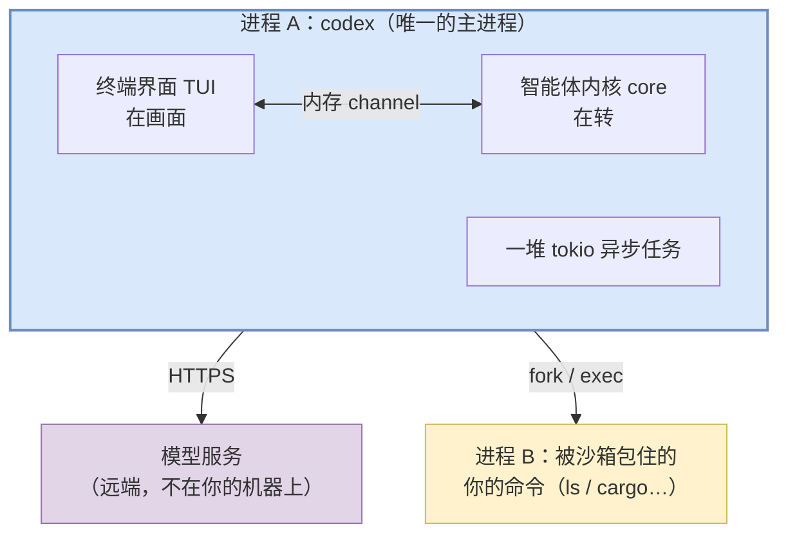
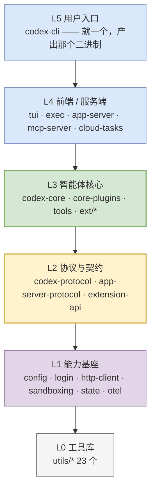

# 01 坐标系：codex 是什么形状的程序

> **配套图**：`dev_docs/diagrams/codex-01-topology.drawio.png`、`dev_docs/diagrams/codex-02-layers.drawio.png`

---

## 1. 先扔掉一个错觉

刚开始看这类项目，最容易犯的错是**上来就找"主逻辑在哪个文件"**。找不到，然后陷进 134 个 crate 的迷宫。

正确的第一个问题不是"代码在哪"，而是：

> **运行 `codex` 的时候，我的电脑上有几个进程？它们各自在干嘛？**

因为 codex 的复杂度**主要来自进程和边界的设计**，不是来自算法。搞清楚进程视角，代码结构会自动对上。

---

## 2. 一次典型运行的进程图

你在项目目录敲 `codex`，回车。此刻你的机器上：

**三个要点，每个都反直觉：**

### ① 界面和内核在同一个进程里

不是"客户端连服务端"那种分离架构。你看到的 TUI 和真正干活的 core，是同一个可执行文件里的两拨异步任务，**靠内存里的 channel 通信**。

> 但它们在**逻辑上**是完全分离的——这个区分很重要，[03](./03-protocol.md) 会展开。正是因为逻辑上分离，同一套内核才能换上 IDE 前端而不改一行。

### ② 模型不在你的机器上

codex 号称"本地运行"，指的是**智能体逻辑**在本地。真正的大脑在远端，每一轮都要发 HTTPS 请求出去。

**codex 本身不含任何模型。** 它是一个"会用工具的壳"，脑子是租来的。

> 例外：你可以配置本地模型（Ollama、LM Studio）。但那也是另一个本地进程，通过 HTTP 调用，不是编译进 codex 的。

### ③ 每条命令都是一个独立子进程

模型说"跑 `cargo test`"，codex **不是**在自己进程里执行，而是 fork 一个子进程，**外面套一层操作系统级的沙箱**，让它在受限环境里跑。跑完收集 stdout/stderr，喂回模型。

这个设计带来两个直接后果：

- **安全边界是操作系统给的**，不是代码逻辑判断出来的——后者可以被绕过，前者不能
- **命令崩溃不会拖垮 codex**，因为它在另一个进程里

---

## 3. "本地运行"不等于"不出网"

这是个常见误解，值得单独说清。实际存在六类出网通路：

| 类别 | 什么时候发生 |
| ---- | ---- |
| ① 模型 API | 默认路径，每一轮 |
| ② 认证 | 登录时 |
| ③ 本地模型 | 你显式配置了才有（Ollama / LM Studio） |
| ④ 你自己配的 MCP server | 你显式配置了才有 |
| ⑤ 云任务 | 用 `codex cloud` 时（实验性） |
| ⑥ 遥测 | **按二进制而异**，见下 |

第 ⑥ 条值得特别注意：**遥测的默认值不统一**。

| 二进制 | 指标上报默认 |
| ---- | ---- |
| TUI、`exec`、`mcp-server`（前台型） | **开** |
| app-server、remote-control、exec-server（被集成的服务端型） | **关** |

不是"统一开"也不是"统一关"。设计意图应该是：前台型有真人在用，被集成型的宿主应该自己决定是否上报（**这是推断，不是源码结论**）。

---

## 4. 那 134 个 crate 是怎么回事

理解了上面，这个数字就不吓人了。

> **它们绝大多数不是运行时的"组件"，而是编译期的"抽屉"。**

打个比方：你可以把整个厨房的东西堆在一张桌子上（一个大 crate），也可以买一堆抽屉分门别类（134 个小 crate）。**做出来的菜是一样的**，区别在于找东西快不快、改一个抽屉会不会碰倒别的。

Rust 项目倾向后者，因为拆开有两个实打实的好处：

1. **增量编译快** —— 改一个小 crate，只重编它和依赖它的
2. **依赖方向可以被机器检查** —— 底层 crate 不可能反过来依赖上层，编译器直接拒绝

**所以"134 个 crate"翻译成中文是"134 个抽屉"，不是"134 个组件在运行"。**

### 计数口径要注意

同一个"crate 数量"有多种口径，混用会造成混乱：

| 口径 | 数值 |
| ---- | ---: |
| `cargo metadata` 的包总数（**本教程统一采用**） | **134** |
| `[workspace] members` 显式条目 | 128 |
| `codex-rs/` 下的清单文件数 | 134 |

差额的 6 个是"不在 `members` 数组里、但被某个成员通过 `path` 依赖间接纳入"的 crate。

---

## 5. 但有一个抽屉特别大

134 个抽屉不是均匀的。真实的行数分布（Rust 代码，`git ls-files` 口径）：

| crate | 行数 | 是什么 |
| ---- | ---: | ---- |
| **`codex-core`** | **296,963** | 智能体内核——循环、工具、上下文 |
| **`codex-tui`** | **238,439** | 终端界面 |
| `codex-app-server` | 128,364 | JSON-RPC 服务端 |
| `codex-exec-server` | 39,311 | 跨 OS 执行服务 |
| `codex-core-plugins` | 37,038 | 插件机制 |
| `codex-app-server-protocol` | 30,946 | 对外协议（含 550 个生成的 `.ts`） |
| `codex-cli` | 26,629 | 命令行分发 |
| `ext/`（12 个 crate 合计） | 24,837 | 内建扩展 |
| `codex-protocol` | 23,132 | **内部协议——全仓最热的契约层** |
| ... 其余 120 多个 | 几百到 2 万不等 | |

**两个立刻可得的结论：**

**① 头两个加起来占了一半以上。** 真正的复杂度集中在 **core（内核）** 和 **tui（界面）**。剩下 132 个大部分是**薄的**，是分层用的，不是逻辑密集的。

**② 学习路径因此明确：先啃 core，其他的用到再看。** 本教程 02–09 篇讲的基本都是 core 里的东西。

---

## 6. 六层分层

> **配套图**：`dev_docs/diagrams/codex-02-layers.drawio.png`

134 个 crate 按依赖方向分成六层，**依赖只能从上往下**：

> 图中的箭头表示**依赖方向**（上层依赖下层）。

这个结构解释了两个关键数字：

- **`codex-core` 依赖 66 个内部 crate** —— 它站在 L3，需要下面三层的一切能力
- **`codex-protocol` 被 70 个 crate 依赖** —— 它在 L2 定义了所有人共用的消息类型

> 这两个数字是**含 dev-dependencies 去重**的口径。只算生产依赖的话分别是 58 和 67。**依赖类的数字必须标口径**，否则不同来源永远对不上。

### 分层是归纳，不是强制

需要说清楚：Rust/Cargo **不强制分层**，`Cargo.toml` 里也没有"层"这个概念。上面的六层是**按 path 依赖方向归纳出来的表述**，实际依赖图存在跨层边。  <!-- ref-exempt: 泛指任意 crate 的清单文件，不指某一个 -->

它的价值是**心智模型**，不是可执行的约束。真正被机器强制的边界只有一条，见 [10](./10-frontends-and-extensions.md)。

---

## 7. 澄清一个高频混淆：27 个子命令 vs 5 种前端

这两个数字属于**不同维度**，经常被混为一谈。

| 维度 | 数量 | 含义 |
| ---- | ---: | ---- |
| **子命令** | **27** | `clap` 的 `Subcommand` 枚举变体数，即 `codex --help` 里那些 |
| **前端 / 进程形态** | **5** | 会**拉起完整智能体会话**的入口。架构维度 |

### 5 种前端

| 入口 | 面向谁 | 形态 |
| ---- | ---- | ---- |
| 默认（**不带任何子命令**） | 人 | 终端 UI，长驻交互 |
| `codex exec` | 脚本 / CI | 一次性，非交互 |
| `codex app-server` | IDE 插件 | JSON-RPC 长连接 |
| `codex mcp-server` | 别的 AI | 把自己包装成 MCP 工具 |
| `codex cloud` | — | 云端任务（实验性） |

**注意第一行：默认 TUI 根本不是一个子命令。** 它是"没给子命令"这个情况的分支——代码里子命令字段的类型是 `Option<Subcommand>`，为 `None` 时进 TUI。

**所以：27 个子命令里，只有 4 个 + 1 个默认行为会拉起智能体内核，其余 22 个都是辅助命令**（登录、诊断、会话管理、补全脚本……它们不调模型，也不进后面要讲的三层循环）。

### 27 个的完整清单（下表按用途分 10 组，组内合计 27 个）<!-- no-count-check -->

| 用途 | 子命令 |
| ---- | ---- |
| **核心交互** | *(无子命令 → 默认 TUI)*、`exec`（别名 `e`）、`review` |
| **会话管理** | `resume`、`fork`、`archive`、`unarchive`、`delete` |
| **认证** | `login`、`logout` |
| **扩展生态** | `mcp`、`plugin`、`mcp-server` |
| **服务化** | `app-server` ⚠️、`remote-control` ⚠️、`exec-server` ⚠️ |
| **诊断运维** | `doctor`、`debug`、`features`、`completion`、`update` |
| **执行隔离** | `sandbox`、`execpolicy` 🔒 |
| **变更应用** | `apply`（别名 `a`） |
| **实验性** | `cloud`（别名 `cloud-tasks`）⚠️、`app`（桌面端，仅 macOS/Windows） |
| **内部用途** | `responses-api-proxy` 🔒、`stdio-to-uds` 🔒 |

⚠️ = 标注实验性　🔒 = 隐藏，帮助里看不见

### 你实际能看到的没有 27 个

| 口径 | 数量 |
| ---- | ---: |
| 枚举变体总数 | 27 |
| 减去 3 个隐藏的 | 24 |
| Linux 上（`app` 仅 macOS/Windows） | **23** |
| macOS / Windows 上 | **24** |

> **记忆锚点**：**27** 是"代码里定义了多少"，**23/24** 是"你能看见多少"，**5** 是"多少个会真的跑起智能体"。

---

## 8. "单二进制"也要打个折

"单二进制"指的是**用户交互入口只有一个 `codex`**，不是"交付物只有一个文件"。

**随正式发布交付的辅助可执行文件有 6 个**，另有 2 个只在运行时被拉起（不进发布清单），合计 8 个：

| 辅助文件 | 作用 | 随发布分发 |
| ---- | ---- | ---- |
| `codex-code-mode-host` | JS code-mode 的独立宿主进程 | 是（全平台） |
| `codex-responses-api-proxy` | 对应隐藏子命令 | 是 |
| `codex-app-server` | 独立 app-server 进程，供 IDE 直接拉起 | 是 |
| `bwrap` | vendored bubblewrap（Linux 沙箱） | 是（Linux） |
| `codex-windows-sandbox-setup` | Windows 沙箱环境准备 | 是（Windows） |
| `codex-command-runner` | Windows 受限命令执行器 | 是（Windows） |
| `codex-linux-sandbox` | Linux 沙箱 helper | 否，运行时拉起 |
| `codex-execve-wrapper` | 权限提升时的 execve 包装 | 否，运行时拉起 |

**理想没能 100% 守住**——这本身是个有价值的信息：真要做"单文件交付"，沙箱和跨语言宿主这两块是最容易破功的地方。

---

## 本篇小结

| 你现在应该能回答 | 答案 |
| ---- | ---- |
| 运行 `codex` 有几个进程？ | 主进程 1 个；每执行一条命令临时多 1 个（带沙箱） |
| 界面和内核是分离的吗？ | 进程上不分离，逻辑上完全分离 |
| 模型在哪？ | 远端。codex 不含模型 |
| 134 个 crate 都在运行吗？ | 不是，那是编译期的抽屉 |
| 复杂度集中在哪？ | core（29.7 万行）和 tui（23.8 万行），占一半以上 |
| "默认 TUI" 是第 28 个子命令吗？ | 不是，是"没给子命令"的分支 |
| "单二进制"准确吗？ | 交互入口只有一个，但**随发布另交付 6 个辅助可执行文件**（加上 2 个运行时 helper 共 8 个） |

---

**下一篇**：[02 启动：从敲下命令到会话转起来](./02-startup.md) —— 我们跟着真实代码走一遍，看智能体是从哪一行开始转的。
