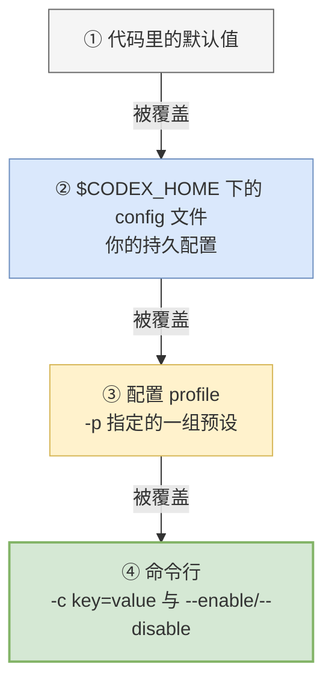
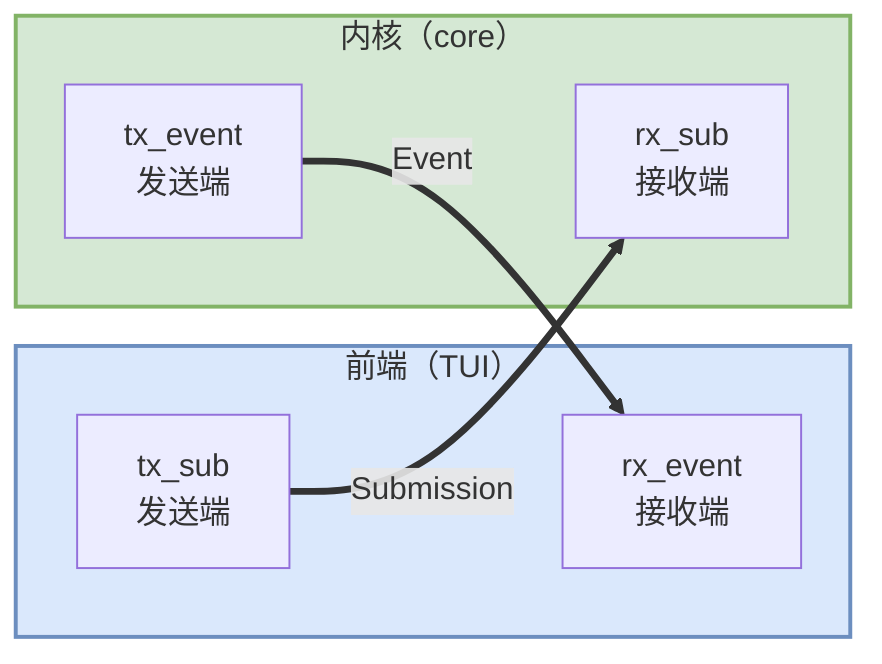
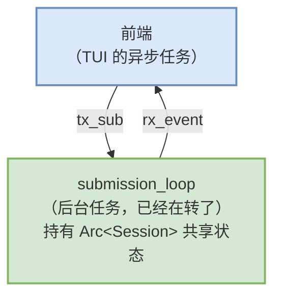

# 02 启动：从敲下命令到会话转起来

> **前置**：[01 坐标系](./01-coordinates.md)
> **配套图**：`dev_docs/diagrams/codex-01-topology.drawio.png`

本篇跟着真实代码走完启动链路。目标不是记住行号，而是**看清"一个智能体是怎么被点火的"**。

---

## 1. 起点：`fn main()`

整个程序的第一行在 `codex-rs/cli/src/main.rs:967`：

```rust
fn main() -> anyhow::Result<()> {
    let remote_control_disabled = codex_app_server::take_remote_control_disabled_env();
    arg0_dispatch_or_else(move |arg0_paths: Arg0DispatchPaths| async move {
        cli_main(arg0_paths, remote_control_disabled).await?;
        Ok(())
    })
}
```

只有 4 行。逐行拆。

### `fn main() -> anyhow::Result<()>`

返回 `Result` 而不是无返回值。Rust 的惯例：**main 可以返回错误**，出错时进程自动以非零状态码退出并打印错误链。

> **Rust 小注**：`Result<T, E>` 表示"要么成功拿到 T，要么失败拿到 E"。Rust 没有异常机制，所有可能失败的操作都通过返回值表达。

### `arg0_dispatch_or_else(...)` —— 这行有个机关

`arg0` 指的是 **argv[0]，程序自己被调用时用的那个名字**。

这里的机关是：**同一个二进制文件，用不同的名字调用，行为可以不同。**

两个真实用途：

| 用途 | 说明 |
| ---- | ---- |
| **发布产物带平台后缀** | 真实文件名是 `codex-x86_64-unknown-linux-musl`，但帮助信息必须显示 `codex`。代码里写死了 `bin_name = "codex"` 强制覆盖 |
| **沙箱 helper 复用同一个二进制** | 与其单独编译一个 helper，不如让主二进制换个名字启动时走另一条分支 |

**这是"单二进制"的第一层含义：一个文件，多重身份。**

### `move |...| async move { ... }`

这是一个**异步闭包**。翻译成 Python 大意是：

```python
async def _inner(arg0_paths):
    await cli_main(arg0_paths, remote_control_disabled)

arg0_dispatch_or_else(_inner)
```

`move` 关键字表示"把外面用到的变量**整个搬进**这个匿名函数里"。

> **这里有两个 Rust 专有词，一次讲清，后面各篇都要用：**
>
> Rust 规定**每个值在任一时刻只有一个"主人"**，这叫**所有权**。别人想用，要么**借用**（临时看一眼，用完还回去，主人不变），要么由主人**交出所有权**（东西归你了，我不能再用）。
>
> 这段代码为什么必须"搬"而不能"借"？因为这个匿名函数要被丢到后台跑，**可能比当前这个函数活得还久**——当前函数返回之后，它借的东西就没了。所以只能把东西直接给它。

> **注意 `main` 本身不是 `async fn`。** 异步运行时（tokio）是在 `arg0_dispatch_or_else` 内部才启动的。
>
> 真正建 runtime 的那几行在 `codex-rs/arg0/src/lib.rs:285`，用的是 `Builder::new_multi_thread()`。Rust 的 async 需要一个第三方运行时来驱动，不像 Python 那样内建——这是常见困惑点，[01](./01-coordinates.md) §2 补课有完整说明。

---

## 2. 解析命令行：声明式的 clap

进入 `cli_main` 之后第一件事：

```rust
let MultitoolCli {
    config_overrides: mut root_config_overrides,
    feature_toggles,
    remote,
    mut interactive,
    subcommand,
} = MultitoolCli::parse();
```

这个结构体定义在 `codex-rs/cli/src/main.rs:106`：

```rust
struct MultitoolCli {
    #[clap(flatten)]  pub config_overrides: CliConfigOverrides,
    #[clap(flatten)]  pub feature_toggles: FeatureToggles,
    #[clap(flatten)]  remote: InteractiveRemoteOptions,
    #[clap(flatten)]  interactive: TuiCli,
    #[clap(subcommand)] subcommand: Option<Subcommand>,
}
```

三个值得停下来的点。

### ① 结构体本身就是命令行的规格说明

Python 的 `argparse` 要你手写一堆 `add_argument`。Rust 这里是**反过来的**：定义一个结构体，`clap` 在编译期**自动生成**解析代码。

字段名 → 参数名，字段类型 → 参数类型，文档注释 → 帮助文本。

**这个模式值得抄。** 它消除了"参数定义"和"参数使用"两处必须同步的重复——那是所有 CLI 项目的经典 bug 源。

### ② `Option<Subcommand>` —— 那个"None 就是 TUI"

```rust
match subcommand {
    None => {
        // 没给子命令 → 进交互式 TUI
        let exit_info = run_interactive_tui(...).await?;
        handle_app_exit(exit_info)?;
    }
    Some(Subcommand::Exec(mut exec_cli)) => { ... }
    // ... 其余分支
}
```

这就是 [01](./01-coordinates.md) §7 说的：**"默认 TUI" 不是子命令，是 `Option` 为 `None` 时的分支**。枚举定义从 `codex-rs/cli/src/main.rs:124` 开始。

### ③ 全局开关在分发前就被折叠掉了

```rust
let toggle_overrides = feature_toggles.to_overrides()?;
root_config_overrides.raw_overrides.extend(toggle_overrides);
```

把 `--enable` / `--disable` 这些开关**折叠进配置覆盖列表**，让它们对所有子命令统一生效。

**这是一个很典型的设计决策**：与其让 27 个子命令各自处理全局开关，不如在分发前统一转成"配置覆盖"，下游只认配置。**一处转换，处处受益。**

---

## 3. 配置：四层叠加

在拉起会话前，配置要先装载。优先级从低到高：



### `$CODEX_HOME` 的解析规则（注意不对称）

权威实现在 `codex-rs/utils/home-dir/src/lib.rs`：

| 情形 | 行为 |
| ---- | ---- |
| `CODEX_HOME` **未设或为空** | 回落到 `~/.codex`，**不校验该目录是否存在** |
| `CODEX_HOME` **非空** | 覆盖默认值，但**要求路径已存在且是目录**，否则直接报错；命中后会 canonicalize |

**行为不对称是有意的**：你显式指定了，说明你确信它在；没指定就用默认值，第一次运行时目录还不存在很正常。

> 有一个容易误判的点：`core` 里也有一个同名的 `find_codex_home`，但它是**薄委托**——函数体只有一行，转调上面那个。两处不是重复实现。

---

## 4. 会话诞生：真正的点火时刻

配置装载完，前端要创建一个**会话（Session）**。这是整个程序里最关键的一次调用。

代码在 `codex-rs/core/src/session/mod.rs`，约 `:766-778`：

```rust
let thread_id = session.thread_id;

// This task will run until Op::Shutdown is received.
let session_for_loop = Arc::clone(&session);
let session_loop_handle = tokio::spawn(async move {
    submission_loop(session_for_loop, config, rx_sub)
        .instrument(info_span!("session_loop", thread_id = %thread_id))
        .await;
});

let io = SessionIo {
    tx_sub,
    rx_event,
    agent_status: agent_status_rx,
    session_loop_termination: session_loop_termination_from_handle(session_loop_handle),
};

Ok((session, io))
```

**这十几行是整个 codex 的点火开关。** 慢慢拆。

### `Arc::clone(&session)`

**这里没有复制任何数据**，只是多拿了一个"指向同一个 `Session` 的把手"，并把"现在有几个人拿着它"这个计数 +1。等所有把手都被丢弃、计数归零，`Session` 才真正被销毁。

**`Arc` 就是这个"可以多人共拿的把手"**，全称 atomically reference counted（可跨线程安全计数的引用）。上一节刚说过"每个值只有一个主人"——`Arc` 正是为了绕开这条限制而存在的：**主人是 `Arc` 自己，大家共同持有它**。

为什么这里需要？因为下一行要把它**搬进**一个后台任务（搬走就不能再用了），而当前函数自己还要继续用 `session`。

> **Rust 小注**：Python 里所有对象都自带这套计数，"两个地方指向同一个东西"是默认行为，你根本感觉不到。Rust 要求你显式写出来——这就是源码里满眼 `Arc<Session>`、`Arc<TurnContext>` 的原因。
>
> **`Arc::clone` 很便宜**（就是个计数 +1），**不要看到 `clone` 就以为在深拷贝一整个对象**。这是从 Python/Java 过来最容易误判性能的一处。

### `tokio::spawn(async move { ... })` ← 点火在这一行

它把 `submission_loop` 丢到后台去跑，**立即返回，不等待**。

对应 Python：

```python
task = asyncio.create_task(submission_loop(session, config, rx_sub))
```

**从这一刻起，智能体的心脏开始跳动。** 它会一直转，直到收到关闭指令或者 channel 被关闭（[04](./04-three-loops.md) 会讲这两种退出方式的区别，那里有个坑）。

### `.instrument(info_span!("session_loop", thread_id = %thread_id))`

给这个异步任务挂一个**追踪 span**，名字 `session_loop`，带上会话 ID。

实用价值：**这个任务里发生的每一条日志，都会自动带上 span 名和会话 ID**。调试多会话并发时这是救命的东西。

> **这不是可选项。** 消息驱动架构没有清晰的调用栈，如果不做结构化追踪，第一次线上问题就会让你崩溃。要抄这个架构，必须连追踪一起抄。

---

## 5. `SessionIo`：两条 channel，四个端点

这是本篇最重要的结构体，定义在 `codex-rs/core/src/session/mod.rs:393`：

```rust
pub(crate) struct SessionIo {
    pub(crate) tx_sub: Sender<Submission>,      // 进：提交
    pub(crate) rx_event: Receiver<Event>,       // 出：事件
    pub(crate) agent_status: watch::Receiver<AgentStatus>,
    pub(crate) session_loop_termination: SessionLoopTermination,
}
```

### 先说命名：`tx` 和 `rx` 是什么

来自无线电术语：**`tx` = transmit（发送端），`rx` = receive（接收端）**。

Rust 的 channel 是**成对创建**的，一次拿到两头：

```rust
let (tx, rx) = async_channel::bounded(512);   // tx 用来发，rx 用来收
```

Python 的 `asyncio.Queue` 是一个对象两头都能用；Rust 把它**拆成两个值**——这样所有权系统能保证"发送端在这里、接收端在那里"，不会有人拿着队列又发又收。

命名规则就是 **`方向_载荷`**：`tx_sub` = "发 Submission 的那一端"，`rx_event` = "收 Event 的那一端"。

> **用的是 `async_channel` 这个第三方 crate，不是 `tokio::sync::mpsc`**——虽然整个项目跑在 tokio 上。别把两者记混了，[01](./01-coordinates.md) §2 补课里有两者的差异。

### 这两条 channel 的创建：一有界、一无界

两条 channel 在同一处创建（`codex-rs/core/src/session/mod.rs:556-557`），**容量选择是不对称的**：

```rust
let (tx_sub, rx_sub) = async_channel::bounded(SUBMISSION_CHANNEL_CAPACITY); // 512
let (tx_event, rx_event) = async_channel::unbounded();
```

| 方向 | 容量 | 满了怎样 | 意图 |
| ---- | ---- | ---- | ---- |
| 前端 → 内核（`Submission`） | **有界 512** | 发送方挂起，**背压** | 前端投递再快也撑不爆内核 |
| 内核 → 前端（`Event`） | **无界** | 不会满 | **内核绝不因界面渲染慢而阻塞** |

`SUBMISSION_CHANNEL_CAPACITY` 定义在同文件 `:485`。

> **这是本篇第二个值得抄的设计**（第一个是下面的类型守边界）。做类似产品时必须提前定：**哪个方向允许阻塞对方**。定反了的症状很典型——模型明明在跑，界面整个僵住。
>
> 无界的代价是内存：前端长时间不消费，事件会堆积。codex 赌"前端总在消费"。你的前端如果可能离线（IDE 断连、网络前端），这个赌注不成立，得换"有界 + 丢弃最旧"。

### 四个端点的分布

codex 里有**两条 channel、四个端点**：



| 端点 | 谁持有 | 干什么 |
| ---- | ---- | ---- |
| `tx_sub` | **前端** | 发提交进去 |
| `rx_sub` | **内核** | 收提交 |
| `tx_event` | **内核** | 发事件出来 |
| `rx_event` | **前端** | 收事件 |

回头看 §4 那段代码，现在应该对上了：

```rust
// 内核那半：submission_loop 拿走 rx_sub
tokio::spawn(async move {
    submission_loop(session_for_loop, config, rx_sub).await;
});

// 前端那半：打包成 SessionIo 交出去
let io = SessionIo { tx_sub, rx_event, ... };
```

**`SessionIo` 就是"前端手里那两个端点"的打包。** 内核那两个端点被内部逻辑各自拿走了，前端永远碰不到。

### 这个设计最妙的地方

> **前端在类型层面上就"不可能"直接调用内核函数** —— 它手里只有一个发送端和一个接收端，除了发消息什么也干不了。

**边界不是靠约定守住的，是靠类型守住的。**

这是整份代码里最值得学的一招。文档写"请不要直接调用内核"是没用的，总有人会写；让它**编译不过**才是真的守住了。

### 另外两个字段

| 字段 | 类型 | 用途 |
| ---- | ---- | ---- |
| `agent_status` | `watch::Receiver` | 一个"当前状态"的观察窗口 |
| `session_loop_termination` | 一个可 await 的 future | "会话结束了"的信号 |

**`watch` 和普通 channel 不一样**：普通 channel 每条消息都要被消费一次；`watch` 只保留**最新值**，多个观察者可以随时读当前值。

用它传"当前状态"正合适——你不关心它中间变过多少次，只关心现在是什么。**这个类型选择很讲究，值得记住。**

---

## 6. 停下来看看我们造出了什么

到这一步，内存里的结构是：



**两个任务，一对 channel，一个共享的 Session。就这么简单。**

> ⚠️ **这张图画的是"内核对外的形状"，不是默认 TUI 的完整链路。** 上面这套 `SessionIo` 是所有前端共同的落点；默认 TUI 抵达它之前还隔着一个**进程内 app-server**（同进程、仍是内存 channel、走 JSON-RPC 消息形态）。`codex exec` 则更接近图上这个直连形态。两跳的细节见 [10](./10-frontends-and-extensions.md) §1–§2。

这个设计有三个直接后果，都很重要：

### ① 前端和内核完全解耦

内核不知道前端是终端界面、IDE 插件还是自动化脚本——它只认消息。**这就是 codex 能有 5 个长得完全不同的前端而不用改内核的根本原因。**

### ② 内核天然是异步的

前端发一个提交，不等结果，继续画界面；内核慢慢干活，边干边往外发事件。**这就是"模型还在跑的时候界面不卡"的根因。**

### ③ 调试有明确的切入点

想知道"用户干了什么"，监听 `tx_sub`；想知道"内核做了什么"，监听 `rx_event`。**不需要在 29 万行里到处埋日志。**

---

## 本篇小结

| 你现在应该能回答 | 答案 |
| ---- | ---- |
| 程序从哪一行开始？ | `codex-rs/cli/src/main.rs:967` |
| argv[0] 分发是干什么的？ | 同一个二进制，不同名字调用走不同分支 |
| 命令行参数怎么定义的？ | 定义结构体，clap 在编译期生成解析代码 |
| 配置有几层？ | 四层：默认值 < config.toml < profile < 命令行 |
| 智能体从哪一行开始转？ | `codex-rs/core/src/session/mod.rs` 里的 `tokio::spawn` |
| 会话对外有几个口子？ | 两个：`tx_sub` 进，`rx_event` 出 |
| `tx` / `rx` 什么意思？ | transmit / receive，channel 的两头 |
| 两条 channel 容量一样吗？ | **不一样**：上行有界 512（背压），下行无界（内核不被卡） |
| 用的是 tokio 的 channel 吗？ | **不是**，是 `async_channel` crate |
| 前端为什么不能直接调内核？ | 它手里只有 channel 端点，类型上就调不到 |

---

**下一篇**：[03 提交与事件：会话的对外形状](./03-protocol.md) —— 那两个口子里流的到底是什么，为什么是"一进多出"的不对称结构。
