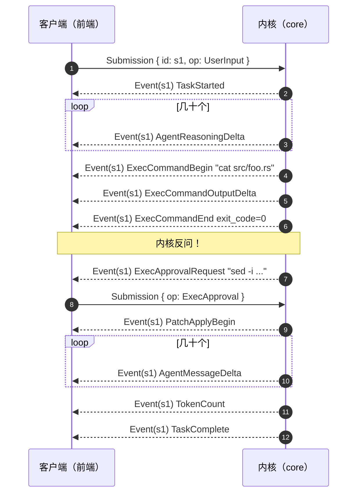

# 03 提交与事件：会话的对外形状

> **前置**：[02 启动](./02-startup.md)
> **配套图**：`dev_docs/diagrams/codex-03-agent-loop.drawio.png`（看底部那个便签）

上一篇我们知道了会话对外只有两个口子。这一篇拆开看里面流的是什么。

---

## 1. 四个类型

全部定义在 `codex-rs/protocol/src/protocol.rs`：

| 类型 | 方向 | 角色 |
| ---- | ---- | ---- |
| `Submission` | 客户端 → 内核 | 一次提交，含 `id` 与 `op` |
| `Op` | 客户端 → 内核 | 提交的动作枚举，**26 个变体** |
| `Event` | 内核 → 客户端 | 一次事件，含 `id` 与 `msg` |
| `EventMsg` | 内核 → 客户端 | 事件负载枚举，**80 个变体** |

`Op` 的枚举体从 `codex-rs/protocol/src/protocol.rs:531` 开始，`EventMsg` 从 `:1288` 开始。

**这四个类型就是 codex 内核的全部对外契约。** 把它们看完，你就知道 codex 能干什么、不能干什么了。

---

## 2. `Op`：客户端能要求内核做的 26 件事

```
Interrupt, CleanBackgroundTerminals,
RealtimeConversationStart, RealtimeConversationAudio, RealtimeConversationText,
RealtimeConversationSpeech, RealtimeConversationClose, RealtimeConversationListVoices,
UserInput, ThreadSettings, InterAgentCommunication,
ExecApproval, PatchApproval, ResolveElicitation, UserInputAnswer,
RequestPermissionsResponse, DynamicToolResponse,
RefreshMcpServers, ReloadUserConfig, Compact, SetThreadMemoryMode, ThreadRollback,
Review, ApproveGuardianDeniedAction, Shutdown, RunUserShellCommand
```

按性质分组来看，结构就清楚了：

| 组 | 变体 | 说明 |
| ---- | ---- | ---- |
| **真正的"干活"** | `UserInput`、`Review`、`RunUserShellCommand`、`Compact` | 会拉起一个任务 |
| **控制** | `Interrupt`、`Shutdown`、`ThreadRollback`、`CleanBackgroundTerminals` | 改变会话状态 |
| **应答**（内核问、客户端答） | `ExecApproval`、`PatchApproval`、`UserInputAnswer`、`ResolveElicitation`、`RequestPermissionsResponse`、`DynamicToolResponse`、`ApproveGuardianDeniedAction` | **7 个，占 27%** |
| **配置** | `ThreadSettings`、`ReloadUserConfig`、`RefreshMcpServers`、`SetThreadMemoryMode` | 运行期改设置 |
| **实时会话** | `RealtimeConversation*` 6 个 | 语音子系统 |
| **多智能体** | `InterAgentCommunication` | |

### 值得注意的一件事：应答类占了 27%

7 个变体是"内核问了个问题，客户端回答"。这揭示了一个容易被忽略的事实：

> **智能体不是单向的"你说它做"，而是双向对话。** 它会反过来问你："这条命令能跑吗？""这个补丁能写吗？""我需要额外权限，给吗？"

**做同类产品时，这部分极易被低估。** 你的 v0.1 可能只想着"用户输入 → 智能体输出"，但真正让智能体可用的恰恰是这些反问通道。

---

## 3. `EventMsg`：内核能告诉客户端的 80 件事

80 个变体不逐一列了，按性质看：

| 组 | 典型变体 | 说明 |
| ---- | ---- | ---- |
| **流式内容** | 消息增量、推理增量 | 模型每吐一段就是一个 |
| **生命周期** | turn 开始/结束、任务开始/完成 | |
| **工具执行** | 命令开始、输出增量、命令结束、补丁应用 | |
| **提问** | 请求审批、请求用户输入、请求权限 | 与 `Op` 的应答类一一对应 |
| **状态** | token 用量、上下文剩余、agent 状态 | |
| **错误与警告** | 错误、警告、流中断 | |
| **实时会话** | 5 个 | |

**`Op` 26 个 vs `EventMsg` 80 个，比例约 1:3。** 这个比例本身就说明了协议的性质——见下一节。

---

## 4. 非对称的请求-流式响应

**一次 `Submission` 可能产生任意多个 `Event`，两者靠 `id` 关联。**

你敲一句"帮我把这个函数改成异步"，回车。可能产生的事件序列：



**一次提交，上百个事件。** 这就是"非对称"的含义。

---

## 5. 为什么必须是消息，不能是函数调用

这是本篇的核心。你要让界面和内核通信，直觉上有两种做法：

**路 A：直接调函数**

```python
result = agent.run("帮我改这个函数")   # 阻塞，等它做完
print(result)
```

**路 B：发消息 + 收事件流**

```python
tx, rx = create_channel()
await tx.send(UserInput("帮我改这个函数"))    # 立即返回
async for event in rx:                        # 持续收
    render(event)
```

**codex 选了 B，而且选得非常彻底。** 四个理由，每一个单拎出来都足够说服人：

### ① 路 A 做不了流式输出

模型是一个 token 一个 token 吐的，你要边吐边显示。函数调用返回的是"最终结果"，中间过程没地方放。

塞回调函数？那就是在用最难看的方式实现 B。

### ② 路 A 做不了中断

用户按 Ctrl+C，你怎么通知一个正在阻塞的函数？

路 B 里这就是**再发一条 `Op::Interrupt` 消息**而已——它和别的消息走同一条通道，不需要任何特殊机制。

### ③ 路 A 做不了"模型跑的时候继续输入"

这是 codex 一个关键的体验：模型还在干活，你可以继续打字，它做完这轮会**直接带着你的新输入再跑一轮**，不用等一个来回。

路 A 做不到，因为你被自己的函数调用堵住了。

### ④ 路 A 换不了前端

这是最深的一条。

函数调用是**同进程**的。要接 IDE 插件（跨进程），你得把所有函数签名重新包一层 RPC。

而路 B 的消息**天生就能序列化**——`Submission` 和 `Event` 都是普通的数据结构，转成 JSON 就能跨进程、跨机器、跨语言。**跨进程只是换个传输通道的事，内核一行不用改。**

> **codex 能有 5 个前端，根本原因就在这里。**

---

## 6. 代价（要认真掂量）

消息驱动不是免费的。三项代价：

### ① 调试变难

函数调用有清晰的调用栈，出错一目了然。消息传递没有——你只能看到"发了什么消息"和"收到什么事件"，中间的因果链要靠 `id` 和日志拼。

> **codex 的应对**：每次提交自动开一个 tracing span，事件都带上会话 ID。**这是这个架构的必需配套，不是加分项。**

### ② 类型爆炸

26 + 80 = 106 个消息类型，每加一个能力就要加消息。这是实打实的样板代码。

> **codex 的应对**：用 Rust 的 enum + 穷尽匹配。**新加一个变体，所有没处理它的地方立刻编译报错**，编译器帮你保证没漏。

### ③ 时序问题

事件可能乱序、可能重复。你得设计好每个事件的幂等性。

---

## 7. 一个容易读错的细节：兜底分支不是死代码

`Op` 标了 `#[non_exhaustive]`。因此内核的 `match` 末尾有一条：

```rust
_ => false,   // Ignore unknown ops; enum is non_exhaustive to allow extensions.
```

**这不是"漏了某个变体"，也不是死代码。** 它是给**跨 crate 的外部扩展**留的兜底分支。

`#[non_exhaustive]` 的作用是：**其他 crate 匹配这个枚举时必须写兜底分支**，这样上游加新变体不算破坏性变更。代价是本 crate 内也得留一条。

> **数变体数时的一个陷阱**（真实踩过）：带结构体字段的变体跨多行。用逐行括号深度脚本统计时，如果在**更新深度之后**才判定当前行是不是变体，这些变体会被整体跳过——曾据此数出 16，与真实的 26 差了 10 个。**判定必须在更新深度之前做。**

---

## 8. 给自建项目：最小消息集

如果你要自己做一个，**不要一上来就抄 26 + 80**。那是六年演进 + 五个前端累积的结果。

### v0.1 够用的最小集

**入向（5 个）：**

| 变体 | 必要性 |
| ---- | ---- |
| `UserInput` | 核心 |
| `Interrupt` | 核心。没有它用户会疯 |
| `Shutdown` | 核心 |
| `ExecApproval` | 只要你要执行命令就必须有 |
| `Compact` | 上下文会满，早晚要 |

**出向（10 个）：**

| 变体 | 必要性 |
| ---- | ---- |
| `TaskStarted` / `TaskComplete` | 生命周期，界面靠它切状态 |
| `AgentMessageDelta` | 流式输出 |
| `AgentReasoningDelta` | 如果模型有推理过程 |
| `ExecCommandBegin` / `OutputDelta` / `End` | 命令执行三件套 |
| `ExecApprovalRequest` | 与入向的 `ExecApproval` 配对 |
| `TokenCount` | 用户要知道烧了多少 |
| `Error` | 必须有 |

**这 15 个就能跑起一个可用的编码智能体。** 剩下的按需要加。

### 弱类型语言怎么补上穷尽匹配

codex 靠 Rust 编译器保证"新加变体不会漏处理"。Python/TypeScript 没有这个，需要人工补：

| 手段 | 效果 |
| ---- | ---- |
| **一个 `handle()` 的注册表**，加变体时必须注册，否则启动时报错 | 把编译期检查换成启动期检查，**最推荐** |
| 类型检查器（mypy / pyright）的 exhaustiveness check | 有用但覆盖不全，容易被 `Any` 击穿 |
| 一个测试：遍历所有变体，断言每个都有 handler | 简单有效，值得写 |

**别指望 code review 能发现"漏处理了某个消息"。** 用机制兜住。

---

## 本篇小结

| 你现在应该能回答 | 答案 |
| ---- | ---- |
| 内核对外的契约是什么？ | 四个类型：`Submission`/`Op`/`Event`/`EventMsg` |
| 一次提交产生几个事件？ | 任意多个，靠 `id` 关联 |
| 为什么不用函数调用？ | 流式、中断、并发输入、换前端，四条都做不到 |
| 消息驱动的代价？ | 调试难、类型多、要处理时序 |
| 兜底 `_ =>` 是漏写吗？ | 不是，是 `#[non_exhaustive]` 留给外部扩展的 |
| 自己做要几个消息？ | v0.1 大约 5 入 + 10 出 |
| `Op` 里最容易被低估的是哪类？ | 应答类（7 个，27%）——智能体会反问你 |

---

**下一篇**：[04 三层循环：内核的心脏](./04-three-loops.md) —— 消息进去之后，内核里到底有几层循环在转。
