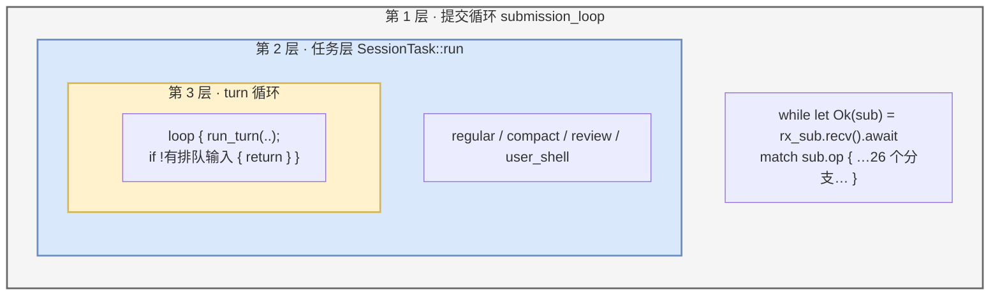
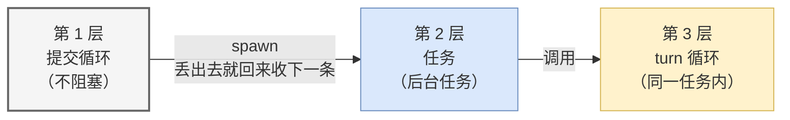

# 04 三层循环：内核的心脏

> **前置**：[03 提交与事件](./03-protocol.md)
> **配套图**：`dev_docs/diagrams/codex-03-agent-loop.drawio.png`

这是整份教程最值得花时间的一篇。

---

## 1. 全景

消息进来之后，内核里有**三层循环**在嵌套地转：



**每层回答一个问题**，这是最好用的记忆锚点：

| 层 | 问题 |
| ---- | ---- |
| 第 1 层 | **有活儿来了吗？** |
| 第 2 层 | **这是什么活儿？** |
| 第 3 层 | **这轮干完了吗？** |

---

## 2. 第 1 层：提交循环

函数签名在 `codex-rs/core/src/session/handlers.rs:714`：

```rust
pub(super) async fn submission_loop(
    sess: Arc<Session>,
    config: Arc<Config>,
    rx_sub: Receiver<Submission>,
) {
    // To break out of this loop, send Op::Shutdown.
    let mut shutdown_received = false;
    while let Ok(sub) = rx_sub.recv().await {
        let dispatch_span = submission_dispatch_span(&sub);
        let should_exit = async {
            match sub.op.clone() {
                Op::Interrupt => { interrupt(&sess).await; false }
                Op::CleanBackgroundTerminals => { /* ... */ }
                // ……26 个分支
            }
        }
        // ……
    }
}
```

### 结构就三件事

| 要素 | 说明 |
| ---- | ---- |
| `while let Ok(sub) = rx_sub.recv().await` | 从 channel 消费提交。**这就是"心跳"** |
| `match sub.op.clone()` | 按 `Op` 变体分派，26 个分支 |
| `submission_dispatch_span(&sub)` | 每次提交开一个 tracing span |

> **Rust 小注**：`while let Ok(sub) = ...` 读作"只要取到的是 `Ok`，就把里面的值绑给 `sub` 并进循环体"。channel 关闭时 `recv()` 返回 `Err`，循环自然退出——**这个细节下面就要用到**。

### 一个已验证的事实：分派是完备的

`submission_loop` 中出现的 `Op::` 名字去重后，与协议里定义的 26 个**完全相同**。即：**每个变体都有显式分支，没有遗漏也没有多余。**

这是个好信号——说明协议和实现没有漂移。

---

## 3. ⚠️ 第一个坑：退出方式不止一种

函数开头的注释写着：

```rust
// To break out of this loop, send Op::Shutdown.
```

**但这句话描述的是意图，不是全部实现。** 同一个函数在循环之后还有一段：

```rust
// If the submission loop exits because the channel closed without an
// explicit shutdown op, still run session teardown.
if !shutdown_received {
    shutdown_session_runtime(&sess).await;
    emit_thread_stop_lifecycle(sess.as_ref()).await;
    // ...
}
```

**即：channel 在发送端全部被丢弃时也会关闭，循环随之退出**，此时 `shutdown_received` 仍为 `false`，代码显式走一遍收尾。

### 这个区别对调试很关键

**会话可能在没有任何关闭指令的情况下结束**——比如客户端进程崩溃导致 `tx_sub` 被 drop。

如果你按"只有 Shutdown 能退出"去排查"会话莫名结束"，方向就错了。

> **更普遍的教训**：**源码注释是作者意图的证据，但穷尽性结论必须从控制流本身读出来。** 这是读任何代码库都适用的原则。

---

## 4. 第 2 层：任务层

收到活儿之后，包装成一个 `SessionTask` 丢到后台跑。trait 定义在 `codex-rs/core/src/tasks/mod.rs:184`：

```rust
pub(crate) trait SessionTask: Send + Sync + 'static {
    fn kind(&self) -> TaskKind;
    fn span_name(&self) -> &'static str;

    fn run(
        self: Arc<Self>,
        session: Arc<Session>,
        ctx: Arc<TurnContext>,
        input: Vec<TurnInput>,
        cancellation_token: CancellationToken,
    ) -> impl std::future::Future<Output = SessionTaskResult> + Send;

    // 另有 abort(...) 释放资源
}
```

### 两个签名细节值得注意

**① `run` 不是 `async fn`，而是显式返回 `impl Future<...> + Send`。**

手写这个而不用 `async fn` 的典型动机就是**要挂上 `+ Send` 约束**——async-fn-in-trait 默认不保证返回的 Future 是 `Send`，而这个任务要被 spawn 到多线程运行时上。实现者若写出非 `Send` 的 future 会直接编译失败。

**② 接收者是 `self: Arc<Self>`，不是 `&self`。**

任务持有自身的 `Arc`，可以在 future 内部跨 await 点存活。

> 这两点是 Rust 特有的工程细节。**如果你用别的语言，这里就是普通的接口方法**，不用纠结。

### 四种任务

| 实现 | 干什么 |
| ---- | ---- |
| `RegularTask` | 普通对话——99% 的情况，含 turn 循环 |
| `CompactTask` | 上下文压缩（见 [08](./08-context.md)） |
| `ReviewTask` | 代码评审（`codex review`） |
| `UserShellCommandTask` | 用户直接敲的 shell 命令 |

任务由会话在**后台异步任务**上执行；实现者通过 `cancellation_token` 感知中止请求并尽快终止。

---

## 5. ⚠️ 第二个坑：4 种任务 ≠ 4 个 TaskKind

**`TaskKind` 只有 3 个变体**：`Regular` / `Review` / `Compact`。

而 `UserShellCommandTask` **复用了 `TaskKind::Regular`**，只能靠 `span_name()` 在追踪里区分：

| 实现 | `kind()` | `span_name()` |
| ---- | ---- | ---- |
| `RegularTask` | `Regular` | `"session_task.turn"` |
| `CompactTask` | `Compact` | `"session_task.compact"` |
| `ReviewTask` | `Review` | `"session_task.review"` |
| `UserShellCommandTask` | **`Regular`** ← 注意 | `"session_task.user_shell"` |

> **后果**：按 `TaskKind` 分支写逻辑时，**用户 shell 任务会落进常规分支**。如果你在 fork 后要在这里加逻辑，务必注意。

### 还有一条：用户 shell 有两条路径

`Op::RunUserShellCommand` 的处理分两种情况：

- **已有活跃 turn** → **不建 task**，直接 spawn 一个挂在既有 turn 上的执行
- **没有活跃 turn** → 才走 `UserShellCommandTask`

**"一个 Op 对应一个 Task" 这个直觉在这里不成立。**

---

## 6. 第 3 层：turn 循环

这一层对应你直觉里的"一轮对话"。代码在 `codex-rs/core/src/tasks/regular.rs`：

```rust
loop {
    let last_agent_message = run_turn(
        Arc::clone(&sess),
        Arc::clone(&ctx),
        next_input,
        prewarmed_client_session.take(),
        cancellation_token.child_token(),
    )
    .instrument(run_turn_span.clone())
    .await?;

    if !sess.input_queue.has_pending_input(&sess.active_turn).await {
        return Ok(last_agent_message);
    }
    next_input = Vec::new();
}
```

### 注意最后那个回环

**这就是"模型还在跑的时候你可以继续打字"的实现原理。**

你打的字进了一个队列（`codex-rs/core/src/session/input_queue.rs`），当前这轮跑完发现队列非空，就**不返回，直接再跑一轮**。

### 一个容易读错的地方

```rust
next_input = Vec::new();   // ← 为什么置空？
```

看起来像 bug，其实不是：**后续 turn 的输入不是从这里传的**，而是由 `run_turn` 内部从输入队列自己取。`run_turn` 的签名在 `codex-rs/core/src/session/turn.rs:149`。

第一轮的输入走参数，后续轮的输入走队列——两条路径。

### `cancellation_token.child_token()`

每个 turn 拿一个**子 token**。父 token 取消时子 token 也取消，但子 token 取消不影响父的。

**这是取消语义的标准做法**：中断一个 turn 不等于中断整个任务。值得抄。

---

## 7. 为什么必须是三层

这是本篇最该带走的东西。三层各自解决一个**没法合并**的问题。

### 如果只有一层会怎样

假设你把三层压成一个循环：

```python
while sub := await queue.get():
    result = await do_everything(sub)     # 一层搞定
```

**立刻出现三个问题：**

| 问题 | 为什么 |
| ---- | ---- |
| **中断没法做** | `do_everything` 在跑的时候，下一条消息取不出来。Ctrl+C 排在队列里，等它跑完才被看到——那时已经晚了 |
| **并发输入没法做** | 同上。用户打的字要等一整轮结束才被消费 |
| **不同任务的收尾逻辑混在一起** | 压缩任务和普通对话的完成语义完全不同，全塞在一个函数里会变成一堆 if |

### 三层各自的必要性

| 层 | 不可替代的职责 |
| ---- | ---- |
| **第 1 层** | **永远在收消息**。它必须能在任务运行期间继续消费 channel，否则中断和排队输入都无从谈起 |
| **第 2 层** | **任务分类与生命周期**。不同任务有不同的完成语义、不同的中止行为、不同的 span |
| **第 3 层** | **再入**。同一个任务内多轮迭代，不需要回到第 1 层重新分派 |

**第 1 层和第 2 层之间是 spawn，不是调用**——这是关键。第 1 层把任务丢到后台就立刻回去收下一条消息了。



### 给自建项目的建议

> **三层是必要的，但你的第 2 层可以先很薄。**

v0.1 的最小结构：

```python
# 第 1 层：永远在收
async def submission_loop(rx_sub):
    while sub := await rx_sub.get():
        match sub.op:
            case UserInput(...):
                # 第 2 层：spawn，不 await
                task = asyncio.create_task(run_task(sub, cancel_token))
                active_task = task
            case Interrupt():
                active_task.cancel()      # ← 因为第 1 层没被堵住，这里才生效
            case Shutdown():
                return

# 第 2 层：先只有一种任务
async def run_task(sub, cancel_token):
    # 第 3 层
    while True:
        await run_turn(...)
        if not input_queue.has_pending():
            return
```

**关键纪律：第 1 层里绝对不能 `await` 一个长任务。** 一旦 await，中断就失效了。这是最容易犯的错。

---

## 本篇小结

| 你现在应该能回答 | 答案 |
| ---- | ---- |
| 三层各回答什么问题？ | 有活儿吗 / 什么活儿 / 这轮完了吗 |
| 第 1 层怎么退出？ | 两种：显式关闭指令，或 channel 关闭（**后者容易漏**） |
| 有几种任务？ | 4 种实现，但只有 3 个 `TaskKind`（user_shell 复用 Regular） |
| "模型跑时能继续打字"怎么实现的？ | 第 3 层的回环 + 输入队列 |
| 为什么不能压成一层？ | 中断和并发输入都会失效 |
| 第 1 层和第 2 层什么关系？ | **spawn，不是调用**。第 1 层不能被堵住 |

---

**下一篇**：[05 一个 turn 的内部](./05-inside-a-turn.md) —— 深入第 3 层，看 `run_turn` 里到底发生了什么。
