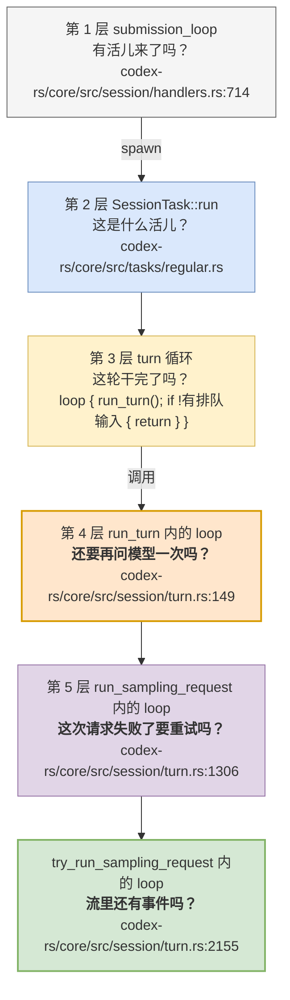
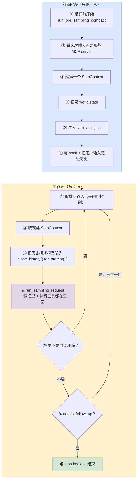
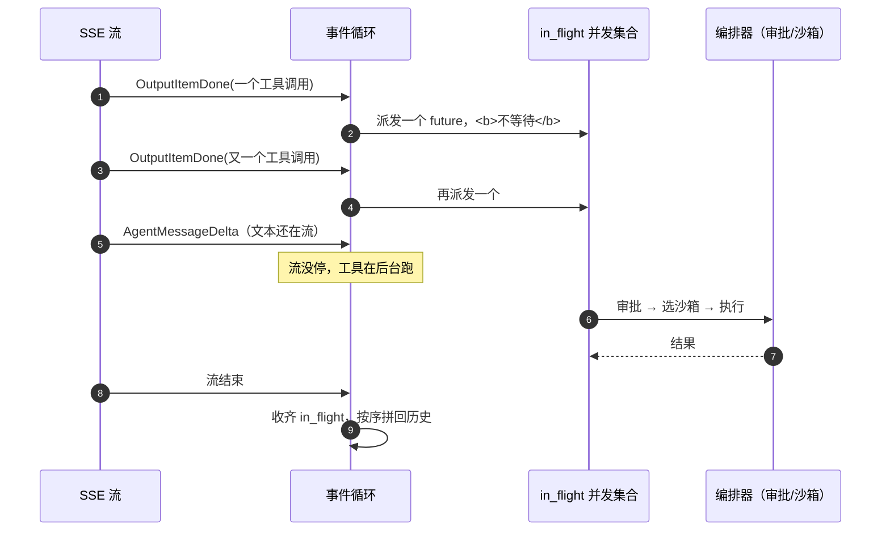
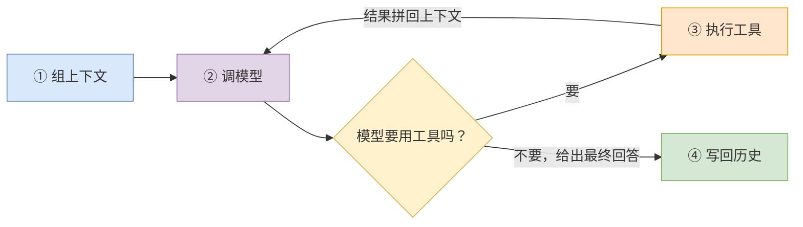

# 05 一个 turn 的内部

> **前置**：[04 三层循环](./04-three-loops.md)
> **配套图**：`dev_docs/diagrams/codex-05-session-modules.drawio.png`

---

## 0. 本篇的证据边界

> **本篇已在 2026-08-05 重写。** 上一版自述"验证程度最低、只给导航图不给结论"，因为 `run_turn` 没有被逐段追踪过。**这一版补上了**——§1 到 §4 的控制流是逐行读 `codex-rs/core/src/session/turn.rs`（2,731 行）得出的。

| 内容 | 把握程度 |
| ---- | ---- |
| `run_turn` 的前置阶段与主循环控制流 | **已读源码**（逐行） |
| 五层嵌套的调用关系与各层退出条件 | **已读源码** |
| 流式事件循环与工具并发派发 | **已读源码** |
| `session/` 的文件清单与职责归属 | **结构性描述**（按文件名与公开类型归类） |
| 各个 hook 点的具体行为 | **未追踪**（本篇只标出它们在哪里被调用） |
| 本地/远程压缩在产出内容上的差异 | **未追踪**，见 [08](./08-context.md) §5 — 本地压缩 vs 远程压缩 |

切入点：`codex-rs/core/src/session/turn.rs:149`（`run_turn`）。

---

## 1. 先纠正一个说法：不是"三层循环"，是五层

[04](./04-three-loops.md) 给的"三层循环"是**正确的抽象**——它讲清了为什么第 1 层不能被堵住。但你真要动 `run_turn` 的代码，会发现下面还有两层：



> **图里冒出来一个词：`sampling`（采样）。** 它在源码里的出现频率很高（`run_sampling_request`、`run_pre_sampling_compact`……），但它的意思和"抽样调查"那个采样没关系。
>
> **在大模型这个领域，"采样"就是"让模型生成一次内容"。** 叫这个名字是因为模型每吐一个字，本质上都是在一堆候选里**按概率抽一个出来**，一路抽到底就成了一段回答。
>
> **所以看到 `sampling` 直接读成"问模型一次"就对了**：`run_sampling_request` = "发起一次模型请求"，`run_pre_sampling_compact` = "在问模型之前先压缩一下"。本教程后面继续用"调模型"这个说法，源码里则一律是 `sampling`——**知道这两个是同一件事即可。**

**每一层的退出条件都不一样**，这是本篇最该带走的东西：

| 层 | 循环在问什么 | 退出条件 |
| ---- | ---- | ---- |
| 第 3 层 | 这轮干完了吗 | 输入队列空了 |
| **第 4 层** | **还要再问模型一次吗** | `needs_follow_up == false` 且 stop hook 不拦截 |
| **第 5 层** | **这次请求要重试吗** | 请求成功，或错误不可重试，或重试次数用尽 |
| 最内层 | 流里还有事件吗 | 收到流结束事件，或流出错 |

> **为什么第 3 层和第 4 层看起来在做同一件事？**
>
> 两层都会"看输入队列里有没有东西"。区别是：**第 4 层在一个 turn 内部把排队输入捎带上**（不重新走一遍前置阶段），**第 3 层是兜底**——第 4 层因为别的原因退出了、但队列里又有新东西时，重新起一个完整的 turn。
>
> 这是真实产品里"边界条件叠边界条件"长出来的结构，不是设计洁癖。

---

## 2. `run_turn` 的真实形状

`run_turn` 分**两段**：一段只跑一次的前置，一段反复转的主循环。



> **前置阶段那六步里有三个陌生词，先各给一句话，正文后面会再展开：**
>
> | 词 | 一句话 | 哪里细讲 |
> | ---- | ---- | ---- |
> | **world state**（世界状态） | codex 给模型准备的一份"现在的处境"快照——工作目录里有什么、改过哪些文件、当前权限是什么 | [05](./05-inside-a-turn.md) §5 |
> | **skills**（技能） | 一批预先写好的提示词包，按需要拼进这次的输入里。**它不是代码，就是文本** | [10](./10-frontends-and-extensions.md) §4 |
> | **plugins**（插件） | 可安装/卸载的能力包，能往主流程里塞工具和指令 | [10](./10-frontends-and-extensions.md) §4 |
>
> **还有一个贯穿全篇的词：`hook`（钩子）。** 它是**预留在流程固定位置上的挂载点**——"turn 开始时""turn 要结束时"这些时刻，允许挂上一段自定义逻辑，流程走到那里就顺便把它执行掉。所以下面会看到"**stop hook 可以把一个本来要结束的 turn 重新拉起来**"：那段挂上去的逻辑有权说"再来一轮"。

### ⚠️ 一个反直觉的地方：压缩在 turn **开始前**就跑一次

前置阶段第一件事是 `run_pre_sampling_compact`——**还没问模型，先看要不要压缩**。

这和直觉相反（直觉是"聊满了才压"）。原因在源码的 `TODO` 注释里写着：它想在**把新用户输入记进历史之前**就把空间腾出来，否则可能出现"记进去就超了"的情况。

> **给自建项目的启示**：压缩的触发点不止一个。至少要有"**事前**"和"**事后**"两处，只做事后的话，一条超大的用户输入就能把你顶爆。

### `needs_follow_up` 才是 turn 的真正终止条件

上一版说"turn 结束的条件是模型不再要求调用工具"。**更准确的是**：

```rust
let needs_follow_up = model_needs_follow_up || has_pending_input;
```

即两个条件**都**要满足才可能结束：

| 条件 | 含义 |
| ---- | ---- |
| `model_needs_follow_up == false` | 模型这一轮没留下待续的工具调用 |
| `has_pending_input == false` | 你没有在它跑的时候又打字 |

**然后还要过 stop hook 那一关**——hook 可以把一个本来要结束的 turn 重新拉起来（`stop_hook_active = true; continue;`）。

---

## 3. 那个"工具调用循环"到底在哪

上一版说"第 3 层里面还有一个工具调用循环，它没有独立的类型和生命周期"。**位置说错了**：它不在 `run_turn` 里，在最内层的 `try_run_sampling_request` 里，而且形状和想象的不一样。

真实情况是**流式事件循环**：

```rust
let mut stream = client_session.stream(prompt, ...).await??;

// 工具调用的 future 放这里，不阻塞流的消费
let mut in_flight: FuturesOrdered<BoxFuture<'static, CodexResult<ResponseInputItem>>>
    = FuturesOrdered::new();

let outcome = loop {
    let event = stream.next().await;       // ← 从模型的 SSE 流里取下一个事件（SSE 见下方注）
    match event {
        ResponseEvent::OutputItemDone(item) => { /* 可能派发一个工具调用 */ }
        // …其余事件类型
    }
};
```

> **`SSE` 全称 Server-Sent Events（服务端推送事件）**，是 HTTP 上一种"**服务端有一段就推一段、客户端边收边处理**"的标准做法。模型"一个字一个字往外吐"就是靠它。本篇你只要知道 `stream.next().await` 取的是"模型刚吐出来的下一小块"即可，[11](./11-model-client.md) §4 讲它怎么建立、怎么在断了之后重连。

**关键在 `in_flight`：工具调用是"派发进一个并发集合"，不是"调用完等它返回"。**

> **Rust 小注（给 Python 读者）**：`FuturesOrdered` 大致相当于 Python 的
> ```python
> tasks = []                      # 派发
> tasks.append(asyncio.create_task(run_tool(call)))
> results = await asyncio.gather(*tasks)   # 按派发顺序收集结果
> ```
> `Ordered` 的意思是**结果按派发顺序返回**（即使先跑完的是后派发的那个）。为什么要保序？因为工具结果要按模型给出的顺序拼回历史，顺序错了模型会读错。

**这解释了 [06](./06-tools.md) §3 里那个 `tool_supports_parallel`**：因为工具本来就是并发派发的，所以必须有一个开关说"这个工具不能和别人同时跑"。

### 所以"模型说要用工具"之后的完整链路是



**注意第 5 步**：工具在跑的时候，模型的文本还在往外流。**如果你把工具调用写成"发现就 await"，这个并发就没了**——界面会卡在那里等工具。

---

## 4. 一个 turn 干四件事（保留这个抽象）

上面讲的是真实控制流。但**日常沟通时**，下面这个四步抽象仍然是对的、好用的：



**什么时候用哪个：**

| 场景 | 用哪个模型 |
| ---- | ---- |
| 跟人解释"智能体怎么工作" | 上面这个四步图 |
| 自己写一个 v0.1 | 四步图 + [04](./04-three-loops.md) 的三层 |
| **要改 codex 的 `codex-rs/core/src/session/turn.rs`** | **§1 的五层 + §2 的两段式** |

**别在第一天就去背五层。** 但等你真的要在 turn 里加东西时，不知道五层就会把代码加错地方——最常见的错误是**把"每次请求都要做的事"加进了前置阶段**（只跑一次），或者反过来。

---

## 5. ① 组上下文：两个容易混淆的目录

模型看到的 prompt 不是你打的那句话，而是一大坨拼装出来的东西。codex 里有**两个名字很像但职责完全不同**的目录：

| 目录 | 职责 | 规模（顶层 / 递归） |
| ---- | ---- | ---- |
| `codex-rs/core/src/context/` | **上下文片段的构造器**——生成注入给模型的文案/指令片段 | 34 个 `.rs` + 1 个子目录 `world_state/` ／ 递归 64 个 `.rs`，5,789 行 |
| `codex-rs/core/src/context_manager/` | **历史记录的管理**——存什么、怎么归一化、怎么增量更新 | 4 个生产 `.rs` + 1 个测试 ／ 3,747 行 |

> **口径说明**（本文档体系吃过亏，见 [22](./22-load-bearing-and-cuts.md) §5 — 真正的痛点：`core` 的顶层是一片平地）：`ls` 数的是顶层条目，`find` 数的是递归文件，两者不是一回事。上表两个口径都给了。

**记法**：`context/` 是"**写**什么给模型"，`context_manager/` 是"**记**什么下来"。

### `context/` 里有什么

从文件名可以看出注入的片段种类：

| 文件 | 注入什么 |
| ---- | ---- |
| `codex-rs/core/src/context/environment_context.rs` | 环境信息（工作目录、平台、shell 之类） |
| `codex-rs/core/src/context/user_instructions.rs` | 用户指令 |
| `codex-rs/core/src/context/permissions_instructions.rs` | 当前权限状态的说明 |
| `codex-rs/core/src/context/turn_aborted.rs` | turn 被中止的说明 |
| `codex-rs/core/src/context/world_state/` | 世界状态 |

> **一个值得学的点**：`permissions_instructions.rs` 的存在说明——**权限状态是要告诉模型的**。模型需要知道自己现在能干什么，否则它会一直提议做不到的事，浪费轮次。  <!-- ref-exempt: 同段上方表格已给出该文件的仓库根相对完整路径 -->

另外还有仓库规范的注入：`codex-rs/core/src/agents_md.rs` 与 `codex-rs/core/src/agents_md_manager.rs` 负责读取并注入仓库里的规范文件（就是 `AGENTS.md` 那套）。

### `context_manager/` 的入口面非常窄

4 个生产文件（`mod.rs` / `history.rs` / `normalize.rs` / `updates.rs`）<!-- ref-exempt: 列举同一目录内的文件名，上下文已给出该目录的完整路径 -->，但 `codex-rs/core/src/context_manager/mod.rs` **全文只有 8 行**：

```rust
mod history;
mod normalize;
pub(crate) mod updates;

pub(crate) use history::ContextManager;
pub(crate) use history::estimate_item_token_count;
pub(crate) use history::is_user_turn_boundary;
pub(crate) use history::truncate_function_output_payload;
```

> **Rust 小注（给 Python 读者）**：`mod history;` 相当于"把同目录下的 `history.rs` 挂进来"<!-- ref-exempt: 讲解 Rust mod 语法，泛指任意同名文件 -->，但**默认是私有的**——外面看不见。要让外面用，必须显式 `pub(crate) use` 再导出一次。
>
> Python 里 `import` 之后模块里所有东西默认都能被外面 `from x.y import z` 拿到；Rust 是**反过来的**，默认全私有，你得一个一个放行。`pub(crate)` 意思是"只对本 crate 公开"，比 `pub`（对全世界公开）更收敛。
>
> **这就是"入口面"能被精确控制的原因**：上面这 8 行就是这个目录对外的**全部**可见符号——1 个类型 + 3 个函数 + 1 个子模块（`updates`）。

**入口窄是好事**——改动时的对外影响范围可控。你想知道"改这个目录会波及谁"，只需要 `rg 'context_manager::'` 找这 5 个名字，不用读 3,747 行。

> 第三个函数 `truncate_function_output_payload` 透露了一个实际问题：**工具输出可能非常大**（想象一下 `cargo build` 的输出）。不截断会直接把上下文冲爆。

---

## 6. ② 调模型：turn 上下文与步上下文

`session/` 里有两个层级的上下文对象：

| 类型 | 文件 | 生命周期 |
| ---- | ---- | ---- |
| `TurnContext` | `codex-rs/core/src/session/turn_context.rs` | 一个 turn |
| `StepContext` | `codex-rs/core/src/session/step_context.rs` | 一个 step（turn 内的一次模型调用） |

**这个切分本身是个设计信号**：turn 级的东西（权限档、模型配置、工作目录）在一个 turn 内不变；step 级的东西（本次调用的具体请求）每次都不同。

分开之后，`TurnContext` 可以用 `Arc` 共享，`StepContext` 每步新建——**省掉大量不必要的克隆**。

---

## 7. ③ 流式解析：两条状态机

`codex-rs/core/src/session/turn.rs` 里能看到三个状态类型：

| 类型 | 用途 |
| ---- | ---- |
| `ProposedPlanItemState` | 提议的计划项状态 |
| `PlanModeStreamState` | 计划模式的流式状态 |
| `AssistantMessageStreamParsers` | 助手消息的流式解析器 |

> **定位方式**：用 `rg 'struct PlanModeStreamState' codex-rs/core/src/session/turn.rs` 这样按符号名找，**不要依赖行号**——这些类型在文件后半段，行号漂移很快。本文档体系曾在这里把 `impl` 块的行号当成定义行号，偏了 80 行。

### 两条状态机不独立

已确认的耦合关系：

- `PlanModeStreamState` 在文件后半段被 **9 个**函数以 `&mut` 形式穿透传递
- `AssistantMessageStreamParsers::new(plan_mode)` 构造时**接收 plan_mode 作为参数**

**即：计划模式是流式解析的一个输入参数，两条状态机并非完全独立。**

> **对改造的提示**：如果你要动流式解析，计划模式那条线会跟着动。这两块要一起读。

### 为什么解析需要状态机

模型的输出是流式的，一段一段来。但一段文本可能是：

- 普通回答的一部分
- 推理过程的一部分
- 一个工具调用的 JSON 参数的一部分
- 计划模式下的一个计划项

**你必须在只看到前半截的时候就判断出它是什么。** 这就是状态机存在的原因。

---

## 8. `session/` 子系统的地图

`codex-rs/core/src/session/` 有 23 个生产文件 + 6 个测试文件 + 2 个目录。按职责分组（**这是结构性描述**，依据文件名与公开类型）：

| 组 | 文件 |
| ---- | ---- |
| **模块根与 I/O** | `codex-rs/core/src/session/mod.rs`（`Session` 构造、`SessionIo`、事件发送） |
| **会话主体** | `codex-rs/core/src/session/session.rs` |
| **循环与分派** | `codex-rs/core/src/session/handlers.rs` |
| **turn 相关** | `codex-rs/core/src/session/turn.rs`、`codex-rs/core/src/session/turn_context.rs`、`codex-rs/core/src/session/step_context.rs` |
| **上下文与预算** | `codex-rs/core/src/session/context_window.rs`、`codex-rs/core/src/session/token_budget.rs`、`codex-rs/core/src/session/rollout_budget.rs` |
| **输入** | `codex-rs/core/src/session/input_queue.rs`、`codex-rs/core/src/session/inject.rs` |
| **MCP 接入** | `codex-rs/core/src/session/mcp.rs`、`codex-rs/core/src/session/mcp_runtime.rs`、`codex-rs/core/src/session/mcp_prewarm.rs`、`codex-rs/core/src/session/mcp_refresh.rs` |
| **特殊模式** | `codex-rs/core/src/session/review.rs`、`codex-rs/core/src/session/multi_agents.rs`、`codex-rs/core/src/session/world_state.rs` |
| **恢复** | `codex-rs/core/src/session/rollout_reconstruction.rs` |
| **杂项** | `codex-rs/core/src/session/config_lock.rs`、`codex-rs/core/src/session/time_reminder.rs`、`codex-rs/core/src/session/extension_metrics.rs`、`codex-rs/core/src/session/code_mode_warning.rs` |

> ⚠️ **注意一个命名陷阱**：`token_budget.rs` / `rollout_budget.rs` 在 `session/` 下有，但 `core/src/` 根目录和 `context/` 下**还有同名文件**。它们是不同的东西。搜索时务必带完整路径。  <!-- ref-exempt: 本句正在说明这两个裸文件名有歧义，不可解析恰是要表达的事实 -->

### 星型枢纽结构

看配套图 `dev_docs/diagrams/codex-05-session-modules.drawio.png`（从源码自动抽取的真实依赖图，16 模块 / 20 边），一眼能看到：

> **`session` 和 `turn_context` 是两个星型枢纽**，几乎所有模块都连向它们。

这意味着：

| 后果 | 说明 |
| ---- | ---- |
| 改这两个文件**波及面最大** | 动它们之前先看这张图 |
| 加新功能时**很容易又往这两个文件里塞** | 这是大文件继续变大的机制 |
| 图上 20 处边交叉不是布局失败 | 是星型结构的必然结果 |

---

## 9. ④ 写回历史

turn 结束后，产生的内容要写回两个地方：

| 去处 | 用途 |
| ---- | ---- |
| **内存中的上下文历史** | 下一轮要用（`context_manager/`） |
| **磁盘上的 rollout** | 会话记录，可回放可恢复（见 [09](./09-persistence.md)） |

> **`rollout` 是 codex 自己造的一个词，不是通用术语，第一次见到很容易误解。**
>
> 它**不是**"发布上线"（rollout 的常见含义），也不是"回滚"。**在 codex 里，一个 rollout = 一次会话从头到尾的完整事件流水账，一行一条，按发生顺序落在磁盘上。**
>
> 你可以把它想成**这次会话的录像带**：你说了什么、模型回了什么、跑了哪些命令、结果是什么，全都按顺序记着。`codex resume` 能把昨天的会话接着往下聊，靠的就是把这盘带子重放一遍。存在哪、长什么样，[09](./09-persistence.md) 全篇都在讲这个。

**这两条是分开的**——内存历史会被压缩、截断、归一化（**"归一化"= 把形式各异但含义相同的记录统一改写成同一种标准形态**）；磁盘 rollout 是**完整的事实记录**，不做压缩（默认配置下）。

> **这个分离很重要，值得抄。** 如果你把"喂给模型的历史"和"存下来的记录"混成一个东西，压缩之后就再也恢复不出原始过程了。

---

## 10. ⚠️ 一个高风险改动面

**从既有 rollout 恢复会话**（`codex-rs/core/src/session/rollout_reconstruction.rs`）是仓库规范点名的高风险改动面。

原因不难理解：恢复逻辑要把**磁盘上的历史记录**重新变成**内存中的会话状态**。这个映射一旦有偏差，用户会得到一个"看起来正常但状态其实错了"的会话——**比直接崩溃更糟**。

要 fork 改造的话，这个文件建议列进禁改清单，见 [22](./22-load-bearing-and-cuts.md)。

---

## 11. 给自建项目的建议

### 该抄的

| 设计 | 为什么 |
| ---- | ---- |
| **turn 级 / step 级上下文分开** | 省克隆，也让"什么东西在一个 turn 内不变"变得显式 |
| **"写给模型的片段"和"记下来的历史"分成两个模块** | 职责完全不同，混一起会很痛 |
| **工具输出必须能截断** | 不做这个，第一次跑 `build` 就爆上下文 |
| **把权限状态告诉模型** | 否则它会反复提议做不到的事 |

### 可以先不做的

| 设计 | 理由 |
| ---- | ---- |
| 计划模式（plan mode） | 产品功能，不是架构必需 |
| 多智能体 | 同上，而且很复杂 |
| 流式解析的完整状态机 | v0.1 可以先攒完整再解析，慢但正确 |

---

## 本篇小结

| 你现在应该能回答 | 答案 |
| ---- | ---- |
| 源码里的 `sampling` 是什么？ | **就是"问模型一次"**。叫采样是因为模型逐字生成时在按概率抽取候选 |
| `hook` 是什么？ | 流程固定位置上的挂载点。**stop hook 有权把一个本要结束的 turn 重新拉起来** |
| `rollout` 是什么？ | 一次会话完整的磁盘流水账，**codex 自造词**，详见 [09](./09-persistence.md) |
| 内核到底有几层循环？ | **五层**。[04](./04-three-loops.md) 的三层是对的抽象，改 `codex-rs/core/src/session/turn.rs` 时要知道下面还有两层 |
| 一个 turn 干几件事？ | 抽象说四件：组上下文 → 调模型 → 用工具 → 写回历史 |
| turn 什么时候结束？ | `needs_follow_up == false`（模型没留待续调用 **且** 没有排队输入）**且** stop hook 不拦截 |
| 工具调用循环在哪？ | 不在 `run_turn`，在最内层的 `try_run_sampling_request`，形式是**流式事件循环 + `FuturesOrdered` 并发派发** |
| `context/` 和 `context_manager/` 什么区别？ | 前者"写什么给模型"，后者"记什么下来" |
| 为什么解析要状态机？ | 流式输出必须在只看到前半截时判断类型 |
| `session/` 里哪两个文件最危险？ | `codex-rs/core/src/session/session.rs` 和 `codex-rs/core/src/session/turn_context.rs`（星型枢纽） |
| 自动压缩发生在哪 | **turn 中间**，压完 `continue` 回同一个 turn，见 [08](./08-context.md) §2 — 压缩有两条入口 |
| 内存历史和磁盘记录是一回事吗？ | **不是**，前者会被压缩，后者是完整事实 |
| 本篇哪些内容没验证？ | 各 hook 点的具体行为（见 §0） |

---

**下一篇**：[06 工具系统](./06-tools.md) —— 模型说"跑个命令"之后，那条命令是怎么被解析、路由、执行的。
