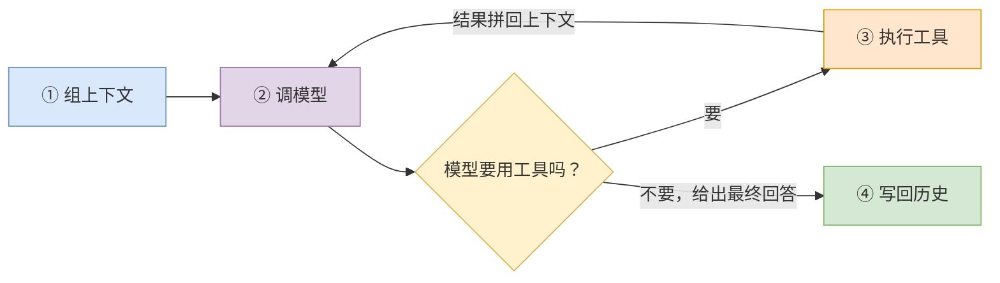

# 05 一个 turn 的内部

> **前置**：[04 三层循环](./04-three-loops.md)
> **配套图**：`dev_docs/diagrams/codex-05-session-modules.drawio.png`

---

## 0. 先说清本篇的证据边界

**这一篇是本教程中验证程度最低的一篇。** 原因：`run_turn` 内部的完整流程横跨十几个文件、几千行，本文档体系没有逐段追踪。

| 内容 | 把握程度 |
| ---- | ---- |
| turn 的输入来源、输入队列交互 | 已读源码 |
| `session/` 的文件清单与职责归属 | **结构性描述**（按文件名与公开类型归类） |
| 流式解析的状态机存在性与耦合关系 | 已读源码（类型与调用点） |
| **turn 内部的完整状态流转** | **未追踪** |
| 本地/远程压缩在产出内容上的差异 | **未追踪** |

**要做基于 codex 的改造，这一块必须自己去读。** 本篇给的是导航图，不是结论。

切入点：`codex-rs/core/src/tasks/regular.rs` 与 `codex-rs/core/src/session/turn.rs:149`。

---

## 1. 一个 turn 干四件事

抽象地说：

**注意 ③→② 那个内循环。** 一个 turn 内部，模型可能连续调用十几次工具：读文件、跑测试、改代码、再跑测试……每次工具执行完，结果拼回上下文再问模型"接下来干什么"。

**turn 结束的条件是模型不再要求调用工具**，而是给出了最终回答。

> 所以"三层循环"其实说少了——第 3 层里面还有一个"工具调用循环"。之所以不把它算作第 4 层，是因为它没有独立的类型和生命周期，就是 `run_turn` 内部的一个 loop。

---

## 2. ① 组上下文：两个容易混淆的目录

模型看到的 prompt 不是你打的那句话，而是一大坨拼装出来的东西。codex 里有**两个名字很像但职责完全不同**的目录：

| 目录 | 职责 | 规模 |
| ---- | ---- | ---- |
| `codex-rs/core/src/context/` | **上下文片段的构造器**——生成注入给模型的文案/指令片段 | 34 个条目 |
| `codex-rs/core/src/context_manager/` | **历史记录的管理**——存什么、怎么归一化、怎么增量更新 | 3 个生产文件 |

**记法**：`context/` 是"**写**什么给模型"，`context_manager/` 是"**记**什么下来"。

### `context/` 里有什么

从文件名可以看出注入的片段种类：

| 文件 | 注入什么 |
| ---- | ---- |
| `codex-rs/core/src/context/environment_context.rs` | 环境信息（工作目录、平台、shell 之类） |
| `codex-rs/core/src/context/user_instructions.rs` | 用户指令 |
| `codex-rs/core/src/context/permissions_instructions.rs` | 当前权限状态的说明 |
| `codex-rs/core/src/context/turn_aborted.rs` | turn 被中止的说明 |
| `codex-rs/core/src/context/world_state/` | 世界状态 |

> **一个值得学的点**：`permissions_instructions.rs` 的存在说明——**权限状态是要告诉模型的**。模型需要知道自己现在能干什么，否则它会一直提议做不到的事，浪费轮次。  <!-- ref-exempt: 同段上方表格已给出该文件的仓库根相对完整路径 -->

另外还有仓库规范的注入：`codex-rs/core/src/agents_md.rs` 与 `codex-rs/core/src/agents_md_manager.rs` 负责读取并注入仓库里的规范文件（就是 `AGENTS.md` 那套）。

### `context_manager/` 的入口面非常窄

整个目录只导出一个 `ContextManager`（定义在 `codex-rs/core/src/context_manager/history.rs`）加三个自由函数：

- `estimate_item_token_count`
- `is_user_turn_boundary`
- `truncate_function_output_payload`

**入口窄是好事**——改动时的对外影响范围可控。

> 第三个函数 `truncate_function_output_payload` 透露了一个实际问题：**工具输出可能非常大**（想象一下 `cargo build` 的输出）。不截断会直接把上下文冲爆。

---

## 3. ② 调模型：turn 上下文与步上下文

`session/` 里有两个层级的上下文对象：

| 类型 | 文件 | 生命周期 |
| ---- | ---- | ---- |
| `TurnContext` | `codex-rs/core/src/session/turn_context.rs` | 一个 turn |
| `StepContext` | `codex-rs/core/src/session/step_context.rs` | 一个 step（turn 内的一次模型调用） |

**这个切分本身是个设计信号**：turn 级的东西（权限档、模型配置、工作目录）在一个 turn 内不变；step 级的东西（本次调用的具体请求）每次都不同。

分开之后，`TurnContext` 可以用 `Arc` 共享，`StepContext` 每步新建——**省掉大量不必要的克隆**。

---

## 4. ③ 流式解析：两条状态机

`codex-rs/core/src/session/turn.rs` 里能看到三个状态类型：

| 类型 | 用途 |
| ---- | ---- |
| `ProposedPlanItemState` | 提议的计划项状态 |
| `PlanModeStreamState` | 计划模式的流式状态 |
| `AssistantMessageStreamParsers` | 助手消息的流式解析器 |

> **定位方式**：用 `rg 'struct PlanModeStreamState' codex-rs/core/src/session/turn.rs` 这样按符号名找，**不要依赖行号**——这些类型在文件后半段，行号漂移很快。本文档体系曾在这里把 `impl` 块的行号当成定义行号，偏了 80 行。

### 两条状态机不独立

已确认的耦合关系：

- `PlanModeStreamState` 在文件后半段被 **9 个**函数以 `&mut` 形式穿透传递
- `AssistantMessageStreamParsers::new(plan_mode)` 构造时**接收 plan_mode 作为参数**

**即：计划模式是流式解析的一个输入参数，两条状态机并非完全独立。**

> **对改造的提示**：如果你要动流式解析，计划模式那条线会跟着动。这两块要一起读。

### 为什么解析需要状态机

模型的输出是流式的，一段一段来。但一段文本可能是：

- 普通回答的一部分
- 推理过程的一部分
- 一个工具调用的 JSON 参数的一部分
- 计划模式下的一个计划项

**你必须在只看到前半截的时候就判断出它是什么。** 这就是状态机存在的原因。

---

## 5. `session/` 子系统的地图

`codex-rs/core/src/session/` 有 23 个生产文件 + 6 个测试文件 + 2 个目录。按职责分组（**这是结构性描述**，依据文件名与公开类型）：

| 组 | 文件 |
| ---- | ---- |
| **模块根与 I/O** | `codex-rs/core/src/session/mod.rs`（`Session` 构造、`SessionIo`、事件发送） |
| **会话主体** | `codex-rs/core/src/session/session.rs` |
| **循环与分派** | `codex-rs/core/src/session/handlers.rs` |
| **turn 相关** | `codex-rs/core/src/session/turn.rs`、`codex-rs/core/src/session/turn_context.rs`、`codex-rs/core/src/session/step_context.rs` |
| **上下文与预算** | `codex-rs/core/src/session/context_window.rs`、`codex-rs/core/src/session/token_budget.rs`、`codex-rs/core/src/session/rollout_budget.rs` |
| **输入** | `codex-rs/core/src/session/input_queue.rs`、`codex-rs/core/src/session/inject.rs` |
| **MCP 接入** | `codex-rs/core/src/session/mcp.rs`、`codex-rs/core/src/session/mcp_runtime.rs`、`codex-rs/core/src/session/mcp_prewarm.rs`、`codex-rs/core/src/session/mcp_refresh.rs` |
| **特殊模式** | `codex-rs/core/src/session/review.rs`、`codex-rs/core/src/session/multi_agents.rs`、`codex-rs/core/src/session/world_state.rs` |
| **恢复** | `codex-rs/core/src/session/rollout_reconstruction.rs` |
| **杂项** | `codex-rs/core/src/session/config_lock.rs`、`codex-rs/core/src/session/time_reminder.rs`、`codex-rs/core/src/session/extension_metrics.rs`、`codex-rs/core/src/session/code_mode_warning.rs` |

> ⚠️ **注意一个命名陷阱**：`token_budget.rs` / `rollout_budget.rs` 在 `session/` 下有，但 `core/src/` 根目录和 `context/` 下**还有同名文件**。它们是不同的东西。搜索时务必带完整路径。  <!-- ref-exempt: 本句正在说明这两个裸文件名有歧义，不可解析恰是要表达的事实 -->

### 星型枢纽结构

看配套图 `dev_docs/diagrams/codex-05-session-modules.drawio.png`（从源码自动抽取的真实依赖图，16 模块 / 20 边），一眼能看到：

> **`session` 和 `turn_context` 是两个星型枢纽**，几乎所有模块都连向它们。

这意味着：

| 后果 | 说明 |
| ---- | ---- |
| 改这两个文件**波及面最大** | 动它们之前先看这张图 |
| 加新功能时**很容易又往这两个文件里塞** | 这是大文件继续变大的机制 |
| 图上 20 处边交叉不是布局失败 | 是星型结构的必然结果 |

---

## 6. ④ 写回历史

turn 结束后，产生的内容要写回两个地方：

| 去处 | 用途 |
| ---- | ---- |
| **内存中的上下文历史** | 下一轮要用（`context_manager/`） |
| **磁盘上的 rollout** | 会话记录，可回放可恢复（见 [09](./09-persistence.md)） |

**这两条是分开的**——内存历史会被压缩、截断、归一化；磁盘 rollout 是**完整的事实记录**，不做压缩（默认配置下）。

> **这个分离很重要，值得抄。** 如果你把"喂给模型的历史"和"存下来的记录"混成一个东西，压缩之后就再也恢复不出原始过程了。

---

## 7. ⚠️ 一个高风险改动面

**从既有 rollout 恢复会话**（`codex-rs/core/src/session/rollout_reconstruction.rs`）是仓库规范点名的高风险改动面。

原因不难理解：恢复逻辑要把**磁盘上的历史记录**重新变成**内存中的会话状态**。这个映射一旦有偏差，用户会得到一个"看起来正常但状态其实错了"的会话——**比直接崩溃更糟**。

要 fork 改造的话，这个文件建议列进禁改清单，见 [22](./22-load-bearing-and-cuts.md)。

---

## 8. 给自建项目的建议

### 该抄的

| 设计 | 为什么 |
| ---- | ---- |
| **turn 级 / step 级上下文分开** | 省克隆，也让"什么东西在一个 turn 内不变"变得显式 |
| **"写给模型的片段"和"记下来的历史"分成两个模块** | 职责完全不同，混一起会很痛 |
| **工具输出必须能截断** | 不做这个，第一次跑 `build` 就爆上下文 |
| **把权限状态告诉模型** | 否则它会反复提议做不到的事 |

### 可以先不做的

| 设计 | 理由 |
| ---- | ---- |
| 计划模式（plan mode） | 产品功能，不是架构必需 |
| 多智能体 | 同上，而且很复杂 |
| 流式解析的完整状态机 | v0.1 可以先攒完整再解析，慢但正确 |

---

## 本篇小结

| 你现在应该能回答 | 答案 |
| ---- | ---- |
| 一个 turn 干几件事？ | 四件：组上下文 → 调模型 → 用工具 → 写回历史 |
| turn 什么时候结束？ | 模型不再要求调用工具时 |
| `context/` 和 `context_manager/` 什么区别？ | 前者"写什么给模型"，后者"记什么下来" |
| 为什么解析要状态机？ | 流式输出必须在只看到前半截时判断类型 |
| `session/` 里哪两个文件最危险？ | `codex-rs/core/src/session/session.rs` 和 `codex-rs/core/src/session/turn_context.rs`（星型枢纽） |
| 内存历史和磁盘记录是一回事吗？ | **不是**，前者会被压缩，后者是完整事实 |
| 本篇哪些内容没验证？ | turn 内部完整状态流转（见 §0） |

---

**下一篇**：[06 工具系统](./06-tools.md) —— 模型说"跑个命令"之后，那条命令是怎么被解析、路由、执行的。
