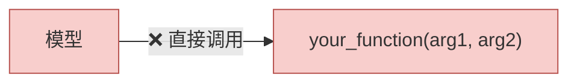
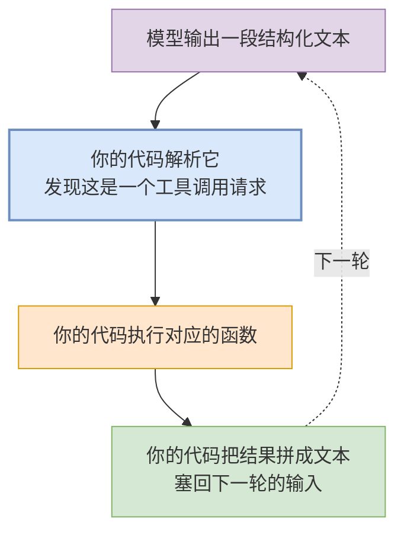
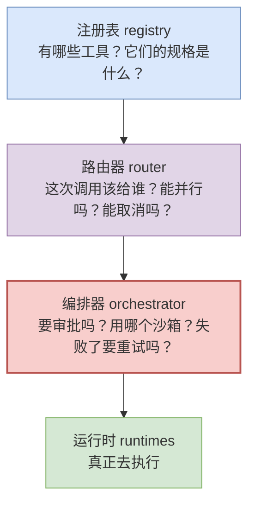
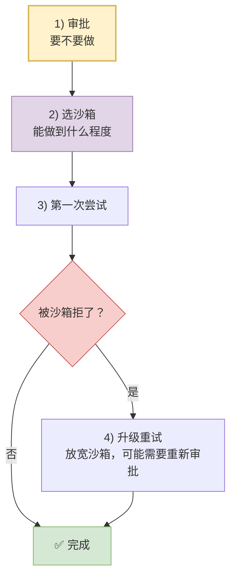

# 06 工具系统：注册、路由、编排

> **前置**：[05 一个 turn 的内部](./05-inside-a-turn.md)

工具是智能体和普通聊天机器人的唯一区别。这一篇讲 codex 怎么组织它们。

---

## 1. 先纠正一个普遍的误解

很多人以为"模型调用函数"是这样的：



**不是。** 模型只会**输出文本**。所谓"工具调用"实际是：



> **模型全程没有执行任何东西。** 它只是在"说"它想要什么。

codex 里这个解析动作有明确的入口：

```rust
// codex-rs/core/src/tools/router.rs 中的构造函数
pub fn build_tool_call(item: ResponseItem)
    -> Result<Option<ToolCall>, FunctionCallError>;
```

**从模型响应项（`ResponseItem`）里构造出 `ToolCall`。** 注意返回类型是 `Result<Option<...>>`：

- `Err` → 这是个工具调用，但格式不对
- `Ok(None)` → 这不是工具调用（是普通文本）
- `Ok(Some(call))` → 解析成功

> **这个三态返回值设计得很好，值得抄。** 很多人会把"不是工具调用"和"解析失败"混成一个 `None`，然后就丢失了报错能力。

---

## 2. 三个核心类型

| 类型 | 位置 | 角色 |
| ---- | ---- | ---- |
| `ToolCall` | `codex-rs/core/src/tools/router.rs:32` | 一次工具调用的载体 |
| `ToolRouter` | `codex-rs/core/src/tools/router.rs:68` | 路由与分发 |
| `ToolRegistry` | `codex-rs/core/src/tools/registry.rs:252` | 工具注册表 |

**分工很清晰：**



> 编排器画成红色是因为**它是所有工具的必经之路**，审批和沙箱都在这一层——见 [§8](#8-给自建项目的最小结构)。

**四层。** 这个切分是本篇最该带走的东西，[§8](#8-给自建项目的最小结构) 会说为什么。

---

## 3. 路由器的公开能力

```rust
// 从模型响应项构造工具调用
pub fn build_tool_call(item: ResponseItem) -> Result<Option<ToolCall>, FunctionCallError>;

// 分发（异步）
pub async fn dispatch_tool_call_with_code_mode_result(...);

// 该工具是否支持并行
pub fn tool_supports_parallel(&self, call: &ToolCall) -> bool;

// 该工具是否需要等待运行时取消
pub fn tool_waits_for_runtime_cancellation(&self, call: &ToolCall) -> bool;
```

从这四个签名能确认三件事：

### ① 工具调用是**解析**出来的

见 §1。

### ② 存在**并行执行**能力

`tool_supports_parallel` + `codex-rs/core/src/tools/parallel.rs`。

**但并行是按工具区分的**，不是全局开关。原因显而易见：读文件可以并行，写文件不行；跑两个 `cargo build` 会打架。

### ③ 取消语义按工具不同

`tool_waits_for_runtime_cancellation` 说明：**有些工具取消后要等它自己收尾，有些可以直接扔掉。**

> 想想一个长驻的 shell 进程 vs 一次 `cat` —— 前者必须等它清理，后者杀了就杀了。**这个区分做得很细，是被真实问题逼出来的。**

---

## 4. 23 个内置处理器（下表 19 行，其中 4 行各含多个模块）<!-- no-count-check -->

`codex-rs/core/src/tools/handlers/` 下的模块：

| 模块 | 工具用途 |
| ---- | ---- |
| `shell` | shell 命令执行 |
| `apply_patch` | 应用结构化补丁 |
| `unified_exec` | **长驻进程式执行**（可以持续写 stdin） |
| `view_image` | 查看图片 |
| `plan` | 计划 |
| `current_time` | 当前时间 |
| `sleep` | 休眠 |
| `mcp` / `mcp_resource` | MCP 工具与资源 |
| `tool_search` | 工具搜索 |
| `request_user_input` | **反问用户** |
| `request_permissions` | **请求额外权限** |
| `request_plugin_install` / `list_available_plugins_to_install` | 插件安装 |
| `get_context_remaining` | 查询剩余上下文 |
| `new_context_window` | 新建上下文窗口 |
| `wait_for_environment` | 等待环境就绪 |
| `multi_agents` / `multi_agents_v2` / `multi_agents_common` | 多智能体协作 |
| `extension_tools` | 扩展提供的工具 |
| `dynamic` | 动态工具 |
| `test_sync` | 测试用途 |

### 几个值得单独说的

**`request_user_input` 和 `request_permissions`** —— 这两个是"**模型主动向人要东西**"的工具。它们对应 [03](./03-protocol.md) 里那 7 个应答类 `Op`。

> **这个设计很关键**：模型卡住时不是瞎猜，而是**有一个正式的渠道问你**。做同类产品时容易漏掉。

**`get_context_remaining` 和 `new_context_window`** —— **模型能感知并管理自己的上下文预算**。它知道自己快没空间了，可以主动请求压缩。

**`unified_exec`** —— 长驻进程执行，配套 `ExecCommandHandler` 和 `WriteStdinHandler`。这是为了支持交互式命令（比如一个 REPL、一个需要输入的安装程序）。

---

## 5. 三类工具：不是所有工具都在 handlers 里

这是个容易误判的地方。**工具表 ≠ 全部工具。**

工具规格枚举定义在 `codex-rs/tools/src/tool_spec.rs`（**注意不在 protocol crate**）：

```rust
pub enum ToolSpec {
    Function(ResponsesApiTool),      // 普通函数工具 —— 有本地 handler
    Namespace(ResponsesApiNamespace),
    ToolSearch { .. },
    WebSearch { .. },                // ← 由模型服务端执行！
    Freeform(FreeformTool),
}
```

### 三类的判别方法

| 类型 | 判别 | 谁执行 |
| ---- | ---- | ---- |
| **本地 handler** | 在 `codex-rs/core/src/tools/handlers/mod.rs` 里能 grep 到 | 你的进程 |
| **托管工具** | 在 `codex-rs/tools/src/tool_spec.rs` 里有、handlers 里没有 | **模型服务端** |
| **扩展 / MCP 提供** | 两处都没有，但出现在响应项里 | 扩展或外部 MCP server |

**`WebSearch` 就是托管工具的例子**——它序列化成 `{"type": "web_search"}` 发给模型服务，**服务端自己搜完把结果一起返回**。codex 侧只负责：按配置决定是否下发这个规格、以及回读结果。

> **这是一个重要的架构认知**：有些"工具"根本不在你这边执行。做产品选型时要知道，某些能力是模型服务商提供的，换 provider 就没了。

**图片生成走的是第三条路**——它不是 `ToolSpec` 的变体，而是通过**扩展**注入的。

> ⚠️ 上面三类是**快速定位用的启发式，不是穷举分类**。动态工具和运行期注册的规格都可能落在三类之外。遇到对不上号的工具名，回到 `codex-rs/core/src/tools/registry.rs` 追注册路径。

---

## 6. ⚠️ 一个被写错过的结论：并非每个工具都有 spec

本文档体系曾写过"多数 handler 有配套的 `*_spec.rs` 与 `*_tests.rs`"。**实测不成立**：

| 口径 | 数量 |
| ---- | ---: |
| handler 模块总数 | 23 |
| 有 `*_spec.rs` 的 | **13**（57%） |
| 有 `*_tests.rs` 的 | **7**（30%） |
| 三件套齐全的 | **6** |

**`*_spec.rs` 只在工具需要向模型下发 JSON Schema 时才出现。** 规格在运行期动态构造的工具就没有这个文件。

以下 10 个模块**没有** `*_spec.rs`：`current_time`、`dynamic`、`extension_tools`、`mcp`、`multi_agents_common`、`multi_agents_v2`、`request_permissions`、`sleep`、`unified_exec`、`wait_for_environment`。

> **对改造的提示**：新增工具时按需要决定是否配 spec，**不要把"三件套"当成硬性规范**。

---

## 7. 编排器：审批 → 沙箱 → 执行 → 重试

`codex-rs/core/src/tools/orchestrator.rs` 的模块头注释直接写明了流程：

> "Central place for approvals + sandbox selection + retry semantics. Drives a simple sequence for any ToolRuntime: **approval → select sandbox → attempt → retry with an escalated sandbox strategy on denial (no re-approval thanks to caching)**."

即：



**顺序很关键，别记反：审批在前，沙箱在后。** 详见 [07 安全模型](./07-security.md)。

### 编排器周边的文件

| 文件 | 职责 |
| ---- | ---- |
| `codex-rs/core/src/tools/lifecycle.rs` | 生命周期 |
| `codex-rs/core/src/tools/parallel.rs` | 并行执行 |
| `codex-rs/core/src/tools/approvals.rs` | 审批 |
| `codex-rs/core/src/tools/sandboxing.rs` | 沙箱决策 |
| `codex-rs/core/src/tools/network_approval.rs` | 网络访问审批 |
| `codex-rs/core/src/tools/executed_tool_calls.rs` | 已执行调用的记录 |
| `codex-rs/core/src/tools/tool_dispatch_trace.rs` | 分发追踪 |

### 工具运行时

真正执行的地方在 `codex-rs/core/src/tools/runtimes/`：

| 运行时 | 说明 |
| ---- | ---- |
| shell | `codex-rs/core/src/tools/runtimes/shell.rs` + 子目录 |
| apply_patch | `codex-rs/core/src/tools/runtimes/apply_patch.rs` |
| unified_exec | `codex-rs/core/src/tools/runtimes/unified_exec.rs` |

> 有个细节：`codex-rs/core/src/tools/handlers/apply_patch.lark` 是一个 **Lark 语法文件**——补丁格式有形式化文法定义，不是拿正则硬凑的。
>
> ⚠️ **但它的用途容易读反**：这份文法**不是本地解析器读的，是随工具规格发给模型的**，用于语法约束解码（本地另有一个 661 行的手写解析器）。完整说明见 [13](./13-patch-and-exec-policy.md) §1 — 先纠正一个误读：那份 `.lark` 文法不是给你的解析器用的。

---

## 8. 给自建项目的最小结构

### 四层切分是必要的

即使你只有 3 个工具，也建议保持这四层：

```python
# 1. 注册表：有哪些工具
REGISTRY = {
    "shell": ToolDef(spec=SHELL_SCHEMA, handler=shell_handler, parallel=False),
    "read_file": ToolDef(spec=READ_SCHEMA, handler=read_handler, parallel=True),
}

# 2. 路由：解析 + 分发
def build_tool_call(item) -> ToolCall | None: ...

# 3. 编排：审批/沙箱/重试  ← 单独一层，别塞进 handler
async def orchestrate(call): 
    if not await approve(call): return Denied
    result = await attempt(call, sandbox=select(call))
    if result.sandbox_denied: return await retry_escalated(call)
    return result

# 4. 运行时：真正执行
async def shell_handler(args): ...
```

**为什么编排必须单独一层？**

因为审批和沙箱逻辑**对所有工具都一样**。如果塞进每个 handler，你会：

- 在 5 个 handler 里重复写审批逻辑
- 第 6 个 handler 的作者忘了写，**安全漏洞就出现了**

> **这是最容易犯的架构错误之一**：把横切关注点（cross-cutting concern）分散到各个实现里。**审批和沙箱必须在一个所有工具都必经的地方。**

### 优先级建议

| 阶段 | 工具 |
| ---- | ---- |
| **v0.1 必须有** | `shell`（执行命令）、`apply_patch` 或等价的写文件 |
| **v0.2 强烈建议** | `request_user_input`（让模型能反问）、上下文查询 |
| **可以很后面** | 并行执行、长驻进程、多智能体、插件 |

### 一个容易漏的设计

> **工具输出必须能截断，且要告诉模型"我截断了"。**

不截断 → 上下文爆炸。截断了不说 → 模型基于残缺信息做决定，还以为自己看全了。

codex 有专门的 `truncate_function_output_payload` 函数处理这件事（见 [05](./05-inside-a-turn.md) §5 — ① 组上下文：两个容易混淆的目录）。

---

## 本篇小结

| 你现在应该能回答 | 答案 |
| ---- | ---- |
| 模型会直接调用函数吗？ | **不会**。它只输出文本，由你解析 |
| 工具系统分几层？ | 四层：注册表 → 路由 → 编排 → 运行时 |
| 为什么并行是按工具区分的？ | 读可并行，写会打架 |
| 所有工具都在本地执行吗？ | 不是。有托管工具（模型服务端执行）和扩展/MCP 提供的 |
| 每个 handler 都有 spec 吗？ | **不是**，只有 57%。规格动态构造的就没有 |
| 编排的顺序？ | 审批 → 选沙箱 → 尝试 → 升级重试 |
| 审批逻辑该放哪？ | **单独一层，所有工具必经**。不能分散到 handler |

---

**下一篇**：[07 安全：审批与沙箱两道防线](./07-security.md) —— 智能体到底能对你的电脑做什么。
