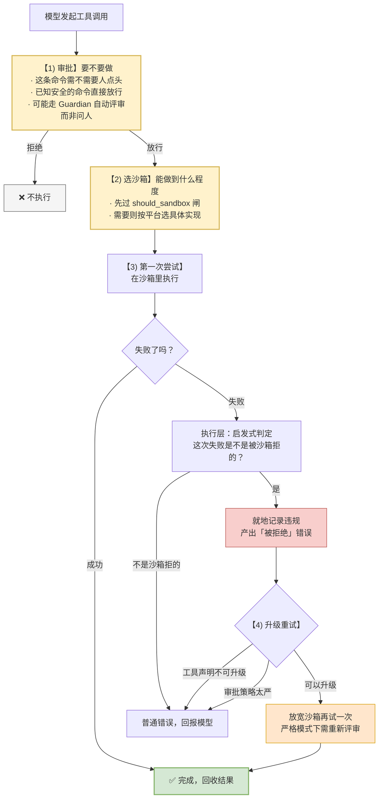

# 07 安全：审批与沙箱两道防线

> **前置**：[06 工具系统](./06-tools.md)
> **配套图**：`dev_docs/diagrams/codex-04-security.drawio.png`

这是 codex 最该被理解、也最容易被误解的部分。

---

## 0. 先记住一句话

> **沙箱解决"能做到什么程度"，审批解决"要不要做"。两件事，两道关，缺一不可。**

很多人以为有沙箱就够了。不够——沙箱不知道你的意图。`rm -rf build/` 和 `rm -rf ~/` 在沙箱看来可能都在可写范围内，但一个是正常操作，一个是灾难。

反过来，只有审批也不够——人会疲劳，点了 20 次"允许"之后第 21 次就闭着眼点了。

---

## 1. 完整流程

模型说"我要跑 `rm -rf build/`"之后：



**这个次序是源码注释里直接写明的**，不是推断出来的。

### "重试不再打扰用户"有例外

编排器的注释说"no re-approval thanks to caching"——审批结果被缓存，重试不再问人。

**但有一个例外**：**去掉沙箱的重试，在严格自动评审模式下必须重新评审。**

> 这个例外很合理：第一次审批是基于"它会在沙箱里跑"的前提给的。前提变了，授权就该重新拿。**这个细节值得抄。**

---

## 2. 四种沙箱类型

```rust
pub enum SandboxType {
    None,
    MacosSeatbelt,
    LinuxSeccomp,
    WindowsRestrictedToken,
}
```

平台选择逻辑（`codex-rs/sandboxing/src/manager.rs`）：

```rust
pub fn get_platform_sandbox(windows_sandbox_enabled: bool) -> Option<SandboxType> {
    if cfg!(target_os = "macos")   { Some(SandboxType::MacosSeatbelt) }
    else if cfg!(target_os = "linux") { Some(SandboxType::LinuxSeccomp) }
    else if cfg!(target_os = "windows") {
        if windows_sandbox_enabled { Some(SandboxType::WindowsRestrictedToken) }
        else { None }
    }
    else { None }
}
```

| 平台 | 结果 |
| ---- | ---- |
| macOS | `MacosSeatbelt` |
| Linux | `LinuxSeccomp` |
| **Windows** | `WindowsRestrictedToken` **或 `None`——默认 `None`** |
| 其他 | `None` |

---

## 3. ⚠️ 必须记住的例外：Windows 默认无沙箱

**这是全篇唯一一个你必须背下来的事实。**

三层默认互相印证，全部指向"关"：

1. 沙箱级别枚举的默认变体是 `Disabled`
2. 未配置时，配置装载走 `Disabled` 分支
3. 传给平台选择函数的实参是"级别 != Disabled"——`Disabled` 直接落到 `None`

另外两个相关的实验性 feature 都已标记为 `Removed` 且默认关闭。

**要在 Windows 上拿到沙箱，必须显式配置。**

---

## 4. ⚠️ 一个容易读错的地方：平台判断不是入口

**不要把 §2 那张表读成"macOS/Linux 一定有沙箱"。**

`get_platform_sandbox` 只回答"本平台**能提供**哪种沙箱实现"，它不是入口。真正的入口先过一道闸：

```rust
pub fn select_initial(&self, permission_profile, pref, ...) -> SandboxType {
    if self.should_sandbox(permission_profile, pref, ...) {
        get_platform_sandbox(...).unwrap_or(SandboxType::None)
    } else {
        SandboxType::None          // ← 根本不问平台
    }
}
```

**准确的说法是：三平台都先过 `should_sandbox` 这道闸；Windows 那个开关是过闸之后的第二道条件。**

### 沙箱偏好有三档

```rust
pub enum SandboxablePreference { Auto, Require, Forbid }
```

| 取值 | 行为 |
| ---- | ---- |
| `Forbid` | 直接不沙箱 |
| `Require` | 直接要沙箱 |
| `Auto` | 按文件系统与网络策略判定 |

**调用方可以强制要求或强制禁止，而不只是"能用就用"。** 这个三态设计比布尔开关好，值得抄。

---

## 5. 三平台的具体实现

### macOS：Seatbelt

通过 `include_str!` 在**编译期**内嵌三份 `.sbpl` 策略文件，按条件拼接：

| 策略段 | 何时进入拼接 |
| ---- | ---- |
| 基础策略 | **恒含**，永远是第一段 |
| 网络策略 | **条件叠加**：只在网络被放行时才加。网络被拒时这段是空字符串 |
| 受限只读平台默认 | **条件追加**：满足特定权限组合时才 push 到末尾 |

中间还夹着按权限档动态生成的 read / write / deny-read 段。

> **不要读成"固定两份拼在一起"**——三段各有各的入场条件。

> **网络访问是叠加上去的独立维度**，与"默认不给网络"的设计一致。

### Linux：bwrap + seccomp

| 机制 | 管什么 |
| ---- | ---- |
| **bubblewrap（bwrap）** | 文件系统隔离 —— **默认路径** |
| **seccomp** | 系统调用过滤 |
| **`no_new_privs`** | 禁止提权 |

bwrap 二进制是**仓库内 vendored 的 bubblewrap C 源码**编译出来的，随 Linux 发布包一起分发。

> ⚠️ **一个被写错过三次的地方**：Landlock **不是**主路径。它的模块文档开宗明义："Filesystem restrictions are enforced by bubblewrap"，Landlock helpers "remain available here as legacy/backup utilities"。
>
> 而且**不存在"失败回退到 Landlock"**——默认路径的注释明确写着 "This path **never falls back** to legacy Landlock on failure."
>
> **正确心智模型：Linux = bwrap 管文件系统 + seccomp 管系统调用 + `no_new_privs`；Landlock 是待删除的 legacy 开关。**

### Windows：受限令牌

`codex-rs/sandboxing/src/windows.rs` + 一个独立的 `codex-windows-sandbox` crate（19,173 行）。

**默认不启用**，见 §3。

---

## 6. 权限模型：两个正交维度

运行时真正流转的类型是 `PermissionProfile`（`codex-rs/protocol/src/models.rs:316`）：

```rust
pub enum PermissionProfile {
    /// Codex owns sandbox construction for this profile.
    Managed { file_system: ManagedFileSystemPermissions, network: NetworkSandboxPolicy },
    /// Do not apply an outer sandbox.
    Disabled,
    /// Filesystem isolation is enforced by an external caller.
    External { network: NetworkSandboxPolicy },
}
```

### 关键设计：权限拆成两个正交维度

**文件系统** 和 **网络** 是分开的。转成运行时权限时返回的是一个二元组。

这个拆分为什么重要？因为真实需求确实是正交的：

| 场景 | 文件系统 | 网络 |
| ---- | ---- | ---- |
| 跑单元测试 | 可写项目目录 | **禁止** |
| `npm install` | 可写 node_modules | **需要** |
| 只读分析代码 | 只读 | 禁止 |

**如果你用一个"安全等级"的一维滑块，这三种情况就表达不了。**

### 三个变体各自的含义

| 变体 | 谁负责隔离 |
| ---- | ---- |
| `Managed` | **codex 自己**构造沙箱 |
| `Disabled` | 不加外层沙箱 |
| `External` | **外部调用方**已经做了文件系统隔离（比如整个 codex 就跑在容器里） |

> `External` 这个变体很有价值：它承认"有人已经帮我隔离了"这个现实。做产品时如果不留这个口子，用户在 Docker 里跑你的工具时会遇到双层沙箱的麻烦。

### 策略的合成：并集与交集

有一个专门的模块负责把多来源的权限声明合成为一个 profile，公开函数包括：

| 函数 | 用途 |
| ---- | ---- |
| `merge_permission_profiles` | **并集**合成（放宽） |
| `intersect_permission_profiles` | **交集**合成（收紧） |
| `effective_permission_profile` | 求有效 profile |

工具侧同时导入了这两个——**说明"附加权限"请求既有放宽路径也有收紧路径**。

---

## 7. 违规检测：判定与记录分离

有一套完整的违规记录机制：违规事件类型、文件系统违规及原因、网络违规、以及三个记录函数。

另有一个启发式函数 `is_likely_sandbox_denied`——**判断某次失败是否由沙箱拒绝导致**。

### 一个值得抄的分工

该函数的文档注释把分工写死了：

> "This predicate is intentionally side-effect free. **Callers that handle a denial should record it where the relevant audit context is available.**"

即：**判定是纯函数，记录由各自持有审计上下文的调用方完成。**

> **为什么这么分？** 因为"是不是沙箱拒的"是个通用判断，而"记录什么审计信息"高度依赖上下文——命令执行、补丁应用、网络访问各自要记的东西完全不同。
>
> 硬把记录塞进判定函数，就得给它传一大堆上下文参数，或者记出一堆没用的日志。

> ⚠️ 本文档体系曾把这两件事都画进编排器，且次序颠倒。**实际上两者都在执行层，发生在失败的那次尝试内部**，作用是*生产*出"被拒绝"错误；记录发生在重试**之前**，不是流程末尾。

---

## 8. 🚨 绝对红线

> **禁止新增或修改任何与沙箱相关的那两个环境变量（`CODEX_SANDBOX_NETWORK_DISABLED_ENV_VAR`、`CODEX_SANDBOX_ENV_VAR`）的代码。**

这条写在仓库最高优先级规范的顶部。

**为什么这么严？** 这两个环境变量是沙箱**内外的判别信号**——代码用它们判断"我是不是已经在沙箱里了"。改动可能导致**沙箱被静默绕过**：不报错、不崩溃，只是保护没了。

**你 fork 之后这条依然适用**，因为风险是技术性的，不是政治性的。把它写进你自己的团队规范。

> 本教程也不复述这两个变量的取值与判定逻辑。

---

## 9. 给自建项目的建议

### 必须有的最低配置

即使是 v0.1，这两条不能省：

| 要求 | 为什么 |
| ---- | ---- |
| **审批必须在一个所有工具必经的地方** | 见 [06](./06-tools.md) §8。分散到 handler 里，第一个忘写的人就是漏洞 |
| **文件系统和网络必须分开控制** | 一维滑块表达不了真实需求 |

### 沙箱的现实建议

**沙箱是整个项目里最难抄的部分**，也是最耗时的。给一个务实的路径：

| 阶段 | 做法 |
| ---- | ---- |
| **v0.1** | **只做一个平台**。macOS 用 `sandbox-exec`，Linux 用 bubblewrap。别想着一次做三个 |
| **v0.2** | 加第二个平台 |
| **可以推很后** | Windows。它的机制和 Unix 完全不同，工作量单独算 |

**如果你的产品跑在服务器/容器里**，还有一条捷径：

> 用 `External` 那个思路——**承认外层已经隔离了**，你只管网络策略。这能省掉 90% 的沙箱工作量。

代价是你不能在用户的开发机上裸跑。**这是个真实的取舍，取决于你的部署形态。**

### 一个容易被忽略的点

> **把权限状态告诉模型。**

codex 有专门的上下文片段构造器注入当前权限说明（见 [05](./05-inside-a-turn.md) §5 — ① 组上下文：两个容易混淆的目录）。

不这么做的话，模型会一直提议它做不到的事——每次都被拒，浪费轮次，用户体验极差。

---

## 本篇小结

| 你现在应该能回答 | 答案 |
| ---- | ---- |
| 两道防线各管什么？ | 审批管"要不要做"，沙箱管"能做到什么程度" |
| 顺序？ | **审批在前，沙箱在后**，失败后升级重试 |
| Windows 默认有沙箱吗？ | **没有**。必须显式配置 |
| Linux 主要靠什么？ | bwrap 管文件系统 + seccomp 管系统调用。**不是 Landlock** |
| 权限有几个维度？ | 两个正交维度：文件系统、网络 |
| 违规判定和记录为什么分开？ | 判定通用，记录依赖上下文 |
| 自己做该从哪开始？ | **一个平台**。或者干脆依赖容器隔离 |

---

**下一篇**：[08 上下文管理与压缩](./08-context.md) —— 聊了两小时为什么还没爆。
