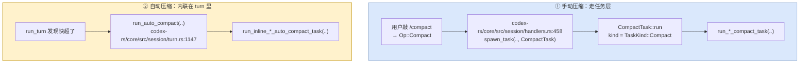
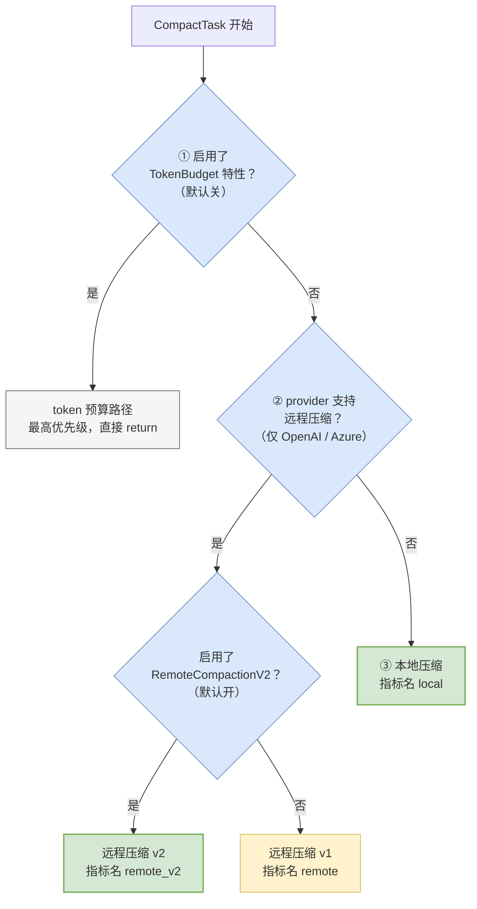

# 08 上下文管理与压缩

> **前置**：[05 一个 turn 的内部](./05-inside-a-turn.md)

---

## 1. 问题是什么

> **本篇有两个词几乎每段都出现，先花三十秒定下来。**
>
> **`token`（词元）**：模型不是按字符、也不是按单词读文本的，而是先把文本切成一个个小片段，每个片段叫一个 token。**粗略的换算：英文大约 4 个字符 ≈ 1 个 token，中文大约 1 个汉字 ≈ 1～2 个 token。** 本教程不译这个词——业界一律说 token，而且**模型按 token 计费、按 token 限长**，它是这个领域事实上的计量单位。
>
> **`上下文窗口`（context window）**：**模型一次能"看见"的 token 总量上限**。注意它是一个**硬性上限**，不是性能建议——多一个 token 都不行，超了就是直接报错。而且这个额度是**输入和输出共用**的：系统提示、全部历史对话、工具输出、以及模型这次要生成的内容，全都挤在同一个窗口里。
>
> **本篇整篇讲的就是一件事：这个窗口装不下了怎么办。**

模型的上下文窗口是有限的。而一次真实的编码任务会产生大量内容：

| 消耗来源 | 典型体量 |
| ---- | ---- |
| 系统提示 + 仓库规范 + 环境信息 | 固定几千 token |
| 你和模型的对话 | 每轮几百到几千 |
| **工具输出** | **最大的变量**——一次 `cargo build` 失败可能几万 token |
| 模型的推理过程 | 每轮可能上千 |

**跑十几轮就会撞墙。** 撞墙之后有三种做法：

| 做法 | 后果 |
| ---- | ---- |
| 直接报错 | 用户体验最差 |
| 从头截断 | 丢失关键信息（比如最初的任务描述） |
| **压缩** | 保留要点，丢弃细节 |

codex 选第三种。

---

## 2. ⚠️ 压缩有**两条**入口：手动是任务，自动是内联函数

> **本节已重写。** 上一版写的是「压缩是一种任务，不是一个函数」。**这只说对了一半**——手动压缩确实是任务，但**自动压缩是 `run_turn` 内部直接调的函数**，不经过任务层。两条路走的代码不一样。



**函数名里就写着这件事**：每个压缩实现都同时导出两个入口——

| 入口 | 谁调 | 例子 |
| ---- | ---- | ---- |
| `run_*_compact_task` | 任务层 | 例如 `codex-rs/core/src/compact.rs` 里的 `run_compact_task` |
| `run_inline_*_auto_compact_task` | turn 内联 | 例如 `codex-rs/core/src/compact.rs:112` 里的 `run_inline_auto_compact_task` |

连指标都区分：`emit_compact_metric(.., /*manual*/ true)` vs `/*manual*/ false`。

### 为什么自动压缩不能做成任务

这是本节真正的知识点。

**因为自动压缩发生在一个 turn 的中间，压完还要接着跑同一个 turn。**

任务是平级的——起一个 `CompactTask` 意味着当前 turn 结束了。但自动压缩的场景是："模型刚说完要调一个工具，但上下文满了" —— 你压完之后必须**回到原来那个 turn 继续**，把工具调用做完。

看 `run_turn` 里的写法就明白了（见 [05](./05-inside-a-turn.md) §2 — `run_turn` 的真实形状）：

```rust
if should_roll_over {
    run_auto_compact(...).await?;   // 内联压缩
    can_drain_pending_input = !model_needs_follow_up;
    continue;                        // ← 回到主循环，turn 没结束
}
```

那个 `continue` 就是关键。**如果压缩是一个任务，这里没法 `continue`。**

### 手动压缩为什么又必须是任务

反过来，用户主动敲 `/compact` 时，四条理由都成立：

| 理由 | 说明 |
| ---- | ---- |
| **压缩本身要调模型** | 让模型总结历史，是一次真实的 API 调用，可能失败、可能超时 |
| **要能被中断** | 用户可以取消 |
| **要有独立的生命周期事件** | 前端要显示"正在压缩…" |
| **要能被显式触发** | 有一个 `Op::Compact` 对应它 |

> **给自建项目的启示**：**"自动触发"和"用户触发"往往需要两条代码路径，即使做的是同一件事。** 差别不在业务逻辑，在**生命周期归属**——一个要能打断当前流程并接上，一个要作为独立单元被观测和取消。
>
> 一上来就想"复用一个函数搞定"，做到一半会发现打断/恢复语义对不上。codex 的做法是**共享底层实现，分开上层入口**。

---

## 3. 两个模块的分工（复习）

| 目录 | 职责 |
| ---- | ---- |
| `codex-rs/core/src/context/` | **写什么给模型**——上下文片段的构造器 |
| `codex-rs/core/src/context_manager/` | **记什么下来**——历史、归一化、增量更新 |

> **`归一化`（normalize）在这里的意思是：把形式各异但含义相同的东西，统一改写成同一种标准形态再存。** 比如同一条工具结果，有的来路带着多余的包装字段、有的字段顺序不同——先归一化，后面所有比较、去重、拼装才不会因为"长得不一样"而出错。[31](./31-testing-an-agent.md) §5 讲测试时还会用到同一个词。

`context_manager/` 有 4 个生产文件，但入口面非常窄——`codex-rs/core/src/context_manager/mod.rs` 全文 8 行，只放行一个 `ContextManager`（定义在 `codex-rs/core/src/context_manager/history.rs`）、一个子模块 `updates`、加三个自由函数（细节见 [05](./05-inside-a-turn.md) §5 — ① 组上下文：两个容易混淆的目录）：

| 函数 | 用途 |
| ---- | ---- |
| `estimate_item_token_count` | 估算一条记录占多少 token |
| `is_user_turn_boundary` | 判断某处是不是用户轮次边界 |
| `truncate_function_output_payload` | **截断工具输出** |

### 这三个函数各自透露了一个真实问题

**① `estimate_item_token_count`** —— **你必须能估算 token，而且是估算。**

精确计数要调 tokenizer，太慢。所以是估算 + 留安全余量。

**② `is_user_turn_boundary`** —— **压缩不能在任意位置切。**

必须在用户轮次的边界切，否则会把一个"提问-回答-工具调用"的完整片段切成两半，剩下的部分模型看不懂。

**③ `truncate_function_output_payload`** —— **工具输出必须单独处理。**

它是最大的变量，且通常尾部比头部有用（错误信息在最后）。**截断策略和对话内容完全不同。**

---

## 4. 压缩的四条路径

`core/src/` 下与压缩相关的有 8 个文件：

| 文件 | 说明 |
| ---- | ---- |
| `codex-rs/core/src/compact.rs` | 本地压缩主体，另提供路径判据与总结提示词 |
| `codex-rs/core/src/compact_token_budget.rs` | token 预算路径 |
| `codex-rs/core/src/compact_model_fallback.rs` | 模型回退 |
| `codex-rs/core/src/compact_remote_v2.rs`（第 6 轮：远程压缩 v1 整条删除，原 `compact_remote.rs` 已不存在） | 远程压缩 v1 |
| `codex-rs/core/src/compact_remote_v2.rs` | 远程压缩 v2 |
| `codex-rs/core/src/compact_remote_v2_attempt.rs` | v2 的内部辅助 |
| `codex-rs/core/src/compact_remote_history.rs` | **第 6 轮新增**：远程压缩的历史处理。原来的请求构造辅助文件已不存在 |
| `codex-rs/core/src/compact_tests.rs` | 测试 |

> **下面开始频繁出现 `provider` 这个词**：它指**模型服务的提供方**——OpenAI、Azure、你本机跑的 Ollama，各算一个 provider。本教程不译它（译成"供应商"反而更容易和商务语境混淆）。**关键认知是：不同 provider 的能力不一样**，某些功能只有特定 provider 才有——这一节讲的"远程压缩"就是第一个例子。

**8 个文件看着吓人，但路径选择就是一棵三层判定树。**

⚠️ **这棵树被写了两遍**——手动一遍（`codex-rs/core/src/tasks/compact.rs`），自动一遍（`codex-rs/core/src/session/turn.rs:1147` 的 `run_auto_compact`），判据完全相同，只有调的函数名不同（`run_*_compact_task` vs `run_inline_*_auto_compact_task`），以及指标里的 `manual` 标志相反。

> **这是一处真实的重复。** 加一条新的压缩路径要改两个地方，漏一个就会出现"手动压缩用新路径、自动压缩还走老路径"的诡异行为。**看到这种成对的判定树，记得在你自己的项目里把它抽成一个函数 + 一个 `manual: bool` 参数。**

树长这样，以 `codex-rs/core/src/tasks/compact.rs` 为准（自动压缩那份同构）：



> 两条绿色的是**默认会走到的路径**：OpenAI/Azure → 远程 v2；其他 provider → 本地。

### 判据是两个布尔开关

| 开关 | 默认 |
| ---- | ---- |
| `Feature::TokenBudget` | **关**（仍在开发中） |
| `Feature::RemoteCompactionV2` | **开**（已稳定） |
| provider 支持远程压缩 | 仅 OpenAI / Azure Responses |

### 所以默认行为是

| 你的 provider | 走哪条 |
| ---- | ---- |
| OpenAI 或 Azure Responses | **远程压缩 v2** |
| 其他（包括本地模型） | **本地压缩** |
| — | token 预算路径默认关闭，一旦开启会**抢占**上面两条 |

---

## 5. 本地压缩 vs 远程压缩

### 差别在哪

| | 本地压缩 | 远程压缩 |
| ---- | ---- | ---- |
| 谁做总结 | **你的代码**发一次请求让模型总结 | **模型服务端**内部处理 |
| 可用性 | 任何 provider | 仅特定 provider |
| 可控性 | 提示词在你手里 | 服务端决定 |

**本地压缩的核心就是一段总结提示词** + 一次模型调用。概念上很简单。

> **未追踪**：本地与远程压缩在**产出内容**上的具体差异，本文档体系没有对比过。集成测试在 `codex-rs/core/tests/suite/compact.rs`（5,440 行），是理解压缩实际行为的最佳入口。

### 这个设计对你的启示

> **远程压缩是 provider 特有能力。如果你的产品要支持多 provider，本地压缩是必须有的兜底。**

codex 的处理方式值得抄：**优先用服务端能力，没有就降级到自己实现**。而不是"要么全用服务端要么全自己做"。

---

## 6. 模型回退

有一个专门的文件处理"压缩用哪个模型"的回退逻辑，公开两个函数：`should_retry_with_current_model()` 和 `record_model_fallback()`。

**推测的动机**（**这是推断，不是源码结论**）：压缩通常想用便宜的小模型（反正只是总结），但小模型可能失败或质量不够，需要回退到当前对话用的模型。

> **未追踪**：回退的具体触发条件。

---

## 7. ⚠️ 一个关键原则：内存历史 ≠ 磁盘记录

这一点在 [05](./05-inside-a-turn.md) §9 — ④ 写回历史 提过，这里强调一遍，因为压缩让它变得极其重要：

| | 内存中的上下文历史 | 磁盘上的 rollout |
| ---- | ---- | ---- |
| 会被压缩吗？ | **会** | **不会**（默认配置下） |
| 会被截断吗？ | 会 | 不会 |
| 用途 | 喂给模型 | 完整事实记录，可回放可恢复 |

**如果你把这两个合成一个东西，压缩之后就再也恢复不出原始过程了。**

> 具体后果：用户说"你刚才为什么改了那个文件"，而那段历史已经被压缩成一句"修改了若干文件"——**你答不上来，日志里也没有。**

**这是必抄的分离。**

---

## 8. 给自建项目：最小压缩方案

### v0.1 够用的做法

```python
async def maybe_compact(history, budget):
    if estimate_tokens(history) < budget * 0.8:      # 留 20% 余量
        return history

    # 1. 找一个安全的切点（用户轮次边界）
    cut = find_last_user_turn_boundary(history, keep_recent=3)

    # 2. 让模型总结前半段
    summary = await model.summarize(history[:cut], SUMMARIZE_PROMPT)

    # 3. 拼回去
    return [SystemMessage(summary)] + history[cut:]
```

**四个要点，缺一个都会出问题：**

| 要点 | 不做的后果 |
| ---- | ---- |
| **留安全余量**（80% 就压，别等 100%） | 估算有误差，压缩本身也要占 token |
| **在用户轮次边界切** | 切碎一个完整片段，模型看不懂 |
| **保留最近几轮原文** | 只有摘要的话，模型对当前状态失去细节 |
| **摘要要标明它是摘要** | 否则模型可能把摘要当成用户原话 |

### 常见陷阱

| 陷阱 | 说明 |
| ---- | ---- |
| **压缩后立刻又超了** | 摘要本身太长。要给摘要设长度上限 |
| **反复压缩同一段** | 要标记"这段已经是摘要了"，避免摘要的摘要的摘要 |
| **工具输出没单独处理** | 一次 build 输出就能顶几十轮对话。**先截断工具输出，再考虑压缩对话** |
| **压缩时用户还在输入** | 压缩期间的新输入要排队，不能丢 |

### 优先级

| 阶段 | 做什么 |
| ---- | ---- |
| **v0.1 必须有** | 工具输出截断。这是最大的单一来源，做了能顶很久 |
| **v0.2** | 简单的边界压缩（上面那 15 行） |
| **可以很后面** | 多级压缩策略、模型回退、远程压缩接入 |

> **反直觉的建议**：**先做截断，不要先做压缩。** 截断简单、可靠、见效快；压缩复杂、有质量风险。很多项目一上来就做压缩，结果发现 80% 的上下文消耗其实是一次 `npm install` 的日志。

---

## 本篇小结

| 你现在应该能回答 | 答案 |
| ---- | ---- |
| `token` 是什么？ | 模型读文本的最小单位（英文约 4 字符、中文约 1 汉字算一个）。**计费和限长都按它算** |
| 上下文窗口是什么？ | 模型一次能看见的 token 上限。**硬性上限，输入输出共用一个额度** |
| 上下文最大的消耗来源？ | **工具输出**，不是对话 |
| 压缩是函数还是任务？ | **两条路**：手动（`Op::Compact`）走 `CompactTask`；**自动压缩是 `run_turn` 内联调的函数**，因为压完要 `continue` 回同一个 turn |
| 有几条压缩路径？ | 四条实现，靠两个开关 + provider 能力三级判定。**判定树被手动/自动各写了一遍** |
| 默认走哪条？ | OpenAI/Azure → 远程 v2；其他 → 本地 |
| 内存历史和磁盘记录是一回事吗？ | **不是**。前者被压缩，后者是完整事实 |
| 压缩能在任意位置切吗？ | **不能**，必须在用户轮次边界 |
| 自己做先做什么？ | **先做工具输出截断**，再考虑压缩 |

---

**下一篇**：[09 持久化与恢复](./09-persistence.md) —— 会话存在哪、怎么恢复、有哪些坑。
