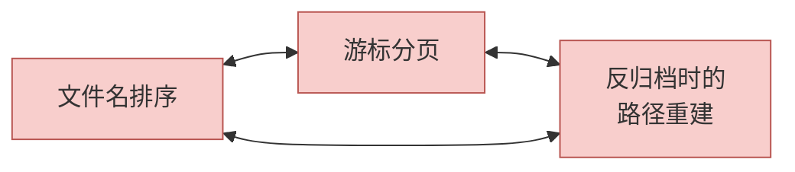
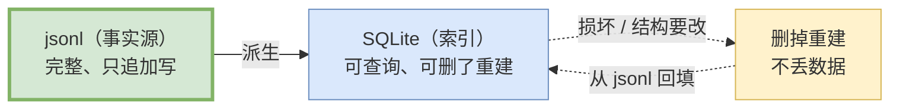

# 09 持久化与恢复

> **前置**：[08 上下文与压缩](./08-context.md)

这一篇有几个**真实存在的设计缺陷**，比正确的设计更有学习价值。

---

## 1. 三层存储

| 层 | crate | 行数 | 载体 | 存什么 |
| ---- | ---- | ---: | ---- | ---- |
| **rollout** | `codex-rollout` | 13,940 | `.jsonl` 文件 **＋ SQLite 线程元数据** | 会话的完整事件流，可回放可检查 |
| **thread-store** | `codex-thread-store` | 20,404 | **无独立载体**，借用下面两层 | 线程元数据、分组、归档状态的**操作面** |
| **state** | `codex-state` | 19,744 | **SQLite**（5 个独立库） | 运行时状态、日志、目标、记忆、线程历史、审计 |

### ⚠️ 一个容易误判的二分

**"rollout = 纯文件、state = 纯数据库"这个二分是错的。**

实测（读两个 crate 的依赖清单）：

```
rollout      → codex-state, zstd, ...            # 既写 jsonl，也写 SQLite，还做压缩
thread-store → codex-rollout, codex-state, sqlx  # 数据不自己发明，全部借下层
```

**rollout 在写 jsonl 的同时也在往 SQLite 写线程元数据。**

### thread-store 的定位值得学

它**没有自己的数据载体**——数据全在 rollout（jsonl）和 state（SQLite）里，它只提供**操作面**（怎么列、怎么归档、怎么分组）。

> **这是一个干净的分层**：存储机制和操作语义分开。换存储不影响操作面，加操作不影响存储格式。

它自己只落一个东西：一个锁目录（见 §5）。

---

## 2. rollout 落在哪

### ⚠️ 路径有三层日期目录

```
$CODEX_HOME/sessions/YYYY/MM/DD/rollout-<日期时间>-<uuid>.jsonl
```

默认就是 `~/.codex/sessions/2026/08/03/rollout-...jsonl`。

> **本文档体系第一版把它写成 `$CODEX_HOME/sessions/`——少了三层。** 按那个路径 `ls` 一个文件都找不到。
>
> **错误来源可以确认**：第一版抄了源码里的**文档注释示例**，而那段注释本身是过时的。
>
> **教训：真实路径由代码决定，不由注释决定。** 这个教训在读任何代码库时都适用。

**能用的查找命令：**

```bash
find ~/.codex/sessions -name 'rollout-*.jsonl*' -type f | sort | tail -5
```

### 为什么要分日期目录

一个活跃用户一天可能开几十个会话。不分层的话，几个月后那个目录会有上万个文件——**`ls` 会卡住，文件系统查找也会变慢。**

**这是个小设计，但省了大麻烦。值得抄。**

---

## 3. ⚠️ 一个真实的缺陷：时区不一致

这是本篇最有价值的一段。

| 侧 | 用的时区 |
| ---- | ---- |
| **文件名/目录生成** | **本地时区** |
| **文件名反向解析** | **UTC** |
| 每行记录的 `timestamp` 字段 | UTC |

**写入用本地时区，解析用 UTC。**

### 后果

非 UTC 时区下，按文件名排序与游标分页会带上**本地偏移量的系统性偏差**。

比如你在 UTC+8，晚上 8 点之后创建的会话，文件名里的日期是"今天"，但解析成 UTC 之后变成"今天中午"——排序和分页都会错位。

### 为什么没人直接修

因为**三处是耦合的**：



**单独"修正"任何一侧都会破坏另外两个之一。** 已经落盘的历史文件是按旧规则命名的，改解析逻辑就读不出老文件了。

### 给你的教训

> **时间戳的时区选择，一旦落进文件名就再也改不动了。**

**做同类产品时，第一天就统一用 UTC。** 文件名、目录、记录字段，全部 UTC。显示的时候再转本地时区。

这是本教程里**最便宜的一条建议**——现在花五分钟定下来，能省掉未来几年的麻烦。

---

## 4. jsonl 是事实源，SQLite 是可重建的派生索引

这个设计很漂亮，值得单独讲。



**SQLite 里的东西全部可以从 jsonl 重新算出来。** 所以：

| 场景 | 处理 |
| ---- | ---- |
| SQLite 损坏 | 删掉重建，不丢数据 |
| 索引结构要改 | 改完重建，不用写迁移脚本 |
| 想加一个新的查询维度 | 加一张表，从 jsonl 回填 |

**对比一下如果反过来**（SQLite 是事实源）：损坏就是真丢数据；改结构就得写迁移；迁移写错就是灾难。

> **这个模式的通用名字叫"事件溯源 + 物化视图"。** 对会话记录这种"只追加、不修改"的数据，它几乎总是对的选择。**强烈建议抄。**

### state 那 5 个 SQLite 库

分成 5 个独立库而不是一个大库，另有 55 个迁移文件。

**分库的好处**：一个库损坏不影响其他；迁移可以独立进行；并发写入竞争减少。

> SQLite 默认与 rollout 同处 `$CODEX_HOME/`，但可以通过配置整体挪走。排查落盘问题时注意它俩**可能不在一个目录**。

---

## 5. 一次会话还会落下这些

除 rollout 本身，默认配置下同一个目录还会出现：

| 产物 | 路径 |
| ---- | ---- |
| 线程名索引 | `$CODEX_HOME/session_index.jsonl` |
| 全局消息历史 | `$CODEX_HOME/history.jsonl` |
| 写者锁目录 | `$CODEX_HOME/thread-writer-locks/` |
| 压缩运行标记 | `$CODEX_HOME/.tmp/rollout-compression.lock` |
| 5 个 SQLite 库 | `$SQLITE_HOME/*.sqlite`（默认同 `$CODEX_HOME`） |

### ⚠️ 第二个真实缺陷：两个 append-only 文件并发策略不一致

| 文件 | 并发保护 |
| ---- | ---- |
| `history.jsonl` | **跨进程文件锁**（try_lock + 10 次重试） |
| `session_index.jsonl` | **只有进程内互斥锁** |

后者的删除操作是"读全文 → 写临时文件 → rename"。

**同一个 `CODEX_HOME` 下多进程并发重命名/删除线程会丢条目。**

> 这不是理论风险——同时开两个 codex 窗口就满足条件了。
>
> **给你的教训**：**同一类数据的并发策略要一致。** 一个加了跨进程锁另一个没加，往往是"先写的那个加了，后加的那个作者不知道"。
>
> 防御方法：把"这个目录下所有 append-only 文件"的写入封装成一个共用组件，而不是各写各的。

---

## 6. zstd 压缩：存在，但默认关闭

有一套完整的 zstd 压缩工作器，会把冷文件转成 `.jsonl.zst`。

**但它挂在一个默认关闭的特性开关后面。默认配置下 rollout 就是纯 `.jsonl`。**

> **这一节记录了一次矫枉过正**，值得引以为戒：
>
> - 第一版说 rollout "是纯文本，不需要任何工具支持"
> - 第二版看到那套完整的压缩机器，就断言"压缩不是可选功能"、"7 天后必然变成 `.zst`"
> - **第二版错了。** 代码存在 ≠ 代码被启用。**第一版在默认口径上反而是对的。**
>
> **教训：看到一个功能的完整实现，不等于它是默认行为。** 必须查开关的默认值和调用点。

---

## 7. 会话恢复：高风险改动面

`codex resume` 的实现依赖 `codex-rs/core/src/session/rollout_reconstruction.rs`——把磁盘上的历史记录重新变成内存中的会话状态。

**这是仓库规范点名的高风险改动面。**

### 为什么风险高

这个映射一旦有偏差，用户会得到一个**"看起来正常但状态其实错了"**的会话。

比如：权限档没恢复对，模型以为自己有写权限；或者工具调用的中间状态丢了，模型不知道上一步做到哪了。

**比直接崩溃更糟**——崩溃你至少知道出问题了。

### fork 时的建议

**列进禁改清单。** 见 [22](./22-load-bearing-and-cuts.md)。

如果你的产品必须改这里，配套要求：

- 每个改动配一个"存 → 读 → 比对"的往返测试
- 覆盖异常场景：中途崩溃的会话、被压缩过的会话、跨版本的会话

---

## 8. 给自建项目：最小持久化方案

### v0.1 够用的做法

```
your_home/
└── sessions/
    └── 2026/08/05/
        └── session-20260805T143022Z-<uuid>.jsonl   ← 全 UTC！
```

**每行一个 JSON 事件，只追加，永不修改。**

```python
# 写
with open(path, "a") as f:
    f.write(json.dumps({"ts": utcnow_iso(), "type": "...", ...}) + "\n")

# 恢复
events = [json.loads(line) for line in open(path)]
session = replay(events)
```

**就这么简单。v0.1 完全不需要 SQLite。**

### 三条纪律

| 纪律 | 为什么 |
| ---- | ---- |
| **全部用 UTC** | 见 §3。这是最便宜的一条建议 |
| **只追加，不修改** | 追加写是原子的（单行且短时），修改不是 |
| **文件名里带 UUID** | 时间戳可能撞（同一秒开两个会话） |

### 什么时候需要索引

当"列出我的所有会话"变慢时——通常是几千个会话之后。

那时再加 SQLite，**从 jsonl 回填**。因为 jsonl 是事实源，加索引是纯增量的事，不用改已有逻辑。

### 一个容易漏的点

> **写盘失败不能让会话崩溃。**

磁盘满了、权限没了、目录被删了——这些都会发生。**记录失败应该降级成一条警告，而不是终止用户正在做的事。**

反过来也要注意：**别静默吞掉**。用户以为存了，结果没存，是更坏的结果。

---

## 本篇小结

| 你现在应该能回答 | 答案 |
| ---- | ---- |
| 存储分几层？ | 三层：rollout（jsonl+SQLite）、thread-store（无载体，操作面）、state（SQLite） |
| rollout 路径？ | `$CODEX_HOME/sessions/YYYY/MM/DD/`，**有三层日期目录** |
| 事实源是谁？ | **jsonl**。SQLite 是可重建的派生索引 |
| 时区有什么问题？ | 写入用本地、解析用 UTC，三处耦合修不动 |
| 你该用什么时区？ | **全部 UTC**，显示时再转 |
| 默认会压缩吗？ | **不会**。压缩挂在默认关闭的开关后面 |
| 恢复为什么危险？ | 状态错了不会崩，只会静默错下去 |
| 自己做要 SQLite 吗？ | **v0.1 不要**。jsonl 足够，慢了再加索引 |

---

**下一篇**：[10 前端与扩展面](./10-frontends-and-extensions.md) —— IDE 怎么接进来，能力怎么加进去。
