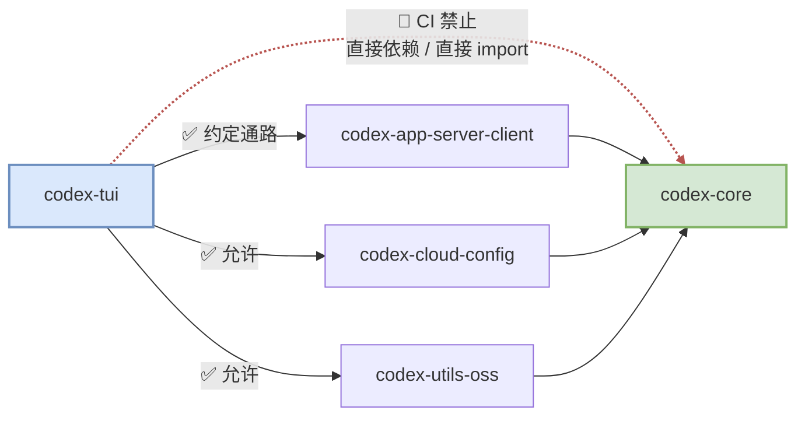
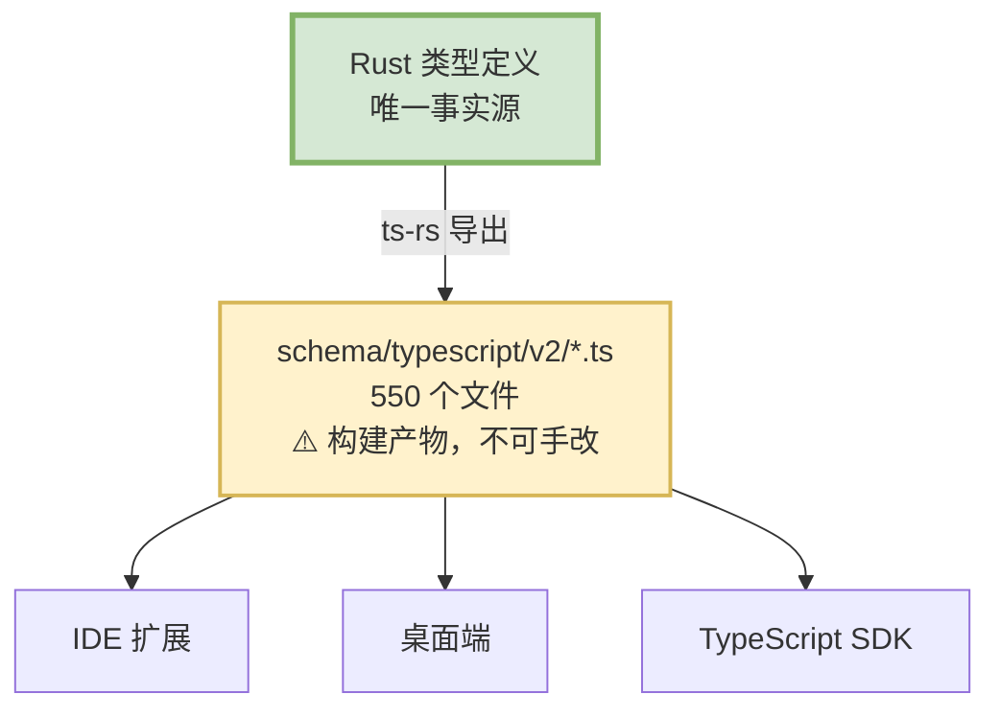

# 10 前端与扩展面

> **前置**：[03 提交与事件](./03-protocol.md)
> **配套图**：`dev_docs/diagrams/codex-01-topology.drawio.png`

---

## 第一部分：前端

## 1. 五种进程形态

同一个内核，五种跑法：

| 形态 | 说明 |
| ---- | ---- |
| **单进程（exec）** | `codex exec` 在本进程内直接跑 core |
| **单进程（TUI，同进程 app-server）** | TUI 在同一进程内启动一个进程内客户端，由它持有 app-server 与 core |
| **TUI ↔ 远端 app-server** | TUI 连接**另一个进程 / 另一台机器**上的 app-server，core 完全跑在远端 |
| **客户端-服务端** | app-server 以 JSON-RPC 对外服务，IDE / 桌面端 / SDK 作为客户端 |
| **守护进程** | `codex app-server daemon` 管理长驻生命周期 |

> **`守护进程`（daemon）**：一个**在后台长期运行、不占用终端、也没有界面**的进程。它开机或首次被用到时启动，然后一直待命，等别人来连它。你机器上的 Docker、数据库、SSH 服务都是这种形态。
>
> 对 codex 来说，好处是**省掉反复启动的开销**——IDE 每开一个窗口都拉起一个新进程太浪费，连到同一个常驻的它就行。

**第三种值得注意**：TUI 可以连远端。这意味着**界面在你的笔记本上，实际执行在一台服务器上**——对"不想让 AI 碰我本机"的场景很有用。

> 这个能力是免费得来的：因为前端和内核只通过消息通信（见 [03](./03-protocol.md)），消息能序列化，跨机器只是换个传输通道。**这就是消息驱动架构的红利。**

---

## 2. ⚠️ 一条 CI 强制的架构边界

**`codex-tui` 不得直接依赖、也不得直接 import `codex-core`。**

这不是风格建议，是 CI 强制的：

- 校验脚本 `.github/scripts/verify_tui_core_boundary.py`
- 检查两件事：TUI 的清单里不能有 `codex-core`；TUI 源码里不能出现对 core 的直接 import
- 违反直接挂 CI，无论功能是否正确

### ⚠️ 但"直接"两个字必须读进去

这条规则**只表示"无直接依赖边、无直接 import"**。它**不**表示 `codex-core` 没被链接进 TUI。

**事实上 core 会传递性地链进去**：

> **三条中间路径都通向 core。** 门禁只看直接关系，所以编译产物里 core 是在 TUI 里的。

**门禁不管传递依赖。** 编译产物里 `codex-core` 是在 TUI 里的。

> **本文档体系在这一句上先后错过三次**，从"TUI 直连 core"到"TUI 完全不含 core"，两个极端都错了。
>
> **准确表述：无直接依赖边、无直接导入（CI 强制）；core 仍经中间 crate 传递性链接。**

### 还有三条绕过"正确通路"的生产路径

CI 只禁 `codex-core` 这一个包名。TUI 里存在三条绕过约定通路的路径，且承载的是真实业务能力：

| 路径 | 用途 |
| ---- | ---- |
| `codex_utils_oss::ensure_oss_provider_ready` | 探测/拉起本地 Ollama、LM Studio |
| `codex_cloud_config::cloud_config_bundle_loader_for_storage` | 加载云配置 |
| `codex_core_plugins::*` | 插件市场名称常量与判定 |

还有一条**被官方认可的过渡通道**：`codex-app-server-client` 显式再导出了 core 的配置类型，TUI 在 93 处、40 个文件中使用。校验脚本的报错文案也点名这是过渡通道。

**所以准确的表述是：约束的是依赖边与 import，不是"core 能力必须经协议方法抵达"。**

### 这条边界给你的启示

**值得学的**：

> **想守住一条架构边界，就让它编译不过 / CI 不过。** 写在文档里的边界，三个月后就被绕过了。

**要注意的**：

> **门禁的措辞必须精确，且团队必须理解它的确切含义。** 这条规则被误读三次，说明"CI 通过"和"架构如你所想"是两回事。加门禁时要同时写清楚**它不保证什么**。

---

## 3. app-server：给 IDE 用的那条路

`codex-app-server` 是一个 **JSON-RPC 服务端**（128,364 行），IDE 插件、桌面端、SDK 都连它。

### 协议先行：类型只写一遍

这是本仓库最重要的工程约定之一：

**硬性规则**（写在仓库规范里）：

| 规则 |
| ---- |
| v2 类型必须标注特定的导出属性 |
| API 形状变更后须跑生成命令 |
| 变更须用指定的测试验证 |

> ⚠️ **生成的 `.ts` 文件是构建产物，不是手写代码。** 有人手改了生成文件，下次生成就被覆盖——这是所有代码生成方案的经典陷阱。

同类的生成物还有配置的 JSON Schema、hooks schema fixtures。

### 为什么必须这么做

**因为手写两份类型定义，第三天就会对不上。**

codex 有 5 个前端 + 一个 TypeScript SDK + 一个桌面端。**手工同步是不可能完成的任务。**

### 给你的建议

| 你的情况 | 建议 |
| ---- | ---- |
| 全栈一种语言 | **不需要代码生成**，但仍要把协议类型**集中在一个模块** |
| 有前端 / SDK / 插件（跨语言） | **必须做，越早越好** |

**"协议先行"真正的内核不是代码生成，而是这条纪律：**

> **所有跨边界的数据结构，集中定义在一个地方，其他所有人都从那里导入。**

这一条不管你是否跨语言都成立。

---

## 第二部分：扩展面

## 4. 四条扩展路径

| 路径 | 入口 |
| ---- | ---- |
| ① **内建扩展** | `codex-rs/ext/`（12 个 crate，公共 API 在 `ext/extension-api`） |
| ② **插件** | `codex-core-plugins`（37,038 行）+ `codex-plugin` |
| ③ **Skills** | `codex-core-skills` + `codex-skills` |
| ④ **MCP** | 客户端 `codex-rmcp-client` / `codex-mcp`；服务端 `codex-mcp-server` |

### 各自解决什么问题

| 路径 | 定位 | 谁写 |
| ---- | ---- | ---- |
| 内建扩展 | 编译进二进制的能力模块 | codex 团队 |
| 插件 | 可安装/卸载的能力包 | 第三方 |
| Skills | 提示词级别的能力包装 | 用户 / 第三方 |
| MCP | 标准协议，接外部工具服务 | 任何人 |

**四条路的抽象层级完全不同**——从"编译期链接"到"运行期加载外部进程"。

---

## 5. ⚠️ 扩展点不是准入条件

**`ext/extension-api` 是主扩展点**，但**不是 `ext/` 目录的准入条件**。

它一共定义 **17 个 `pub trait`**，分两类：

| 类别 | 数量 | 位置 |
| ---- | ---: | ---- |
| **contributor trait**（扩展往主流程里"贡献"东西） | **13** | `codex-rs/ext/extension-api/src/contributors.rs` 12 个 + `codex-rs/ext/extension-api/src/user_instructions.rs` 1 个 |
| **capability trait**（主流程反过来提供给扩展的能力） | 4 | `codex-rs/ext/extension-api/src/capabilities/` 下 |

> 复现：`rg -n 'pub trait ' codex-rs/ext/extension-api/src/`。**"13 个扩展点"指的是 contributor 那一类**，说"扩展 trait 有 13 个"时要带上这个口径。

实测：15 个 `ext/*` crate 里，只有 **8 个**依赖 `extension-api`（逐份直读各 crate 清单的 `[dependencies]` 段，非 grep 计数）。不依赖的 3 个是 `ext/agent`、`ext/connectors`、`ext/items`；剩下 1 个是 `extension-api` 自己。

> **本文档体系第一版说"12 个全部依赖"。** 那是一次**未取证的归纳**——把"`ext/` 下有 12 个 crate"直接当成了"12 个都依赖它"。
>
> ⚠️ **连这条勘误的错因本身也曾被写错。** 上一版说错因是"grep 把 `ext/extension-api` 自己数进去了"。**这个解释站不住**：按那个口径只会得到 9，而 `agent`/`connectors`/`items` 三份清单里该字符串出现 **0 次**，grep 口径解释不了 12 → 8 这个差额。真实错因就是最朴素的那个——**没查，直接归纳了**。
>
> （这条修订与仓库规范 `dev_docs/rules/combined/AI_RULES.md` §5.3 的记载保持一致。）
>
> **教训**：依赖类断言必须逐份读 `[dependencies]` 段，不能 `grep -rl` 数文件名。

### 三个例外各是什么

它们在 `ext/` 目录下，却不接主扩展点：

| crate | 是什么 |
| ---- | ---- |
| `ext/items` | **纯类型 crate，不是扩展**。它的模块文档自述"刻意位于 protocol 之下，好让 core 能携带扩展项而不必拥有每个扩展的展示 schema" |
| `ext/agent` | **子智能体派生的辅助层**，建在 core 的线程管理器之上，完全不走扩展契约（全文件仅 91 行） |
| `ext/connectors` | **建在插件机制之上**（依赖 core-plugins + plugin） |

### `ext/connectors` 是个重要的反例

它位于 `ext/` 目录下、名字带 `-extension`，却完全不碰扩展 API，而是构建在插件机制上。

> **这削弱了"插件是完全平行的第二条赛道"的说法** —— 插件机制已经反向被 `ext/` 内的成员复用。**两者是交叉，不是平行。**

**给你的启示**：

> **目录约定不等于契约。** 如果你希望"放在这个目录里的东西都实现某个接口"，必须用机制强制（比如一个注册宏、一个 CI 检查），否则一定会有例外长出来。
>
> （**`宏`（macro）是 Rust 里"能生成代码的代码"**——编译时先由它展开成一段真正的代码，再编译。把注册动作做成宏，就能在展开时顺便强制检查"你有没有实现那个接口"，没实现就编译不过。Python 里最接近的是装饰器，但装饰器是运行时的，宏是编译期的。）

---

## 6. Skills 与 MCP 被包装成扩展

有意思的一点：Skills 和 MCP 这两条独立的路径，**最后都被包装成扩展接进体系**：

- `ext/skills` 依赖 `core-skills` + `skills`
- `ext/mcp` 依赖 `codex-mcp`

**即：底层机制各自独立，接入 core 的方式统一。**

> **这个模式值得抄**：让"能力的实现方式"和"能力的接入方式"解耦。你可以有五种能力来源，但 core 只认一种接入契约。

---

## 7. MCP：值得单独说

**MCP（Model Context Protocol）是一个跨厂商的开放协议**，让 AI 工具之间可以互相调用。

codex 同时是**两边**：

| 角色 | crate | 意思 |
| ---- | ---- | ---- |
| **客户端** | `codex-rmcp-client`、`codex-mcp` | codex 可以调用别人的 MCP server |
| **服务端** | `codex-mcp-server` | 别的 AI 可以调用 codex |

### 对你的产品意味着什么

**支持 MCP 客户端 = 免费获得一个生态。** 用户已经有的 MCP server（数据库、浏览器、各种 SaaS）立刻能用。

**这可能是投入产出比最高的扩展路径。** 相比之下自己设计一套插件机制，还得说服别人来写。

> 优先级建议：**如果你只做一条扩展路径，做 MCP 客户端。**

---

## 8. 给自建项目的建议

### 扩展机制的取舍

| 阶段 | 做什么 |
| ---- | ---- |
| **v0.1** | **一条都不做**。把工具硬编码进去 |
| **v0.2** | **MCP 客户端**。投入小，立刻接入现成生态 |
| **看情况** | 提示词级的 skills（简单，就是加载一些文本） |
| **最后** | 自己的插件机制（复杂，且需要生态才有价值） |

**最容易犯的错是过早做插件系统。** 在只有 3 个工具的时候设计"可扩展的工具注册机制"，是典型的过度设计——你还不知道扩展点该开在哪。

### 前端的取舍

| 你的情况 | 建议 |
| ---- | ---- |
| 只做 CLI，永远不做别的前端 | 可以简化，但**内核仍然不能 print** |
| 可能做 IDE / Web / API | **老实抄消息驱动**。中途改造的成本是重写 |
| 不确定 | 抄。这个决策后悔成本极高 |

### 一条纪律

> **内核代码里能不能出现 `print()`？只要能，你就已经把界面焊死在内核里了。**

这是最简单的自检标准。

---

## 本篇小结

| 你现在应该能回答 | 答案 |
| ---- | ---- |
| 有几种进程形态？ | 五种，包括"TUI 连远端 core" |
| TUI 能用 core 吗？ | **不能直接依赖/import**（CI 强制），但 core 会传递性链接进去 |
| 协议类型怎么跨语言同步？ | Rust 是唯一事实源，TS 自动生成 |
| `ext/` 里都实现扩展 API 吗？ | **不是**，12 个里只有 8 个依赖它。目录约定不等于契约 |
| 有几条扩展路径？ | 四条：内建扩展、插件、Skills、MCP |
| 只做一条选哪个？ | **MCP 客户端**，投入产出比最高 |
| 什么时候做插件系统？ | 最后。过早做是典型过度设计 |

---

**理解篇到此结束。**

如果你的目标是"参照 codex 做一个类似的产品"，继续读决策篇：

- [20 架构决策清单](./20-design-decisions.md) —— 抄什么、别抄什么
- [21 fork 之前必须定的五件事](./21-before-you-fork.md)
- [22 承重墙与削减地图](./22-load-bearing-and-cuts.md)
- [23 实施路线与团队分工](./23-rollout-plan.md)
