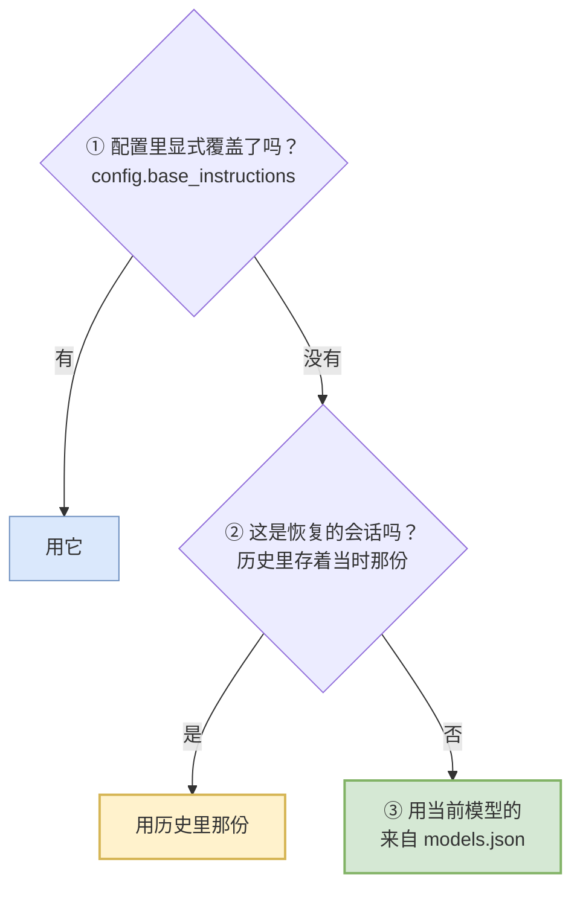
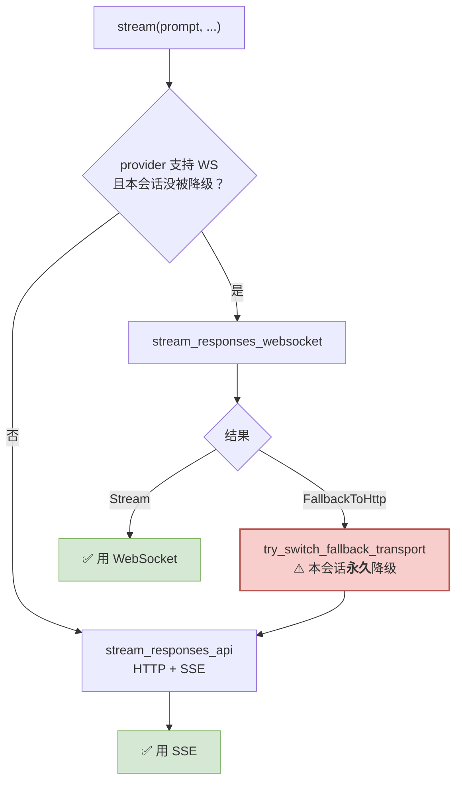
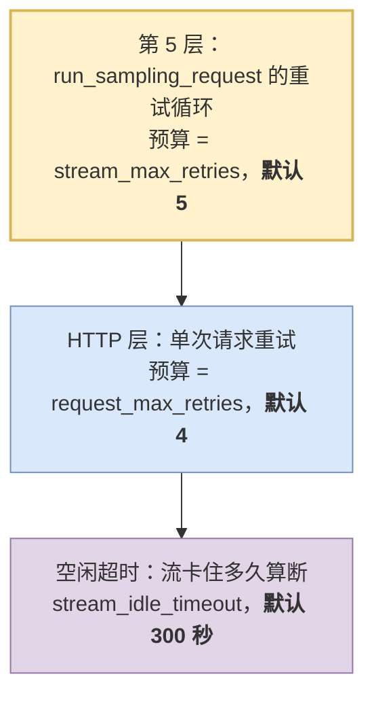

# 11 模型客户端：一次请求的一生

> **前置**：[05 一个 turn 的内部](./05-inside-a-turn.md)
> **读序建议**：读完 05 之后、读 [06 工具系统](./06-tools.md) 之前

---

## 0. 这一篇补的是什么洞

理解篇 01–10 有一个**结构性缺口**：

- [04](./04-three-loops.md) 讲完了三层循环
- [05](./05-inside-a-turn.md) 讲完了 `run_turn`，其中"② 调模型"是一个方框
- [06](./06-tools.md) 从"模型说要跑命令"开始讲

**中间那一步——"怎么把历史变成一个 HTTP 请求发出去、怎么把流回来的字节变回事件"——一直是个黑箱。**

这一篇打开它。对"要自己做一个"的人来说，**这是绕不过去的一层**：工具系统可以先只有一个 `shell`，沙箱可以先依赖容器，但模型客户端你必须自己写。

---

## 1. 先扔掉一个错觉：那些 `*_prompt.md` 是死文件

你在 `codex-rs/core/` 下会看到这些文件，名字非常像系统提示词：

```
gpt_5_codex_prompt.md
gpt_5_1_prompt.md
gpt_5_2_prompt.md
gpt-5.1-codex-max_prompt.md
gpt-5.2-codex_prompt.md
prompt_with_apply_patch_instructions.md
```

**前五个在全仓有 0 处引用。** 复现：

```bash
grep -rn "gpt_5_codex_prompt" --include=*.rs --include=*.toml --include=*.bazel codex-rs/
# 无输出
```

第六个只被**一个测试文件**用 `include_str!` 读进去做对比断言（`codex-rs/core/src/session/tests.rs:1437`），生产路径同样不读它。

> ⚠️ **这是"名字贴切 ≠ 它在生效"的教科书案例。**
>
> 一个叫 `codex-rs/core/gpt_5_codex_prompt.md` 的文件躺在内核目录里，任何人都会认为它就是系统提示词。**它不是。** 它是重构后留下的遗骸——`git log` 显示相关改动是 "Assemble sandbox/approval/network prompts dynamically"，提示词改成动态组装之后，这些静态文件没被删掉。
>
> **判据永远是"谁读它"，不是"它叫什么"。** 读任何陌生代码库时，看到一个位置显眼、名字贴切的文件，第一件事是反查引用点。

---

## 2. 系统提示词真正住在哪

**在 `codex-rs/models-manager/models.json` 里，按模型 slug 一条一条存着。**

```bash
python3 -c "
import json; d=json.load(open('codex-rs/models-manager/models.json'))
print('模型数:', len(d['models']))
for m in d['models']:
    print(m['slug'], '→ base_instructions', len(m['base_instructions']), '字符')
"
```

实测 **8 个模型**，每个都带一份完整的、几千字符的 `base_instructions`。它和 `context_window`、`supports_parallel_tool_calls`、`apply_patch_tool_type` 这些能力字段并列——**提示词被当成"模型的一个属性"，而不是"程序的一个常量"。**

### 为什么这么设计

| 好处 | 说明 |
| ---- | ---- |
| **换模型自动换提示词** | 不同模型的最佳提示词写法差别很大，硬编码一份就是照顾了 A 得罪了 B |
| **不用重新编译就能改** | 那份 JSON 是数据，不是代码 |
| **能力和提示词同源** | "这个模型支持并行工具调用吗"和"该怎么跟它说话"放在一起，不会漂 |

> **给自建项目**：**第一天就把提示词按模型分开存，不要写死在代码里。** 这个改造后期做非常痛——你会发现提示词里到处是 `if model == "xxx"`。

### 三级优先级

真正生效的那一份，在 `codex-rs/core/src/session/mod.rs:635` 附近解析，源码注释直接写明了顺序：

```rust
// 1. config.base_instructions override
// 2. conversation history => session_meta.base_instructions
// 3. base_instructions for current model
```



**第 ② 级是最容易被忽略、也最重要的一级。**

> **为什么恢复会话要用"当时那份"而不是"现在这份"？**
>
> 因为你昨天的会话是在旧提示词下产生的。今天 codex 升级了提示词，如果恢复时换成新的，**模型会看到一段和历史行为对不上的指令**——它可能觉得"我之前怎么会那样做"，然后行为突变。
>
> **这一条值得抄。** 提示词是会话状态的一部分，不是全局配置。

---

## 3. `Prompt`：一次请求的完整输入

定义在 `codex-rs/core/src/client_common.rs:18`，**只有 6 个字段**：

```rust
pub struct Prompt {
    /// 对话上下文条目
    pub input: Vec<ResponseItem>,

    /// 这次可以用的工具（含 MCP 来的）
    pub(crate) tools: Vec<ToolSpec>,

    /// 允许并行调工具吗
    pub(crate) parallel_tool_calls: bool,

    pub base_instructions: BaseInstructions,

    /// 可选：要求模型按这个 schema 输出
    pub output_schema: Option<Value>,

    /// Responses API 是否严格校验上面那个 schema
    pub output_schema_strict: bool,
}
```

**看清楚这 6 个字段，你就知道"模型看到的世界"由什么构成了：**

| 字段 | 对应 [05](./05-inside-a-turn.md) 里的哪一步 |
| ---- | ---- |
| `input` | 组上下文（历史 + 注入的片段） |
| `tools` | 工具注册表算出来的可见工具集（[06](./06-tools.md)） |
| `base_instructions` | §2 那三级解析的结果 |
| 其余三个 | 本次请求的开关 |

### 它是在哪一刻被拼出来的

`codex-rs/core/src/session/turn.rs:1278`，函数体只有 12 行：

```rust
pub(crate) fn build_prompt(
    input: Vec<ResponseItem>,
    router: &ToolRouter,
    turn_context: &TurnContext,
    base_instructions: BaseInstructions,
) -> Prompt {
    Prompt {
        input,
        tools: router.model_visible_specs(),                              // ← 工具从这来
        parallel_tool_calls: turn_context.model_info.supports_parallel_tool_calls,
        base_instructions,
        output_schema: turn_context.final_output_json_schema.clone(),
        output_schema_strict: !crate::guardian::is_guardian_reviewer_source(...),
    }
}
```

**两个值得停下来的点：**

**① `parallel_tool_calls` 来自 `model_info`，不是来自配置。** 也就是说"能不能并行调工具"是**模型的能力**，不是用户的偏好。这和 [06](./06-tools.md) §3 里"按工具区分并行"是两个不同层级的开关——**模型说能并行，工具还得说自己能并行。**

**② `build_prompt` 在第 5 层重试循环里，每次重试都重新拼。** 见 [05](./05-inside-a-turn.md) §1 — 不是"三层循环"，是五层。这意味着重试时历史可能已经变了（比如中途插入了工具结果），**重试不是简单地重发同一个包**。

---

## 4. 传输层：一个协议，两条通道

### `WireApi` 只有一个变体

```rust
pub enum WireApi {
    /// The Responses API exposed by OpenAI at `/v1/responses`.
    #[default]
    Responses,
}
```

**就这一个。** 没有 Chat Completions 分支了。

> ⚠️ **这一条会随上游变化。** 很多讲 codex 的资料还在说"支持 Responses 和 Chat Completions 两种 wire API"——那是旧版本。**用 `grep -n "enum WireApi" -A 10 codex-rs/model-provider-info/src/lib.rs` 自己确认当前状态。**
>
> 对自建项目的启示：**统一到一个 wire 协议是有价值的**。支持两种意味着所有能力都要做两遍适配。

### 但传输有两条：WebSocket 与 HTTP SSE

`ModelClientSession::stream`（`codex-rs/core/src/client.rs:1800`）的逻辑：



**注意"永久"两个字**——源码注释写得很明确：

> "Permanently disables WebSockets for this Codex session and resets WebSocket state. This is used after exhausting the provider retry budget, to force subsequent requests onto the HTTP transport."

即：**WS 失败到一定程度就整个会话都不再试 WS 了**，而不是每次请求都重试一遍。

> **这个设计值得抄。** 一个在你的网络环境下根本连不通的传输方式，如果每次请求都先试一遍再回退，用户感受到的是"每句话都要多等 15 秒"（`websocket_connect_timeout` 默认 15,000ms）。**失败要有记忆。**

### provider 能力是数据，不是代码

`ModelProviderInfo`（`codex-rs/model-provider-info/src/lib.rs:89`）的字段本身就是一份"接一个新 provider 需要知道什么"的清单：

| 字段组 | 字段 |
| ---- | ---- |
| **地址** | `base_url`、`query_params` |
| **认证** | `env_key`、`auth`（命令行取 token）、`aws`（SigV4）、`requires_openai_auth` |
| **HTTP 头** | `http_headers`（写死的）、`env_http_headers`（从环境变量取的） |
| **韧性** | `request_max_retries`、`stream_max_retries`、`stream_idle_timeout_ms`、`websocket_connect_timeout_ms` |
| **能力** | `wire_api`、`supports_websockets`、`supports_standalone_web_search` |

> **给自建项目**：**把 provider 的差异全部收敛成一个结构体的字段**，不要写成 `if provider == "openai"`。上面这张表可以直接当你的字段清单用——它是被真实需求打出来的。
>
> 特别注意 `env_http_headers` 这种"值从环境变量取"的设计：企业用户经常要加一个内部网关的鉴权头，你不给这个口子，他们就没法用。

---

## 5. 流里流的是什么：`ResponseEvent`

定义在 `codex-rs/codex-api/src/common.rs:76`。按性质分组看：

| 组 | 变体 | 说明 |
| ---- | ---- | ---- |
| **生命周期** | `Created`、`Completed { response_id, token_usage, end_turn }` | 一次请求的头尾 |
| **完整条目** | `OutputItemAdded`、`OutputItemDone` | **工具调用从这里出来** |
| **文本增量** | `OutputTextDelta` | 模型正在打字 |
| **推理增量** | `ReasoningSummaryDelta`、`ReasoningSummaryDone`、`ReasoningContentDelta` | 思考过程 |
| **工具参数增量** | `ToolCallInputDelta { item_id, call_id, delta }` | **工具参数是一段一段流回来的** |
| **服务端元信息** | `ServerModel`、`ModelVerifications`、`TurnModerationMetadata`、`ServerReasoningIncluded`、`SafetyBuffering` | 服务端告诉你的事 |

### 三个容易被低估的变体

**① `ToolCallInputDelta` —— 工具参数是流式的。**

模型不是"想好整个 JSON 再发出来"，而是一个字符一个字符地吐。这意味着：

- 你**不能**等 JSON 完整了再解析——那样界面上"正在写文件…"的提示会延迟好几秒
- 你**必须**能处理"只看到半个 JSON"的状态

这就是 [05](./05-inside-a-turn.md) §7 里那些流式解析状态机存在的原因。

**② `ServerModel(String)` —— 服务端可能换掉你要的模型。**

注释写着："This can differ from the requested model when backend safety routing applies."

> **你请求 A，服务端可能给你 B。** 做产品时这会导致"用户明明选了某个模型，token 计费和行为却对不上"。**必须把服务端实际用的模型显示出来**——codex 有对应的 `EventMsg::ModelReroute` 往前端发。

**③ `Completed { end_turn: Option<bool> }` —— 注意那个 `Option`。**

注释：*"Some providers do not set this, so we rely on fallback logic when this is `None`."*

**即：不是所有 provider 都会明确告诉你"我说完了"。** 你需要一套兜底逻辑去判断。这是多 provider 支持的典型税。

> **Rust 小注（给 Python 读者）**：`Option<bool>` 是**三态**——`Some(true)` / `Some(false)` / `None`。
>
> Python 里你会写 `end_turn: bool | None = None`，但很容易忘记处理 `None`，写成 `if end_turn:` 就把 `None` 和 `False` 混成一类了。Rust 强制你显式区分这三种情况，否则 `match` 编译不过。**这正是这类"三态语义"最容易出 bug 的地方。**

---

## 6. 重试：三层预算，各管各的

这是自建项目最容易做漏的部分。codex 有**三层**独立的重试预算：



复现：`grep -n "DEFAULT_STREAM_MAX_RETRIES\|DEFAULT_REQUEST_MAX_RETRIES\|DEFAULT_STREAM_IDLE_TIMEOUT_MS" codex-rs/model-provider-info/src/lib.rs`

### 三层为什么不能合并

| 层 | 它在处理什么失败 | 合并的后果 |
| ---- | ---- | ---- |
| **流重试** | 流到一半断了（网络抖动、服务端主动断） | 已经收到的 token 白费了，要能重发 |
| **请求重试** | 请求根本没建立（5xx、连接失败） | 和"流断了"完全不同的语义 |
| **空闲超时** | 连接还在，但服务端不吐东西了 | **没有这个，会话会永远挂着**，用户看到光标闪但什么都不来 |

> **第三个最容易漏。** "连接没断但也不给数据"是分布式系统里最讨厌的一种状态——它不报错，所以你的错误处理路径永远不会被触发。**必须有超时。**

### 不是所有错误都能重试

`run_sampling_request` 里有一个明确的分诊（`codex-rs/core/src/session/turn.rs:1306`）：

```rust
Err(err) => match err.details() {
    CodexErrorDetails::ContextWindowExceeded => {
        sess.set_total_tokens_full(&turn_context).await;
        return Err(err);                     // ← 不重试：重发一遍还是超
    }
    CodexErrorDetails::UsageLimitReached(e) => {
        // 记录限流信息给前端显示
        return Err(err);                     // ← 不重试：重发只会更快撞墙
    }
    _ => err,                                 // ← 其余的进重试判断
},
// ...
if !err.is_retryable() { return Err(err); }
```

**判断原则很清楚：**

| 错误性质 | 重试吗 | 例子 |
| ---- | ---- | ---- |
| **重发能解决的** | ✅ | 网络抖动、5xx、流中断 |
| **重发结果一样的** | ❌ | 上下文超限、参数非法 |
| **重发会让情况更糟的** | ❌ | 触发限流 |

> **给自建项目**：**别写"所有错误统一重试 3 次"。** 那会让"上下文超了"这种确定性失败变成"卡 3 倍时间之后才报错"，还可能在限流时把你的账号打得更死。
>
> 最小做法：给你的错误类型加一个 `is_retryable()` 方法，**默认返回 `false`**，只对确认能重试的显式返回 `true`。默认不重试比默认重试安全。

---

## 7. `ModelClientSession`：为什么是 turn 级的

源码注释解释了这个类型存在的理由：

> "`ModelClientSession` is turn-scoped and caches WebSocket + sticky routing state, so we reuse one instance across retries within this turn."

拆开看两件事：

| 缓存的东西 | 为什么必须跨重试保留 |
| ---- | ---- |
| **WebSocket 连接** | 每次重试都重连要多花十几秒 |
| **sticky routing 状态** | 通过 `x-codex-turn-state` 头传递，让服务端把同一个 turn 的多次请求路由到同一后端 |

**`x-codex-turn-state` 这个头值得单独说。** 它的意思是："我这个 turn 之前的请求被路由到了某台机器，请继续用那台。"

> **为什么需要粘性路由？** 因为服务端可能缓存了这个 turn 的上下文（KV cache）。换一台机器，缓存失效，延迟和成本都上去了。
>
> **对自建项目**：如果你自己部署推理服务，**turn 级粘性路由是一个巨大的性能杠杆**。这也解释了为什么 `ModelClientSession` 的生命周期必须精确对齐 turn——短了丢缓存，长了跨 turn 串状态。

---

## 8. 给自建项目：最小模型客户端

### v0.1 够用的结构

```python
class ModelClient:
    def __init__(self, provider: ProviderInfo):
        self.provider = provider        # 所有差异收敛在这个结构体里

    async def stream(self, prompt: Prompt) -> AsyncIterator[ResponseEvent]:
        for attempt in range(self.provider.stream_max_retries + 1):
            try:
                async for ev in self._stream_once(prompt):
                    yield ev
                return
            except Exception as e:
                if not is_retryable(e) or attempt == self.provider.stream_max_retries:
                    raise
                await asyncio.sleep(backoff(attempt))

    async def _stream_once(self, prompt):
        async with httpx.AsyncClient() as c:
            async with c.stream("POST", self.provider.base_url,
                                json=self._body(prompt),
                                headers=self._headers(),
                                timeout=self.provider.stream_idle_timeout) as r:
                async for line in r.aiter_lines():
                    if ev := parse_sse_line(line):
                        yield ev
```

**六件必须有的事，缺一个都会在真实使用中咬你：**

| # | 要求 | 不做的后果 |
| ---: | ---- | ---- |
| 1 | **空闲超时** | 会话永久挂起，且不报错 |
| 2 | **`is_retryable()` 默认 false** | 上下文超限被重试 3 次；限流时把账号打死 |
| 3 | **provider 差异收进一个结构体** | 第二个 provider 接进来时代码里全是 `if` |
| 4 | **提示词按模型存** | 换模型时提示词对不上，且改动要重新发版 |
| 5 | **恢复会话用历史里的提示词** | 老会话在新提示词下行为突变 |
| 6 | **暴露服务端实际用的模型** | 用户选 A 实际跑 B，计费和行为都解释不了 |

### 可以先不做的

| 能力 | 理由 |
| ---- | ---- |
| WebSocket 传输 | SSE 够用。WS 是延迟优化，不是功能 |
| 粘性路由 | 只有你自己部署推理服务时才有意义 |
| 结构化输出 schema | 早期用提示词约束就行 |
| 多层重试预算 | v0.1 一层 + 超时即可，但**超时不能省** |

### 一个容易漏的设计

> **把"请求发出去的完整内容"能 dump 出来。**

codex 有 `codex-rs/core/src/prompt_debug.rs` 专门干这个。

调模型的 bug 有 80% 是"发出去的东西和你以为的不一样"——少了一段指令、工具 schema 写错、历史顺序颠倒。**没有 dump 能力，你只能靠猜。** 这个功能十几行，第一天就该有。

---

## 本篇小结

| 你现在应该能回答 | 答案 |
| ---- | ---- |
| 系统提示词在哪？ | `codex-rs/models-manager/models.json`，**按模型 slug 存**。8 个模型各一份 |
| `codex-rs/core/gpt_5_codex_prompt.md` 是什么？ | **零引用的死文件**。名字贴切不等于它在生效 |
| 提示词怎么选出来的？ | 三级：配置覆盖 > 历史里那份 > 当前模型的 |
| 恢复会话用哪份提示词？ | **历史里那份**，否则老会话行为会突变 |
| `Prompt` 有几个字段？ | 6 个：输入、工具、并行开关、基础指令、输出 schema、schema 严格性 |
| 支持几种 wire API？ | **一种**（`Responses`）。但传输有 WS 和 SSE 两条 |
| WS 连不上会怎样？ | **整个会话永久降级到 HTTP**，不是每次重试 |
| 有几层重试？ | 三层：流重试（默认 5）、请求重试（默认 4）、空闲超时（默认 300 秒） |
| 什么错误不该重试？ | 上下文超限、限流——**重发结果一样或更糟的** |
| 自己做最不能省的是什么？ | **空闲超时** + **默认不重试** + **能 dump 出实际发出去的内容** |

---

**下一篇**：回到 [06 工具系统](./06-tools.md) 继续理解篇；或者跳到 [12 配置系统与特性开关](./12-config-and-features.md) 看这些默认值都是从哪来的。
