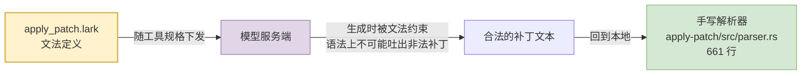
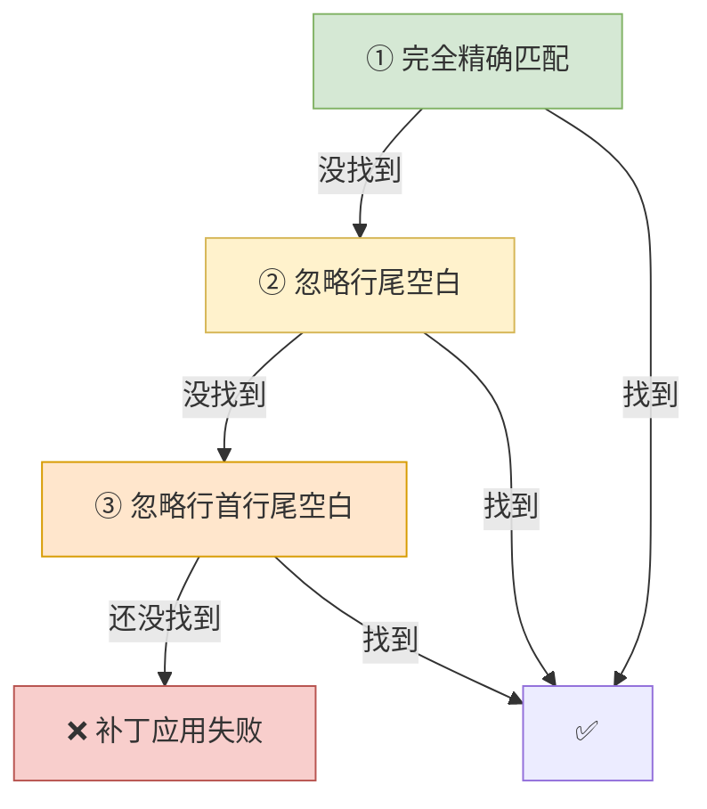
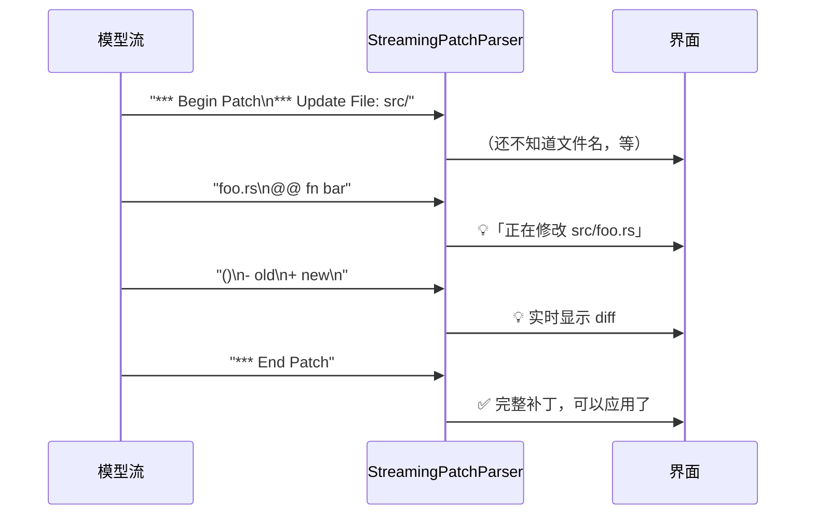

# 13 补丁与执行策略：模型怎么安全地改代码

> **前置**：[06 工具系统](./06-tools.md)、[07 安全](./07-security.md)

---

## 0. 两套机制，管两件不同的事

[07](./07-security.md) 讲了审批和沙箱——那是**通用**的两道关。但对编码智能体来说，有两个动作特别高频、特别危险，各自还有一套专门的机制：

| 动作 | 专门机制 | 在哪 |
| ---- | ---- | ---- |
| **改文件** | `apply_patch` 补丁格式 | `codex-rs/apply-patch/`（4,553 行） |
| **跑命令** | `execpolicy` 策略引擎 | `codex-rs/execpolicy/`（1,974 行） |

这一篇讲这两套。**它们是"编码"智能体区别于"聊天"机器人的地方。**

---

## 1. ⚠️ 先纠正一个误读：那份 `.lark` 文法不是给你的解析器用的

[06](./06-tools.md) §7 提到过：

> "`handlers/apply_patch.lark` 是一个 **Lark 语法文件**——补丁格式有形式化文法定义，不是拿正则硬凑的。"

**"有形式化文法"是对的，但它的用途说反了。** 这份文法**不是本地解析器读的**，而是**发给模型的**。

看唯一的引用点（`codex-rs/core/src/tools/handlers/apply_patch_spec.rs:5`）：

```rust
const APPLY_PATCH_LARK_GRAMMAR: &str = include_str!("apply_patch.lark");

pub fn create_apply_patch_freeform_tool(include_environment_id: bool) -> ToolSpec {
    // ...
    ToolSpec::Freeform(FreeformTool {
        name: "apply_patch".to_string(),
        description: "The `apply_patch` tool can be used to edit files. \
                      This is a FREEFORM tool, so do not wrap the patch in JSON.".to_string(),
        format: FreeformToolFormat {
            r#type: "grammar".to_string(),      // ← 关键
            syntax: "lark".to_string(),
            definition,                          // ← 文法正文
        },
    })
}
```

**这是一个 freeform 工具 + 语法约束解码（grammar-constrained decoding）。**



> **这个手法非常值得学。** 常规做法是"让模型输出 JSON，然后本地校验，错了再让它重试"。语法约束解码是**从源头上让它吐不出错的东西**——模型在生成每个 token 时，采样空间就被文法限制住了。
>
> 对补丁这种**格式极其严格、错一个字符就应用失败**的场景，这个收益巨大。
>
> **前提**：你的 provider 要支持。这属于 [11](./11-model-client.md) §4 说的"provider 能力"——换个 provider 可能就没有了，得准备好降级到"输出+校验+重试"。

### 为什么本地还要一个手写解析器

因为**模型输出被约束**不等于**输入一定合法**：

- 会话恢复时读到的历史补丁
- 用户手工粘贴的补丁
- 不支持语法约束的 provider 生成的补丁
- 模型服务端的约束实现有 bug

**约束是优化，不是保证。本地校验不能省。**

---

## 2. ⚠️ 而且这份文法被写了两遍，两份已经漂了

`codex-rs/apply-patch/src/parser.rs` 的文件头注释里，**又抄了一份文法**：

> "The official Lark grammar for the apply-patch format is: …"

**两份对比，有一处实质差异：**

| 位置 | `add_line` / `change_line` 的正文部分 |
| ---- | ---- |
| **真文法** `apply_patch.lark` | `/(.*)/` ← **星号，允许空** |
| **注释副本** `codex-rs/apply-patch/src/parser.rs` 头 | `/(.+)/` ← **加号，至少一个字符** |

**空行在补丁里极其常见**（函数之间的空行），所以注释那份是过时的——按它实现会拒绝掉大量合法补丁。

好在紧接着还有一句注释救了场：

> "The parser below is a little more lenient than the explicit spec and allows for leading/trailing whitespace around patch markers."

即**手写解析器本来就比文法宽松**，所以实际没出事。

> **教训（和 [12](./12-config-and-features.md) §1 是同一条）**：**同一个事实被写在两个地方，就一定会漂。**
>
> 这里的漂移是良性的（宽松方向），但下一次可能不是。**正确做法是让注释指向文件而不是复制内容**——`// 文法见 ../../core/src/tools/handlers/apply_patch.lark`。
>
> 这也是 [10](./10-frontends-and-extensions.md) §3 "协议先行，类型只写一遍"那条纪律的又一个例证：**跨边界的定义，只能有一个事实源。**

---

## 3. 补丁格式本身：为什么不用 unified diff

文法很短，全文如下：

```lark
start: begin_patch hunk+ end_patch
begin_patch: "*** Begin Patch" LF
end_patch: "*** End Patch" LF?

hunk: add_hunk | delete_hunk | update_hunk
add_hunk: "*** Add File: " filename LF add_line+
delete_hunk: "*** Delete File: " filename LF
update_hunk: "*** Update File: " filename LF change_move? change?

filename: /(.+)/
add_line: "+" /(.*)/ LF -> line

change_move: "*** Move to: " filename LF
change: (change_context | change_line)+ eof_line?
change_context: ("@@" | "@@ " /(.+)/) LF
change_line: ("+" | "-" | " ") /(.*)/ LF
eof_line: "*** End of File" LF
```

**四种操作**：新增文件、删除文件、修改文件、移动文件（`*** Move to:`）。

### 和 unified diff 的关键差异

> **`unified diff` 是你每天都在看、但可能没留意它有名字的那个东西**——`git diff` 输出的默认格式，长这样：
>
> ```diff
> @@ -12,7 +12,9 @@
>    fn foo() {
> -     old_line();
> +     new_line();
>  }
> ```
>
> 关键在开头那行 `@@ -12,7 +12,9 @@`：**它用行号定位**，读作"原文件从第 12 行起的 7 行，替换成新文件从第 12 行起的 9 行"。这是所有 Unix 补丁工具（`patch`、`git apply`）认的标准格式。
>
> **codex 没用它**，下表就是原因。

| | unified diff | codex 的格式 |
| ---- | ---- | ---- |
| 定位方式 | **行号** `@@ -12,7 +12,9 @@` | **上下文内容** `@@ fn foo()` |
| 模型要知道什么 | 准确的行号和行数 | 只要贴一段唯一的上下文 |
| 行号算错的后果 | 整个补丁失败 | 无所谓，没用行号 |

**这是为模型量身改的。**

> **模型数不清行号。** 让它输出 `@@ -12,7 +12,9 @@` 意味着它要准确记住"从第 12 行开始的 7 行，改成 9 行"——这种算术是大模型的弱项，而且**读文件时看到的行号和改完之后的行号还会变**。
>
> 改成"贴上下文"之后，模型只需要做它擅长的事：**复述一段它刚看过的代码**。

### 定位策略：三级递减严格度

`codex-rs/apply-patch/src/seek_sequence.rs`（163 行）的文档注释写明了：

> "Matches are attempted with decreasing strictness: **exact match**, then **ignoring trailing whitespace**, then **ignoring leading and trailing whitespace**."



**为什么需要这个降级？** 因为模型复述代码时**很容易改动空白**——把 tab 变成空格、丢掉行尾空格、缩进差一格。这些差异对代码语义毫无影响，但会让精确匹配失败。

> **给自建项目**：**上下文匹配必须容忍空白差异，但不能容忍别的。**
>
> 注意它**只放宽空白**，不做模糊匹配（比如编辑距离）。这个界限很重要——**放宽到"相似即可"就会改错地方**，而改错地方是静默的灾难。

那段注释里还留着一条历史：

> "`pattern.len() > lines.len()` → returns `None` (cannot match, avoids out-of-bounds panic **that occurred pre-2025-04-12**)"

**补丁比文件还长的时候会 panic。** 这就是 [20](./20-design-decisions.md) 说的"很多正确设计是被真实问题打出来的"。

> **`panic` 是 Rust 里的一个专有词，指"程序遇到了无法继续的情况，当场终止"**——打印一段错误和调用栈，然后整个线程直接死掉。
>
> **注意它和 `Result` 不是一回事**：`Result` 表示"这件事可能失败，请你处理一下"（[32](./32-rust-for-python-readers.md) §3），是**预期内**的失败；`panic` 表示"出现了本不该出现的状态"，是**程序员的 bug**。数组越界、除以零、以及上面这种"在只有 3 行的文件里找 10 行的内容"，都会 panic。
>
> 最接近的 Python 对应是**未被捕获的异常直接把进程带走**。这也是为什么 [32](./32-rust-for-python-readers.md) §10 里 codex 会用门禁禁掉 `unwrap()`——那个方法正是"出错就 panic"的意思。

---

## 4. 补丁是边流边解析的

`codex-rs/apply-patch/src/streaming_parser.rs` 有 **944 行**——比完整解析器（661 行）还大。

为什么需要它？回到 [11](./11-model-client.md) §5：**工具参数是通过 `ToolCallInputDelta` 一段一段流回来的**。



**不做流式解析的后果**：模型写一个 200 行的补丁要几十秒，这期间界面上什么都没有，用户以为卡死了。

> **但注意优先级**：[06](./06-tools.md) §8 的建议是"v0.1 可以先攒完整再解析"。**流式解析是体验优化，不是正确性需求。** 先把补丁应用对，再考虑边流边显示。

---

## 5. execpolicy：用 Python 子集写安全策略

### 为什么这对你特别友好

execpolicy 的策略文件用 **Starlark** 写——那是 Bazel 用的配置语言，**本质上是 Python 的一个确定性子集**（没有 `import`、没有 `while`、没有副作用）。

你已经会写了：

```starlark
prefix_rule(
    pattern = ["cmd", ["alt1", "alt2"]],   # 有序 token；列表元素表示"任选其一"
    decision = "prompt",                    # allow | prompt | forbidden，默认 allow
    justification = "explain why this rule exists",
    match     = [["cmd", "alt1"], "cmd alt2"],    # 必须匹配的示例
    not_match = [["cmd", "oops"], "cmd alt3"],    # 必须不匹配的示例
)
```

> **为什么选 Starlark 而不是 YAML/TOML**：策略需要**表达力**（"这些命令里任选其一"、"这个前缀加任意参数"），但又**绝对不能是图灵完备的**——一个能死循环、能读文件、能发网络请求的安全策略语言本身就是漏洞。
>
> Starlark 正好卡在这个位置：**长得像 Python，但保证会终止、无副作用、可重复求值。**
>
> **这个选型值得抄。** 如果你需要用户可编写的策略/配置，Starlark 比"自己发明一个 DSL"和"直接 `eval()` Python"都好。
>
> （**`DSL` = Domain-Specific Language，领域专用语言**：只为一件具体的事设计的小语言，不是通用编程语言。SQL 是查数据库的 DSL，正则表达式是匹配文本的 DSL。**"自己发明一个 DSL"意味着你要自己写解析器、自己处理报错、自己写文档**——所以能借用现成的就别自己发明。）
>
> （**"图灵完备"**是判断一门语言"能不能算任何东西"的标准。**这里恰恰是不想要它**：一个图灵完备的语言写出来的策略可能死循环、可能永不返回，而安全策略必须**每次都在有限时间内给出答案**。Starlark 故意砍掉了 `while` 和递归，就是为了拿到这个保证。）

### 三态决策，不是布尔

```rust
pub enum Decision {
    /// Command may run without further approval.
    Allow,
    /// Request explicit user approval; rejected outright when running with `approval_policy="never"`.
    Prompt,
    /// Command is blocked without further consideration.
    Forbidden,
}
```

**`Prompt` 是关键的中间态。**

| 决策 | 含义 | 在自动化环境下（`approval_policy="never"`） |
| ---- | ---- | ---- |
| `Allow` | 直接跑 | 直接跑 |
| **`Prompt`** | **问人** | **直接拒绝**（没人可问） |
| `Forbidden` | 拒绝，不再考虑 | 拒绝 |

> **注意 `Prompt` 在无人值守时的行为**：它**降级为拒绝**，而不是降级为允许。**默认安全（fail-closed），不是默认可用。**
>
> 这条一定要抄。反过来做（没人问就放行）在 CI 里会变成"所有危险命令自动通过"。

### `match` / `not_match`：把示例当加载期单元测试

这是本篇最值得抄的一个设计。README 写得很直白：

> "`match` / `not_match` supply example invocations that are **validated at load time** (think of them as unit tests)"

即：**你写规则的同时必须写例子，加载策略时会自动跑这些例子，对不上就加载失败。**

```starlark
prefix_rule(
    pattern = ["git", ["status", "diff", "log"]],
    decision = "allow",
    match     = ["git status", "git diff --stat"],   # 这些必须命中
    not_match = ["git push", "git reset --hard"],    # 这些必须不命中
)
```

> **为什么这个设计这么好？**
>
> 安全策略是**极易写错**的东西——一个前缀写宽了，`git` 全系列命令就都放行了，包括 `git push --force`。而这种错误**不会有任何症状**，直到出事。
>
> 把示例做成规则的一部分、在加载期强制校验，意味着：
> - 写规则的人**被迫**想清楚边界在哪
> - 规则被别人改宽了，**原来的 `not_match` 会立刻挂掉**
>
> **成本几乎为零，收益极大。任何"规则/匹配/白名单"类系统都该抄。**

### `host_executable`：防止路径绕过

```starlark
host_executable(
    name = "git",
    paths = ["/opt/homebrew/bin/git", "/usr/bin/git"],
)
```

解决的问题是：规则写的是 `git`，模型跑的是 `/usr/bin/git` 或 `./git` —— 该不该算命中？

> 下面会用到 **`basename`（基名）**这个词：**一个路径去掉目录部分之后剩下的那截文件名**。`/usr/bin/git` 的 basename 是 `git`，`./git` 的也是 `git`。**"回退到 basename 规则"就是说"路径对不上时，退一步只比最后那个名字"**——方便，但也正是第 4 条要防的漏洞入口。

匹配语义（README 明确列出）：

1. **永远先试第一个 token 的精确匹配**
2. 关闭 host-executable 解析时，`/usr/bin/git status` 只匹配首 token 为 `/usr/bin/git` 的规则
3. 开启时，精确匹配失败可以回退到 basename 规则
4. **但如果 `host_executable(name="git", ...)` 存在，回退只允许列出的绝对路径**
5. 没有对应 `host_executable()` 条目的 basename，回退不受限

> **第 4 条是安全要点**：如果不限制，攻击者在 `PATH` 里放一个假的 `git`，就能借着"git 是允许的"这条规则跑任意代码。**允许清单必须能钉死到绝对路径。**

---

## 6. 给自建项目：最小方案

### 补丁：先抄格式，别抄实现

| 做什么 | 优先级 |
| ---- | ---: |
| **用"上下文定位"而不是"行号定位"** | **必须**。行号方案会让模型频繁失败 |
| **匹配时容忍空白差异（且只容忍空白）** | **必须**。模型复述代码必然改动空白 |
| 支持 增/删/改/移 四种操作 | 高。少一种就得用 shell 绕，绕就失控 |
| 语法约束解码 | 中。provider 支持才有，要能降级 |
| 流式解析 | 低。体验优化，v0.1 攒完整再解析 |

**一个陷阱**：不要直接用 `git apply` 或 `patch` 命令。它们要行号，且错误信息是给人看的，模型读不懂——你需要能把"为什么没匹配上"结构化地喂回去让它重试。

### 执行策略：v0.1 可以很简单

```python
# 最小可用：三态 + 前缀匹配 + 示例校验
RULES = [
    Rule(prefix=["git", ("status", "diff", "log")], decision=ALLOW,
         match=["git status"], not_match=["git push"]),
    Rule(prefix=["rm"], decision=FORBIDDEN,
         justification="use trash instead"),
]

def load_rules(rules):
    for r in rules:                      # ← 加载期就跑示例
        for ex in r.match:
            assert r.matches(shlex.split(ex)), f"{r} should match {ex}"
        for ex in r.not_match:
            assert not r.matches(shlex.split(ex)), f"{r} should NOT match {ex}"
    return rules
```

**四条纪律：**

| 纪律 | 为什么 |
| ---- | ---- |
| **三态，不是布尔** | 需要"问人"这个中间态 |
| **`Prompt` 在无人值守时降级为拒绝** | fail-closed。反过来做等于 CI 里全放行 |
| **示例在加载期强制校验** | 规则写宽了不会有症状，只能靠这个兜 |
| **允许清单能钉到绝对路径** | 否则 `PATH` 投毒能绕过一切 |

> **别一上来就搞 DSL。** 上面这个 Python 列表就够 v0.1 用。等策略多到用户要自己写了，再考虑 Starlark（用 `starlark-pyo3` 之类的库，别自己实现）。

---

## 本篇小结

| 你现在应该能回答 | 答案 |
| ---- | ---- |
| `apply_patch.lark` 是给谁的？ | **给模型的**，用于语法约束解码。不是本地解析器读的 |
| 那本地怎么解析？ | 手写解析器 `codex-rs/apply-patch/src/parser.rs`（661 行），比文法更宽松 |
| 两份文法一致吗？ | **不一致**。注释副本用 `/(.+)/`，真文法是 `/(.*)/`（允许空行） |
| 为什么不用 unified diff？ | **模型数不清行号**。改用上下文定位，让它做擅长的事 |
| 上下文匹配严格吗？ | 三级递减：精确 → 忽略行尾空白 → 忽略首尾空白。**只放宽空白** |
| 补丁为什么要流式解析？ | 工具参数是流回来的，不流式解析界面会静默几十秒 |
| execpolicy 用什么语言？ | **Starlark**——Python 的确定性子集，有表达力但保证终止无副作用 |
| 决策有几种？ | **三种**：`Allow` / `Prompt` / `Forbidden`。`Prompt` 无人值守时**降级为拒绝** |
| `match` / `not_match` 干什么？ | **加载期强制校验的单元测试**。规则被改宽会立刻挂 |
| 自己做最该抄哪条？ | **上下文定位 + 示例即测试**。两条成本都接近零 |

---

**下一篇**：[30 动手篇](./30-hands-on.md) —— 把前面读到的东西跑起来、看见、改一次。
