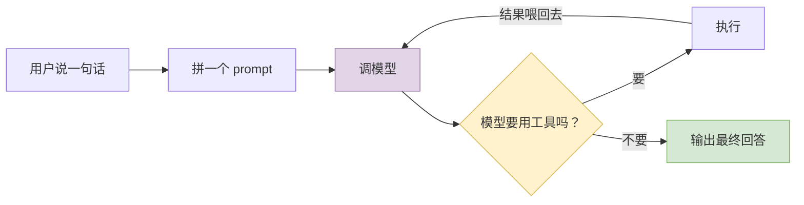

# 20 架构决策清单：抄什么、别抄什么

> **前置**：理解篇 [01](./01-coordinates.md)–[10](./10-frontends-and-extensions.md)（至少读完 01–07）

---

## 0. 先看清核心其实很小

一个编码智能体，剥掉所有实现细节，本质是：



**这个核心，一个周末能写出来，两百行足够。**

那 codex 的 29 万行在干什么？在处理这些"怎么办"：

| 真实问题 |
| ---- |
| 模型还在跑，用户又输入了怎么办 |
| 上下文超了怎么办（不能直接截断，会丢关键信息） |
| 模型要执行危险命令怎么办 |
| 用户换了个界面（IDE 而不是终端），逻辑要重写吗 |
| 崩了之后怎么恢复到刚才那一步 |
| 想加一个新工具，要改几个文件 |
| 三个操作系统的沙箱机制完全不同，怎么统一 |

**真正的架构价值全在这些"怎么办"里。你要抄的就是这些答案。**

---

## 层级 Ⅰ：形态

这三个决策最贵——**定错了后面全要返工**。

### 决策 1：一个二进制，多个前端

**做法**：一个可执行文件，多个子命令，其中 5 个入口拉起完整智能体（见 [01](./01-coordinates.md) §7）。

**为什么**：

| 理由 | 说明 |
| ---- | ---- |
| **分发成本** | 用户装一个文件就能用。每多一步安装，流失一半用户 |
| **版本一致性** | 前端和内核在同一个二进制里，**物理上不可能版本错配** |
| **内核只写一遍** | 加一个新能力，所有前端自动都有 |

**代价**：编译产物大（几十 MB 起）；启动时要判断"我是谁"；理想守不到 100%（codex 随发布另交付 6 个辅助可执行文件）。

**建议**：

> **抄。而且从第一天就抄。** 这个决策早期做几乎零成本，晚期做要伤筋动骨。

具体到代码结构，从第一行就要保证：

```
✅ 内核是一个库（library），不是 main 函数里的一坨
✅ CLI 只是这个库的一个调用者
❌ 绝不在内核里 print / input
```

---

### 决策 2：前端与内核用「消息」解耦，不是「函数调用」

**这是整个 codex 最值得抄的一个决策。** 详见 [03](./03-protocol.md)。

**做法**：会话对外只有两个口子（提交进、事件出），一次提交产生任意多个事件。

**为什么**（四条，每条单独都足够）：

| 理由 | 函数调用为什么做不到 |
| ---- | ---- |
| **流式输出** | 函数返回的是最终结果，中间过程没地方放 |
| **中断** | 你怎么通知一个正在阻塞的函数？ |
| **并发输入** | 你被自己的函数调用堵住了 |
| **换前端** | 函数调用是同进程的；消息天生能序列化 |

**代价**：

| 代价 | 必需的应对 |
| ---- | ---- |
| 调试变难（没有调用栈） | **结构化追踪不是加分项，是必需配套** |
| 类型爆炸 | 强类型语言靠穷尽匹配；弱类型靠注册表 + 测试 |
| 时序问题 | 每个事件要设计幂等性 |

**建议**：

| 你的情况 | 建议 |
| ---- | ---- |
| 只做 CLI，永远不做别的前端 | 可简化成"回调 + 生成器" |
| 可能做 IDE / Web / API | **老实抄完整版**。中途改造 = 重写 |
| 不确定 | 抄。后悔成本极高 |

---

### 决策 3：协议先行，类型只写一遍

**做法**：所有跨边界的数据结构，一种语言是唯一事实源，其他语言的类型自动生成。

**为什么**：手写两份类型定义，第三天就会对不上。这类 bug 编译期发现不了，运行时才炸，报错还毫无帮助。

**代价**：构建流程变复杂；生成的代码不能手改（经典陷阱）；单向的，主语言必须选对。

**建议**：

| 你的情况 | 建议 |
| ---- | ---- |
| 全栈一种语言 | 不需要代码生成，但**类型必须集中在一个模块** |
| 跨语言 | **必须做，越早越好** |

> **真正的内核不是代码生成，而是这条纪律**：所有跨边界的数据结构集中定义在一个地方。这条不管你是否跨语言都成立。

---

## 层级 Ⅱ：内核

### 决策 4：三层循环，第一层永不阻塞

**做法**：提交循环 → 任务层 → turn 循环（见 [04](./04-three-loops.md)）。

**为什么必须三层**：压成一层的话，中断和并发输入立刻失效——因为第 1 层被长任务堵住了，取不出下一条消息。

**建议**：

> **三层是必要的，但第 2 层可以先很薄。**

**最关键的一条纪律**：

> **第 1 层里绝对不能 `await` 一个长任务。** 一旦 await，中断就失效了。这是最容易犯的错。

---

### 决策 5：任务分类 + 取消令牌树

**做法**：不同性质的活儿包装成不同的任务类型，每个 turn 拿一个子取消令牌。

**为什么**：

- 压缩、评审、普通对话的**完成语义完全不同**，塞一个函数里会变成一堆 if
- 子令牌让"中断一个 turn"和"中断整个任务"可以分开表达

**建议**：抄取消令牌树。任务分类可以从 1 种开始，需要时再拆。

> ⚠️ codex 在这里有个反面教材：4 种任务实现但只有 3 个 `TaskKind`，`user_shell` 复用了 `Regular`（见 [04](./04-three-loops.md) §5）。**如果你要按类型分支写逻辑，从一开始就让分类和实现一一对应。**

---

### 决策 6：内存历史与磁盘记录分离

**做法**：喂给模型的上下文会被压缩截断；存到磁盘的记录是完整事实，不压缩（见 [08](./08-context.md) §7、[09](./09-persistence.md) §4）。

**为什么**：合成一个的话，压缩之后就再也恢复不出原始过程了。用户问"你刚才为什么改了那个文件"，你答不上来。

**建议**：**必抄。** 而且磁盘那份用"事件溯源 + 可重建索引"的模式：


SQLite 损坏就删了重建，不丢数据；索引结构要改就重建，不用写迁移。

---

## 层级 Ⅲ：能力

### 决策 7：工具系统四层切分

**做法**：注册表 → 路由 → 编排 → 运行时（见 [06](./06-tools.md) §2）。

**为什么编排必须单独一层**：审批和沙箱逻辑**对所有工具都一样**。塞进每个 handler 会导致：

- 在 5 个 handler 里重复写审批逻辑
- 第 6 个 handler 的作者忘了写，**安全漏洞就出现了**

**建议**：

> **即使你只有 3 个工具，也保持四层。** 这是最容易犯的架构错误之一——把横切关注点分散到各个实现里。

---

### 决策 8：安全两道防线，权限两个维度

**做法**：审批（要不要做）+ 沙箱（能做到什么程度）；权限拆成文件系统和网络两个正交维度（见 [07](./07-security.md)）。

**为什么两个维度**：真实需求确实是正交的——

| 场景 | 文件系统 | 网络 |
| ---- | ---- | ---- |
| 跑单元测试 | 可写项目目录 | 禁止 |
| `npm install` | 可写 node_modules | 需要 |
| 只读分析 | 只读 | 禁止 |

**一维"安全等级"滑块表达不了这三种。**

**建议**：

| 项 | 建议 |
| ---- | ---- |
| 两道防线 | **必抄** |
| 两个正交维度 | **必抄**，成本几乎为零 |
| 三平台沙箱 | **只做一个平台**。或者依赖容器隔离（见 [07](./07-security.md) §9） |
| 把权限状态告诉模型 | 抄。否则它会一直提议做不到的事 |

---

### 决策 9：先做截断，再做压缩

**做法**：工具输出单独截断；对话历史在用户轮次边界压缩（见 [08](./08-context.md)）。

**为什么这个顺序**：

> 80% 的上下文消耗其实是工具输出（一次 `npm install` 的日志）。**截断简单、可靠、见效快；压缩复杂、有质量风险。**

很多项目一上来就做压缩，是搞反了优先级。

**建议**：v0.1 只做截断。v0.2 再加简单的边界压缩。

---

## 层级 Ⅳ：演进

### 决策 10：边界靠机制守，不靠文档守

**做法**：codex 用 CI 脚本强制"TUI 不得直接依赖 core"；用类型系统让前端"拿不到内核的函数"（见 [02](./02-startup.md) §5、[10](./10-frontends-and-extensions.md) §2）。

**为什么**：写在文档里的边界，三个月后就被绕过了。

**但要注意 codex 在这里的教训**：

> 那条 CI 规则的准确含义（"不得**直接**依赖"）被误读了三次。**"CI 通过"和"架构如你所想"是两回事。**

**建议**：

| 做法 | 说明 |
| ---- | ---- |
| 优先用**类型**守边界 | 最强。前端手里只有 channel 端点，想调也调不到 |
| 其次用 **CI 检查** | 有效，但要写清楚**它不保证什么** |
| **不要**只写在文档里 | 无效 |
| 加门禁时同时写"它不覆盖什么" | 否则会被过度解读 |

---

## 反面清单：codex 做了但你大概率不该抄

**同样重要**——别把研究生级别的复杂度抄进一个刚起步的项目。

| codex 的做法 | 它为什么需要 | 你为什么八成不需要 |
| ---- | ---- | ---- |
| **134 个 crate** | 团队几十人并行，增量编译时间是真金白银 | **从 3–5 个模块起步**，长到疼了再拆 |
| **双构建系统** | 发布要可复现、要交叉编译 | 纯粹的负担 |
| **CI 强制的架构边界** | 已经烂过一次，被迫加门禁 | 等你真的烂过再加 |
| **三平台原生沙箱** | 面向全球用户，Windows 不能不支持 | **先做一个平台** |
| **实时语音会话子系统** | 产品需求 | 除非你也要做语音 |
| **26 个 Op / 80 个 EventMsg** | 六年演进 + 五个前端的累积 | **v0.1 有 5 入 10 出就够**（见 [03](./03-protocol.md) §8） |
| **四条扩展路径** | 生态需要 | **先一条都不做**，然后只做 MCP 客户端 |
| **多智能体协作** | 高级产品功能 | 很后面再说 |
| **计划模式（plan mode）** | 产品功能 | 不是架构必需 |

> **判断原则：codex 的很多复杂度是规模和历史的产物，不是设计的必需品。抄结构，别抄体量。**

---

## v0.1 的目标形态

把上面十个决策落成代码：

```
your_project/
├── protocol/            # 决策 3：所有消息类型集中在这里
│   └── mod.rs           #   5 个入向 Op + 10 个出向 Event
├── kernel/              # 决策 1、2：只认消息，绝不碰 UI
│   ├── loop.rs          #   决策 4：三层循环
│   ├── session.rs       #   决策 6：内存历史
│   ├── tools/           #   决策 7：注册表/路由/编排/运行时
│   │   ├── registry.rs
│   │   ├── router.rs
│   │   ├── orchestrator.rs   # ← 审批+沙箱在这里，所有工具必经
│   │   └── runtimes/
│   ├── security.rs      #   决策 8：审批 + 沙箱
│   └── context.rs       #   决策 9：截断优先
├── store/               # 决策 6：磁盘记录（jsonl，只追加，全 UTC）
└── frontends/           # 决策 1：内核的调用者，可以有多个
    └── cli.rs
```

### 三条自检纪律

| 纪律 | 违反的表现 |
| ---- | ---- |
| **内核里不能有 `print` / `input`** | 界面焊死在内核里了 |
| **前端里不能有模型调用逻辑** | 换前端时要重写 |
| **消息类型不能定义在 protocol 之外** | 迟早会有两份定义 |

**做到这三条，你就拿到了 codex 架构层 90% 的价值。**

---

## 一个务实的提醒

> **codex 的很多"正确设计"是被真实问题打出来的，不是想出来的。**

比如：

- `truncate_function_output_payload` 的存在，说明有人被一次 build 日志爆过上下文
- `tool_waits_for_runtime_cancellation` 按工具区分，说明有过"取消之后进程没清理干净"的问题
- 时区那个缺陷（[09](./09-persistence.md) §3）说明**当初没人想过这件事**

**所以不要指望第一版就设计对。** 上面这些决策的价值在于：**它们标出了哪些地方"改起来最贵"**——那些地方值得多想五分钟。其余的先跑起来再说。

---

**下一篇**：如果你打算**直接 fork codex 删减改造**（而不是从零写），继续读 [21 fork 之前必须定的五件事](./21-before-you-fork.md)。
