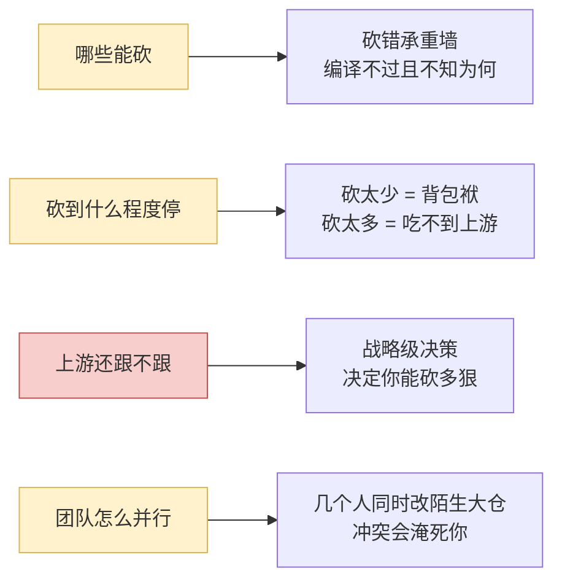
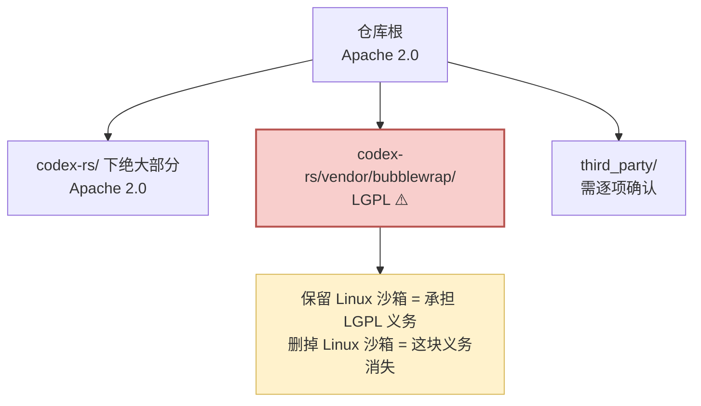
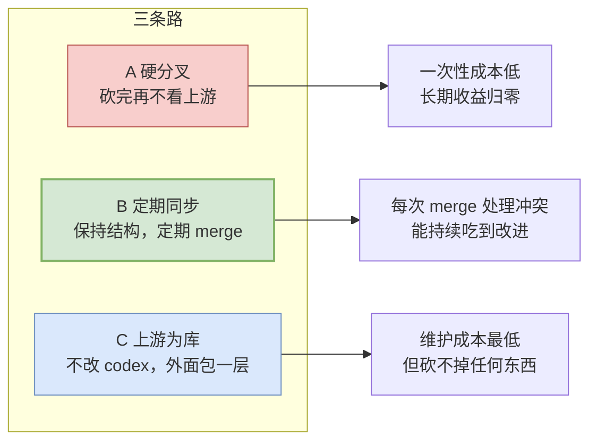
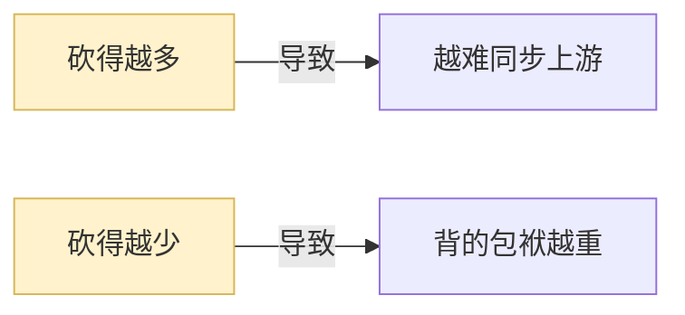
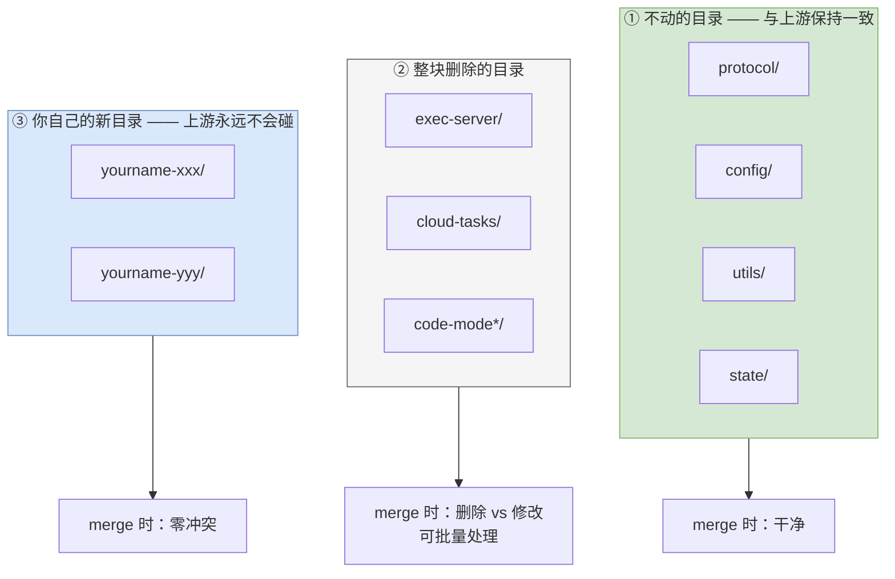
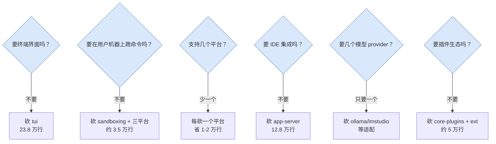

# 21 fork 之前必须定的五件事

> **前置**：理解篇 [01](./01-coordinates.md)–[10](./10-frontends-and-extensions.md)、[20 架构决策清单](./20-design-decisions.md)
> **适用**：你打算**直接在 codex 源码上删减改造**，而不是从零写

---

## 0. fork 和自建是两个不同的项目

先明确这个区别，因为它决定了你的真实难题是什么：

| | 从零自建 | fork 删减 |
| ---- | ---- | ---- |
| 主要难题 | **怎么设计** | **哪些能砍、砍到哪停** |
| 起步速度 | 慢（什么都要写） | 快（能跑的东西已经在那了） |
| 长期成本 | 你完全理解自己的代码 | **你要为 29 万行陌生代码负责** |
| 上游改进 | 拿不到 | 取决于同步策略 |

**fork 的真实难题是这四个：**



本篇解决这四个的前置条件。

---

## 1. 先看清体量

`codex-rs/` 下的真实分布（Rust 代码行数）：

| crate | 行数 | 是什么 |
| ---- | ---: | ---- |
| `core` | 296,963 | 智能体内核 |
| `tui` | 238,439 | 终端界面 |
| `app-server` | 128,364 | JSON-RPC 服务端 |
| `exec-server` | 39,311 | 跨 OS 执行服务 |
| `core-plugins` | 37,038 | 插件机制 |
| `app-server-protocol` | 30,946 | 对外协议 |
| `cli` | 26,629 | 命令行分发 |
| `ext`（12 个合计） | 24,837 | 内建扩展 |
| `protocol` | 23,132 | **内部协议——承重墙** |
| `config` / `thread-store` / `state` | 各约 2 万 | 配置与持久化 |
| 其余 120 多个 | 几百到 2 万 | |

**两个立刻可得的结论：**

**① `tui` + `app-server` 加起来 36.7 万行，比内核还大。** 如果你的产品不做终端界面，**这是最大的一刀**。

**② 真正的"智能体循环骨架"其实很小。** core 的 29.7 万行里包含了实时语音、插件装载、多套压缩实现、code-mode 等一大堆产品功能。

---

## 2. 第一件：License

仓库根是 **Apache License 2.0**，另有 `NOTICE` 文件。

### 机械层面的要求

> ⚠️ **以下不是法律意见。团队应该走一次正式的法务确认。**

| 你可以 | 你必须 |
| ---- | ---- |
| 商用、闭源、改名、再分发 | 保留 `LICENSE` 和 `NOTICE` |
| 不开源你的修改 | 在改动过的文件中标注"已修改" |
| 做成产品卖 | 不使用原项目的商标/名称做背书 |

**Apache 2.0 对 fork 商用相当友好**（比 GPL 宽松得多）。

### ⚠️ 但有一个容易被忽略的点

`codex-rs/vendor/bubblewrap/` 里 vendored 了第三方 C 代码，**bubblewrap 是 LGPL**。



**如果你保留 Linux 沙箱，这块的许可证义务和 Apache 2.0 不一样。务必让法务单独看。**

### 去品牌化必须彻底

Apache 2.0 允许改名，但**改名要改干净**。不只是显示名称：

| 要改的 | 例子 |
| ---- | ---- |
| 显示名称、帮助文本 | `codex --help` 里的每一处 |
| 二进制名 | `codex` → `你的名字` |
| 配置目录 | `~/.codex` → `~/.你的名字` |
| 环境变量前缀 | `CODEX_HOME` → `YOURNAME_HOME` |
| 内部 crate 名 | `codex-core` → `yourname-core`（可选，但混着很难看） |
| 遥测端点、User-Agent | 必须改，否则会往人家服务器打点 |

> ⚠️ **最后一条最容易漏**：不改遥测端点 = 你的用户数据往上游服务器发。这既是合规问题也是隐私问题。

---

## 3. 第二件：上游还跟不跟

**这是最贵的决策，决定了你能砍多狠。**



| 策略 | 适合 |
| ---- | ---- |
| **A 硬分叉** | 产品形态与 codex 差异极大 |
| **B 定期同步** | 产品形态接近，想持续吃上游改进 |
| **C 上游为库** | 只加不减，不需要删东西 |

### 核心矛盾



### 推荐：B 的一个变体「按目录隔离」



> **最忌讳的是"在上游文件里东改一行西改一行"** —— 那会让每次 merge 变成噩梦。
>
> **改动要么整文件重写，要么零。**

---

## 4. 第三件：那条红线

仓库规范顶部有一条硬规则：

> **禁止新增或修改任何与那两个沙箱环境变量相关的代码。**

**为什么这么严**：这两个环境变量是沙箱**内外的判别信号**——代码用它们判断"我是不是已经在沙箱里了"。改动可能导致**沙箱被静默绕过**：不报错、不崩溃，保护没了。

**fork 之后依然适用**，因为风险是技术性的，不是政治性的。

**把它写进你自己的团队规范。**

---

## 5. 第四件：团队并行的节奏

29 万行 + 134 个 crate，**新人上手期以周计**。前期最容易犯的错是"三个人同时开始改代码"。

```mermaid
gantt
    dateFormat X
    axisFormat 第%d周
    title fork 项目的前期节奏

    section 调研
    全员只读不写，各认领 2-3 个 crate   :done, r1, 0, 2
    产出「这块干什么 / 能不能砍」        :done, r2, 0, 2

    section 决策
    集中定削减方案                       :active, d1, 2, 1

    section 削减
    一次性砍完，一个大 PR，全员 review    :crit, c1, 3, 1

    section 并行开发
    基于砍完的基线并行                    :p1, 4, 4
```



### 关键纪律

> **削减必须一次性做完，且在并行开发之前。**

如果边砍边开发，每个人都在处理别人砍掉的东西，效率会灾难性下降。

### 认领建议

调研期每人认领 2–3 个 crate，产出一页纸：

```
crate 名：
一句话职责：
被谁依赖（反查）：
依赖了谁：
能不能砍：能 / 不能 / 有条件
如果能砍，前提是什么：
如果不能砍，为什么：
```

**这些一页纸拼起来就是 [22](./22-load-bearing-and-cuts.md) 的削减地图。**

---

## 6. 第五件：你的产品和 codex 差在哪

**这个想不清楚，削减方案无从谈起。** 六个决定性问题：



**把这六个问题的答案写下来（要"要/不要"，不要"可能"），就是削减地图的输入。**

---

## 7. 一个粗略的削减预估

在不知道你产品形态的前提下，按"企业内部编码智能体"的常见假设（要终端 UI、要本地执行、只支持 Linux+macOS、不做插件生态、不做云任务）：

| 可整块删除 | 行数 | 前提 |
| ---- | ---: | ---- |
| `exec-server` + `exec-server-protocol` | 约 4.1 万 | 不需要跨 OS 远程执行 |
| `external-agent-migration` | 1.5 万 | 不需要从别家智能体迁移 |
| `network-proxy` | 1.7 万 | 不需要网络代理层 |
| `code-mode*`（4 个 crate） | 约 1.9 万 | 不需要 JS code-mode |
| `windows-sandbox-rs` | 1.9 万 | 不支持 Windows |
| `analytics` + 部分 `otel` | 约 1.9 万 | 换成你自己的遥测 |
| `cloud-tasks*` + `cloud-config` | 约 0.8 万 | 不做云任务 |
| `chatgpt` / `responses-api-proxy` / `v8-poc` / `feedback` | 约 1 万 | provider 特有 |
| `core-plugins` + 大部分 `ext/` | 约 5 万 | 不做插件生态 |
| **合计** | **约 20 万行** | |

**再加上如果不要终端界面**：`tui` 23.8 万行——**这一刀比上面所有加起来还大**。

> ⚠️ **这些是上限估计。** 真实删除时会发现交叉依赖，实际能砍的少一些。
>
> **`core` 内部尤其麻烦**——它是 411 个平铺模块（没有嵌套分组），不能按目录整块切，只能逐模块判断。这是 fork codex 最大的技术痛点，见 [22](./22-load-bearing-and-cuts.md) §5。

---

## 8. 调研阶段的产出：四页决策备忘

**这四页定下来，后面所有技术决策都有依据。没有它，削减方案会反复推翻。**

```markdown
# 第 1 页：产品形态定义
- 要终端界面吗？          [ ] 要  [ ] 不要
- 要在用户机器上跑命令吗？  [ ] 要  [ ] 不要
- 支持哪些平台？          [ ] macOS [ ] Linux [ ] Windows
- 要 IDE 集成吗？         [ ] 要  [ ] 不要
- 支持哪些模型 provider？  ______________________
- 要插件生态吗？          [ ] 要  [ ] 不要

# 第 2 页：上游策略
- 选择：[ ] A 硬分叉  [ ] B 定期同步  [ ] C 上游为库
- 同步频率：__________
- 目录隔离规则：
  - 不动的：__________
  - 删除的：__________
  - 新增的（前缀）：__________

# 第 3 页：合规确认
- [ ] Apache 2.0 义务清单已确认（法务签字）
- [ ] vendored bubblewrap 的 LGPL 义务已单独确认
- [ ] third_party/ 下逐项确认
- 去品牌化范围：
  - [ ] 显示名称  [ ] 二进制名  [ ] 配置目录
  - [ ] 环境变量前缀  [ ] 遥测端点  [ ] crate 名

# 第 4 页：禁改清单 v0
- 沙箱环境变量红线（见本篇 §4）
- 承重墙清单（见 22 篇）
- 高风险改动面（会话恢复等）
```

---

## 本篇小结

| 你现在应该能回答 | 答案 |
| ---- | ---- |
| fork 的真实难题是什么？ | 砍什么、砍到哪停、跟不跟上游、怎么并行 |
| License 是什么？ | Apache 2.0，商用友好。**但 bubblewrap 是 LGPL** |
| 去品牌化最容易漏什么？ | **遥测端点**——不改就往上游打点 |
| 上游策略怎么选？ | 推荐 B 的变体「按目录隔离」 |
| 削减什么时候做？ | **并行开发之前，一次性做完** |
| 最大的一刀在哪？ | `tui`（23.8 万行），如果你不要终端界面 |
| 最麻烦的是哪？ | **`core` 内部**——411 个平铺模块，不能整块切 |

---

**下一篇**：[22 承重墙与削减地图](./22-load-bearing-and-cuts.md) —— 逐个说明哪些碰不得、哪些能整块砍。
