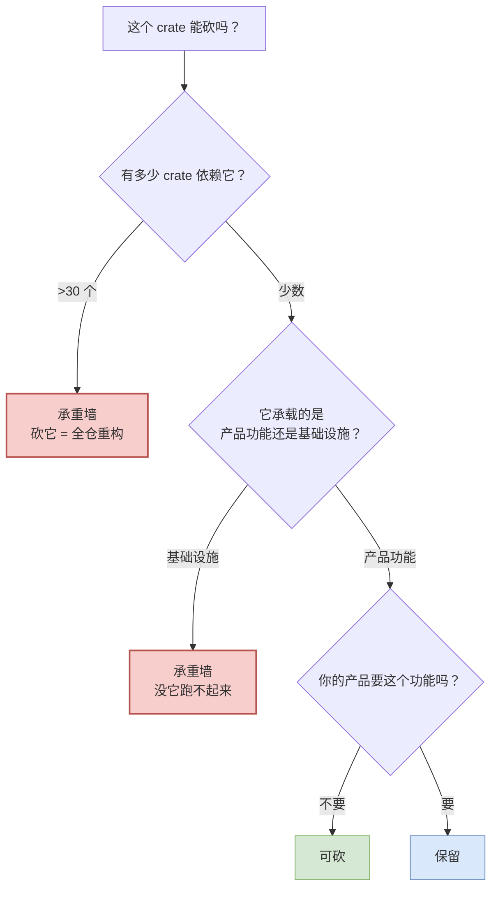
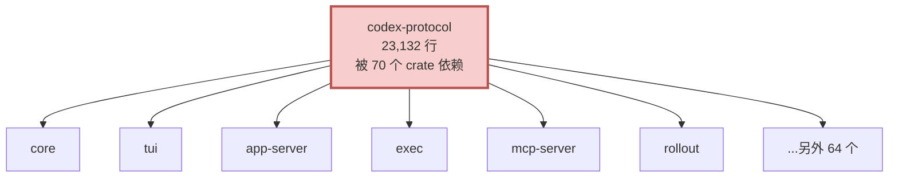
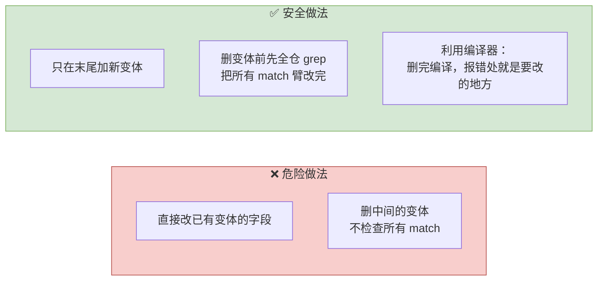
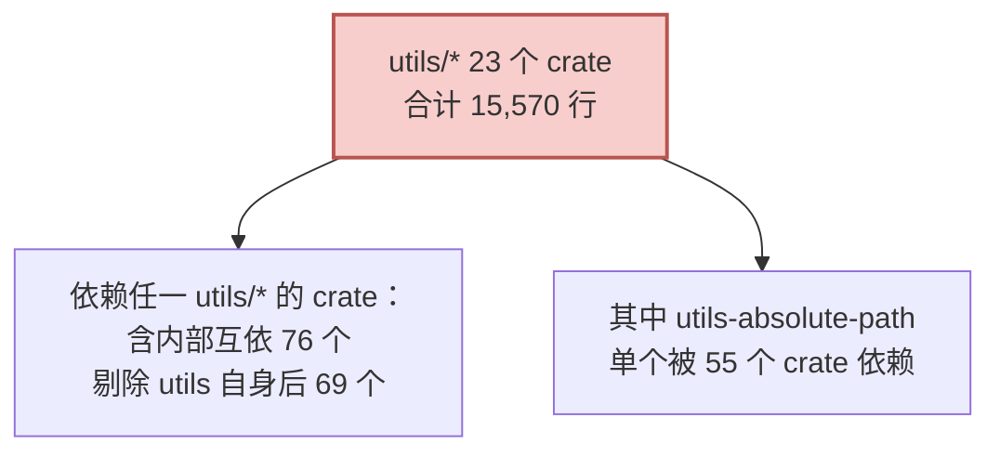
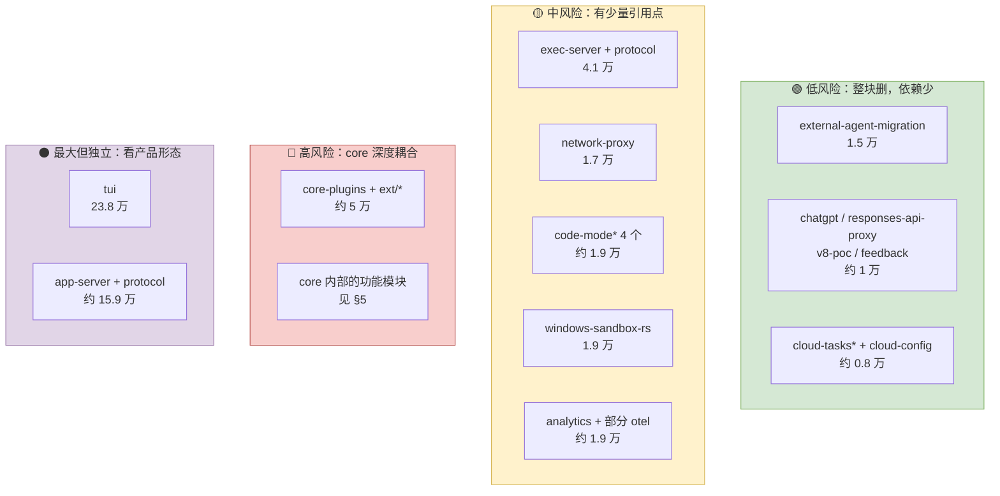
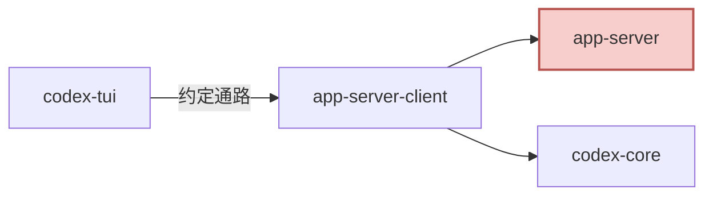
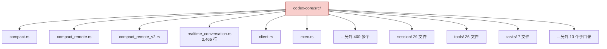
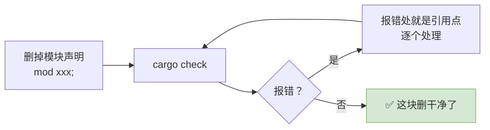
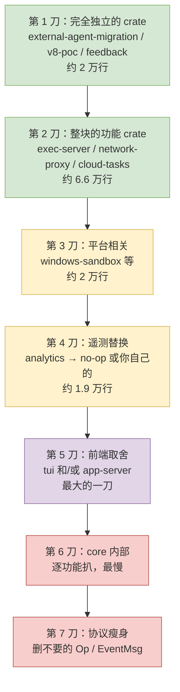

# 22 承重墙与削减地图

> **前置**：[21 fork 之前必须定的五件事](./21-before-you-fork.md)
> **配套图**：`dev_docs/diagrams/codex-02-layers.drawio.png`、`dev_docs/diagrams/codex-05-session-modules.drawio.png`

---

## 0. 判断标准

一个 crate 是不是承重墙，看两件事：



**反查依赖的命令**（fork 时你会反复用到）：

```bash
# 谁依赖了 X？
grep -rl "codex-X" codex-rs --include=Cargo.toml

# X 依赖了谁？
awk '/^\[dependencies\]/{f=1;next} /^\[/{f=0} f' codex-rs/X/Cargo.toml | grep '^codex'

# 源码里谁在 use 它？
rg 'codex_x::' codex-rs --type rust -l
```

---

## 第一部分：承重墙

## 1. `codex-protocol` —— 最大的一堵墙

**被 70 个 crate 依赖。** 它定义了所有人共用的消息类型（`Submission` / `Op` / `Event` / `EventMsg` 等）。



**改它的每一个类型都是全仓级别的地震。**

### 但你必须改它

因为你要加自己的 `Op`、删掉不要的 `Op`。**这堵墙上必须开门。**

### 怎么在承重墙上开门而不塌



**Rust 在这里帮了大忙**：

> **删掉一个枚举变体后，所有没处理它的 `match` 会立刻编译报错。** 编译器会带你走遍每一处。

**这是 fork Rust 项目相对于 fork Python 项目的最大优势。** 充分利用它——**删了就编译，跟着报错走。**

### ⚠️ 一个例外要注意

`Op` 标了 `#[non_exhaustive]`，`match` 末尾有一条 `_ => ...` 兜底分支。

**这条兜底分支会吃掉你本该看到的编译错误。** 删变体时它不会报错，运行时才发现漏了。

> **建议**：削减期间**临时注释掉那条兜底分支**，让编译器帮你找全，改完再加回来。

---

## 2. 其余承重墙

| crate | 为什么不能动 |
| ---- | ---- |
| `codex-config` | 配置装载是所有东西的前置。改了它，所有 crate 的初始化路径都变 |
| `utils/*`（23 个） | L0 层。其中 `utils-absolute-path` 单个被 **55 个 crate** 依赖 |
| `codex-state` | SQLite 层，5 个库 + 55 个迁移文件。动它要写迁移 |
| `codex-rollout` | 会话事实源。格式一改，历史会话全部读不出 |
| `codex-thread-store` | 会话操作面，建在上面两个之上 |
| `codex-http-client` | 所有出网请求的基座 |

### `utils/*` 特别说明

23 个小 crate，加起来只有 15,570 行——**很薄，但被依赖极广**。



**结论：别碰 utils。** 它们又薄又不碍事，砍掉省不了多少行，却会引发大面积重构。

---

## 3. 高风险改动面（不是承重墙，但要慎改）

这些可以改，但**改错的后果是静默错误，不是崩溃**：

| 位置 | 风险 |
| ---- | ---- |
| `codex-rs/core/src/session/rollout_reconstruction.rs` | 会话恢复。映射有偏差 → 用户拿到一个"看起来正常但状态错了"的会话 |
| rollout 的文件名/路径生成 | 时区问题（见 [09](./09-persistence.md) §3）。三处耦合，单独改一处会破坏另外两个 |
| 沙箱环境变量相关代码 | **绝对红线**，见 [21](./21-before-you-fork.md) §4 |
| `codex-rs/core/src/session/session.rs` / `codex-rs/core/src/session/turn_context.rs` | 星型枢纽，波及面最大 |

**建议**：这四条直接进禁改清单。真要改，每处配往返测试。

---

## 第二部分：削减地图

## 4. 按功能块的可砍清单



### 逐条的前置条件

| 可删除 | 行数 | 前提 | 风险 |
| ---- | ---: | ---- | ---- |
| `external-agent-migration` | 1.5 万 | 不需要从别家智能体迁移 | 🟢 |
| `chatgpt` / `responses-api-proxy` / `v8-poc` / `feedback` | 约 1 万 | provider 特有 / 实验性 | 🟢 |
| `cloud-tasks*` + `cloud-config` | 约 0.8 万 | 不做云任务 | 🟢 但 tui 有引用点 |
| `exec-server` + `exec-server-protocol` | 4.1 万 | 不需要跨 OS 远程执行 | 🟡 |
| `network-proxy` | 1.7 万 | 不需要网络代理层 | 🟡 |
| `code-mode*`（4 个） | 约 1.9 万 | 不需要 JS code-mode | 🟡 core 有 handler 引用 |
| `windows-sandbox-rs` | 1.9 万 | 不支持 Windows | 🟡 |
| `analytics` + 部分 `otel` | 约 1.9 万 | 换成你自己的遥测 | 🟡 **必须换，不能只删** |
| `ollama` / `lmstudio` | 小 | 不支持本地模型 | 🟢 但 tui 有引用点 |
| `core-plugins` + 大部分 `ext/` | 约 5 万 | 不做插件生态 | 🔴 core 直接依赖 |
| `tui` | **23.8 万** | 不做终端界面 | ⚫ 独立，删得干净 |
| `app-server` + `app-server-protocol` | 约 15.9 万 | 不做 IDE 集成 | ⚫ **但 TUI 依赖它！** |

### ⚠️ 两个陷阱

**① 删 `app-server` 会连累 TUI。**

TUI 抵达 core 的约定通路就是经 `app-server-client` → `app-server`（见 [10](./10-frontends-and-extensions.md) §2）。



**要么两个一起留，要么两个一起删（同时把 TUI 改成直连 core）。**

**② 删 `analytics` 不能只删。**

遥测代码散落在各处的初始化路径里。只删 crate 会到处编译错误。**正确做法是替换成一个 no-op 实现**，或者接你自己的遥测。

---

## 5. 🔴 最大的痛点：`core` 内部无法按目录切

这是 fork codex 最难的一件事，值得单独一节。

### 问题

`codex-core` 的 `src/` 下是 **411 个平铺模块**，嵌套模块数为 0。



**平铺意味着：你不能"删掉某个子目录"来去掉一个功能。** 只能逐模块判断。

### 应对方法

**① 从「入口」倒推，不要从「文件名」正推。**

一个功能的入口通常是提交循环里的某几个 `Op` 分支。顺着它往下扒：

```bash
# 例：要删实时语音会话
# 1. 找入口
rg 'Op::RealtimeConversation' codex-rs/core/src/session/handlers.rs

# 2. 看它调到哪
rg 'realtime_conversation' codex-rs/core/src --type rust -l

# 3. 反查这些文件还被谁用
```

**实时语音是个好例子**：入口是 6 个 `Op` 分支，主体是一个 2,465 行的单文件 + 一个小子目录。**边界清晰，可以整块删。**

**② 用编译器做删除验证。**



**这是 Rust 项目 fork 的最大红利。** 不用担心"删漏了什么运行时才发现"。

**③ 先删测试，再删实现。**

`core` 里 27% 的模块是 `*_tests`。先把要删功能的测试删掉，能大幅减少后续的编译错误噪音。

**④ 用模块依赖图辅助判断。**

`dev_docs/diagrams/codex-05-session-modules.drawio.png` 是从 `core/src/session/` 自动抽取的真实依赖图。同样的方法可以对任意子目录再跑一次，看清边界。

---

## 6. 削减顺序建议

**顺序很重要**——先砍独立的，再砍耦合的，让每一步都能编译通过。



**每一刀之后必须：**

| 检查 | 命令 |
| ---- | ---- |
| 编译通过 | `cargo check --workspace` |
| 测试通过 | `cargo test --workspace`（删了的功能的测试也要删） |
| 提交 | 一刀一个 commit，方便回退 |

> **协议瘦身放最后**，因为它波及面最大。前面砍完之后，很多 `Op` / `EventMsg` 已经没有引用点了，这时候删最安全。

---

## 7. 一份可以直接用的禁改清单模板

```markdown
# 禁改清单 v1

## 🔴 绝对禁止
- 沙箱环境变量相关的任何代码（技术性红线）

## 🟠 需要架构组批准
- codex-protocol 的已有类型（只允许末尾加变体）
- utils/* 下任何 crate
- codex-state 的迁移文件
- codex-rollout 的文件名/路径生成逻辑

## 🟡 需要配套测试
- session/rollout_reconstruction.rs（会话恢复）
  → 每个改动配「存 → 读 → 比对」往返测试
- session/session.rs、session/turn_context.rs（星型枢纽）
  → 改前先看模块依赖图

## 📋 修改需标注
- 所有从上游继承的文件，修改时在文件头加「Modified from upstream」
  （Apache 2.0 义务，见 21 篇）
```

---

## 本篇小结

| 你现在应该能回答 | 答案 |
| ---- | ---- |
| 最大的承重墙是什么？ | `codex-protocol`，被 70 个 crate 依赖 |
| 怎么在它上面开门？ | 只在末尾加变体；删变体靠编译器带路 |
| 删变体时要注意什么？ | **临时注释掉 `_ =>` 兜底分支**，否则漏了不报错 |
| 哪些绝对别碰？ | 沙箱环境变量、utils/*、state 迁移、rollout 路径 |
| 最大的一刀在哪？ | `tui`（23.8 万行） |
| 删 app-server 有什么坑？ | **TUI 依赖它**，要么一起留要么一起删 |
| 删 analytics 有什么坑？ | **不能只删，要替换成 no-op** |
| core 为什么最难砍？ | 411 个平铺模块，不能按目录切，只能从 `Op` 入口倒推 |
| 削减顺序？ | 独立 → 整块 → 平台 → 遥测 → 前端 → core 内部 → 协议 |

---

**下一篇**：[23 实施路线与团队分工](./23-rollout-plan.md) —— 把上面的东西变成可执行的排期。
