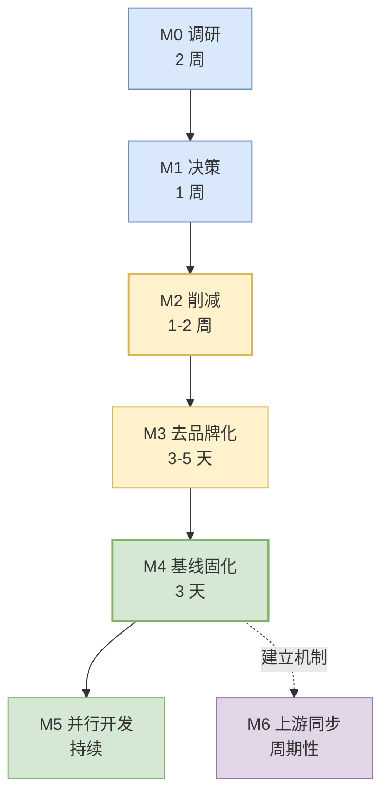
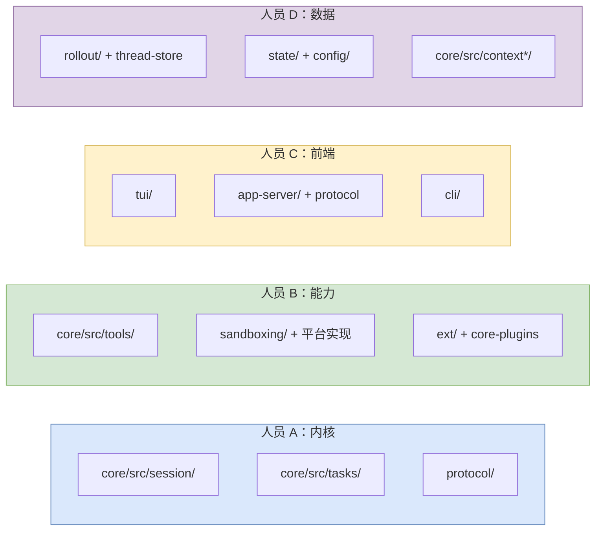
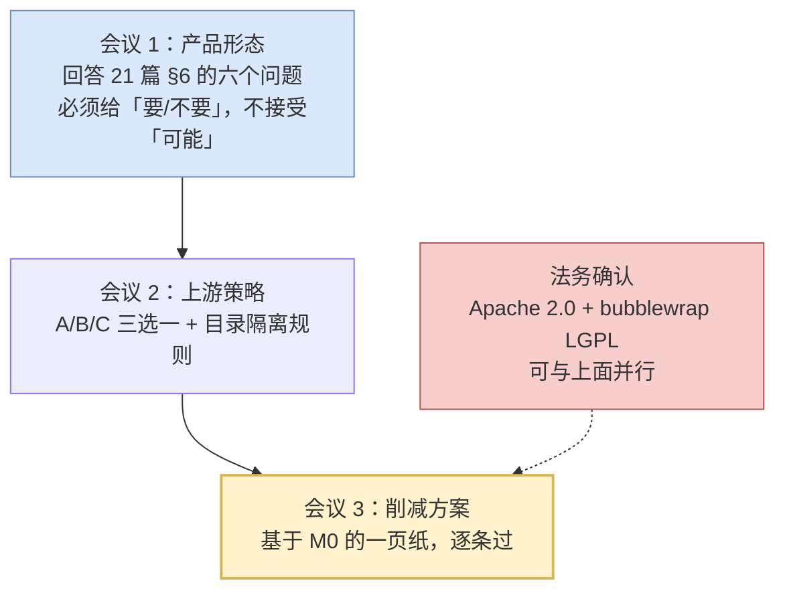
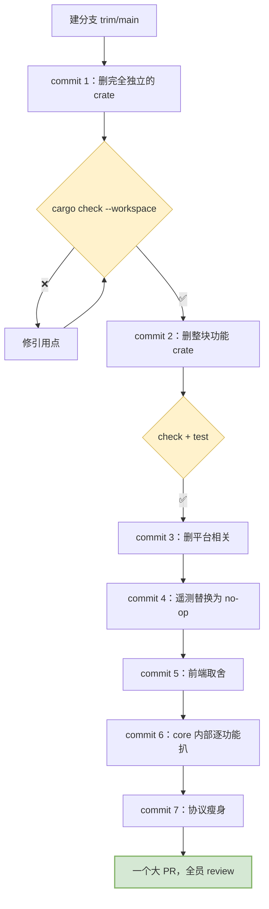
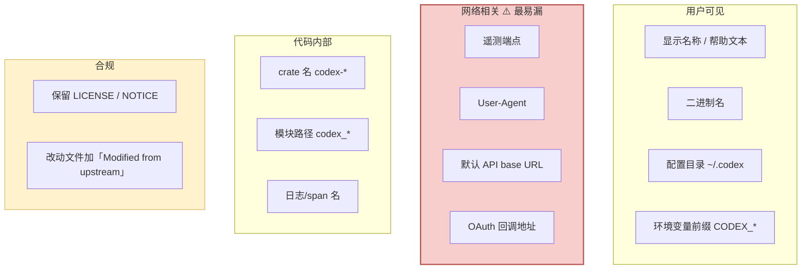
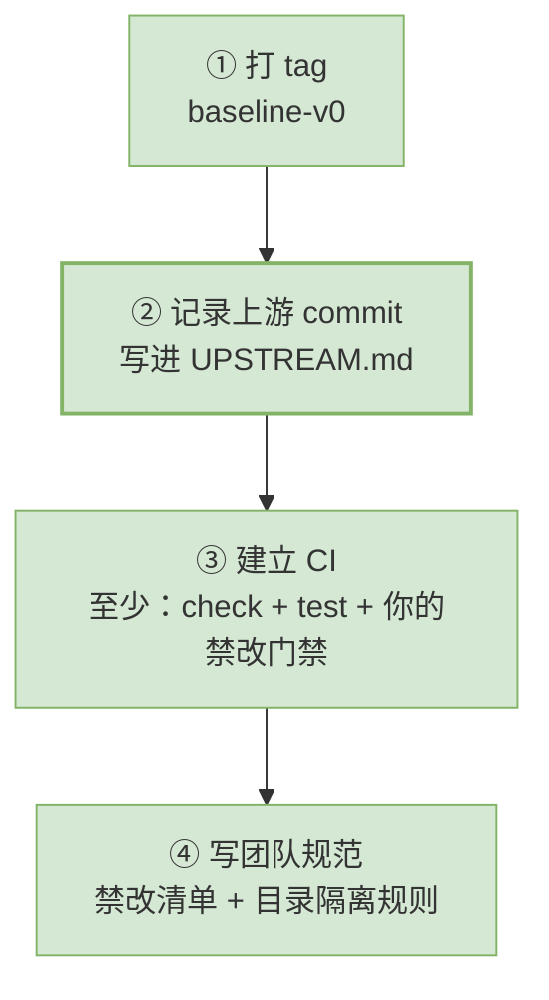
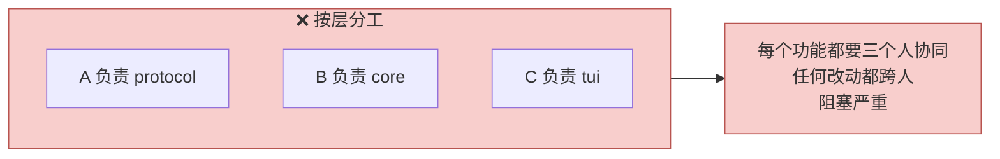
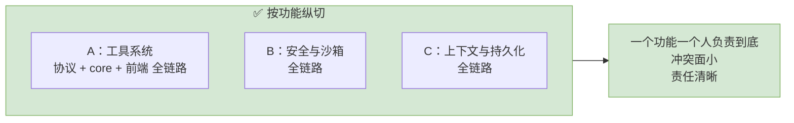
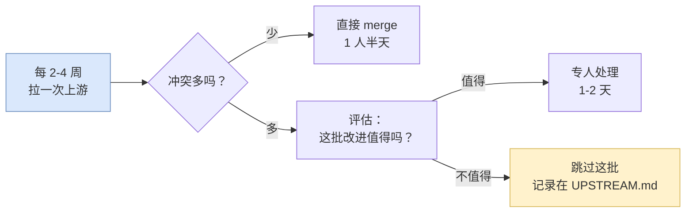

# 23 实施路线与团队分工

> **前置**：[21 fork 之前必须定的五件事](./21-before-you-fork.md)、[22 承重墙与削减地图](./22-load-bearing-and-cuts.md)

---

## 0. 全景



**关键约束**：**M2 削减必须一次性完成，且在 M5 并行开发之前。** 边砍边开发会让每个人都在处理别人砍掉的东西。

---

## M0：调研（2 周）

### 纪律：全员只读不写

**这两周不产出任何代码。** 产出的是认知。

### 认领分配

按 [01](./01-coordinates.md) §5 的行数分布，建议这样分：



### 每人的产出：一页纸 × N

```markdown
## crate/模块名：______

一句话职责：

被谁依赖（反查）：
  grep -rl "codex-X" codex-rs --include=Cargo.toml

依赖了谁：

行数：

能不能砍：[ ] 能  [ ] 不能  [ ] 有条件

如果能砍，前提是：
如果不能砍，为什么：
如果有条件，条件是：

我发现的坑（写给同事看）：
```

**这些一页纸拼起来就是削减地图。**

### 验收标准

| 项 | 标准 |
| ---- | ---- |
| 覆盖率 | 前 30 大 crate 全部有一页纸 |
| 全员能画出 | 三层循环的图（不看资料） |
| 全员能说清 | 审批和沙箱的顺序与分工 |

---

## M1：决策（1 周）

### 产出：四页决策备忘

模板见 [21](./21-before-you-fork.md) §8。四页：产品形态定义、上游策略、合规确认、禁改清单 v0。

### 关键会议



> **会议 1 最容易失控。** 六个问题里只要有一个答"再看看"，削减方案就定不下来。**逼团队做决定**——错了可以改，悬着改不了。

---

## M2：削减（1–2 周）

### 操作序列

按 [22](./22-load-bearing-and-cuts.md) §6 的七刀顺序。**一刀一个 commit。**



### 每刀之后的验证

```bash
cargo check --workspace          # 必须过
cargo test --workspace           # 删了的功能的测试也要删
git commit -m "trim: 删除 XXX（前提：不需要 YYY）"
```

**commit message 里写清前提**——三个月后有人问"为什么删了这个"，答案在那儿。

### 两个必须记住的技巧

**① 删枚举变体前，临时注释掉兜底分支。**

```rust
// match sub.op {
//     ...
//     _ => false,        // ← 削减期间注释掉这行
// }
```

否则编译器不会告诉你哪里漏了。改完再加回来。

**② 先删测试，再删实现。**

`core` 里 27% 的模块是测试。先删能大幅减少编译错误噪音。

### 验收标准

| 项 | 标准 |
| ---- | ---- |
| 编译 | `cargo check --workspace` 零错误 |
| 测试 | 全绿（删掉的功能的测试已一并删除） |
| 行数 | 对照 M1 的削减方案，达成率 ≥ 80% |
| 可运行 | 主流程端到端跑通 |

---

## M3：去品牌化（3–5 天）

**Apache 2.0 允许改名，但要改干净。** 完整清单：



> ⚠️ **网络那一组最容易漏。** 不改遥测端点 = 你的用户数据往上游服务器发。既是合规问题也是隐私问题。
>
> **验证方法**：跑一遍主流程，抓包看有没有请求发往上游域名。

### crate 改名要不要做

| 选择 | 优点 | 缺点 |
| ---- | ---- | ---- |
| **改** | 干净，不会混淆 | **每次 merge 上游都要处理大量重命名冲突** |
| **不改** | merge 容易 | 你的代码库里到处是 `codex_` |

> **如果你选了"定期同步上游"策略，建议不改内部 crate 名。** 只改用户可见的部分。这个取舍要在 M1 就定下来。

---

## M4：基线固化（3 天）

**这是最容易被跳过、但最不该跳过的一步。**

### 要做的四件事



### `UPSTREAM.md` 长什么样  <!-- ref-exempt: 指你在自己 fork 中新建的文件，不是本仓库内已存在的文件 -->

```markdown
# 上游同步记录

上游：openai/codex
策略：B 定期同步（按目录隔离）

## 基线
- 基线 commit：<hash>
- 基线日期：2026-XX-XX
- 削减 PR：#1

## 目录隔离规则
- 不动（可干净 merge）：protocol/ config/ utils/ state/ rollout/
- 已整块删除：exec-server/ network-proxy/ cloud-tasks/ code-mode*/ ...
- 我方新增（前缀 yourname-）：yourname-xxx/ ...

## 同步历史
| 日期 | 上游 commit | 冲突数 | 处理人 | 备注 |
| ---- | ---- | ---- | ---- | ---- |
```

**没有这个文件，三个月后没人知道你们 fork 自哪、改了什么。**

### 禁改门禁

把 [22](./22-load-bearing-and-cuts.md) §7 的清单变成一个 CI 脚本：

```bash
# 示例：检查有没有人碰沙箱环境变量
if git diff --name-only origin/main...HEAD | xargs grep -l "SANDBOX.*ENV_VAR" 2>/dev/null; then
  echo "❌ 触碰了沙箱环境变量红线"
  exit 1
fi
```

> **codex 自己的教训**（见 [10](./10-frontends-and-extensions.md) §2）：**加门禁时必须同时写清楚"它不保证什么"**，否则会被过度解读。

---

## M5：并行开发（持续）

### ⚠️ 分工原则：按纵向切片，不要按层

**最容易犯的错**是按架构层分工：





**唯一的例外是 `protocol`** —— 它是所有人的共享区。建议：

| 做法 | 说明 |
| ---- | ---- |
| 协议改动走单独 PR | 不和功能实现混在一起 |
| 协议改动要架构组过 | 见 [22](./22-load-bearing-and-cuts.md) §7 |
| 只在末尾加变体 | 减少冲突 |

### 代码规范的两条底线

从 codex 抄的（见 [20](./20-design-decisions.md) 决策 10）：

| 规范 | 怎么强制 |
| ---- | ---- |
| 内核里不能 print/input | CI 脚本 grep |
| 消息类型只能定义在 protocol | CI 脚本检查其他目录有没有 `#[derive(Serialize)]` 的顶层消息类型 |

**写在文档里的规范会被绕过，写成 CI 的不会。**

---

## M6：上游同步（周期性）

### 频率建议



> **别攒着。** 攒三个月再 merge，冲突量是每两周 merge 的十倍不止。

### 冲突处理原则

| 冲突类型 | 处理 |
| ---- | ---- |
| 你删了 / 上游改了 | **保持删除**。这是最常见的一类，批量 `git rm` |
| 你没动 / 上游改了 | 直接接受上游 |
| 你改了 / 上游也改了 | **最贵的一类**。这就是"别在上游文件里东改一行"的原因 |
| 上游新增文件 | 判断：属于你删掉的功能吗？是则不要 |

### 一个实用技巧

```bash
# 只看上游在"你保留的目录"里的改动
git log --oneline HEAD..upstream/main -- codex-rs/protocol codex-rs/core/src/session
```

**先看改了什么，再决定要不要 merge。** 不要盲目 merge 完再看。

---

## 常见失败模式

写在这里，因为它们都是**可预测的**：

| 失败模式 | 症状 | 预防 |
| ---- | ---- | ---- |
| **边砍边开发** | 每个人都在修别人砍出来的编译错误 | M2 必须一次性完成 |
| **产品形态没定死** | 削减方案反复推翻 | M1 会议 1 逼出"要/不要" |
| **按层分工** | 每个小功能都要三人协同 | 按功能纵切 |
| **不记上游 commit** | 三个月后不知道 fork 自哪 | M4 的 `UPSTREAM.md` |  <!-- ref-exempt: 同上，指你 fork 中新建的文件 -->
| **攒着不 merge** | 半年后冲突到无法处理 | 每 2–4 周一次 |
| **规范只写文档** | 三个月后全被绕过 | 变成 CI |
| **遥测端点没改** | 用户数据发往上游 | M3 抓包验证 |
| **`core` 想按目录砍** | 17 个子目录能整块切，但顶层还平铺着 112 个文件，砍到那里卡住 | 顶层部分从 `Op` 入口倒推，见 [22](./22-load-bearing-and-cuts.md) §5 |

---

## 一个务实的提醒

> **不要指望 M2 削减能一次砍到位。**

真实情况是：削减完跑起来，开发两个月之后你会发现——

- 有些东西砍早了（后来发现需要）
- 有些东西该砍没砍（一直没人碰）

**这是正常的。** M2 的目标不是"完美的削减"，而是**"一个能编译、能跑、团队能理解的基线"**。剩下的边开发边调整。

**唯一不能返工的是 M1 的产品形态决策和 M4 的基线固化。** 那两个错了，后面全乱。

---

## 本篇小结

| 里程碑 | 时长 | 核心产出 | 最容易失败的点 |
| ---- | ---- | ---- | ---- |
| **M0 调研** | 2 周 | 每个 crate 一页纸 | 有人忍不住开始改代码 |
| **M1 决策** | 1 周 | 四页决策备忘 | 产品形态答"再看看" |
| **M2 削减** | 1–2 周 | 一个大 PR，一刀一 commit | 边砍边开发 |
| **M3 去品牌化** | 3–5 天 | 改名 + 合规标注 | **遥测端点没改** |
| **M4 基线固化** | 3 天 | tag + UPSTREAM.md + CI | 被跳过 |
| **M5 并行开发** | 持续 | — | 按层分工 |
| **M6 上游同步** | 每 2–4 周 | 同步记录 | 攒着不 merge |

---

**教程到此结束。**

回到 [目录](./README.md)，或者从 [01 坐标系](./01-coordinates.md) 重新读一遍——第二遍会快很多，而且你会看到第一遍漏掉的东西。

**遇到不懂的地方、觉得某段说得不对、或者想让某一篇更深入，直接提出来。这些文档是活的。**
