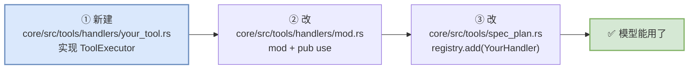

# 30 动手篇：跑起来、看见、改一次

> **前置**：理解篇 [01](./01-coordinates.md)–[10](./10-frontends-and-extensions.md)（至少 01–06）

---

## 0. 这一篇为什么必要

前面十几篇都是**读**。但"读懂了"和"能改"之间有一道坎，跨过去只有一个办法：**亲手跑一次、亲眼看见、亲手改一处**。

这一篇给三件事：

| # | 做什么 | 验证了什么 |
| ---: | ---- | ---- |
| 1 | 从源码跑起来 | 你的环境是通的 |
| 2 | **看见三层循环** | [04](./04-three-loops.md) 讲的东西真的存在 |
| 3 | **加一个工具** | 你能改 [06](./06-tools.md) 那套系统了 |

> **强烈建议真的做一遍第 3 件。** 读十遍工具系统，不如加一个工具。

---

## 1. 跑起来

### 前提

仓库用 [`just`](https://github.com/casey/just) 作为命令入口。**`justfile` 是命令的事实源**——文档里的命令可能过时，`just -l` 不会。

```bash
just -l              # 列出所有可用命令
```

> ⚠️ 注意 `justfile` 第一行是 `set working-directory := "codex-rs"`。**所有 recipe 都在 `codex-rs/` 下执行**，但 `just` 命令本身在仓库根跑。

### 四条最常用的

```bash
just install            # rustup show + cargo fetch，拉依赖
just codex              # 从源码跑 TUI（等价 cargo run --bin codex）
just exec "你的任务"     # 从源码跑 codex exec，非交互
just test -p codex-core # 只跑 codex-core 的测试
```

`just codex` 有别名 `just c`。

### 编译很慢怎么办

第一次全量编译在普通笔记本上要**十几分钟**。之后靠增量编译，但改到 `codex-core` 或 `codex-protocol` 时仍会波及一大片（这正是 [01](./01-coordinates.md) §4 说的"134 个抽屉"的代价与收益）。

**几个实用做法：**

| 做法 | 命令 |
| ---- | ---- |
| **只检查不生成二进制**（快得多） | `cargo check -p codex-core` |
| 只编一个 crate | `cargo build -p codex-core` |
| 只跑一个 crate 的测试 | `just test -p codex-core` |
| 只跑一个测试 | `just test -p codex-core 测试名` |

> ⚠️ **不要加 `--all-features`。** 这个仓库**制度性禁止 workspace crate features**——`.github/scripts/verify_cargo_workspace_manifests.py` 会直接拒绝任何 `[features]` 段。`justfile` 里的注释也写着 *"Workspace crate features are banned, so there should be no need to add `--all-features`."*
>
> （AGENTS.md 里那条"偶尔要用 `--all-features`"的建议**已经陈旧**，见 `dev_docs/rules/combined/AI_RULES.md` §3.5 的 S2。）

### 格式与 lint

```bash
just fmt          # 格式化（Rust + Bazel + Python 一起）
just fmt-check    # 只检查不改
just clippy       # lint
just fix -p codex-core   # 自动修 lint（大改动之后跑）
```

---

## 2. ⚠️ 看见三层循环：先解决"日志默认不写文件"

这是**最容易卡住的一步**，而且没有任何提示。

### 默认情况下 TUI 不写日志文件

看 `codex-rs/tui/src/lib.rs:1227`：

```rust
let (tui_file_layer, _tui_file_log_guard) = if config_toml_log_dir_configured {
    let log_dir = config.log_dir.clone();
    // …建立文件日志层…
} else {
    (None, None)          // ← 默认走这里：不写文件
};
```

而 `config_toml_log_dir_configured` 的判定是（同文件 `:1183`）：

```rust
let config_toml_log_dir_configured = config
    .config_layer_stack
    .effective_config()
    .as_table()
    .is_some_and(|table| table.contains_key("log_dir"))
    || config.config_layer_stack.requirements_toml().log_dir.is_some();
```

**即：必须在配置里显式出现 `log_dir` 这个键，文件日志才存在。**

> **注意这个判定的微妙之处**：它检查的是**键存不存在**，不是值是什么。`Config` 里的 `log_dir` 字段**有默认值**，但那个默认值不会让日志打开——你必须自己在用户配置文件里写出这个键。
>
> **这是一个典型的"默认值存在 ≠ 功能开启"**，和 [12](./12-config-and-features.md) §3 的 `Mdm` 层、[11](./11-model-client.md) §1 的死文件是同一类认知陷阱的不同形态。

### 打开它

在 `$CODEX_HOME/config.toml`（默认 `~/.codex/config.toml`）里加一行：

```toml
log_dir = "~/.codex/log"
```

然后日志会写到 `<log_dir>/codex-tui.log`（文件名常量 `TUI_LOG_FILE_NAME`，`codex-rs/tui/src/lib.rs:228`，Unix 下权限 `0o600`）。

### 调日志级别

默认过滤器是：

```rust
EnvFilter::new("codex_core=info,codex_tui=info,codex_rmcp_client=info")
```

用 `RUST_LOG` 覆盖它（`EnvFilter::try_from_default_env()` 优先）：

```bash
RUST_LOG=codex_core=trace,codex_tui=info just codex
```

> **Rust 小注（给 Python 读者）**：`EnvFilter` 的语法是 `目标=级别`，逗号分隔。`codex_core` 是 **crate 名**（`-` 变 `_`），相当于 Python `logging.getLogger("codex_core").setLevel(TRACE)`。
>
> 级别从低到高：`trace < debug < info < warn < error`。设成 `trace` 会非常吵，建议只对你关心的那个 crate 开。

### 现在去看那些 span

日志层配了 `FmtSpan::NEW | FmtSpan::CLOSE`——**span 的创建和结束都会打一行**。这意味着你可以直接在日志里看到 [04](./04-three-loops.md) 和 [05](./05-inside-a-turn.md) 描述的结构：

```bash
tail -f ~/.codex/log/codex-tui.log | grep -E "session_loop|session_task|run_turn|stream_request"
```

**对照着找这些名字：**

| span 名 | 对应 | 出处 |
| ---- | ---- | ---- |
| `session_loop` | **第 1 层**提交循环 | [02](./02-startup.md) §4 那个 `tokio::spawn` |
| `session_task.turn` | **第 2 层**普通任务 | [04](./04-three-loops.md) §5 的 `span_name()` |
| `session_task.compact` | 第 2 层压缩任务 | 手动压缩才有，见 [08](./08-context.md) §2 |
| `session_task.user_shell` | 第 2 层用户 shell | **注意它的 `kind` 是 `Regular`**（[04](./04-three-loops.md) §5 那个坑） |
| `run_turn.prepare_sampling_request_input` | 拼模型输入 | [05](./05-inside-a-turn.md) §2 |
| `stream_request` | 发出去那一刻 | [11](./11-model-client.md) §4 |
| `receiving_stream` / `handle_responses` | 流式事件循环 | [05](./05-inside-a-turn.md) §3 |

> **这是本篇最有价值的五分钟**：跑一句"帮我看看这个目录里有什么"，然后在日志里**亲眼看到** `session_loop` → `session_task.turn` → `run_turn.*` → `stream_request` → `receiving_stream` 依次出现。
>
> 前面十篇讲的结构，在这一刻会从"文字"变成"你见过的东西"。

---

## 3. 看见模型实际收到了什么

[11](./11-model-client.md) §8 说"要有 dump 能力"——codex 真的有：

```bash
just codex -- debug prompt-input "帮我改一下这个函数"
```

子命令定义在 `codex-rs/cli/src/main.rs:236`：

> "Render the model-visible prompt input list as JSON."

实现在 `codex-rs/core/src/prompt_debug.rs`，注意它会设 `config.ephemeral = true`——**不会污染你的会话记录**。

**你会看到 [05](./05-inside-a-turn.md) §5 讲的那些注入片段真实地拼在一起**：环境信息、仓库的 `AGENTS.md`、权限说明、你的那句话。

> **调模型出问题时，第一件事就是跑这个。** 80% 的"模型行为不对"其实是"发出去的东西和你以为的不一样"。

顺带一提，`codex debug models` 能把模型目录（含 [11](./11-model-client.md) §2 说的 `base_instructions`）打出来。

---

## 4. 加一个工具：只要改 3 个文件

这是**验证你真的懂了 [06](./06-tools.md) 的方式**。

### 先读最简单的那个 handler

`codex-rs/core/src/tools/handlers/current_time.rs`——**它是整个 handlers 目录里最短、最完整的一个**，五脏俱全：定义 spec、实现 handle、定义输出类型。

**照着它抄就行。**

### 三个文件



**① 新建 `core/src/tools/handlers/your_tool.rs`**<!-- ref-exempt: 这是你要新建的文件，仓库中当然不存在 --> —— 实现 `ToolExecutor`（trait 在 `codex-rs/tools/src/tool_executor.rs:57`）：

```rust
pub struct YourHandler;

impl ToolExecutor<ToolInvocation> for YourHandler {
    fn tool_name(&self) -> ToolName { ToolName::from("your_tool") }

    fn spec(&self) -> ToolSpec {
        // 告诉模型这个工具叫什么、干什么、参数长什么样
        ToolSpec::Function(ResponsesApiTool { /* … */ })
    }

    fn handle(&self, invocation: ToolInvocation) -> ToolExecutorFuture<'_> {
        Box::pin(async move {
            // 真正干活
            Ok(boxed_tool_output(YourOutput { /* … */ }))
        })
    }
}

impl CoreToolRuntime for YourHandler {}   // ← 别忘了这行标记
```

**② `codex-rs/core/src/tools/handlers/mod.rs`** —— 两行：

```rust
mod your_tool;                              // 挂进来（Rust 默认私有）
pub use your_tool::YourHandler;             // 再导出
```

**③ `codex-rs/core/src/tools/spec_plan.rs`** —— 一行：

```rust
registry.add(YourHandler);
```

（对照 `codex-rs/core/src/tools/spec_plan.rs:832` 那行 `registry.add(CurrentTimeHandler);`。）

### `ToolExecutor` 的默认方法就是你的开关

trait 有几个带默认实现的方法，**它们直接对应 [06](./06-tools.md) 讲的那些能力**：

```rust
fn exposure(&self) -> ToolExposure { ToolExposure::Direct }
fn supports_parallel_tool_calls(&self) -> bool { false }      // ← 默认不并行
fn search_info(&self) -> Option<ToolSearchInfo> { /* 从 spec 推 */ }
```

> **注意 `supports_parallel_tool_calls` 默认是 `false`。**
>
> 这是 [06](./06-tools.md) §3 和 [05](./05-inside-a-turn.md) §3 那个 `FuturesOrdered` 并发派发的开关。**默认不并行是正确的选择**——并行是需要证明安全的，不是默认假设。你的工具确认可以并发跑（比如纯读），才显式开。

### 别忘了注册表会拒绝重名

`register_trusted_with_exposure` 里有：

```rust
error_or_panic(format!("tool {tool_name} already registered"));
```

**重名直接炸。** 这是好事——总比两个工具静默地互相覆盖强。

---

## 5. 改完之后跑什么

按 `dev_docs/rules/combined/AI_RULES.md` §7 的自检清单，改 `codex-core` 至少要：

```bash
just fmt                    # 格式化
just test -p codex-core     # 单 crate 测试
just clippy                 # lint
```

**几条容易踩空的：**

| 情况 | 还要做什么 |
| ---- | ---- |
| 改了 `ConfigToml` | `just write-config-schema` |
| 改了 Cargo 依赖 | `just bazel-lock-update` |
| 改了用户可见 UI | **补 `insta` 快照**（AGENTS.md 里是 Requirement，最常被漏） |
| 新增 `include_str!` | 往 `BUILD.bazel` 的 `compile_data` 里补（Bazel 不会自动让源码树文件可见） |
| 改了 `codex-rs/tui` | **不能出现 `codex_core`**，连注释和字符串字面量里都不行（见下） |

> ⚠️ **TUI 那条边界是字面量级检查。** `.github/scripts/verify_tui_core_boundary.py` 用逐行正则扫 `codex-rs/tui/**/*.rs`（含 `tests/`），**不做语法解析**——你在注释里写一句 `// 这里以前用 codex_core::Foo` 也会挂 CI。
>
> 完整含义见 [10](./10-frontends-and-extensions.md) §2 — 一条 CI 强制的架构边界。

---

## 6. 三个练习

按难度排：

### 练习 1（30 分钟）：看见五层嵌套

打开 `log_dir`，设 `RUST_LOG=codex_core=trace`，跑一句需要用工具的话（比如"这个目录里有几个 Rust 文件"），然后在日志里找出 [05](./05-inside-a-turn.md) §1 那五层的 span，按时间顺序排出来。

**验证点**：你能指出哪一层是 spawn 出去的（第 1→2 层），哪些是同步调用。

### 练习 2（1 小时）：加一个工具

抄 `codex-rs/core/src/tools/handlers/current_time.rs`，加一个返回当前 git 分支名的工具。

**验证点**：改动只碰了 3 个文件；`just test -p codex-core` 全绿；跑起来问模型"我在哪个分支"，它会调你的工具。

### 练习 3（半天）：让它并行

给你的工具开 `supports_parallel_tool_calls() -> true`，然后让模型同时调它两次，在日志里观察 `FuturesOrdered` 的派发与收集顺序。

**验证点**：你能解释为什么结果是**按派发顺序**返回的，以及如果换成"先完成先返回"会出什么问题（提示：[05](./05-inside-a-turn.md) §3）。

---

## 本篇小结

| 你现在应该能回答 | 答案 |
| ---- | ---- |
| 命令的事实源是什么？ | **`justfile`**，用 `just -l` 列出。文档会过时 |
| 从源码跑起来？ | `just codex`（别名 `just c`） |
| 为什么看不到日志文件？ | **默认不写**。必须在用户配置文件里显式写 `log_dir` 键 |
| 怎么调日志级别？ | `RUST_LOG=codex_core=trace`，覆盖默认的 `info` |
| 怎么亲眼看到三层循环？ | grep span 名：`session_loop` → `session_task.*` → `run_turn.*` → `stream_request` |
| 怎么看模型实际收到什么？ | `just codex -- debug prompt-input "…"` |
| 加一个工具要改几个文件？ | **3 个**：新 handler、`codex-rs/core/src/tools/handlers/mod.rs`、`codex-rs/core/src/tools/spec_plan.rs` |
| 照着哪个 handler 抄？ | `codex-rs/core/src/tools/handlers/current_time.rs`，最短且完整 |
| 工具默认能并行吗？ | **不能**。`supports_parallel_tool_calls()` 默认 `false`，要显式开 |
| 能加 `--all-features` 吗？ | **不能**。本仓库制度性禁止 workspace crate features |

---

**下一篇**：[31 怎么测一个智能体](./31-testing-an-agent.md) —— 加完工具之后，怎么证明它是对的。
