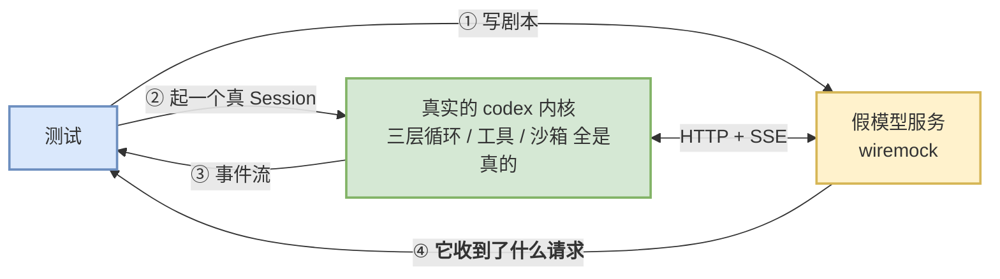

# 31 怎么测一个智能体

> **前置**：[30 动手篇](./30-hands-on.md)

---

## 1. 问题：智能体看起来根本没法测

你刚加完一个工具（[30](./30-hands-on.md) §4），想写个测试证明它是对的。然后你发现：

| 障碍 | 为什么 |
| ---- | ---- |
| **模型输出不确定** | 同一句话问两次，回答不一样 |
| **要花钱、要联网** | 每跑一次测试就是一次 API 调用 |
| **慢** | 一次真实调用几秒到几十秒 |
| **中间过程不可见** | 只有最终结果，不知道中间调了什么 |

**很多团队到这里就放弃了**，改成"人工点一点看看对不对"。然后三个月后没人敢改核心逻辑。

**codex 的答案很干脆：把模型换掉。**

---

## 2. 核心手法：模型是可以编剧的

关键认知：

> **智能体的不确定性 100% 来自模型。把模型换成一个"照剧本念台词"的假服务，整条链路立刻变回一个普通的确定性系统。**

codex 用 `wiremock` 起一个本地 HTTP 服务，冒充模型服务端：

```rust
let server = start_mock_server().await;

mount_sse_once(&server, sse(vec![
    ev_response_created("resp-1"),
    ev_function_call("call-1", "shell", r#"{"command":["ls"]}"#),   // ← 让"模型"要求跑 ls
    ev_completed("resp-1"),
])).await;
```

**这三行就是"剧本"**：模型会先发一个 `response.created`，然后要求调用 `shell` 工具执行 `ls`，然后结束。

`ev_*` 是一组构造 SSE 事件的辅助函数（`codex-rs/core/tests/common/responses.rs`）：

| 函数 | 造出什么 |
| ---- | ---- |
| `ev_response_created(id)` | 流开始 |
| `ev_assistant_message(id, text)` | 模型说了一句话 |
| `ev_function_call(call_id, name, args)` | **模型要求调用工具** |
| `ev_completed(id)` | 流结束 |
| `ev_completed_with_tokens(id, n)` | 流结束 + 指定 token 用量（测压缩用） |

`sse(vec![...])` 把它们拼成真正的 SSE 报文格式。

> **给 Python 读者的对照**：这就是 `responses` / `respx` 那类库干的事——起一个假 HTTP 服务，按预设脚本回复。区别只是这里回的是 SSE 流，不是一次性 JSON。

### 于是整条链路都变得可测了



**注意只有模型是假的。** 三层循环、工具路由、审批、沙箱、持久化——**全都是真的在跑**。

---

## 3. ⭐ 最关键的一招：断言"发出去了什么"

这是本篇最该带走的东西。

大多数人测智能体只会断言**结果**："跑完之后文件被改了吗"。**但智能体最容易错的地方在输入侧**——发给模型的上下文里少了一段指令、工具 schema 写错了、历史顺序颠倒了。

**codex 的假服务会把收到的每个请求录下来**：

```rust
pub struct ResponseMock {
    requests: Arc<Mutex<Vec<ResponsesRequest>>>,
}

impl ResponseMock {
    pub fn single_request(&self) -> ResponsesRequest { /* 断言恰好一次请求 */ }
    pub fn requests(&self) -> Vec<ResponsesRequest> { /* 全部 */ }
    pub fn last_request(&self) -> Option<ResponsesRequest> { /* 最后一次 */ }
    pub fn saw_function_call(&self, call_id: &str) -> bool { /* … */ }
    pub fn function_call_output_text(&self, call_id: &str) -> Option<String> { /* … */ }
}
```

而 `ResponsesRequest` 上挂了一整套**面向语义的取值器**，不用你自己啃 JSON：

| 方法 | 回答什么问题 |
| ---- | ---- |
| `instructions_text()` | **系统提示词发出去的是哪一份**（对应 [11](./11-model-client.md) §2 那三级解析） |
| `tool_by_name(namespace, name)` | **这个工具的 schema 下发对了吗** |
| `message_input_texts(role)` | 某个角色的消息文本 |
| `message_input_image_urls(role)` | 图片有没有正确附上 |
| `input()` / `inputs_of_type(ty)` | 完整输入项 / 按类型筛 |
| `function_call_output(call_id)` | **工具结果是怎么拼回去的** |
| `body_contains_text(text)` | 粗粒度兜底 |

> **这套取值器就是测试可维护性的关键。**
>
> 如果每个测试都写 `body["input"][3]["content"][0]["text"]`，改一次协议就要改几百个测试。**给请求对象加语义方法，把协议形状的知识收敛在一个地方。**
>
> **这条是自建项目最该抄的。** 成本是一天，收益是三年。

### 举个具体的例子

想验证 [11](./11-model-client.md) §2 说的"恢复会话要用历史里那份提示词"，测试大概长这样：

```rust
// 1. 用旧提示词跑一个会话，存下来
// 2. 改掉当前模型的 base_instructions
// 3. 恢复那个会话，随便说一句话
// 4. 断言：
assert_eq!(mock.last_request().instructions_text(), OLD_INSTRUCTIONS);
//                                ^^^^^^^^^^^^^^^^^^ 断言发出去的，不是断言结果
```

**只断言结果的话，这个 bug 根本测不出来**——模型（假的）无论收到哪份指令，回的都是同一段剧本。

---

## 4. 时序问题：事件驱动的等待

消息驱动架构没有"函数返回"这个时刻（[03](./03-protocol.md) §6 说的代价之一），所以测试不能写 `result = agent.run(...)`。

`core_test_support` 给的是**等到某个事件出现**：

```rust
pub async fn wait_for_event<F>(codex: &CodexThread, predicate: F) -> EventMsg
where F: FnMut(&EventMsg) -> bool
{
    wait_for_event_with_timeout(codex, predicate, Duration::from_secs(1)).await
}
```

用法：

```rust
let ev = wait_for_event(&codex, |e| matches!(e, EventMsg::ExecApprovalRequest(_))).await;
```

**注意默认超时只有 1 秒。** 这是因为模型是假的，一切都在本地内存里——**慢就说明真出问题了**，而不是"网络有点卡"。

> **给自建项目**：**默认超时要短。**
>
> 常见错误是把超时设成 30 秒"以防万一"。结果是一个死锁 bug 让整个测试套件跑 20 分钟才失败，大家就把这个测试标记成 flaky 跳过了。
>
> 假模型 + 1 秒超时 = **死锁立刻暴露**。

还有一个 `wait_for_event_match`，谓词返回 `Option<T>`，命中时直接把值取出来——省掉"先等到再 match 一遍"的样板。

---

## 5. 归一化：把不确定的字段擦掉

即使模型是假的，仍有东西每次都变：随机 ID、时间戳、临时目录路径。

所以有一组 `strip_*`：

```rust
pub fn strip_metadata(item: ResponseItem) -> ResponseItem;
pub fn strip_response_item_id(item: ResponseItem) -> ResponseItem;
pub fn strip_response_item_ids_from_json(value: Value) -> Value;
pub fn strip_metadata_from_json(value: Value) -> Value;
```

**先擦掉不确定字段，再整体比对。**

> **这比"逐字段断言"好在哪？**
>
> 逐字段断言只能验你想到的字段。**擦掉噪声后整体比对，能抓到你没想到的多余字段**——比如某次改动意外往请求里多塞了一个字段，逐字段断言全绿，整体比对立刻挂。
>
> 但代价是：加一个合法的新字段，一堆测试要更新。**这是个真实取舍**，codex 选了整体比对。

配套还有 `pretty_assertions::assert_eq`——AGENTS.md 明确要求用它而不是标准的 `assert_eq!`，因为它会**彩色高亮差异行**。比对大 JSON 时这是刚需。

> ⚠️ AGENTS.md 同时警告**不要"比对整个对象的相等性"**（grep 关键词 `comparing the equality of entire objects`）。这和上面的"整体比对"不矛盾——**擦掉噪声后针对一个明确子结构比对**是可以的，**把两个大对象整个 `assert_eq!` 而不做任何归一化**才是被禁的。

---

## 6. 组织方式：两个值得抄的结构决定

### ① 测试脚手架是一个独立 crate

`codex-rs/core/tests/common/` 有自己的清单文件（`codex-rs/core/tests/common/Cargo.toml`），包名 `core_test_support`，**6,752 行**：

| 文件 | 行数 | 干什么 |
| ---- | ---: | ---- |
| `codex-rs/core/tests/common/responses.rs` | 1,768 | **假模型服务 + 请求断言** |
| `codex-rs/core/tests/common/test_codex.rs` | 1,310 | 起一个测试用 Session |
| `codex-rs/core/tests/common/context_snapshot.rs` | 787 | 上下文快照 |
| `codex-rs/core/tests/common/apps_test_server.rs` | 773 | 假的 apps 服务 |
| `codex-rs/core/tests/common/streaming_sse.rs` | 714 | SSE 流式细节 |
| `codex-rs/core/tests/common/lib.rs` | 717 | `wait_for_event` 等公共设施 |
| 其余 7 个 | | 环境、进程、hooks、tracing… |

> **它正是 [01](./01-coordinates.md) §4 说的那 6 个"不在 `members` 数组里"的 crate 之一**（另两个同类是 `app-server/tests/common`、`mcp-server/tests/common`）。
>
> **为什么要做成 crate 而不是 `tests/` 下的普通模块？** 因为 Rust 里 `tests/` 下每个 `.rs` 都是独立的测试二进制，**模块没法跨文件共享**。做成 crate 之后，117 个测试文件都能 `use core_test_support::...`。

### ② 117 个测试文件聚合进**一个**测试二进制

`codex-rs/core/tests/all.rs` 全文只有 6 行：

```rust
#![allow(clippy::expect_used)]

// Single integration test binary that aggregates all test modules.
// The submodules live in `tests/all/`.
pub use codex_protocol::error;

mod suite;
```

**`core/tests/suite/` 下的 117 个文件全部是它的子模块。**

> **动因是编译时间。** Rust 为 `tests/` 下每个顶层 `.rs` 生成一个独立二进制，各自链接一遍。117 个文件 = 117 次链接 = 几分钟白等。
>
> 聚合成一个之后只链接一次。**代价**：任何一个测试文件编译不过，整个测试二进制都跑不了。
>
> **这个取舍在大型 Rust 项目里几乎总是划算的**，值得抄。

---

## 7. 规模：测试比你想的多得多

| 口径 | 行数 |
| ---: | ---: |
| `codex-rs/core/src/`（生产代码） | 185,107 |
| **`codex-rs/core/tests/`（集成测试）** | **111,856** |
| 比例 | **测试 ≈ 生产的 60%** |

再加上 `codex-rs/core/src/` 目录内部还有 113 个单元测试模块文件（占该目录递归 `.rs` 文件数的 27%）——注意这只是 `core` 一个 crate 的口径，全仓同类文件的总数是另一个数量级。

单个测试文件的规模也很惊人：

| 文件 | 行数 |
| ---- | ---: |
| `codex-rs/core/tests/suite/compact.rs` | 5,440 |
| `codex-rs/core/tests/suite/hooks.rs` | 4,927 |
| `codex-rs/core/tests/suite/realtime_conversation.rs` | 4,907 |
| `codex-rs/core/tests/suite/code_mode.rs` | 4,515 |
| `codex-rs/core/tests/suite/approvals.rs` | 3,959 |

> **`codex-rs/core/tests/suite/compact.rs` 5,440 行是理解压缩实际行为的最佳入口**（[08](./08-context.md) §5 也这么建议）。**读测试往往比读实现更快看懂一个功能**——因为测试写的是"它应该怎么表现"，实现写的是"它怎么做到"。

---

## 8. 给自建项目：第一天就搭的最小骨架

### 三个文件

```python
# tests/support/fake_model.py  ← 最重要的一个
class FakeModel:
    def __init__(self):
        self.requests = []          # ← 录下发出去的每个请求
        self.script = []

    def push(self, *events):        # 编剧
        self.script.append(events)

    async def handle(self, request):
        self.requests.append(request)          # ← 录
        for ev in self.script.pop(0):
            yield ev

    # 语义取值器 —— 别让测试去啃 JSON
    def last_instructions(self) -> str: ...
    def tool_schema(self, name) -> dict: ...
    def function_call_output(self, call_id) -> str: ...


# tests/support/harness.py
async def wait_for_event(agent, predicate, timeout=1.0):   # ← 超时要短
    ...

def strip_volatile(obj):           # 擦掉 id / 时间戳 / 临时路径
    ...


# tests/test_tools.py
async def test_shell_tool_runs_and_reports_back():
    model = FakeModel()
    model.push(fn_call("c1", "shell", {"command": ["echo", "hi"]}), completed())
    model.push(assistant_message("done"), completed())

    agent = await start_agent(model=model)
    await agent.send("say hi")
    await wait_for_event(agent, lambda e: e.type == "TaskComplete")

    # ① 断言结果
    assert "hi" in model.function_call_output("c1")
    # ② ⭐ 断言发出去的东西
    assert model.tool_schema("shell")["parameters"]["required"] == ["command"]
```

### 五条纪律

| # | 纪律 | 不做的后果 |
| ---: | ---- | ---- |
| 1 | **假模型必须能编剧多轮** | 只能测单轮，测不了工具调用循环 |
| 2 | **⭐ 录下请求并提供语义取值器** | 输入侧的 bug 全部测不出来 |
| 3 | **超时默认 1 秒** | 死锁变成"跑得慢"，最后被标记 flaky 跳过 |
| 4 | **归一化不确定字段** | 测试随机挂，团队开始忽略红灯 |
| 5 | **测试脚手架独立成包** | 每个测试文件各写一份假模型 |

### 一个反直觉的建议

> **先写假模型，再写智能体。**

假模型是 200 行，但它决定了你**能不能测**。很多项目的顺序是"先把功能做出来，回头补测试"——回头时会发现内核和真实 HTTP 客户端焊死了，根本插不进假的。

**能不能换掉模型客户端，是一个架构问题，不是测试问题。** [11](./11-model-client.md) §8 那个 `ModelClient` 之所以能被替换，是因为它一开始就是一个可注入的对象。

---

## 本篇小结

| 你现在应该能回答 | 答案 |
| ---- | ---- |
| 智能体怎么变成确定性系统？ | **把模型换成照剧本念台词的假服务**。其余全是真的 |
| 假模型用什么起？ | `wiremock` 本地 HTTP + 手工拼的 SSE 报文 |
| 最关键的断言是什么？ | **断言发出去的请求**，不只断言结果。输入侧的 bug 只能这么抓 |
| 怎么避免测试啃 JSON？ | 给请求对象加**语义取值器**（`instructions_text()`、`tool_by_name()`…） |
| 超时设多少？ | **1 秒**。假模型下慢就是有 bug |
| 为什么要归一化？ | 擦掉 id/时间戳后整体比对，能抓到"多了个字段"这类没想到的问题 |
| 测试脚手架放哪？ | **独立 crate**（`core_test_support`，6,752 行）。`tests/` 下的模块没法跨文件共享 |
| 117 个测试文件几个二进制？ | **一个**（`codex-rs/core/tests/all.rs` 聚合）。为了省链接时间 |
| 测试有多少？ | `core/tests/` **111,856 行**，约为生产代码的 60% |
| 先写什么？ | **先写假模型**。能不能替换模型客户端是架构问题 |

---

**下一篇**：[32 Python 程序员读 codex 的 Rust 地图](./32-rust-for-python-readers.md) —— 把散落各篇的 Rust 小注收拢成一张对照表。
